# 连载《Chrome V8 原理讲解》第一篇：V8环境搭建  
  
# 为什么写这个主题
Chrome的重要地位不用赘述，V8不仅是chrome的核心组件，还是node.js等众多软件的核心组件，V8的重要程度亦不用多言。V8涉及的技术十分广泛，包括了操作系统、编译技术、计算机系统结构等多方面的知识，而网上的材料或零散或陈旧，给初学者造成了很大的困难，所以我准备写一系列文章，从基础入手，到V8内存分配、Isolate创建、handles概念、builtin、codegen、编译等每个方面进行详细讲解，力求做到概念层面的讲解、有理论依据，又要有代码层面的说明、有事实论证。
# 本节内容介绍
本文是这个系列的第一篇，主要讲解四部分内容：一、编译工具链、V8编译和调试；二、如何学习V8代码最容易；三、以JavaScript元素(Element)为例，开启V8源码的学习之旅，起到抛砖引玉的作用；四、元素原理讲解。
**本文所讲的操作过程要求你的网络能访问谷歌，还要求你的cmd命令行也能通过http(s)访问谷歌。**

# 一、下载、编译、调试
## 1.系统环境要求
操作系统 win 10 64bit,VS2019社区版，git  
操作系统 Win 10 64bit，VS2019社区版，Git，windows 10 SDK至少是10.0.19041以上版，安装SDK时不推荐用VS installer安装，单独下载SDK安装包。原因是installer安装的SDK文件不全。
## 2.depot_tools工具
它是v8的编译工具链，下载代码，编译代码都需要用到它。
* 下载地址：https://storage.googleapis.com/chrome-infra/depot_tools.zip
* 压缩depot_tools.zip,用鼠标右键压缩，注意：不要双击打开并从中拖拽出来
* 把depot_tools加入到环境变量PATH中；添加系统变量DEPOT_TOOLS_WIN_TOOLCHAIN=0
* 打开CMD终端(不是powershell，并且能http(s)访问谷歌),执行gclient。它做一些初始化工作，与v8代码无关，不作深入讲解，可自行查阅源码
* gclient执行完毕，用where python查看depot_tools中的python.bat的位置，确保python.bat在环境变量PATH中的位置在系统中原有(如果有)的python环境位置前面
## 3.下载代码
* git的初始化
  ```
  > git config --global user.name "Name"
  > git config --global user.email "address@mail.com"
  > git config --global core.autocrlf false
  > git config --global core.filemode false
  > git config --global branch.autosetuprebase always
  ```
* 下载V8代码  
  ```
  fetch v8
  git pull origin master
  ```
  源码不太大，用debug模式编译后需要7G的硬盘空间，建议用固态硬盘，因为文件数量多，VS2019在扫描文件之间的引用关系时，固态很有优势。
* 生成GN工程文件
  ```
  > cd ~\v8\src #进入v8 src目录
  > gn gen --ide=vs out\default --args="is_component_build = true is_debug = true v8_optimized_debug = false"
  ```
  gn命令不是本文重点，可自行查阅。参数：is_debug = true 让v8可以被调试，v8_optimized_debug = false 去掉对调试v8有干扰的代码优化，这不会影响v8的正确性，只可能对性能有点影响,下文是我的编译配置文件args.gn。
  ```
  is_component_build = true  
  is_debug = true  
  v8_optimized_debug = false  
  v8_use_snapshot = false
  ```  
## 4.编译、调试
用VS2019编译V8  
在src\out\default下，能看到all.sln，双击打开,如图-1。  
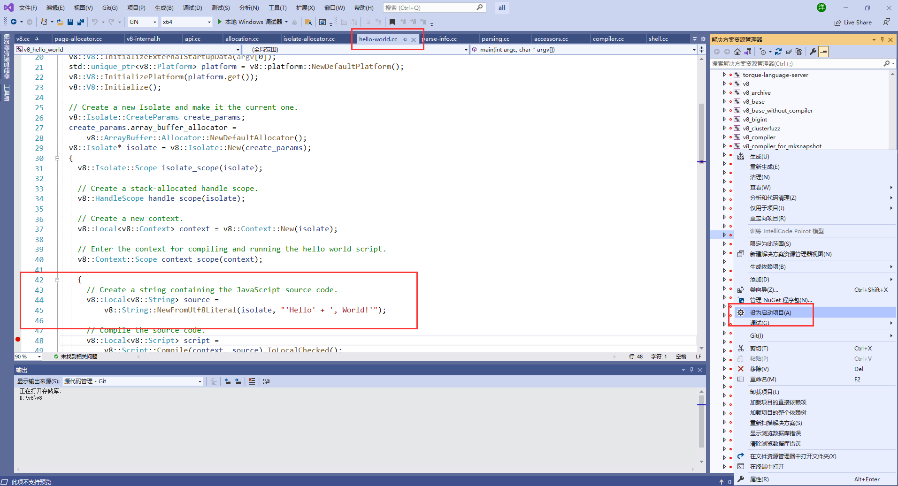    
在解决方案资源管理器中，能看到v8_hello_world这个方案，鼠标右击“设为启动项目”，再次鼠标右击“生成”，这样就开始编译了，在图1下方的输出窗口，能看到编译过程。编译时间长短要看机器性能：CPU和内存频率、硬盘读写速度。 
   
上图是跟踪hello world的调用堆栈。   
总结，环境搭建过程中可能会出现意想不到的问题，多半都和SDK版本、环境变量有关，详细查看出错信息往往会得到答案。  

# 二、更容易入手的学习方法  
学代码，肯定是可以调试，跟踪最容易，V8代码太大，要有一个合理的入口才好，v8的源码都在src目录下，如下图。
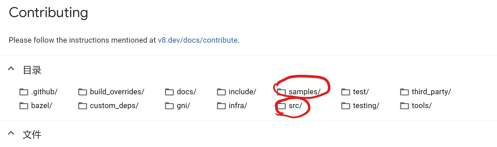
还有一个samples目录，这里就是我们开始学习的地方，图1中打开的文件正是hello-world.cc,这是一个hello world程序。V8是一个javascript虚拟机，这个hello word正是在这个V8运行的一个程序，包括了V8的创建、Isolate创建、handle创建，编译，输出hello world，再结束V8的全过程。学习V8的方式就是从跟踪hello-world.cc做起。    
# 三 、元素(Element)初始化
&emsp;&emsp;V8在启动全过程涉及很知识，本篇文章的作用为学习V8代码起个头，所以咱们聊聊相对简单的元素(Element)初始化。通过元素的初始化，学习如何跟踪V8代码，以及了角V8的代码风格。  
&emsp;&emsp;先来说什么是元素，Element是什么？先来看一个概念，{a:"foo",b:"bar"}，这个对象有两个名字属性(name properties)，"a"和"b",它们不能用数组下标索引，有下标索引属性的，通常被称为元素(Element),例如：["foo","bar"],0位置是"foo"，1位置是"bar"。这在V8中的处理方式有很大的不同，先通过一张图说明一下javascipt对象在V8中的表现形式。  
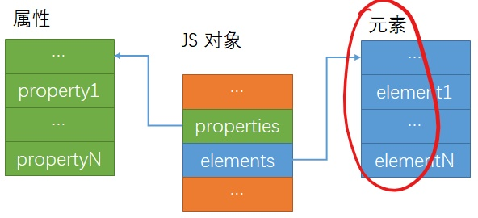   
&emsp;&emsp;从图可以看出，在V8中javaScript对象内部是分开做存储的，name property和元素分开存储的。本节主要讲解element，也就是图版中红色标记的部分。
&emsp;&emsp;我直接给出跟踪方法，见下图。  
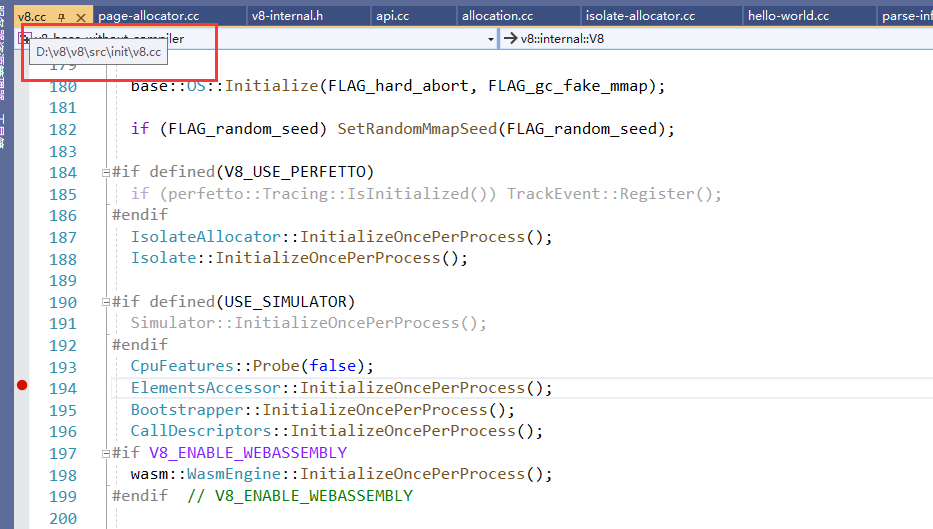  
&emsp;&emsp;注意图中文件的位置，和断点，调试时就可以在这个位置停下来,这就是跟踪方法，单步进入分析即可。  
# 四、元素(ELement)原理及重要数据结构  
## 1.主要代码和数据结构   
&emsp;&emsp;Element中的大量方法，例如pop或者slice方法等，大多都是用来对一段连续的地址空间进行操作的。ElementsAccessor是操作Element的基类，在Element上的每个操作都会对应到ElmentsAccessor。
```
void ElementsAccessor::InitializeOncePerProcess() {
  static ElementsAccessor* accessor_array[] = {
#define ACCESSOR_ARRAY(Class, Kind, Store) new Class(),
     ELEMENTS_LIST(ACCESSOR_ARRAY)//这里初化的宏义
#undef ACCESSOR_ARRAY
  };

  STATIC_ASSERT((sizeof(accessor_array) / sizeof(*accessor_array)) ==
                kElementsKindCount);

  elements_accessors_ = accessor_array;
}
```
&emsp;&emsp;代码中的ACCESSOR_ARRAY和ELEMENTS_LIST两个宏配合完成初始化，ELEMENTS_LIST中也能看到所有种类的Element，也就是Element kinds，如下图所示。  
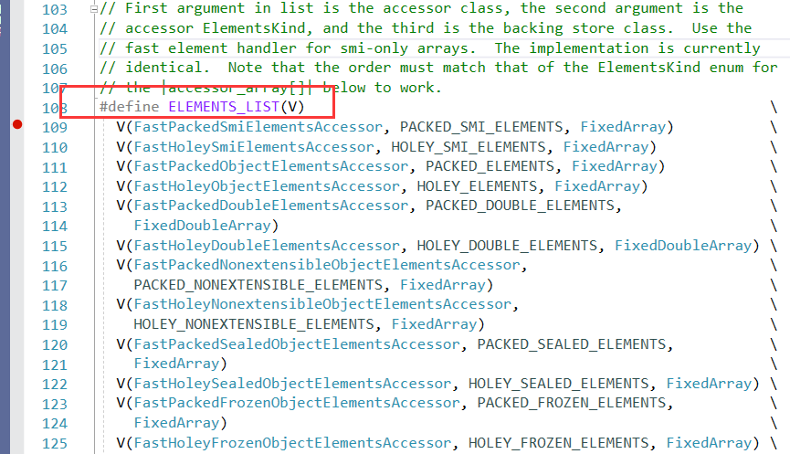  
&emsp;&emsp;以FastPackedSmiElemntsAccessor为例进行分析，这个类从名字可以出来它是连续存储的Smi类型，连续存储是指数据中没有空洞，例如：a =[1,2,3],这就是packed Smi，b = [1,,3],这就是Holey Smi。何为Smi?就是小整数，以32位CPU为例说明，最低的一位(bit)是表示类型的，如果是1，则是指针，是0表示是Smi。  
&emsp;&emsp;FastPackedSmiElementsAccessor中没有具体实现的功能， 我们直接看他的父类 FastSmiOrObjectElementsAccessor,这里有一些功能的实现，但目前看完这些功能，是没有办法在脑海中构建出一个Element结构来的，现在看还为时尚早，因为这里只有Element的初始化，没有讲它是如何使用的，比如：slice方法是如何实现的，这里并没有详细说明。这里主要说明了初始化，接着看FastElementsAccessor这个父类，这里定义了的功能实现比FastSmiOrObjectElementsAccessor中多，方法名中包含"Normailize"字样的方法非常重要，因为任何一个JavaScript中关于Element的操作方法(比如slice)的执行过程都与Normalize有关，Normalize是Element的操作方法到最终实现之间的必经之路。  
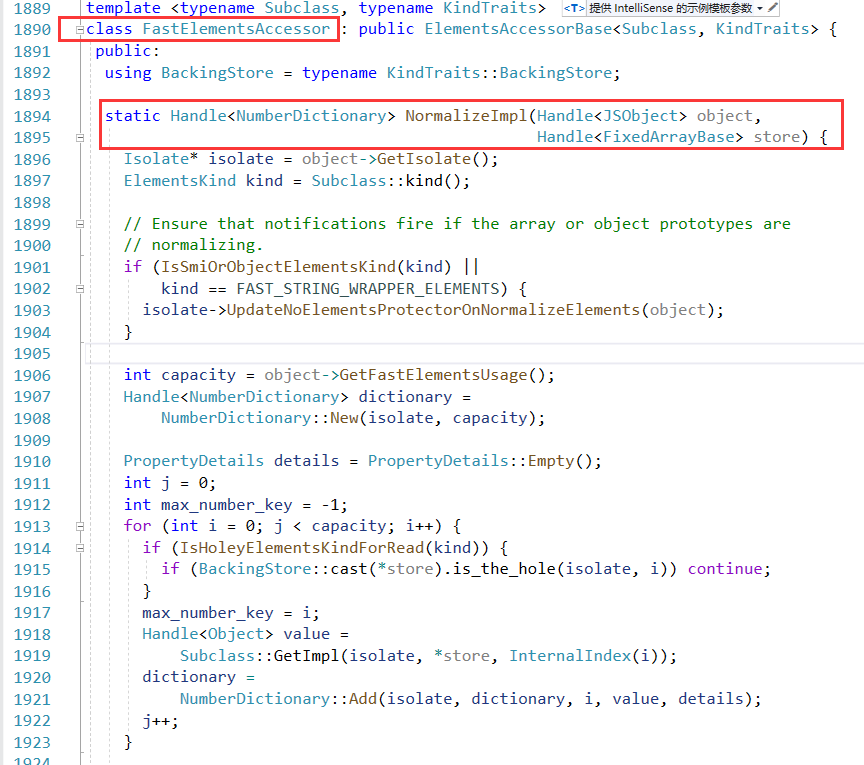  
&emsp;&emsp;NormalizeImpl是Normalize方法的具体实现。再进入下一个父类  
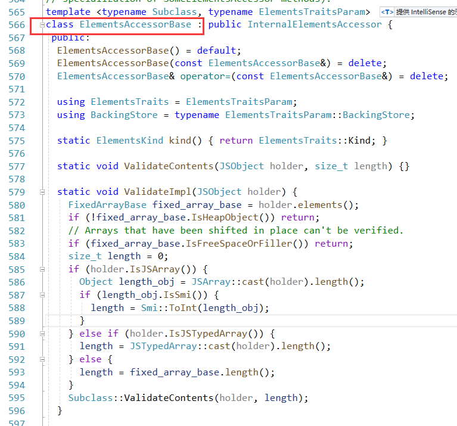  
&emsp;&emsp;最后给出类型的嵌套关系，如下图  
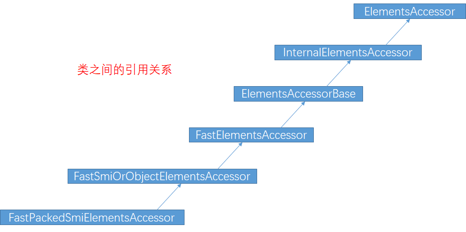  
&emsp;&emsp;看完这类中的各种方法，感觉方法之间无法关联起，这是正常的，因为目前为止，我们还没有进入方法的调用过程。  
## 2.从element.length看执行过程  
&emsp;&emsp;到目前为止，我们还只是看ELement的初始化过程，如果能让所有的成员动起来，可以提高我们的学习效率。借助debug来做个测试，如下图  
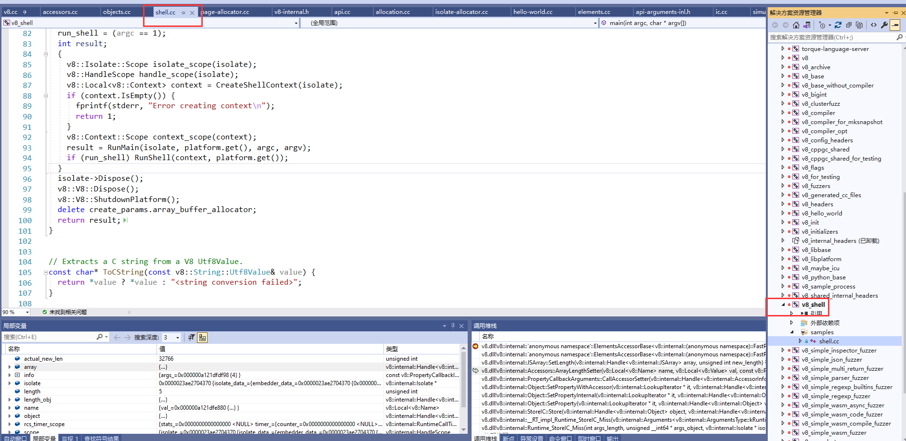  
&emsp;&emsp;我们调试的是shell.cc，它的位置在samples\下。调试之前要把这个工程编译，看图中右侧的红色标记，可以把这个工程设置为启动项，然后生成，启动debug后看到这到下图。  
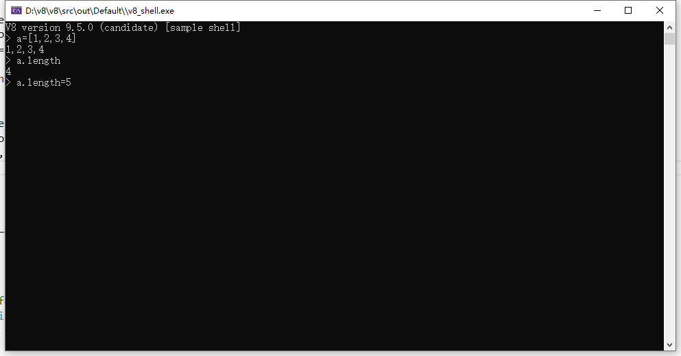
&emsp;&emsp;这时，我们在elements.cc中下断点，如下图。  
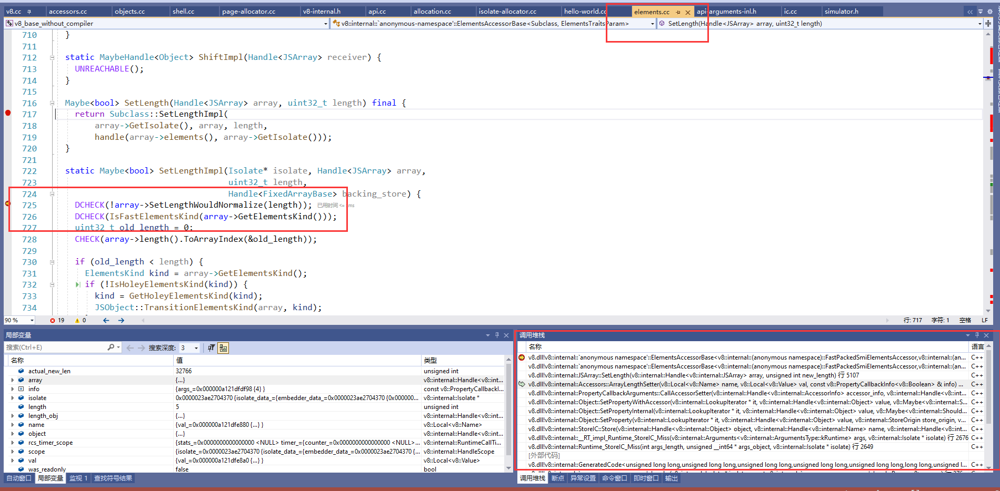  
&emsp;&emsp;在这样图中，能看到断点，还有调用堆栈，从中能看到函数的调用过程，在shell窗口中执行如下指令  
```
a=[1,2,3,4]
a.length = 7 //这是特意改变数组长度，为了能触发断点
```  
这时就能复原上图的堆栈了，你可以查看附近的相关代码。  
## 3.数据结构Accessors  
&emsp;&emsp;我们先来看一下这个结构的部分源代码。  
```
// Accessors contains all predefined proxy accessors.
class Accessors : public AllStatic {
 public:
#define ACCESSOR_GETTER_DECLARATION(_, accessor_name, AccessorName, ...) \
  static void AccessorName##Getter(                                      \
      v8::Local<v8::Name> name,                                          \
      const v8::PropertyCallbackInfo<v8::Value>& info);
  ACCESSOR_INFO_LIST_GENERATOR(ACCESSOR_GETTER_DECLARATION, /* not used */)
#undef ACCESSOR_GETTER_DECLARATION

#define ACCESSOR_SETTER_DECLARATION(accessor_name)          \
  static void accessor_name(                                \
      v8::Local<v8::Name> name, v8::Local<v8::Value> value, \
      const v8::PropertyCallbackInfo<v8::Boolean>& info);
  ACCESSOR_SETTER_LIST(ACCESSOR_SETTER_DECLARATION)
#undef ACCESSOR_SETTER_DECLARATION
...
省略很多代码... ....
...
```  
&emsp;&emsp;这个Accessors的作用是什么？通过上面的例子来说明：上面定义的a.length=5的执行过程是：需要先找到它的Accessors，然后再才能到具体的setlength，这正好和V8的ElementsAccessor说明是对应的，如下图。  
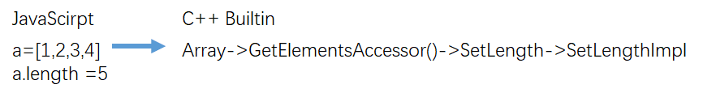  
好了，今天就到这里，下次见。  
**微信：qq9123013   邮箱：v8blink@outlook.com 欢迎批评指正**