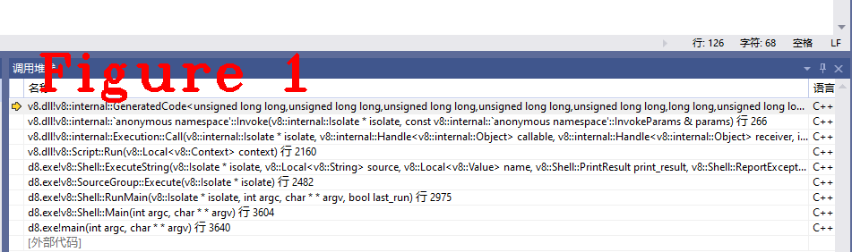
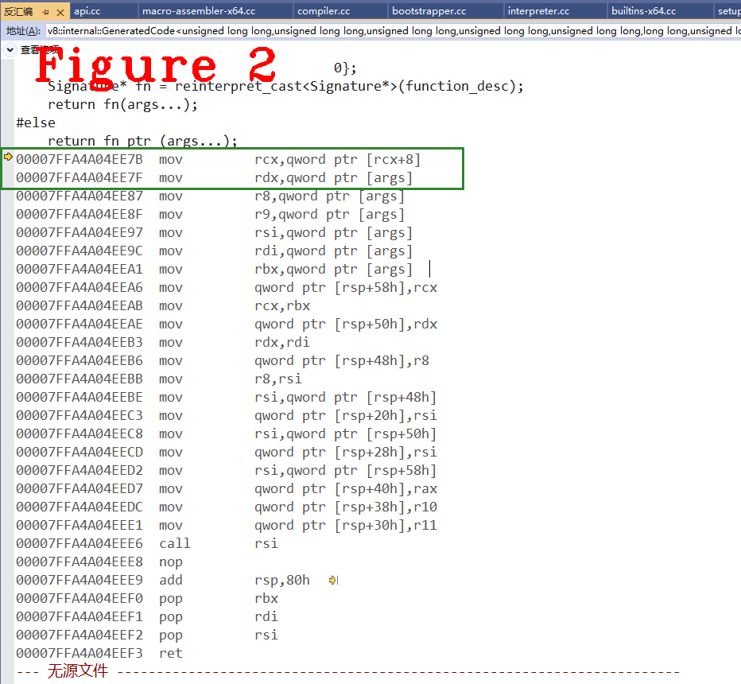

# 连载《Chrome V8 原理讲解》第十篇 V8 Execution源码分析

# 1 摘要  
`Execution`是V8执行Javascript字节码的运行单元，它负责启动Ignition执行字节码。前几篇文章对Javascript的执行过程和理论知识做过介绍。本文重在实践，注重梳理`Execution`工作流程，从`SharedFunction`谈起，跟着Javascript测试用例的执行过程走，代码执行到哪，就讲到哪，详细阐述运行单元`Execution`的具体工作内容、动作步骤和关键节点，给读者展现一个“活动”的V8。  

本文剩余内容按字节码的执行顺序讲解该过程中涉及到的V8源码，故只设置一个章节(章节2)。  

**关键字：** Execution，SharedFunction，Context，BindToCurrentContext 
# 2 Execution执行单元  
经过`GetSharedFunctionInfoForScript()`之后，得到了`MayHandle<SharedFunctionInfo>`类型的`maybe_result`数据，见下段代码：
```c++
0.  MaybeHandle<SharedFunctionInfo> Compiler::GetSharedFunctionInfoForScript(
1.      Isolate* isolate, Handle<String> source,
2.      const Compiler::ScriptDetails& script_details,
3.      ScriptOriginOptions origin_options, v8::Extension* extension,
4.      ScriptData* cached_data, ScriptCompiler::CompileOptions compile_options,
5.      ScriptCompiler::NoCacheReason no_cache_reason, NativesFlag natives) {
6.  //...................删除部分代码，留下最核心功能
7.    // Do a lookup in the compilation cache but not for extensions.
8.    MaybeHandle<SharedFunctionInfo> maybe_result;
9.    IsCompiledScope is_compiled_scope;
10.    if (extension == nullptr) {
11.      bool can_consume_code_cache =
12.          compile_options == ScriptCompiler::kConsumeCodeCache;
13.      if (can_consume_code_cache) {
14.        compile_timer.set_consuming_code_cache();
15.      }
16.      // First check per-isolate compilation cache.
17.      maybe_result = compilation_cache->LookupScript(
18.          source, script_details.name_obj, script_details.line_offset,
19.          script_details.column_offset, origin_options, isolate->native_context(),
20.          language_mode);
21.      if (!maybe_result.is_null()) {
22.        compile_timer.set_hit_isolate_cache();
23.      } 
24.    }
25.  //...................删除部分代码，留下最核心功能
26.    if (maybe_result.is_null()) {
27.      ParseInfo parse_info(isolate);
28.      // No cache entry found compile the script.
29.      NewScript(isolate, &parse_info, source, script_details, origin_options,
30.                natives);
31.      // Compile the function and add it to the isolate cache.
32.      if (origin_options.IsModule()) parse_info.set_module();
33.      parse_info.set_extension(extension);
34.      parse_info.set_eager(compile_options == ScriptCompiler::kEagerCompile);
35.      parse_info.set_language_mode(
36.          stricter_language_mode(parse_info.language_mode(), language_mode));
37.      maybe_result = CompileToplevel(&parse_info, isolate, &is_compiled_scope);
38.      Handle<SharedFunctionInfo> result;
39.      if (extension == nullptr && maybe_result.ToHandle(&result)) {
40.        DCHECK(is_compiled_scope.is_compiled());
41.        compilation_cache->PutScript(source, isolate->native_context(),
42.                                     language_mode, result);
43.      } else if (maybe_result.is_null() && natives != EXTENSION_CODE) {
44.        isolate->ReportPendingMessages();
45.      }
46.    }
47.    return maybe_result;
48.  }
```  
获取`SharedFunction`时先查找`compilation cache`，命中则直接返回结果，样例JS源码是第一次运行，第26行的`maybe_result`是`null`，执行37行的`CompileToplevel()`，得到编译后的结果`maybe_result`。进入Execution执行单元之前，还需要绑定当面上下文，代码如下：
```c++
0.  Local<Script> UnboundScript::BindToCurrentContext() {
1.    auto function_info =
2.        i::Handle<i::SharedFunctionInfo>::cast(Utils::OpenHandle(this));
3.    i::Isolate* isolate = function_info->GetIsolate();
4.    i::Handle<i::JSFunction> function =
5.        isolate->factory()->NewFunctionFromSharedFunctionInfo(
6.            function_info, isolate->native_context());
7.    return ToApiHandle<Script>(function);
8.  }
```
完成绑定后，进入`ExecuteString()`，这是执行单元的入口函数，代码如下：
```c++
0.  bool Shell::ExecuteString(Isolate* isolate, Local<String> source,
1.                            Local<Value> name, PrintResult print_result,
2.                            ReportExceptions report_exceptions,
3.                            ProcessMessageQueue process_message_queue) {
4.    bool success = true;
5.    {
6.      PerIsolateData* data = PerIsolateData::Get(isolate);
7.      Local<Context> realm =
8.          Local<Context>::New(isolate, data->realms_[data->realm_current_]);
9.      Context::Scope context_scope(realm);
10.      MaybeLocal<Script> maybe_script;
11.      Local<Context> context(isolate->GetCurrentContext());
12.      ScriptOrigin origin(name);
13.      if (options.compile_options == ScriptCompiler::kConsumeCodeCache) {
14.  //...................删除部分代码，留下最核心功能
15.      } else if (options.stress_background_compile) {
16.  //...................删除部分代码，留下最核心功能
17.      } else {
18.        ScriptCompiler::Source script_source(source, origin);
19.        maybe_script = ScriptCompiler::Compile(context, &script_source,
20.                                               options.compile_options);
21.      }
22.      maybe_result = script->Run(realm);
23.  //...................删除部分代码，留下最核心功能
24.      if (options.code_cache_options ==
25.          ShellOptions::CodeCacheOptions::kProduceCacheAfterExecute) {
26.        // Serialize and store it in memory for the next execution.
27.        ScriptCompiler::CachedData* cached_data =
28.            ScriptCompiler::CreateCodeCache(script->GetUnboundScript());
29.        StoreInCodeCache(isolate, source, cached_data);
30.        delete cached_data;
31.      }
32.      if (process_message_queue && !EmptyMessageQueues(isolate)) success = false;
33.      data->realm_current_ = data->realm_switch_;
34.    }
35.    DCHECK(!try_catch.HasCaught());
36.    return success;
37.  }
```
上述代码中，`maybe_script`变量在上述代码中被多次重复使用，在debug时可以观察到它代表的语义多次发生变化，我们只需关注`this`指针的结果即可。19行执行完后得到`maybe_script`结果，进入22行`script->Run(realm)`，代码如下：
```c++
0.  MaybeLocal<Value> Script::Run(Local<Context> context) {
1.    auto isolate = reinterpret_cast<i::Isolate*>(context->GetIsolate());
2.    TRACE_EVENT_CALL_STATS_SCOPED(isolate, "v8", "V8.Execute");
3.    ENTER_V8(isolate, context, Script, Run, MaybeLocal<Value>(),
4.             InternalEscapableScope);
5.    i::HistogramTimerScope execute_timer(isolate->counters()->execute(), true);
6.    i::AggregatingHistogramTimerScope timer(isolate->counters()->compile_lazy());
7.    i::TimerEventScope<i::TimerEventExecute> timer_scope(isolate);
8.    auto fun = i::Handle<i::JSFunction>::cast(Utils::OpenHandle(this));
9.    i::Handle<i::Object> receiver = isolate->global_proxy();
10.    Local<Value> result;
11.    has_pending_exception = !ToLocal<Value>(
12.        i::Execution::Call(isolate, fun, receiver, 0, nullptr), &result);
13.    RETURN_ON_FAILED_EXECUTION(Value);
14.    RETURN_ESCAPED(result);
15.  }
```  
上述代码中，第8行`auto fun = i::Handle<i::JSFunction>::cast(Utils::OpenHandle(this));`将`this`结果转为`JSFunction`，得到`console.log(JsPrint(6));`的fun，fun是JSFuncion类型，fun中包括了字节码序列，进入12行的`call()`方法。在`call()`方法中，执行`SetUpForCall()`完成参数的设置，最后进入`Invoke()`，代码如下：  
```C++
0.  V8_WARN_UNUSED_RESULT MaybeHandle<Object> Invoke(Isolate* isolate,
1.                                                   const InvokeParams& params) {
2.  //...................删除部分代码，留下最核心功能
3.    Object value;
4.    Handle<Code> code =
5.        JSEntry(isolate, params.execution_target, params.is_construct);
6.    {
7.      SaveContext save(isolate);
8.      SealHandleScope shs(isolate);
9.      if (FLAG_clear_exceptions_on_js_entry) isolate->clear_pending_exception();
10.      if (params.execution_target == Execution::Target::kCallable) {
11.        // clang-format off
12.        // {new_target}, {target}, {receiver}, return value: tagged pointers
13.        // {argv}: pointer to array of tagged pointers
14.        using JSEntryFunction = GeneratedCode<Address(
15.            Address root_register_value, Address new_target, Address target,
16.            Address receiver, intptr_t argc, Address** argv)>;
17.        // clang-format on
18.        JSEntryFunction stub_entry =
19.            JSEntryFunction::FromAddress(isolate, code->InstructionStart());
20.        Address orig_func = params.new_target->ptr();
21.        Address func = params.target->ptr();
22.        Address recv = params.receiver->ptr();
23.        Address** argv = reinterpret_cast<Address**>(params.argv);
24.        RuntimeCallTimerScope timer(isolate, RuntimeCallCounterId::kJS_Execution);
25.        value = Object(stub_entry.Call(isolate->isolate_data()->isolate_root(),
26.                                       orig_func, func, recv, params.argc, argv));
27.      } else {
28.  //...................删除部分代码，留下最核心功能     
29.      }
30.    }
```  
在`Invoke()`中，第18行获得入口`Builtin`功能，该`Builtin`的编号是40，生成函数是`Generate_JSEntry`，它的作用是为字节码执行做准备工作。第25行进入执行函数`Call()`，该函数中调用了函数指针`fn_ptr_`，该指针是第40号`Builtin`，测试样例的字节码序列是该函数的参数，目前是c++级别的调试跟踪，图1给出了调用堆栈，从`fn_ptr_`之后将进入汇编码。  
  
这之后进入汇编执行，先执行下面的`Generate_JSEntryVariant`完成执行前的准备工作，然后执行样例代码。
```c++
0.  void Generate_JSEntryVariant(MacroAssembler* masm, StackFrame::Type type,
1.                               Builtins::Name entry_trampoline) {
2.    Label invoke, handler_entry, exit;
3.    Label not_outermost_js, not_outermost_js_2;
4.    {  // NOLINT. Scope block confuses linter.
5.      NoRootArrayScope uninitialized_root_register(masm);
6.      // Set up frame.
7.      __ pushq(rbp);
8.      __ movq(rbp, rsp);
9.      // Push the stack frame type.
10.      __ Push(Immediate(StackFrame::TypeToMarker(type)));
11.      // Reserve a slot for the context. It is filled after the root register has
12.      // been set up.
13.      __ AllocateStackSpace(kSystemPointerSize);
14.      // Save callee-saved registers (X64/X32/Win64 calling conventions).
15.      __ pushq(r12);
16.      __ pushq(r13);
17.      __ pushq(r14);
18.      __ pushq(r15);
19.  #ifdef _WIN64
20.      __ pushq(rdi);  // Only callee save in Win64 ABI, argument in AMD64 ABI.
21.      __ pushq(rsi);  // Only callee save in Win64 ABI, argument in AMD64 ABI.
22.  #endif
23.      __ pushq(rbx);
24.  //.......................代码太长，省略很多.............................
25.    __ ret(0);
26.  }
27.  }  // namespace
28.  //==================分隔线===============================
29.  void Builtins::Generate_JSEntry(MacroAssembler* masm) {
30.    Generate_JSEntryVariant(masm, StackFrame::ENTRY,
31.                            Builtins::kJSEntryTrampoline);
32.  }
```
见代码30行，40号Builtin功能`JSEntry`的实现由`Generate_JSEntryVariant`负责，`Builtin`功能的分析方法参见上一篇文章，图2给出汇编代码执行的开始片段，请读者自行跟踪。  
  
图2中上面有c++源码，下面就是汇编码了。测试样例`console.log(JsPrint(6));`，在V8中`console`是一个全局功能，它的实现如下代码：
```c++
0.  #define RUNTIME_FUNCTION_RETURNS_TYPE(Type, InternalType, Convert, Name)      \
1.    static V8_INLINE InternalType __RT_impl_##Name(Arguments args,              \
2.                                                   Isolate* isolate);           \
3.                                                                                \
4.    V8_NOINLINE static Type Stats_##Name(int args_length, Address* args_object, \
5.                                         Isolate* isolate) {                    \
6.      RuntimeCallTimerScope timer(isolate, RuntimeCallCounterId::k##Name);      \
7.      TRACE_EVENT0(TRACE_DISABLED_BY_DEFAULT("v8.runtime"),                     \
8.                   "V8.Runtime_" #Name);                                        \
9.      Arguments args(args_length, args_object);                                 \
10.      return Convert(__RT_impl_##Name(args, isolate));                          \
11.    }                                                                           \
12.                                                                                \
13.    Type Name(int args_length, Address* args_object, Isolate* isolate) {        \
14.      DCHECK(isolate->context().is_null() || isolate->context().IsContext());   \
15.      CLOBBER_DOUBLE_REGISTERS();                                               \
16.      if (V8_UNLIKELY(TracingFlags::is_runtime_stats_enabled())) {              \
17.        return Stats_##Name(args_length, args_object, isolate);                 \
18.      }                                                                         \
19.      Arguments args(args_length, args_object);                                 \
20.      return Convert(__RT_impl_##Name(args, isolate));                          \
21.    }                                                                           \
22.                                                                                \
23.    static InternalType __RT_impl_##Name(Arguments args, Isolate* isolate)
24.  #define CONVERT_OBJECT(x) (x).ptr()
25.  #define CONVERT_OBJECTPAIR(x) (x)
26.  #define RUNTIME_FUNCTION(Name) \
27.    RUNTIME_FUNCTION_RETURNS_TYPE(Address, Object, CONVERT_OBJECT, Name)
28.  //==================分隔线===============================
29.  //==================分隔线===============================
30.  Object DeclareGlobals(Isolate* isolate, Handle<FixedArray> declarations,
31.                        int flags, Handle<JSFunction> closure) {
32.    HandleScope scope(isolate);
33.    Handle<JSGlobalObject> global(isolate->global_object());
34.    Handle<Context> context(isolate->context(), isolate);
35.    Handle<FeedbackVector> feedback_vector = Handle<FeedbackVector>::null();
36.    Handle<ClosureFeedbackCellArray> closure_feedback_cell_array =
37.        Handle<ClosureFeedbackCellArray>::null();
38.    if (closure->has_feedback_vector()) {
39.      feedback_vector =
40.          Handle<FeedbackVector>(closure->feedback_vector(), isolate);
41.      closure_feedback_cell_array = Handle<ClosureFeedbackCellArray>(
42.          feedback_vector->closure_feedback_cell_array(), isolate);
43.    } else {
44.      closure_feedback_cell_array = Handle<ClosureFeedbackCellArray>(
45.          closure->closure_feedback_cell_array(), isolate);
46.    }
47.    // Traverse the name/value pairs and set the properties.
48.    int length = declarations->length();
49.    FOR_WITH_HANDLE_SCOPE(isolate, int, i = 0, i, i < length, i += 4, {
50.      Handle<String> name(String::cast(declarations->get(i)), isolate);
51.      FeedbackSlot slot(Smi::ToInt(declarations->get(i + 1)));
52.      Handle<Object> possibly_feedback_cell_slot(declarations->get(i + 2),
53.                                                 isolate);
54.      Handle<Object> initial_value(declarations->get(i + 3), isolate);
55.      bool is_var = initial_value->IsUndefined(isolate);
56.      bool is_function = initial_value->IsSharedFunctionInfo();
57.      DCHECK_NE(is_var, is_function);
58.      Handle<Object> value;
59.      if (is_function) {
60.        DCHECK(possibly_feedback_cell_slot->IsSmi());
61.        Handle<FeedbackCell> feedback_cell =
62.            closure_feedback_cell_array->GetFeedbackCell(
63.                Smi::ToInt(*possibly_feedback_cell_slot));
64.        // Copy the function and update its context. Use it as value.
65.        Handle<SharedFunctionInfo> shared =
66.            Handle<SharedFunctionInfo>::cast(initial_value);
67.        Handle<JSFunction> function =
68.            isolate->factory()->NewFunctionFromSharedFunctionInfo(
69.                shared, context, feedback_cell, AllocationType::kOld);
70.        value = function;
71.      } else {
72.        value = isolate->factory()->undefined_value();
73.      }
74.      // Compute the property attributes. According to ECMA-262,
75.      // the property must be non-configurable except in eval.
76.      bool is_eval = DeclareGlobalsEvalFlag::decode(flags);
77.      int attr = NONE;
78.      if (!is_eval) attr |= DONT_DELETE;
79.      // ES#sec-globaldeclarationinstantiation 5.d:
80.      // If hasRestrictedGlobal is true, throw a SyntaxError exception.
81.      Object result = DeclareGlobal(isolate, global, name, value,
82.                                    static_cast<PropertyAttributes>(attr), is_var,
83.                                    is_function, RedeclarationType::kSyntaxError,
84.                                    feedback_vector, slot);
85.      if (isolate->has_pending_exception()) return result;
86.    });
87.    return ReadOnlyRoots(isolate).undefined_value();
88.  }
89.  //==================分隔线===============================
90.  //==================分隔线===============================
91.  RUNTIME_FUNCTION(Runtime_DeclareGlobals) {
92.    HandleScope scope(isolate);
93.    DCHECK_EQ(3, args.length());
94.    CONVERT_ARG_HANDLE_CHECKED(FixedArray, declarations, 0);
95.    CONVERT_SMI_ARG_CHECKED(flags, 1);
96.    CONVERT_ARG_HANDLE_CHECKED(JSFunction, closure, 2);
97.    return DeclareGlobals(isolate, declarations, flags, closure);
98.  }

```
`RUNTIME_FUNCTION(Runtime_DeclareGlobals)`是由宏模板定义的全局功能，该函数先检查参数的正确性，然后进入`DeclareGlobals()`完成具体功能。在我们的测试样例中，`DeclareGlobals()`是获得`console`的全局对象。得到该对象后返回到汇编码状态接着执行，获得该对象的`log`属性，也就是`console.log`，检测到它的参数`JsPrint(6)`是函数，然后编译此函数，得到一份字节码序列，开启一个新的执行单元，请读者自行跟踪。
好了，今天到这里，下次见。   
**恳请读者批评指正、提出宝贵意见**  
**微信：qq9123013  备注：v8交流    邮箱：v8blink@outlook.com**