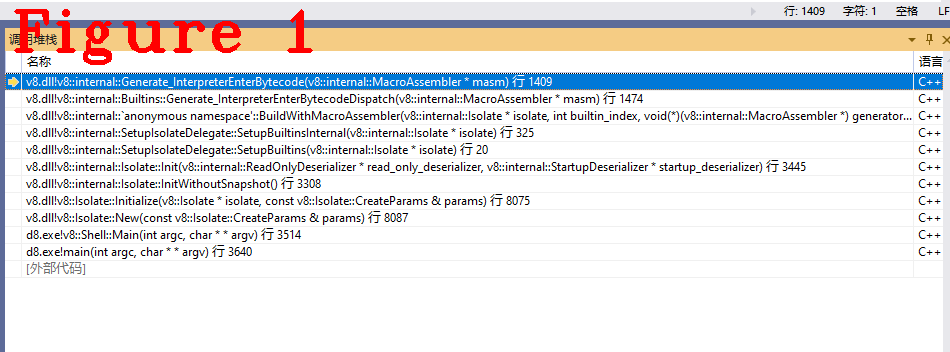
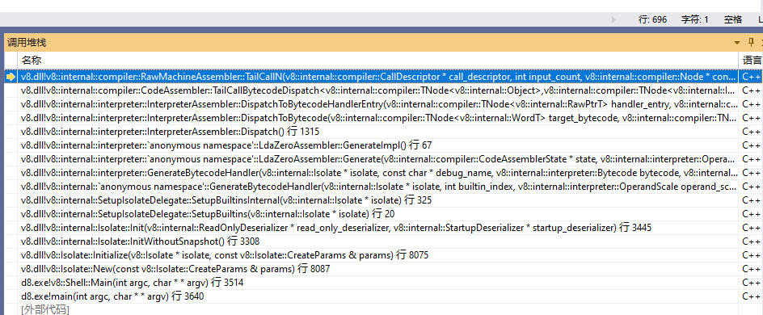

# 连载《Chrome V8 原理讲解》第十一篇 字节码调度 Dispatch机制
  

# 1 摘要  

Dispatch（调度）负责字节码的调度，每条字节码执行完后由Dispatch负责调度下一条字节码执行，相当于寄存器EIP++、执行下一条字节码。Dispatch是V8维护的全局指令调度机制，它由调度表（dispatch table）、一个物理寄存器和调度函数`Dispatch()`组成，每条字节码处理程序（Bytecode handler）执行结束后不执行下一条字节码，而是执行函数`Dispatch()`，由它负责调用下一条字节码。本文讲解Dispatch机制的源码、数据结构和`Dispatch()`调度方法。  

本文内容组织方式：讲解Dispatch机制具体实现（章节2）；`Dispatch()`调度下一条字节码的源码分析（章节3）。  

# 2 Dispatch机制  

字节码处理程序的地址存储在`Dispatch table`中，使用物理寄存器维护。`Dispatch table`是指针数组，数组元素是`Code`类型指针，指向一个字节码处理程序。  

```c++
1.  class Code : public HeapObject {
2.   public:
3.    NEVER_READ_ONLY_SPACE
4.    using Flags = uint32_t;
5.  #define CODE_KIND_LIST(V)   \
6.    V(OPTIMIZED_FUNCTION)     \
7.    V(BYTECODE_HANDLER)       \
8.    V(STUB)                   \
9.    V(BUILTIN)                \
10.   V(REGEXP)                 \
11.    V(WASM_FUNCTION)          \
12.    V(WASM_TO_CAPI_FUNCTION)  \
13.    V(WASM_TO_JS_FUNCTION)    \
14.    V(JS_TO_WASM_FUNCTION)    \
15.    V(JS_TO_JS_FUNCTION)      \
16.    V(WASM_INTERPRETER_ENTRY) \
17.    V(C_WASM_ENTRY)
18.    enum Kind {
19.  #define DEFINE_CODE_KIND_ENUM(name) name,
20.      CODE_KIND_LIST(DEFINE_CODE_KIND_ENUM)
21.  #undef DEFINE_CODE_KIND_ENUM
22.          NUMBER_OF_KINDS
23.    };
24.    static const char* Kind2String(Kind kind);
25.  #ifdef ENABLE_DISASSEMBLER
26.    const char* GetName(Isolate* isolate) const;
27.    V8_EXPORT_PRIVATE void Disassemble(const char* name, std::ostream& os,
28.                                       Address current_pc = kNullAddress);
29.  #endif
30.  //.................省略很多代码....................
31.  //.................省略很多代码....................
32.  };
```  

**注意：** 在Isolate中，还有另一个数据表，用于管理所有Builtin，表项也是`Code`类型。本文的`Dispatch table`数据表，只包含`Code`类型为`BYTECODE_HANDLER`的Builtin地址。  
字节码调度由`Builtin`方法实现，其外层的入口函数为`BuildWithMacroAssembler()`，代码如下：  

```c++
1.  Code BuildWithMacroAssembler(Isolate* isolate, int32_t builtin_index,
2.                               MacroAssemblerGenerator generator,
3.                               const char* s_name) {
4.    HandleScope scope(isolate);
5.    // Canonicalize handles, so that we can share constant pool entries pointing
6.    // to code targets without dereferencing their handles.
7.    CanonicalHandleScope canonical(isolate);
8.    constexpr int kBufferSize = 32 * KB;
9.    byte buffer[kBufferSize];
10.   MacroAssembler masm(isolate, BuiltinAssemblerOptions(isolate, builtin_index),
11.                        CodeObjectRequired::kYes,
12.                        ExternalAssemblerBuffer(buffer, kBufferSize));
13.    masm.set_builtin_index(builtin_index);
14.    DCHECK(!masm.has_frame());
15.    generator(&masm);
16.    int handler_table_offset = 0;
17.    // JSEntry builtins are a special case and need to generate a handler table.
18.    DCHECK_EQ(Builtins::KindOf(Builtins::kJSEntry), Builtins::ASM);
19.    DCHECK_EQ(Builtins::KindOf(Builtins::kJSConstructEntry), Builtins::ASM);
20.    DCHECK_EQ(Builtins::KindOf(Builtins::kJSRunMicrotasksEntry), Builtins::ASM);
21.    if (Builtins::IsJSEntryVariant(builtin_index)) {
22.      handler_table_offset = HandlerTable::EmitReturnTableStart(&masm);
23.      HandlerTable::EmitReturnEntry(
24.          &masm, 0, isolate->builtins()->js_entry_handler_offset());
25.    }
26.    //.....................................................
27.    //................省略很多.............................
28.  }
```   

`BuildWithMacroAssembler()`的分析方法参见第九篇文章，直接给出它的重要参数：`builtin_index`值为65，是Builtin编号，`generator`为`Generate_InterpreterEnterBytecodeDispatch`，下面是源码：  

```c++
1.  static void Generate_InterpreterEnterBytecode(MacroAssembler* masm) {
2.    // Set the return address to the correct point in the interpreter entry
3.    // trampoline.
4.    Label builtin_trampoline, trampoline_loaded;
5.    Smi interpreter_entry_return_pc_offset(
6.        masm->isolate()->heap()->interpreter_entry_return_pc_offset());
7.    DCHECK_NE(interpreter_entry_return_pc_offset, Smi::kZero);
8.    // If the SFI function_data is an InterpreterData, the function will have a
9.    // custom copy of the interpreter entry trampoline for profiling. If so,
10.   // get the custom trampoline, otherwise grab the entry address of the global
11.    // trampoline.
12.    __ movq(rbx, Operand(rbp, StandardFrameConstants::kFunctionOffset));
13.    __ LoadTaggedPointerField(
14.        rbx, FieldOperand(rbx, JSFunction::kSharedFunctionInfoOffset));
15.    __ LoadTaggedPointerField(
16.        rbx, FieldOperand(rbx, SharedFunctionInfo::kFunctionDataOffset));
17.    __ CmpObjectType(rbx, INTERPRETER_DATA_TYPE, kScratchRegister);
18.    __ j(not_equal, &builtin_trampoline, Label::kNear);
19.    __ movq(rbx,
20.            FieldOperand(rbx, InterpreterData::kInterpreterTrampolineOffset));
21.    __ addq(rbx, Immediate(Code::kHeaderSize - kHeapObjectTag));
22.    __ jmp(&trampoline_loaded, Label::kNear);
23.    __ bind(&builtin_trampoline);
24.    // TODO(jgruber): Replace this by a lookup in the builtin entry table.
25.    __ movq(rbx,
26.            __ ExternalReferenceAsOperand(
27.                ExternalReference::
28.                    address_of_interpreter_entry_trampoline_instruction_start(
29.                        masm->isolate()),
30.                kScratchRegister));
31.    __ bind(&trampoline_loaded);
32.    __ addq(rbx, Immediate(interpreter_entry_return_pc_offset.value()));
33.    __ Push(rbx);
34.    // Initialize dispatch table register.
35.    __ Move(
36.        kInterpreterDispatchTableRegister,
37.        ExternalReference::interpreter_dispatch_table_address(masm->isolate()));
38.    // Get the bytecode array pointer from the frame.
39.    __ movq(kInterpreterBytecodeArrayRegister,
40.            Operand(rbp, InterpreterFrameConstants::kBytecodeArrayFromFp));
41.    if (FLAG_debug_code) {
42.      // Check function data field is actually a BytecodeArray object.
43.      __ AssertNotSmi(kInterpreterBytecodeArrayRegister);
44.      __ CmpObjectType(kInterpreterBytecodeArrayRegister, BYTECODE_ARRAY_TYPE,
45.                       rbx);
46.      __ Assert(
47.          equal,
48.          AbortReason::kFunctionDataShouldBeBytecodeArrayOnInterpreterEntry);
49.    }
50.    // Get the target bytecode offset from the frame.
51.    __ movq(kInterpreterBytecodeOffsetRegister,
52.            Operand(rbp, InterpreterFrameConstants::kBytecodeOffsetFromFp));
53.    __ SmiUntag(kInterpreterBytecodeOffsetRegister,
54.                kInterpreterBytecodeOffsetRegister);
55.    // Dispatch to the target bytecode.
56.    __ movzxbq(r11, Operand(kInterpreterBytecodeArrayRegister,
57.                            kInterpreterBytecodeOffsetRegister, times_1, 0));
58.    __ movq(kJavaScriptCallCodeStartRegister,
59.            Operand(kInterpreterDispatchTableRegister, r11,
60.                    times_system_pointer_size, 0));
61.    __ jmp(kJavaScriptCallCodeStartRegister);
62.  }
63.  //================================分隔线=========================
64.  //================================分隔线=========================
65.  //================================分隔线=========================
66.  void Builtins::Generate_InterpreterEnterBytecodeDispatch(MacroAssembler* masm) {
67.    Generate_InterpreterEnterBytecode(masm);
68.  }
```  

上述代码由两部分组成，`Generate_InterpreterEnterBytecodeDispatch()`是字节码调度程序的入口，`Generate_InterpreterEnterBytecode()`是调度的具体实现，下面给出几点重要概念：  

**（1）** `Generate_InterpreterEnterBytecodeDispatch()`是`Builtin`方法。它的index为65号（V8版本不同，index可能略有不同）。  

**（2）** V8使用物理寄存器保存`Dispatch table`地址，寄存器名字为`kInterpreterDispatchTableRegister`，在实际运行时映射到物理寄存器。使用物理寄存器可以避免指令调度时的入栈出栈，简化指令设计，提高效率。  

下面解释代码的重要语句：  

**（1）** 代码35行把`dispatch table`地址移动到`kInterpreterDispatchTableRegister`寄存器，`ExternalReference::interpreter_dispatch_table_address(masm->isolate())`负责从`isolate`中取出基址，`interpreter_dispatch_table_address`的源码如下：
```c++
1.  ExternalReference ExternalReference::interpreter_dispatch_table_address(
2.      Isolate* isolate) {
3.    return ExternalReference(isolate->interpreter()->dispatch_table_address());
4.  }
5.  //================================分隔线=========================
6.    interpreter::Interpreter* interpreter() const {
7.      return interpreter_;
8.    }
9.  //================================分隔线=========================
10.   Address dispatch_table_address() {
11.      return reinterpret_cast<Address>(&dispatch_table_[0]);
12.    }
```  

上述代码，可以看到`dispatch_table_`是数组，基址是`&dispatch_table_[0]`,它的位置是`isolate->interpreter_->dispatch_table_`。

**（2）** 代码39行从堆栈中获取bytecode array的基址。  

**（3）** 代码51行获取目标bytecode的偏移量（offset）。  

**（4）** 代码56、58行，计算目标bytecode地址，存入`kJavaScriptCallCodeStartRegister`。  

**（5）** 代码61行，跳转到`kJavaScriptCallCodeStartRegister`，调度完毕，图1为函数调用堆栈。  

  

# 3 Dispatch()方法  

`Dispatch()`是字节码处理程序最后调用的方法，故称之为尾部调用（TailCall）方法，下面给出几条字节码处理程序源码：  

```c++
1.  // StaGlobal <name_index> <slot>
2.  //
3.  // Store the value in the accumulator into the global with name in constant pool
4.  // entry <name_index> using FeedBackVector slot <slot>.
5.  IGNITION_HANDLER(StaGlobal, InterpreterAssembler) {
6.    TNode<Context> context = GetContext();
7.    // Store the global via the StoreGlobalIC.
8.    TNode<Name> name = CAST(LoadConstantPoolEntryAtOperandIndex(0));
9.    TNode<Object> value = GetAccumulator();
10.   TNode<IntPtrT> raw_slot = Signed(BytecodeOperandIdx(1));
11.    TNode<Smi> smi_slot = SmiTag(raw_slot);
12.    TNode<HeapObject> maybe_vector = LoadFeedbackVector();
13.    Label no_feedback(this, Label::kDeferred), end(this);
14.    GotoIf(IsUndefined(maybe_vector), &no_feedback);
15.    CallBuiltin(Builtins::kStoreGlobalIC, context, name, value, smi_slot,
16.                maybe_vector);
17.    Goto(&end);
18.    Bind(&no_feedback);
19.    CallRuntime(Runtime::kStoreGlobalICNoFeedback_Miss, context, value, name);
20.    Goto(&end);
21.    Bind(&end);
22.    Dispatch();
23.  }
24.  // LdaContextSlot <context> <slot_index> <depth>
25.  //
26.  // Load the object in |slot_index| of the context at |depth| in the context
27.  // chain starting at |context| into the accumulator.
28.  IGNITION_HANDLER(LdaContextSlot, InterpreterAssembler) {
29.    TNode<Context> context = CAST(LoadRegisterAtOperandIndex(0));
30.    TNode<IntPtrT> slot_index = Signed(BytecodeOperandIdx(1));
31.    TNode<Uint32T> depth = BytecodeOperandUImm(2);
32.    TNode<Context> slot_context = GetContextAtDepth(context, depth);
33.    TNode<Object> result = LoadContextElement(slot_context, slot_index);
34.    SetAccumulator(result);
35.    Dispatch();
36.  }
37.  // LdaImmutableContextSlot <context> <slot_index> <depth>
38.  //
39.  // Load the object in |slot_index| of the context at |depth| in the context
40.  // chain starting at |context| into the accumulator.
41.  IGNITION_HANDLER(LdaImmutableContextSlot, InterpreterAssembler) {
42.    TNode<Context> context = CAST(LoadRegisterAtOperandIndex(0));
43.    TNode<IntPtrT> slot_index = Signed(BytecodeOperandIdx(1));
44.    TNode<Uint32T> depth = BytecodeOperandUImm(2);
45.    TNode<Context> slot_context = GetContextAtDepth(context, depth);
46.    TNode<Object> result = LoadContextElement(slot_context, slot_index);
47.    SetAccumulator(result);
48.    Dispatch();
49.  }
```
上述代码给出了三条字节码处理程序，它们的尾部都调用了`Dispatch()`方法。下面给出`Dispatch()`源码，并解释重要语句。  

```C++
1.  void InterpreterAssembler::Dispatch() {
2.    Comment("========= Dispatch");
3.    DCHECK_IMPLIES(Bytecodes::MakesCallAlongCriticalPath(bytecode_), made_call_);
4.    TNode<IntPtrT> target_offset = Advance();
5.    TNode<WordT> target_bytecode = LoadBytecode(target_offset);
6.    if (Bytecodes::IsStarLookahead(bytecode_, operand_scale_)) {
7.      target_bytecode = StarDispatchLookahead(target_bytecode);
8.    }
9.    DispatchToBytecode(target_bytecode, BytecodeOffset());
10. }
```  
第2行代码是注释功能，调试代码时很有用；第4行`Advance()`是获取目标字节码在`bytecode array`中的偏移量，请读者自行分析；第5行读取目标字节码；第9行进入`DispatchToBytecode()`，该方法又进入`DispatchToBytecodeHandlerEntry()`，代码如下：  

```c++
void InterpreterAssembler::DispatchToBytecodeHandlerEntry(
    TNode<RawPtrT> handler_entry, TNode<IntPtrT> bytecode_offset) {
  // Propagate speculation poisoning.
  TNode<RawPtrT> poisoned_handler_entry =
      UncheckedCast<RawPtrT>(WordPoisonOnSpeculation(handler_entry));
  TailCallBytecodeDispatch(InterpreterDispatchDescriptor{},
                           poisoned_handler_entry, GetAccumulatorUnchecked(),
                           bytecode_offset, BytecodeArrayTaggedPointer(),
                           DispatchTablePointer());
}
```
该方法的参数1是目标字节码，它的作用是从`dispatch table`中索引对应的字节码处理程序；参数2是目标字节码的偏移量，它的作用是从`bytecode array`中读取操作数，下面进入`TailCallBytecodeDispatch()`:  

```c++
0.  template <class... TArgs>
1.  void CodeAssembler::TailCallBytecodeDispatch(
2.      const CallInterfaceDescriptor& descriptor, TNode<RawPtrT> target,
3.      TArgs... args) {
4.    DCHECK_EQ(descriptor.GetParameterCount(), sizeof...(args));
5.    auto call_descriptor = Linkage::GetBytecodeDispatchCallDescriptor(
6.        zone(), descriptor, descriptor.GetStackParameterCount());
7.    Node* nodes[] = {target, args...};
8.    CHECK_EQ(descriptor.GetParameterCount() + 1, arraysize(nodes));
9.    raw_assembler()->TailCallN(call_descriptor, arraysize(nodes), nodes);
10.  }
```  
代码第5行建立目标字节码的`call discriptor`，见下面代码：  

```c++
0.  CallDescriptor* Linkage::GetBytecodeDispatchCallDescriptor(
1.      Zone* zone, const CallInterfaceDescriptor& descriptor,
2.      int stack_parameter_count) {
3.    const int register_parameter_count = descriptor.GetRegisterParameterCount();
4.    const int parameter_count = register_parameter_count + stack_parameter_count;
5.    DCHECK_EQ(descriptor.GetReturnCount(), 1);
6.    LocationSignature::Builder locations(zone, 1, parameter_count);
7.    locations.AddReturn(regloc(kReturnRegister0, descriptor.GetReturnType(0)));
8.    for (int i = 0; i < parameter_count; i++) {
9.      if (i < register_parameter_count) {
10.        // The first parameters go in registers.
11.        Register reg = descriptor.GetRegisterParameter(i);
12.        MachineType type = descriptor.GetParameterType(i);
13.        locations.AddParam(regloc(reg, type));
14.      } else {
15.        int stack_slot = i - register_parameter_count - stack_parameter_count;
16.        locations.AddParam(LinkageLocation::ForCallerFrameSlot(
17.            stack_slot, MachineType::AnyTagged()));
18.      }
19.    }
20.    MachineType target_type = MachineType::Pointer();
21.    LinkageLocation target_loc = LinkageLocation::ForAnyRegister(target_type);
22.    const CallDescriptor::Flags kFlags =
23.        CallDescriptor::kCanUseRoots | CallDescriptor::kFixedTargetRegister;
24.    return new (zone) CallDescriptor(  // --
25.        CallDescriptor::kCallAddress,  // kind
26.        target_type,                   // target MachineType
27.        target_loc,                    // target location
28.        locations.Build(),             // location_sig
29.        stack_parameter_count,         // stack_parameter_count
30.        Operator::kNoProperties,       // properties
31.        kNoCalleeSaved,                // callee-saved registers
32.        kNoCalleeSaved,                // callee-saved fp
33.        kFlags,                        // flags
34.        descriptor.DebugName());
35.  }
```  

这个函数的参数2是目标字节码，参数3是栈参数的数量，函数的作用是申请寄存器等资源、生成`CallDescriptor`。`CallDescriptor`描述了调用字节码时应该提供的参数类型、数量等，代码24行的注释给出了它的布局。  

返回`TailCallBytecodeDispatch()`，第9行`raw_assembler()->TailCallN()`的第一个参数是`CallDescriptor`，源码下如:  

```c++
1.  void RawMachineAssembler::TailCallN(CallDescriptor* call_descriptor,
2.                                      int input_count, Node* const* inputs) {
3.    // +1 is for target.
4.    DCHECK_EQ(input_count, call_descriptor->ParameterCount() + 1);
5.    Node* tail_call =
6.        MakeNode(common()->TailCall(call_descriptor), input_count, inputs);
7.    schedule()->AddTailCall(CurrentBlock(), tail_call);
8.    current_block_ = nullptr;
9.  }
```  
第5行生成`Node`节点，第7行由`AddTailCall()`把节点加到当前基本块（Basic Block）的尾部，完成字节码调度，`AddTailCall()`源码请读者自行分析，图2给出了上述过程的调用堆栈。  

  

学习过程中，需要分析和调试汇编码，思路一旦中断就可能得从头再来，一定要多做笔记。  

好了，今天到这里，下次见。   

**恳请读者批评指正、提出宝贵意见**  
**微信：qq9123013  备注：v8交流    邮箱：v8blink@outlook.com**