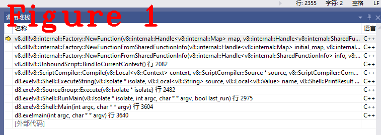
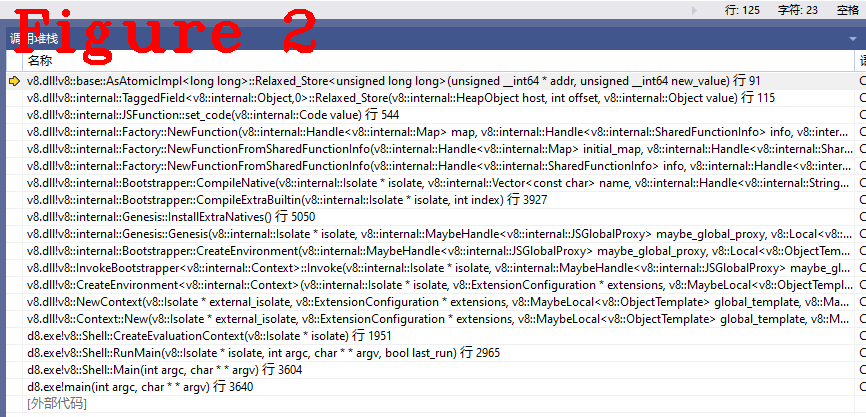

# 《Chrome V8原理讲解》第十二篇 JSFunction源码分析
  

# 1 摘要  
编译Javascript源码得到的字节码流（Bytecode Array）不能直接执行，绑定了入口（Entry）和上下文（Context）的字节码流才能被解释器（Ignition）执行，绑定了“入口+上下文”的字码流称为JSFunction，JSFunction是Ignition可以执行的实例。读懂JSFunction，可以更加深入了解Igntion的工作原理，更有助于在脑海中、在演草纸上擘画出字节码的解释（interpreter）过程。本文以SharedFunction（字节码流的表示方法）为输入，讲解JSFuncition源码和重要功能函数，分析JSFunction创建（new）、绑定入口和上下文的过程（章节2）；最后，分析JSFunction内存布局，讲解读/写（getter/setter）方法（章节3）。

# 2 JSFunction分析  
一段C语言程序要经过编译（Compilation）、汇编（Assembly）和链接（Linking）之后才能执行。不太严谨但很形象的类比：字节码流类似汇编之后的结果（V8称之为SharedFunction），JSFunction类似链接之后的程序，所以说JSFunction是可以执行的实例。下面来看JSFunction源码：  
```c++
1.  class JSFunction : public JSObject {
2.    public:
3.     DECL_ACCESSORS(prototype_or_initial_map, HeapObject)
4.     DECL_ACCESSORS(shared, SharedFunctionInfo)
5.     static const int kLengthDescriptorIndex = 0;
6.     static const int kNameDescriptorIndex = 1;
7.     static const int kMaybeHomeObjectDescriptorIndex = 2;
8.     inline Context context();
9.     inline bool has_context() const;
10.    inline void set_context(HeapObject context);
11.    inline JSGlobalProxy global_proxy();
12.    inline NativeContext native_context();
13.    inline int length();
14.    static Handle<Object> GetName(Isolate* isolate, Handle<JSFunction> function);
15.    static Handle<NativeContext> GetFunctionRealm(Handle<JSFunction> function);
16.    inline Code code() const;
17.    inline void set_code(Code code);
18.    inline void set_code_no_write_barrier(Code code);
19.    inline AbstractCode abstract_code();
20.    inline bool IsInterpreted();
21.    inline bool ChecksOptimizationMarker();
22.    inline bool IsOptimized();
23.    inline bool HasOptimizedCode();
24.    inline bool HasOptimizationMarker();
25.    void MarkForOptimization(ConcurrencyMode mode);
26.    inline bool IsMarkedForOptimization();
27.    inline bool IsMarkedForConcurrentOptimization();
28.    inline bool IsInOptimizationQueue();
29.    inline void ClearOptimizedCodeSlot(const char* reason);
30.    inline void SetOptimizationMarker(OptimizationMarker marker);
31.    inline void ClearOptimizationMarker();
32.    int ComputeInstanceSizeWithMinSlack(Isolate* isolate);
33.    inline void CompleteInobjectSlackTrackingIfActive();
34.    DECL_ACCESSORS(raw_feedback_cell, FeedbackCell)
35.    inline FeedbackVector feedback_vector() const;
36.    inline bool has_feedback_vector() const;
37.    V8_EXPORT_PRIVATE static void EnsureFeedbackVector(
38.        Handle<JSFunction> function);
39.    inline bool has_closure_feedback_cell_array() const;
40.    inline ClosureFeedbackCellArray closure_feedback_cell_array() const;
41.    static void EnsureClosureFeedbackCellArray(Handle<JSFunction> function);
42.    static void InitializeFeedbackCell(Handle<JSFunction> function);
43.    void ClearTypeFeedbackInfo();
44.    inline bool NeedsResetDueToFlushedBytecode();
45.    inline void ResetIfBytecodeFlushed();
46.    DECL_GETTER(has_prototype_slot, bool)
47.    DECL_GETTER(initial_map, Map)
48.    static void SetInitialMap(Handle<JSFunction> function, Handle<Map> map,
49.                              Handle<HeapObject> prototype);
50.    DECL_GETTER(has_initial_map, bool)
51.    V8_EXPORT_PRIVATE static void EnsureHasInitialMap(
52.        Handle<JSFunction> function);
53.    static V8_WARN_UNUSED_RESULT MaybeHandle<Map> GetDerivedMap(
54.        Isolate* isolate, Handle<JSFunction> constructor,
55.        Handle<JSReceiver> new_target);
56.    DECL_GETTER(has_prototype, bool)
57.    DECL_GETTER(has_instance_prototype, bool)
58.    DECL_GETTER(prototype, Object)
59.    DECL_GETTER(instance_prototype, HeapObject)
60.    DECL_GETTER(has_prototype_property, bool)
61.    DECL_GETTER(PrototypeRequiresRuntimeLookup, bool)
62.    static void SetPrototype(Handle<JSFunction> function, Handle<Object> value);
63.    inline bool is_compiled() const;
64.    static int GetHeaderSize(bool function_has_prototype_slot) {
65.      return function_has_prototype_slot ? JSFunction::kSizeWithPrototype
66.                                         : JSFunction::kSizeWithoutPrototype;
67.    }
68.    void PrintName(FILE* out = stdout);
69.    DECL_CAST(JSFunction)
70.    static V8_WARN_UNUSED_RESULT int CalculateExpectedNofProperties(
71.        Isolate* isolate, Handle<JSFunction> function);
72.    static void CalculateInstanceSizeHelper(InstanceType instance_type,
73.                                            bool has_prototype_slot,
74.                                            int requested_embedder_fields,
75.                                            int requested_in_object_properties,
76.                                            int* instance_size,
77.                                            int* in_object_properties);
78.    DECL_PRINTER(JSFunction)
79.    DECL_VERIFIER(JSFunction)
80.    static Handle<String> GetName(Handle<JSFunction> function);
81.    static V8_WARN_UNUSED_RESULT bool SetName(Handle<JSFunction> function,
82.                                              Handle<Name> name,
83.                                              Handle<String> prefix);
84.    static Handle<String> GetDebugName(Handle<JSFunction> function);
85.    static Handle<String> ToString(Handle<JSFunction> function);
86.  //
87.    DEFINE_FIELD_OFFSET_CONSTANTS(JSObject::kHeaderSize,
88.                                  TORQUE_GENERATED_JSFUNCTION_FIELDS)
89.    static constexpr int kSizeWithoutPrototype = kPrototypeOrInitialMapOffset;
90.    static constexpr int kSizeWithPrototype = kSize;
91.    OBJECT_CONSTRUCTORS(JSFunction, JSObject);
92.  };
```  
代码18~45行是关于优化及反优化的功能，这些优化机制用于热点统计，反馈给TurboFan用于优化编译；46~68行定义了`GETTER`方法。5~7行定义了几个重要的数据索引（index）；10，11，12行代码绑定上下文和全局Reciver；17行代码绑定入口的Builtin功能（InterpreterEntryTrampoline），87行是JSFunction的内存布局，下面跟随new JSFunction过程逐步分析:  
**（1）** 获得SharedFunction  
```c++
1.  void InstallBytecodeArray(Handle<BytecodeArray> bytecode_array,
2.                            Handle<SharedFunctionInfo> shared_info,
3.                            ParseInfo* parse_info, Isolate* isolate) {
4.    if (!FLAG_interpreted_frames_native_stack) {
5.      shared_info->set_bytecode_array(*bytecode_array);
6.      return;
7.    }
8.    Handle<Code> code = isolate->factory()->CopyCode(Handle<Code>::cast(
9.        isolate->factory()->interpreter_entry_trampoline_for_profiling()));
10.    Handle<InterpreterData> interpreter_data =
11.        Handle<InterpreterData>::cast(isolate->factory()->NewStruct(
12.            INTERPRETER_DATA_TYPE, AllocationType::kOld));
13.    interpreter_data->set_bytecode_array(*bytecode_array);
14.    interpreter_data->set_interpreter_trampoline(*code);
15.    shared_info->set_interpreter_data(*interpreter_data);
16.    Handle<Script> script = parse_info->script();
17.    Handle<AbstractCode> abstract_code = Handle<AbstractCode>::cast(code);
18.    int line_num =
19.        Script::GetLineNumber(script, shared_info->StartPosition()) + 1;
20.    int column_num =
21.        Script::GetColumnNumber(script, shared_info->StartPosition()) + 1;
22.    String script_name = script->name().IsString()
23.                             ? String::cast(script->name())
24.                             : ReadOnlyRoots(isolate).empty_string();
25.    CodeEventListener::LogEventsAndTags log_tag = Logger::ToNativeByScript(
26.        CodeEventListener::INTERPRETED_FUNCTION_TAG, *script);
27.    PROFILE(isolate, CodeCreateEvent(log_tag, *abstract_code, *shared_info,
28.                                     script_name, line_num, column_num));
29.  }
```  
`InstallBytecodeArray()`最重要的作用是把编译生成的`bytecode_array`安装到shared_info中，代码第5行。**注：** 我的编译选项：FLAG_interpreted_frames_native_stack为`false`。  
**（2）** 生成JSFunction  
```c++
1.  Local<Script> UnboundScript::BindToCurrentContext() {
2.    auto function_info =
3.        i::Handle<i::SharedFunctionInfo>::cast(Utils::OpenHandle(this));
4.    i::Isolate* isolate = function_info->GetIsolate();
5.    i::Handle<i::JSFunction> function =
6.        isolate->factory()->NewFunctionFromSharedFunctionInfo(
7.            function_info, isolate->native_context());
8.    return ToApiHandle<Script>(function);
9.  }
10.  //..................分隔线........................................
11.  Handle<JSFunction> Factory::NewFunctionFromSharedFunctionInfo(
12.      Handle<Map> initial_map, Handle<SharedFunctionInfo> info,
13.      Handle<Context> context, AllocationType allocation) {
14.    DCHECK_EQ(JS_FUNCTION_TYPE, initial_map->instance_type());
15.    Handle<JSFunction> result =
16.        NewFunction(initial_map, info, context, allocation);
17.    // Give compiler a chance to pre-initialize.
18.    Compiler::PostInstantiation(result);
19.    return result;
20.  }
```  
上述代码2行`this`转为`SharedFunctionInfo`，代码5行，`function_info`和`native_context`作为参数，返回`JSFunction`。代码5行的工厂方法`factory()`进入代码11行的`NewFunctionFromSharedFunctionInfo()`，最终调用下面的方法：  
```c++
1.  Handle<JSFunction> Factory::NewFunction(Handle<Map> map,
2.                                          Handle<SharedFunctionInfo> info,
3.                                          Handle<Context> context,
4.                                          AllocationType allocation) {
5.    Handle<JSFunction> function(JSFunction::cast(New(map, allocation)),
6.                                isolate());
7.    function->initialize_properties(isolate());
8.    function->initialize_elements();
9.    function->set_shared(*info);
10.    function->set_code(info->GetCode());
11.    function->set_context(*context);
12.    function->set_raw_feedback_cell(*many_closures_cell());
13.    int header_size;
14.    if (map->has_prototype_slot()) {
15.      header_size = JSFunction::kSizeWithPrototype;
16.      function->set_prototype_or_initial_map(*the_hole_value());
17.    } else {
18.      header_size = JSFunction::kSizeWithoutPrototype;
19.    }
20.    InitializeJSObjectBody(function, map, header_size);
21.    return function;
22.  }
```
上述代码9行，把`SharedFunctionInfo`保存到`kSharedFunctionInfoOffset`位置。代码10行，`GetCode()`源码如下：  
```c++
1.  Code SharedFunctionInfo::GetCode() const {
2.    Isolate* isolate = GetIsolate();
3.    Object data = function_data();
4.    if (data.IsSmi()) {
5.      DCHECK(HasBuiltinId());
6.      return isolate->builtins()->builtin(builtin_id());
7.    } else if (data.IsBytecodeArray()) {
8.      DCHECK(HasBytecodeArray());
9.      return isolate->builtins()->builtin(Builtins::kInterpreterEntryTrampoline);
10.    } else if (data.IsAsmWasmData()) {
11.      DCHECK(HasAsmWasmData());
12.      return isolate->builtins()->builtin(Builtins::kInstantiateAsmJs);
13.    } else if (data.IsUncompiledData()) {
14.      DCHECK(HasUncompiledData());
15.      return isolate->builtins()->builtin(Builtins::kCompileLazy);
16.    } else if (data.IsFunctionTemplateInfo()) {
17.      DCHECK(IsApiFunction());
18.      return isolate->builtins()->builtin(Builtins::kHandleApiCall);
19.    } else if (data.IsWasmExportedFunctionData()) {
20.      DCHECK(HasWasmExportedFunctionData());
21.      return wasm_exported_function_data().wrapper_code();
22.    } else if (data.IsInterpreterData()) {
23.      Code code = InterpreterTrampoline();
24.      DCHECK(code.IsCode());
25.      DCHECK(code.is_interpreter_trampoline_builtin());
26.      return code;
27.    } else if (data.IsWasmJSFunctionData()) {
28.      return wasm_js_function_data().wrapper_code();
29.    } else if (data.IsWasmCapiFunctionData()) {
30.      return wasm_capi_function_data().wrapper_code();
31.    }
32.    UNREACHABLE();
33.  }
```  
上述代码中，我们的测试用例满足代码7行，所以得到`Builtins::kInterpreterEntryTrampoline`，它负责堆栈，压入参数等等（参见第八篇文章），即前面提到的绑定入口(Entry)。  
返回到`NewFunction()`，11行绑定Context。至此，字节码流，入口、上下文三个最重要的数据都安装到了`function`中，new JSFunction完成，图1给出函数调用堆栈。注:map机制，JSObject后续文章讲解。  
  
# 3 JSFunction内存布局  

下面讲解JSFuncion的内存布局，JSFunction是堆对象，它的成员都有固定的存储偏移（offset），`class JSFunction`中的`DEFINE_FIELD_OFFSET_CONSTANTS`宏模板定义了JSFuncion成员的封装方法，源码如下：    
```c++
#define TORQUE_GENERATED_JSFUNCTION_FIELDS(V) \
V(kStartOfStrongFieldsOffset, 0) \
V(kSharedFunctionInfoOffset, kTaggedSize) \
V(kContextOffset, kTaggedSize) \
V(kFeedbackCellOffset, kTaggedSize) \
V(kEndOfStrongFieldsOffset, 0) \
V(kStartOfWeakFieldsOffset, 0) \
V(kCodeOffset, kTaggedSize) \
V(kPrototypeOrInitialMapOffset, kTaggedSize) \
V(kEndOfWeakFieldsOffset, 0) \
V(kSize, 0) \
//.................分隔.....................
#define DEFINE_ONE_FIELD_OFFSET(Name, Size) Name, Name##End = Name + (Size)-1,

#define DEFINE_FIELD_OFFSET_CONSTANTS(StartOffset, LIST_MACRO) \
  enum {                                                       \
    LIST_MACRO##_StartOffset = StartOffset - 1,                \
    LIST_MACRO(DEFINE_ONE_FIELD_OFFSET)                        \
  };
```  
`TORQUE_GENERATED_JSFUNCTION_FIELDS`定义了所有成员的存储偏移，StartOffset是`kHeaderSize`，它是基址，通过基址+偏移的方法实现读/写成员，以JSFunction的set_code为例讲解，代码如下:  
```c++
void JSFunction::set_code(Code value) {
  DCHECK(!ObjectInYoungGeneration(value));
  RELAXED_WRITE_FIELD(*this, kCodeOffset, value);
#ifndef V8_DISABLE_WRITE_BARRIERS
  MarkingBarrier(*this, RawField(kCodeOffset), value);
#endif
}
```  
代码中`RELAXED_WRITE_FIELD`模板的展开如下：  
```c++
#define RELAXED_WRITE_FIELD(p, offset, value) \
  TaggedField<Object>::Relaxed_Store(p, offset, value)
//.................分隔线...........................
template <typename T, int kFieldOffset>
void TaggedField<T, kFieldOffset>::Relaxed_Store(HeapObject host, int offset,
                                                 T value) {
  AsAtomicTagged::Relaxed_Store(location(host, offset),
                                full_to_tagged(value.ptr()));
}
//.................分隔线...........................
  template <typename T>
  static void Relaxed_Store(T* addr,
                            typename std::remove_reference<T>::type new_value) {
    STATIC_ASSERT(sizeof(T) <= sizeof(AtomicStorageType));
    base::Relaxed_Store(to_storage_addr(addr),
                        cast_helper<T>::to_storage_type(new_value));
  }
```  
两个`Relaxed_Store()`配合上述的宏模板实现`set_code()`的写入功能，图2给出函数调用堆栈。    
  
读数据与写数据的方式相同，在正确的偏移位置读取数据，并用类型转换获取正确内容，下面给关键代码，请读者自行分析。  
```c++
#define RELAXED_READ_FIELD(p, offset) \
  TaggedField<Object>::Relaxed_Load(p, offset)
//.................分隔线...........................
  template <typename T>
  static T Relaxed_Load(T* addr) {
    STATIC_ASSERT(sizeof(T) <= sizeof(AtomicStorageType));
    return cast_helper<T>::to_return_type(
        base::Relaxed_Load(to_storage_addr(addr)));
  }
```  
上面给出的`Relaxed_Load()`方法是公共方法，通过图2的堆栈可以看出他们是V8的基类方法，堆上对象的方法都会用这几个方法。  
好了，今天到这里，下次见。   

**恳请读者批评指正、提出宝贵意见**  
**微信：qq9123013  备注：v8交流    邮箱：v8blink@outlook.com**