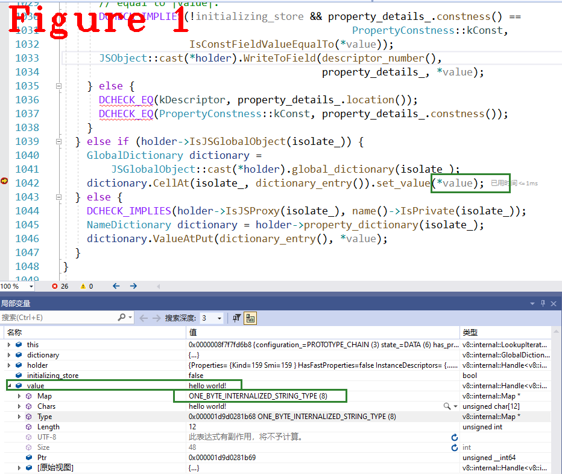
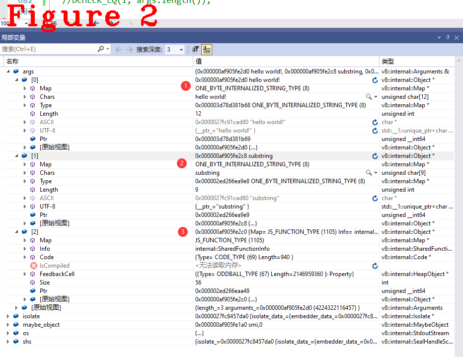

# 《Chrome V8原理讲解》第13篇 String类方法的源码分析

  
# 1 摘要  
Javascript对象是属性和一些成员值的集合。通过“.”符号来引用属性值。字符串（string）不是对象，为什么它会有属性呢？因为引用字符串的属性时，V8会将字符串转换成对象，此时对象就有了操作字符串的方法，这一转换过程对Javascript开发人员不可见，通过分析V8源码可以清楚细看这一过程，可以更好地理解Javascript中String类型的行为和特点。本文详细讲解V8中字符串相关的源码，对字符串的定义方法（章节2），字符串对象转换及重要数据结构（章节3）进行说明。最后进行技术总结，并介绍本文使用的V8调式手段(章节4)。  
# 2 字符串String定义  
在《Javascript:The Definitive Guide》书中提到：“字符串不是对象，它为什么有属性？”见下面代码。
```c++
var s = "hello world!";
var word = s.substring(s.indexOf(" ")+1,s.length);
console.log(word)
```
书中给出的答案是：“只要引用了字符串s的属性，Javascript会将字符值转换成对象--new String(s)”。我们知道，转换过程是由V8完成，为了看懂这一转换过程，我将其拆解成以下两个问题进行回答：  
**（1）** 要先确定这个字符串s定义时的类型是简单的字符串，还是对象？如果定义时已经是对象类型，“.”操作时还需要转换吗？  
**（2）** 如果需要转换，它一定发生在代码运行期。那么，只有跟踪字节码的运行，才能看到转换过程。  
如下是这段JS源码对应的字节码，我们先来确定字符串s定义后的类型是什么，即回答问题1。  
```c++
1.  [generated bytecode for function:  (0x03d78d381bd1 <SharedFunctionInfo>)]
2.  Parameter count 1
3.  Register count 6
4.  Frame size 48
5.           000003D78D381D06 @    0 : 12 00             LdaConstant [0]
6.           000003D78D381D08 @    2 : 26 fa             Star r1
7.           000003D78D381D0A @    4 : 0b                LdaZero
8.           000003D78D381D0B @    5 : 26 f9             Star r2
9.           000003D78D381D0D @    7 : 27 fe f8          Mov <closure>, r3
10.           000003D78D381D10 @   10 : 61 2d 01 fa 03    CallRuntime [DeclareGlobals], r1-r3
11.      0 E> 000003D78D381D15 @   15 : a7                StackCheck
12.      8 S> 000003D78D381D16 @   16 : 12 01             LdaConstant [1]
13.      8 E> 000003D78D381D18 @   18 : 15 02 04          StaGlobal [2], [4]
14.     36 S> 000003D78D381D1B @   21 : 13 02 00          LdaGlobal [2], [0]
15.           000003D78D381D1E @   24 : 26 f9             Star r2
16.     38 E> 000003D78D381D20 @   26 : 29 f9 03          LdaNamedPropertyNoFeedback r2, [3]
17.           000003D78D381D23 @   29 : 26 fa             Star r1
18.     48 E> 000003D78D381D25 @   31 : 13 02 00          LdaGlobal [2], [0]
19.           000003D78D381D28 @   34 : 26 f7             Star r4
20.     50 E> 000003D78D381D2A @   36 : 29 f7 04          LdaNamedPropertyNoFeedback r4, [4]
21.           000003D78D381D2D @   39 : 26 f8             Star r3
22.           000003D78D381D2F @   41 : 12 05             LdaConstant [5]
23.           000003D78D381D31 @   43 : 26 f6             Star r5
24.     50 E> 000003D78D381D33 @   45 : 5f f8 f7 02       CallNoFeedback r3, r4-r5
25.     62 E> 000003D78D381D37 @   49 : 40 01 06          AddSmi [1], [6]
26.           000003D78D381D3A @   52 : 26 f8             Star r3
27.     65 E> 000003D78D381D3C @   54 : 13 02 00          LdaGlobal [2], [0]
28.           000003D78D381D3F @   57 : 26 f7             Star r4
29.     67 E> 000003D78D381D41 @   59 : 29 f7 06          LdaNamedPropertyNoFeedback r4, [6]
30.           000003D78D381D44 @   62 : 26 f7             Star r4
31.  //省略很多.................
32.  Constant pool (size = 10)
33.  000003D78D381C71: [FixedArray] in OldSpace
34.   - map: 0x03ac45880169 <Map>
35.   - length: 10
36.             0: 0x03d78d381c11 <FixedArray[8]>
37.             1: 0x03d78d381b69 <String[#12]: hello world!>
38.             2: 0x03d78d381b51 <String[#1]: s>
39.             3: 0x02ed266ea9e9 <String[#9]: substring>
40.             4: 0x02ed266e8121 <String[#7]: indexOf>
41.             5: 0x006d3e183c21 <String[#1]:  >
42.             6: 0x03ac45884819 <String[#6]: length>
43.             7: 0x03ac45885301 <String[#4]: word>
44.             8: 0x02ed266f2441 <String[#7]: console>
45.             9: 0x02ed266f1a81 <String[#3]: log>
46.  Handler Table (size = 0)
```  
先说明一个概念`Constant pool`，常量池（代码32行至结尾），在Javascript编译期生成，用于存储常量数据的一个字符串类型数组，代码32行开始是长常池，代码37行存储Javascript源码中的`hello world!`，代码38行存储字符串变量名`s`。字节码执行过程中，常量池为其提供数据，字节码通过下标对常量池进行访问。  
解答问题（1）字符串s定义时的类型是什么？  
`var s = "hello world!";`，由代码12，13行完成全局字符串s的定义。代码12行`LdaConstant [1]`把常量池中下标为1的元素`hello world!`（代码37行）加载到累加器；代码13行`StaGlobal [2], [4]`以常量池[2]（代码38行）中的值（s）作为key，把累加器值存为全局变量，也就是`s = hello world!`。  
debug跟踪这两条字节码的执行过程，可以看s定义后的类型，分析13行的字节码，得知它最终调用如下代码：  
```c++
RUNTIME_FUNCTION(Runtime_StoreGlobalICNoFeedback_Miss) {
  HandleScope scope(isolate);
  DCHECK_EQ(2, args.length());
  // Runtime functions don't follow the IC's calling convention.
  Handle<Object> value = args.at(0);
  Handle<Name> key = args.at<Name>(1);

  // TODO(mythria): Replace StoreGlobalStrict/Sloppy with StoreNamed.
  StoreGlobalIC ic(isolate, Handle<FeedbackVector>(), FeedbackSlot(),
                   FeedbackSlotKind::kStoreGlobalStrict);
  RETURN_RESULT_OR_FAILURE(isolate, ic.Store(key, value));
}
//.................分隔线...................................
#define RETURN_RESULT_OR_FAILURE(isolate, call)      \
  do {                                               \
    Handle<Object> __result__;                       \
    Isolate* __isolate__ = (isolate);                \
    if (!(call).ToHandle(&__result__)) {             \
      DCHECK(__isolate__->has_pending_exception());  \
      return ReadOnlyRoots(__isolate__).exception(); \
    }                                                \
    DCHECK(!__isolate__->has_pending_exception());   \
    return *__result__;                              \
  } while (false)
```
上面这段代码最后的`RETURN_RESULT_OR_FAILURE`是宏模板，继续跟踪，进入`WriteDataValue()`,代码如下：  
```c++
void LookupIterator::WriteDataValue(Handle<Object> value,
                                    bool initializing_store) {
  DCHECK_EQ(DATA, state_);
  Handle<JSReceiver> holder = GetHolder<JSReceiver>();
  if (IsElement()) {
    Handle<JSObject> object = Handle<JSObject>::cast(holder);
    ElementsAccessor* accessor = object->GetElementsAccessor(isolate_);
    accessor->Set(object, number_, *value);
  } else if (holder->HasFastProperties(isolate_)) {
    if (property_details_.location() == kField) {
  //省略很多..............................    
```
`WriteDataValue()`方法先判断是不是全局对象，测试代码中字符串s定义在全局空间内，所以是全局变量，满足图1中标记位置的判断条件。    
  
注意看图1中的绿色标记，`value`的值是`hello world!`，它最终存以字典{key:value}形式存在全局表中,至此完成了s的定义。此时，它在V8中的类型是ONE_BYTE_INTERNALIZED_STRING，单字节字符串，这与书中的说法一致，s是字符串。  
# 3 字符串的substring()方法  
下面回答前述的问题2，如何转换。
根据前面的源代码`var word = s.substring(s.indexOf(" ")+1,s.length);`,现在要执行`s.substring()`，在V8执行逻辑中，先要获取字符串s的substring()方法，也就是'.'操作。前述字节码中第14、15行把刚定义的字节串s存到了r2寄存器中，代码16行：  
`LdaNamedPropertyNoFeedback r2, [3]`  
这条字节码的作用是在r2寄存器（字符串变量s的地址）内容中获取常量池[3]（字符串substring）中的方法，就是获取s的`substring()`方法，字节码LdaNamedPropertyNoFeedback源码如下：  
```c++
1.  IGNITION_HANDLER(LdaNamedPropertyNoFeedback, InterpreterAssembler) {
2.    TNode<Object> object = LoadRegisterAtOperandIndex(0);
3.    TNode<Name> name = CAST(LoadConstantPoolEntryAtOperandIndex(1));
4.    TNode<Context> context = GetContext();
5.    TNode<Object> result =
6.        CallBuiltin(Builtins::kGetProperty, context, object, name);
7.    SetAccumulator(result);
8.    CallRuntime(Runtime::kDebugPrint, context, object, name,result);//这里是我添加的调试命令
9.    Dispatch();
10.  }
11.  //...........................分隔线..........................................
12.  TF_BUILTIN(GetProperty, CodeStubAssembler) {
13.    Node* object = Parameter(Descriptor::kObject);
14.    Node* key = Parameter(Descriptor::kKey);
15.    Node* context = Parameter(Descriptor::kContext);
16.    // TODO(duongn): consider tailcalling to GetPropertyWithReceiver(object,
17.    // object, key, OnNonExistent::kReturnUndefined).
18.    Label if_notfound(this), if_proxy(this, Label::kDeferred),
19.        if_slow(this, Label::kDeferred);
20.    CodeStubAssembler::LookupInHolder lookup_property_in_holder =
21.        [=](Node* receiver, Node* holder, Node* holder_map,
22.            Node* holder_instance_type, Node* unique_name, Label* next_holder,
23.            Label* if_bailout) {
24.          VARIABLE(var_value, MachineRepresentation::kTagged);
25.          Label if_found(this);
26.          TryGetOwnProperty(context, receiver, holder, holder_map,
27.                            holder_instance_type, unique_name, &if_found,
28.                            &var_value, next_holder, if_bailout);
29.          BIND(&if_found);
30.          Return(var_value.value());
31.        };
32.    CodeStubAssembler::LookupInHolder lookup_element_in_holder =
33.        [=](Node* receiver, Node* holder, Node* holder_map,
34.            Node* holder_instance_type, Node* index, Label* next_holder,
35.            Label* if_bailout) {
36.          // Not supported yet.
37.          Use(next_holder);
38.          Goto(if_bailout);
39.        };
40.    TryPrototypeChainLookup(object, object, key, lookup_property_in_holder,
41.                            lookup_element_in_holder, &if_notfound, &if_slow,
42.                            &if_proxy);
43.    BIND(&if_notfound);
44.    Return(UndefinedConstant());
45.    BIND(&if_slow);
46.    TailCallRuntime(Runtime::kGetProperty, context, object, key);
47.    BIND(&if_proxy);
48.    {
49.      // Convert the {key} to a Name first.
50.      TNode<Object> name = CallBuiltin(Builtins::kToName, context, key);
51.      // The {object} is a JSProxy instance, look up the {name} on it, passing
52.      // {object} both as receiver and holder. If {name} is absent we can safely
53.      // return undefined from here.
54.      TailCallBuiltin(Builtins::kProxyGetProperty, context, object, name, object,
55.                      SmiConstant(OnNonExistent::kReturnUndefined));
56.    }
57.  }
```  
调试过程中只有汇编码，无法看到C++源码，因为他们属于Builtin，是预先编译好并存储在`snapshot_blob.bin`文件中，V8启动时反序列化加载的二进制源码，关于Builtin详见之前的文章。  
代码8行，是我加入的调用断点，触发时会进入C++源码环境，方便给大家展示程序状态。代码5行调用`TF_BUILTIN(GetProperty, CodeStubAssembler)`返回结果result，result是字符串`substring()`方法。  
   
图2是VS2019的调试窗口，前面提到无法做C++源码调试，在这看到的程序状态信息，因为代码8行是我添加的`CallRuntime(Runtime::kDebugPrint, context, object, name,result)`指令，才得以进入C++环境查看程序状态。这里只能看到程序状态，不要误以为这种方式可以摆脱汇编，一直在C++源码中调试执行，看图3调用堆栈。 
   
图3中可以看到，调用堆栈只有两层，因为`DebugPrint`由`Builtin::LdaNamedPropertyNoFeedback`调用，退出后还要回到汇编代码。  
图2中的`args[0]`是'hello world!'，它是之前声明的全局变量s，注意看它的类型依旧就是ONE_BYTE_INTERNALIZED_STRING；再看`args[1]`是`substring`，是从常量池中读取的，它的类型同上；最后看`args[2]`,它的类型是JS_FUNCTION，这就是获取的`substring()`方法的地址指针，注意与`args[1]`的区别。  
到此，转换过程完毕，我们并没有看到字符串s的类型在V8中发生过变化，但也没有阻碍获取字符串`substring()`方法。  
# 4 技术总结
**（1）** 相对于bool等几个基础类型，String是复合类型，本文只讲了一种字符串ONE_BYTE类型，下面给出其它字符串类型。  
```c++
switch (map.instance_type()) {
    case CONS_STRING_TYPE:
    case CONS_ONE_BYTE_STRING_TYPE:
    case THIN_STRING_TYPE:
    case THIN_ONE_BYTE_STRING_TYPE:
    case SLICED_STRING_TYPE:
    case SLICED_ONE_BYTE_STRING_TYPE:
    case EXTERNAL_STRING_TYPE:
    case EXTERNAL_ONE_BYTE_STRING_TYPE:
    case UNCACHED_EXTERNAL_STRING_TYPE:
    case UNCACHED_EXTERNAL_ONE_BYTE_STRING_TYPE:
    case STRING_TYPE:
    case ONE_BYTE_STRING_TYPE:
    //省略............................
```  
在V8内部，对String类型做了进一步的详细区分，定义很多不同的字符串类型，上述代码每一个`XXX_STRING_TYPE`代表一种字符串类型。  
**（2）** 全局字符串s的类型没有因为'.'操作发生变化。这绝对没违背书中所描述的技术原理，只是V8的具体实现方式不同而已。  
**（3）** 从V8源码的角度来讲来，String类的父类是Name，Name的父类是HeapObject，最后是Ojbect类，这么说来，String类本身就是一个堆对象方法。但这和书中说的不是一个概念，书中强调:对字符串进行‘.’操作时，它就不再是字符串，而是一个对象了，注意区别。  
**（4）** 下面是我用的`DebugPrint()`方法，这是V8内置方法，代码如下。
```c++
1.  RUNTIME_FUNCTION(Runtime_DebugPrint) {
2.    SealHandleScope shs(isolate);
3.    //DCHECK_EQ(1, args.length());这行我注释掉了
4.    MaybeObject maybe_object(*args.address_of_arg_at(0));
5.    StdoutStream os;
6.    if (maybe_object->IsCleared()) {
7.      os << "[weak cleared]";
8.    } else {
9.      Object object = maybe_object.GetHeapObjectOrSmi();
10.      bool weak = maybe_object.IsWeak();
11.  #ifdef DEBUG
12.      if (object.IsString() && !isolate->context().is_null()) {
13.        DCHECK(!weak);
14.        // If we have a string, assume it's a code "marker"
15.        // and print some interesting cpu debugging info.
16.        object.Print(os);
17.        JavaScriptFrameIterator it(isolate);
18.        JavaScriptFrame* frame = it.frame();
19.        os << "fp = " << reinterpret_cast<void*>(frame->fp())
20.           << ", sp = " << reinterpret_cast<void*>(frame->sp())
21.           << ", caller_sp = " << reinterpret_cast<void*>(frame->caller_sp())
22.           << ": ";
23.      } else {
24.        os << "DebugPrint: ";
25.        if (weak) {
26.          os << "[weak] ";
27.        }
28.        object.Print(os);
29.      }
30.      if (object.IsHeapObject()) {
31.        HeapObject::cast(object).map().Print(os);
32.      }
33.  #else
34.      if (weak) {
35.        os << "[weak] ";
36.      }
37.      // ShortPrint is available in release mode. Print is not.
38.      os << Brief(object);
39.  #endif
40.    }
41.    os << std::endl;
42.    return args[0];  // return TOS
43.  }
```  
该方法类似“断点”功能，在调试V8源码时，可以在Builtin中使用，并把想要观察的变量作为参数传入，就可以回到C++环境查看程序状态。  
这个方法原本是为调试Javascript源码提供的，在JS中的使用方式是`%DebugPrint()`。我用来充当调试断点，给大家展示程序中断状态。在Builtin中的调用方法是：`CallRuntime(Runtime::kDebugPrint, context, your args0,your args1....);`。    
好了，今天到这里，下次见。   

**恳请读者批评指正、提出宝贵意见**  
**微信：qq9123013  备注：v8交流    邮箱：v8blink@outlook.com**