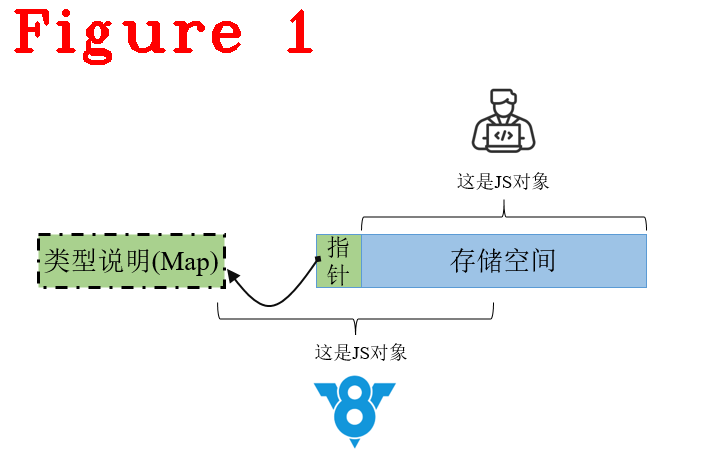
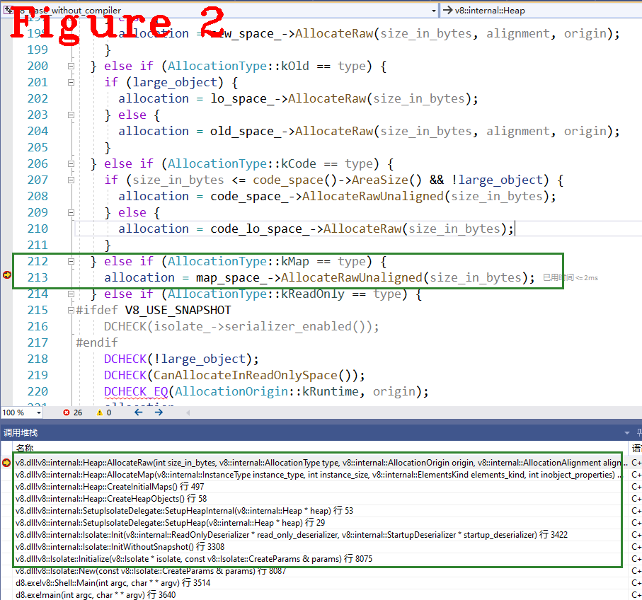
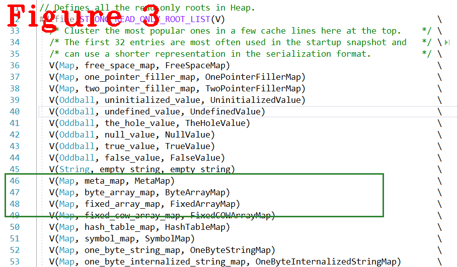

# 《Chrome V8原理讲解》第14篇 看V8如何表示JS的动态类型
  
# 1 摘要  
JavaScript是动态类型语言，数据类型具有不确定性。V8是用C++编写的，C++是强类型语言，要求类型确定。类型确定的C++是如何表达类型不确定的JS呢？解决方法是：操作JS数据前先查询类型，再操作。这又产生了新问题--性能损耗，因为类型查询是极为耗时的操作，频繁使用严重影响程序运行速度。为此，V8采用了Map机制，也称为隐藏类（Hidden Class）。**注意：** Map机制与JS中的`map()`没有关系，只是同名。Map机制可以很好地表达JS的不确定性，它的主要作用是降低性能损耗。本文通过形象化的比喻和深入的源码分析，使大家从宏观和微观角度全面累计Map机制，本文组织结构：Map原理，它如何表达Javascript的动态类型（章节2）；V8初始化阶段对Map的处理过程（章节3）。 
# 2 Map原理  
由于Javascript类型的不确定性，V8操作Javascript对象（例如：调用方法、访问对对象成员）前要先查询其类型。因此，V8引入了Map机制，它是一种用于描述类型的数据结构，可以形象地把它叫作“地图”，它的使用特点是固定的位置存储指定的内容，如图1所示。    
  
借助图1，我们对Map机制进行概要描述：  
**（1）** JS开发者角度，仅能看到存储空间，这段存储空间保存了开发者定义的JS对象，但V8不知道对象类型；  
**（2）** 指针，它是存储空间的第一个位置，类型是指针，大小8byte（64位系统中），这个指针由V8维护，开发者看不到，所以叫隐藏类。它的作用是指向Map；  
**（3）** V8角度，能看到指针+存储空间，就可以找到Map。这个Map大小是固定的80byte，存储信息的格式与位置也是固定的，存储信息包括：JS对象的存储空间有哪些成员，成员类型，成员偏移地址等。所以说，Map就是地图。  
V8通过查询Map，可以知道存储空间内存放了什么，怎么存放的，进而正确操作JS对象。一句话总结：V8利用类型确定的Map类（c++实现的class对象）管理JS的动态类型。其实，在V8角度看，Map类型是确定的，所以整体数据类型就是确定的。最重要是Map提高了效率，因为它代替了耗时的JS对象类型检索操作。
下面来看Map的布局：     
```c++
1.  Map layout:
2.  // +---------------+---------------------------------------------+
3.  // |   _ Type _    | _ Description _                             |
4.  // +---------------+---------------------------------------------+
5.  // | TaggedPointer | map - Always a pointer to the MetaMap root  |
6.  // +---------------+---------------------------------------------+
7.  // | Int           | The first int field                         |
8.  //  `---+----------+---------------------------------------------+
9.  //      | Byte     | [instance_size]                             |
10.  //      +----------+---------------------------------------------+
11.  //      | Byte     | If Map for a primitive type:                |
12.  //      |          |   native context index for constructor fn   |
13.  //      |          | If Map for an Object type:                  |
14.  //      |          |   inobject properties start offset in words |
15.  //      +----------+---------------------------------------------+
16.  //      | Byte     | [used_or_unused_instance_size_in_words]     |
17.  //      |          | For JSObject in fast mode this byte encodes |
18.  //      |          | the size of the object that includes only   |
19.  //      |          | the used property fields or the slack size  |
20.  //      |          | in properties backing store.                |
21.  //      +----------+---------------------------------------------+
22.  //      | Byte     | [visitor_id]                                |
23.  // +----+----------+---------------------------------------------+
24.  // | Int           | The second int field                        |
25.  //  `---+----------+---------------------------------------------+
26.  //      | Short    | [instance_type]                             |
27.  //      +----------+---------------------------------------------+
28.  //      | Byte     | [bit_field]                                 |
29.  //      |          |   - has_non_instance_prototype (bit 0)      |
30.  //      |          |   - is_callable (bit 1)                     |
31.  //      |          |   - has_named_interceptor (bit 2)           |
32.  //      |          |   - has_indexed_interceptor (bit 3)         |
33.  //      |          |   - is_undetectable (bit 4)                 |
34.  //      |          |   - is_access_check_needed (bit 5)          |
35.  //      |          |   - is_constructor (bit 6)                  |
36.  //      |          |   - has_prototype_slot (bit 7)              |
37.  //      +----------+---------------------------------------------+
38.  //      | Byte     | [bit_field2]                                |
39.  //      |          |   - new_target_is_base (bit 0)              |
40.  //      |          |   - is_immutable_proto (bit 1)              |
41.  //      |          |   - unused bit (bit 2)                      |
42.  //      |          |   - elements_kind (bits 3..7)               |
43.  // +----+----------+---------------------------------------------+
44.  // | Int           | [bit_field3]                                |
45.  // |               |   - enum_length (bit 0..9)                  |
46.  // |               |   - number_of_own_descriptors (bit 10..19)  |
47.  // |               |   - is_prototype_map (bit 20)               |
48.  // |               |   - is_dictionary_map (bit 21)              |
49.  // |               |   - owns_descriptors (bit 22)               |
50.  // |               |   - is_in_retained_map_list (bit 23)        |
51.  // |               |   - is_deprecated (bit 24)                  |
52.  // |               |   - is_unstable (bit 25)                    |
53.  // |               |   - is_migration_target (bit 26)            |
54.  // |               |   - is_extensible (bit 28)                  |
55.  // |               |   - may_have_interesting_symbols (bit 28)   |
56.  // |               |   - construction_counter (bit 29..31)       |
57.  // |               |                                             |
58.  // +*************************************************************+
59.  // | Int           | On systems with 64bit pointer types, there  |
60.  // |               | is an unused 32bits after bit_field3        |
61.  // +*************************************************************+
62.  // | TaggedPointer | [prototype]                                 |
63.  // +---------------+---------------------------------------------+
64.  // | TaggedPointer | [constructor_or_backpointer]                |
65.  // +---------------+---------------------------------------------+
66.  // | TaggedPointer | [instance_descriptors]                      |
67.  // +*************************************************************+
68.  // ! TaggedPointer ! [layout_descriptors]                        !
69.  // !               ! Field is only present if compile-time flag  !
70.  // !               ! FLAG_unbox_double_fields is enabled         !
71.  // !               ! (basically on 64 bit architectures)         !
72.  // +*************************************************************+
73.  // | TaggedPointer | [dependent_code]                            |
74.  // +---------------+---------------------------------------------+
75.  // | TaggedPointer | [prototype_validity_cell]                   |
76.  // +---------------+---------------------------------------------+
77.  // | TaggedPointer | If Map is a prototype map:                  |
78.  // |               |   [prototype_info]                          |
79.  // |               | Else:                                       |
80.  // |               |   [raw_transitions]                         |
81.  // +---------------+---------------------------------------------+
```   
前面提到Map是格式统一、大小固定的数据结构，即规定的位置代表指定的含义。上面代码是它的格式，它大小是80个字节，代码9行，instance_size代表图1中的存储空间的大小；代码24行，instance_type代表图1中的存储空间内的JS数据类型，例如：JS数组、JSFunction等。代码66行，instance_descriptors对JS数据的详细描述，例如：每个成员都是什么，存在哪里等。
**注意**：每一个JavaScript对象的存储空间的第一个位置都是一个Map指针，也就是每个js对象都有Map，Map大小不因js对象不同而改变，始终是80字节，存储内容也如上所示，保持不变。它用来描述JS对象的形状，相同形状的不同js对象共同一个Map。“形状相同”是类型一样，内部成员存储布局也一样，如下面代码：
```c++
function Point(x,y) {
	this.x = x;
	this.y = y;
}

var fun1 = new Point(1,2);
var fun2 = new Point(3,4);
```  
`fun1`和`fun2`共用一个Map，因为他们的形状一样。执行`fun2.z=80;`之后，fun2的形状发生了变，随之会有新的Map产生，叫Map迁移，后续文章会讲解。
下面来看是Map类的核心代码：  
```c++
1.  class Map : public HeapObject {
2.   public:
3.  //...............省略很多..................
4.     DECL_PRIMITIVE_ACCESSORS(bit_field, byte)
5.     DECL_PRIMITIVE_ACCESSORS(relaxed_bit_field, byte)
6.   // Bit positions for |bit_field|.
7.   #define MAP_BIT_FIELD_FIELDS(V, _)          \
8.     V(HasNonInstancePrototypeBit, bool, 1, _) \
9.     V(IsCallableBit, bool, 1, _)              \
10.     V(HasNamedInterceptorBit, bool, 1, _)     \
11.     V(HasIndexedInterceptorBit, bool, 1, _)   \
12.     V(IsUndetectableBit, bool, 1, _)          \
13.     V(IsAccessCheckNeededBit, bool, 1, _)     \
14.     V(IsConstructorBit, bool, 1, _)           \
15.     V(HasPrototypeSlotBit, bool, 1, _)
16.     DEFINE_BIT_FIELDS(MAP_BIT_FIELD_FIELDS)
17.   #undef MAP_BIT_FIELD_FIELDS
18.     // Bit field 2.
19.     DECL_PRIMITIVE_ACCESSORS(bit_field2, byte)
20.   // Bit positions for |bit_field2|.
21.   #define MAP_BIT_FIELD2_FIELDS(V, _)      \
22.     V(NewTargetIsBaseBit, bool, 1, _)      \
23.     V(IsImmutablePrototypeBit, bool, 1, _) \
24.     V(UnusedBit, bool, 1, _)               \
25.     V(ElementsKindBits, ElementsKind, 5, _)
26.     DEFINE_BIT_FIELDS(MAP_BIT_FIELD2_FIELDS)
27.   #undef MAP_BIT_FIELD2_FIELDS
28.     DECL_PRIMITIVE_ACCESSORS(bit_field3, uint32_t)
29.     V8_INLINE void clear_padding();
30.   // Bit positions for |bit_field3|.
31.   #define MAP_BIT_FIELD3_FIELDS(V, _)                               \
32.     V(EnumLengthBits, int, kDescriptorIndexBitCount, _)             \
33.     V(NumberOfOwnDescriptorsBits, int, kDescriptorIndexBitCount, _) \
34.     V(IsPrototypeMapBit, bool, 1, _)                                \
35.     V(IsDictionaryMapBit, bool, 1, _)                               \
36.     V(OwnsDescriptorsBit, bool, 1, _)                               \
37.     V(IsInRetainedMapListBit, bool, 1, _)                           \
38.     V(IsDeprecatedBit, bool, 1, _)                                  \
39.     V(IsUnstableBit, bool, 1, _)                                    \
40.     V(IsMigrationTargetBit, bool, 1, _)                             \
41.     V(IsExtensibleBit, bool, 1, _)                                  \
42.     V(MayHaveInterestingSymbolsBit, bool, 1, _)                     \
43.     V(ConstructionCounterBits, int, 3, _)
44.     DEFINE_BIT_FIELDS(MAP_BIT_FIELD3_FIELDS)
45.   #undef MAP_BIT_FIELD3_FIELDS
46.      DEFINE_FIELD_OFFSET_CONSTANTS(HeapObject::kHeaderSize,
47.                                    TORQUE_GENERATED_MAP_FIELDS)
48.      //...............省略很多..................
49.      OBJECT_CONSTRUCTORS(Map, HeapObject);
50.  };
```  
上述代码中，只保留了MAP格式的定义，我们对DEFINE_FIELD_OFFSET_CONSTANTS做展开，如下：  
```c++
1.    enum {
2.  TORQUE_GENERATED_MAP_FIELDS_StartOffset= 7,
3.  kInstanceSizeInWordsOffset=8, kInstanceSizeInWordsOffsetEnd = 8,
4.  kInObjectPropertiesStartOrConstructorFunctionIndexOffset=9, kInObjectPropertiesStartOrConstructorFunctionIndexOffsetEnd = 9,
5.  kUsedOrUnusedInstanceSizeInWordsOffset=10, kUsedOrUnusedInstanceSizeInWordsOffsetEnd = 10,
6.  kVisitorIdOffset=11, kVisitorIdOffsetEnd = 11,
7.  kInstanceTypeOffset=12, kInstanceTypeOffsetEnd = 13,
8.  kBitFieldOffset=14, kBitFieldOffsetEnd = 14,
9.  kBitField2Offset=15, kBitField2OffsetEnd = 15,
10.  kBitField3Offset=16, kBitField3OffsetEnd = 19,
11.  kOptionalPaddingOffset=20, kOptionalPaddingOffsetEnd = 23,
12.  kStartOfStrongFieldsOffset=24, kStartOfStrongFieldsOffsetEnd = 23,
13.  kPrototypeOffset=24, kPrototypeOffsetEnd = 31,
14.  kConstructorOrBackPointerOffset=32, kConstructorOrBackPointerOffsetEnd = 39,
15.  kInstanceDescriptorsOffset=40, kInstanceDescriptorsOffsetEnd = 47,
16.  kLayoutDescriptorOffset=48, kLayoutDescriptorOffsetEnd = 55,
17.  kDependentCodeOffset=56, kDependentCodeOffsetEnd = 63,
18.  kPrototypeValidityCellOffset=64, kPrototypeValidityCellOffsetEnd = 71,
19.  kEndOfStrongFieldsOffset=72, kEndOfStrongFieldsOffsetEnd = 71,
20.  kStartOfWeakFieldsOffset=72, kStartOfWeakFieldsOffsetEnd = 71,
21.  kTransitionsOrPrototypeInfoOffset=72, kTransitionsOrPrototypeInfoOffsetEnd = 79,
22.  kEndOfWeakFieldsOffset=80, kEndOfWeakFieldsOffsetEnd = 79,
23.  kSize=80, kSizeEnd = 79,
24.    }
```  
代码2行TORQUE_GENERATED_MAP_FIELDS_StartOffset说明了Map的起始偏移是7（从0算起），也就是第8个字节，前面提到一个Map的大小是80个字节，由于Map继承Heap对象，这80个字节中的前8个字节是Heap对象，所以它的实际可用的字节是72个，每个成员的偏移和大小与前述第一段代码（Map Layout）对应。Map的创建和回收由V8的Heap负责管理，下面是创建Map的源码位置：  
```c++
1.  AllocationResult Heap::AllocateRaw(int size_in_bytes, AllocationType type,
2.                                     AllocationOrigin origin,
3.                                     AllocationAlignment alignment) {
4.  //.....省略很多.......
5.    if (AllocationType::kYoung == type) {
6.  //.....省略很多.......
7.    } else if (AllocationType::kOld == type) {
8.  //.....省略很多.......
9.    } else if (AllocationType::kCode == type) {
10.      if (size_in_bytes <= code_space()->AreaSize() && !large_object) {
11.        allocation = code_space_->AllocateRawUnaligned(size_in_bytes);
12.      } else {
13.        allocation = code_lo_space_->AllocateRaw(size_in_bytes);
14.      }
15.    } else if (AllocationType::kMap == type) {
16.      allocation = map_space_->AllocateRawUnaligned(size_in_bytes);
17.    } else if (AllocationType::kReadOnly == type) {
18.  #ifdef V8_USE_SNAPSHOT
19.      DCHECK(isolate_->serializer_enabled());
20.  #endif
21.      DCHECK(!large_object);
22.      DCHECK(CanAllocateInReadOnlySpace());
23.      DCHECK_EQ(AllocationOrigin::kRuntime, origin);
24.      allocation =
25.          read_only_space_->AllocateRaw(size_in_bytes, alignment, origin);
26.    } else {
27.      UNREACHABLE();
28.    }
29.    return allocation;
30.  }
```  
代码15行，`type=KMap`时`size_in_bytes`是80，进入代码16行分配内存，图2给出了执行代码16的调用堆栈。  
  
`AllocateRaw()`分配内存后返回到`AllocateMap()`,对内存进行初始化，代码如下：  
```c++
1.  Map Factory::InitializeMap(Map map, InstanceType type, int instance_size,
2.                             ElementsKind elements_kind,
3.                             int inobject_properties) {
4.    map.set_instance_type(type);
5.    map.set_prototype(*null_value(), SKIP_WRITE_BARRIER);
6.    map.set_constructor_or_backpointer(*null_value(), SKIP_WRITE_BARRIER);
7.    map.set_instance_size(instance_size);
8.    if (map.IsJSObjectMap()) {
9.      DCHECK(!ReadOnlyHeap::Contains(map));
10.      map.SetInObjectPropertiesStartInWords(instance_size / kTaggedSize -
11.                                            inobject_properties);
12.      DCHECK_EQ(map.GetInObjectProperties(), inobject_properties);
13.      map.set_prototype_validity_cell(*invalid_prototype_validity_cell());
14.    } else {
15.      DCHECK_EQ(inobject_properties, 0);
16.      map.set_inobject_properties_start_or_constructor_function_index(0);
17.      map.set_prototype_validity_cell(Smi::FromInt(Map::kPrototypeChainValid));
18.    }
19.    map.set_dependent_code(DependentCode::cast(*empty_weak_fixed_array()),
20.                           SKIP_WRITE_BARRIER);
21.    map.set_raw_transitions(MaybeObject::FromSmi(Smi::zero()));
22.    map.SetInObjectUnusedPropertyFields(inobject_properties);
23.    map.SetInstanceDescriptors(isolate(), *empty_descriptor_array(), 0);
24.    if (FLAG_unbox_double_fields) {
25.      map.set_layout_descriptor(LayoutDescriptor::FastPointerLayout());
26.    }
27.  //.................省略很多...............
28.    return map;
29.  }
```  
上面代码是对Map的初始化，按最开始给出的May layout对每个字段（bit位、byte位、short位等）进行初始化。代码8，9，10，13行对JSObject对象中的InObject数据进行初始化，“InObject”是存储在JSObject对象内部的数据，访问这些数据更快。代码28返回Map,至此Map生成完毕，后续会通过这个Map访问图1中的存储空间，请读者自行跟踪代码，不再赘述。  
# 3 Map初始化  
在V8的启动阶段，`CreateInitialMaps()`对所有Javascript类型分别建立对应的空Map，“空Map”说明了创建某个JS类型数据所需的最小内存空间。这样，开发者创建javascript对象时，V8先用对应的空Map申请一段最小空间，随时开发者对JS对象添加成员，Map也会发生改变。下面给出Map初始化的源码：  
```c++
1.  bool Heap::CreateInitialMaps() {//....代码太长，中间省略很多........
2.    HeapObject obj;
3.    {
4.      AllocationResult allocation = AllocatePartialMap(MAP_TYPE, Map::kSize);
5.      if (!allocation.To(&obj)) return false;
6.    }
7.    Map new_meta_map = Map::unchecked_cast(obj);
8.    set_meta_map(new_meta_map);
9.    new_meta_map.set_map_after_allocation(new_meta_map);
10.  //...................分隔线....................
11.    ReadOnlyRoots roots(this);
12.    {  // Partial map allocation
13.  #define ALLOCATE_PARTIAL_MAP(instance_type, size, field_name)                \
14.    {                                                                          \
15.      Map map;                                                                 \
16.      if (!AllocatePartialMap((instance_type), (size)).To(&map)) return false; \
17.      set_##field_name##_map(map);                                             \
18.    }
19.      ALLOCATE_PARTIAL_MAP(FIXED_ARRAY_TYPE, kVariableSizeSentinel, fixed_array);
20.      ALLOCATE_PARTIAL_MAP(WEAK_FIXED_ARRAY_TYPE, kVariableSizeSentinel,
21.                           weak_fixed_array);
22.      ALLOCATE_PARTIAL_MAP(WEAK_ARRAY_LIST_TYPE, kVariableSizeSentinel,
23.  //...................分隔线....................
24.  #undef ALLOCATE_PARTIAL_MAP
25.    }
26.    // Allocate the empty array.
27.    {
28.      AllocationResult alloc =
29.          AllocateRaw(FixedArray::SizeFor(0), AllocationType::kReadOnly);
30.      if (!alloc.To(&obj)) return false;
31.      obj.set_map_after_allocation(roots.fixed_array_map(), SKIP_WRITE_BARRIER);
32.      FixedArray::cast(obj).set_length(0);
33.    }
34.    set_empty_fixed_array(FixedArray::cast(obj));
35.  //...................分隔线....................
36.    FinalizePartialMap(roots.meta_map());
37.    FinalizePartialMap(roots.fixed_array_map());
38.    FinalizePartialMap(roots.weak_fixed_array_map());
39.    {
40.      if (!AllocateRaw(FixedArray::SizeFor(0), AllocationType::kReadOnly)
41.               .To(&obj)) {
42.        return false;
43.      }
44.      obj.set_map_after_allocation(roots.closure_feedback_cell_array_map(),
45.                                   SKIP_WRITE_BARRIER);
46.      FixedArray::cast(obj).set_length(0);
47.      set_empty_closure_feedback_cell_array(ClosureFeedbackCellArray::cast(obj));
48.    }
49.    DCHECK(!InYoungGeneration(roots.empty_fixed_array()));
50.    roots.bigint_map().SetConstructorFunctionIndex(
51.        Context::BIGINT_FUNCTION_INDEX);
52.    return true;
53.  }
```  
分隔线把代码分成了四部分，代码4,5,6,7,8行创建`meta_data`，这是所有Map都要用的元信息；代码13~22行，结合宏模板`ALLOCATE_PARTIAL_MAP`创建`ARRAY`和`ARRAY_LIST`类型的Map；代码27~34行创建其类型Map；分三批创建是因为后者的创建要依赖前者。最后，36开始，是完成所有Map创建的最终工作，并存储到root_table中，图3给出部分Map在root_table中的存储位置。  
  
root_table是由下面的一系列宏板定义实现的指针类型数组，通过debug跟踪代码，可以看到meta_data在root_table中的位置下标是10，其它的下标请读者自行计算。
```c++
#define READ_ONLY_ROOT_LIST(V)     \
  STRONG_READ_ONLY_ROOT_LIST(V)    \
  INTERNALIZED_STRING_ROOT_LIST(V) \
  PRIVATE_SYMBOL_ROOT_LIST(V)      \
  PUBLIC_SYMBOL_ROOT_LIST(V)       \
  WELL_KNOWN_SYMBOL_ROOT_LIST(V)   \
  STRUCT_MAPS_LIST(V)              \
  ALLOCATION_SITE_MAPS_LIST(V)     \
  DATA_HANDLER_MAPS_LIST(V)

#define MUTABLE_ROOT_LIST(V)                \
  STRONG_MUTABLE_IMMOVABLE_ROOT_LIST(V)     \
  STRONG_MUTABLE_MOVABLE_ROOT_LIST(V)       \
  V(StringTable, string_table, StringTable) \
  SMI_ROOT_LIST(V)

#define ROOT_LIST(V)     \
  READ_ONLY_ROOT_LIST(V) \
  MUTABLE_ROOT_LIST(V)
```   
上述定义了root_table,通过宏模板的参数，可猜想出每个元素的大体功能和作用，配合debug跟踪来验证猜想是否确。  
  
好了，今天到这里，下次见。   

**恳请读者批评指正、提出宝贵意见**  
**微信：qq9123013  备注：v8交流    邮箱：v8blink@outlook.com**