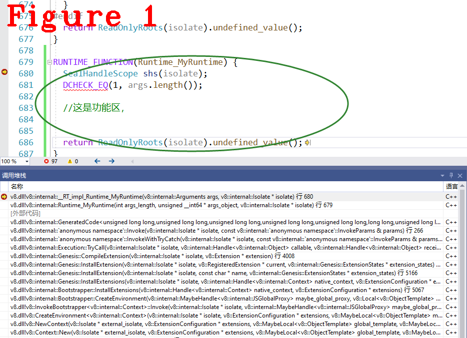

# 《Chrome V8原理讲解》第十五篇 运行时辅助类，给V8添加钩子函数
  
  
# 前言  
本系列的前十三篇文，讲解了V8执行Javascript时最基础的工作流程和原理，包括词法分析、语法分析、字节码生成、Builtins方法、ignition执行单元，等等，达到了从零做起，入门学习的目的。  
接下来的文章将以问题为导向讲解V8源码，例如：以闭包技术、或垃圾加收（GC）为专题讲解V8中的相关源码。V8代码过于庞大，以问题为导向可以使得学习主题更加明确、效果更好。同时，我争取做到每篇文章是一个独立的知识点，方便大家阅读。  
读者可以把想学的内容在文末评论区留言，我汇总后出专题文章。  
# 1 摘要  
Javascript的部分功能，如属性访问，新建对象、正则表达式等，由C++编码、以独立函数的形式存在，JavaScript在运行时以函数调用方式使用这些功能，所以称之为Runtime辅助类。`new ojbect()`、`prototype`等功能均由C++函数实现，由于V8封装了这些函数，所以Javascript开发者看不到使用细节。本文讲解Runtime的使用细节，内容包括以下三方面：  
**（1）** Runtime源码讲解，数据结构和定义方法；  
**（2）** 调用约定，Bytecode如何调用Runtime功能，即builtin调用Runtime功能的约定；  
**（3）** 自定义Runtime功能方法，随时随地给V8添加钩子函数。  
# 2 Runtime源码  
先说明runtime功能有哪些？叫什么？功能是什么？答案在runtime.h文件中，源码如下：
```c++
1.  #define FOR_EACH_INTRINSIC_GENERATOR(F, I)    \
2.    I(AsyncFunctionAwaitCaught, 2, 1)           \
3.    I(AsyncFunctionAwaitUncaught, 2, 1)         \
4.    I(AsyncFunctionEnter, 2, 1)                 \
5.    I(AsyncFunctionReject, 3, 1)                \
6.    I(AsyncFunctionResolve, 3, 1)               \
7.    I(AsyncGeneratorAwaitCaught, 2, 1)          \
8.    I(GeneratorGetResumeMode, 1, 1)
9.  #define FOR_EACH_INTRINSIC_MODULE(F, I) \ //省略很多.....................
10.    F(DynamicImportCall, 2, 1)            \
11.    I(GetImportMetaObject, 0, 1)          \
12.    F(GetModuleNamespace, 1, 1)
13.  #define FOR_EACH_INTRINSIC_NUMBERS(F, I) \
14.    F(GetHoleNaNLower, 0, 1)               \
15.    F(GetHoleNaNUpper, 0, 1)               \
16.    I(IsSmi, 1, 1)                         \
17.    F(IsValidSmi, 1, 1)                    \
18.    F(MaxSmi, 0, 1)                        \
19.    F(NumberToString, 1, 1)                \
20.    F(StringParseFloat, 1, 1)              \ //省略很多.....................
21.    F(StringParseInt, 2, 1)                \
22.    F(StringToNumber, 1, 1)
23.  #define FOR_EACH_INTRINSIC_OBJECT(F, I)                         \
24.    F(AddDictionaryProperty, 3, 1)                                \
25.    F(NewObject, 2, 1)  
26.  #define FOR_EACH_INTRINSIC_REGEXP(F, I)             \
27.    I(IsRegExp, 1, 1)                                 \
28.    F(RegExpExec, 4, 1)                               \
29.    F(RegExpExecMultiple, 4, 1)                       \
30.    F(RegExpInitializeAndCompile, 3, 1)               \
31.    F(RegExpReplaceRT, 3, 1)                          \
32.    F(RegExpSplit, 3, 1)                              \
33.    F(StringReplaceNonGlobalRegExpWithFunction, 3, 1) \
34.    F(StringSplit, 3, 1)
35.  #define FOR_EACH_INTRINSIC_STRINGS(F, I)  \
36.    F(StringGreaterThan, 2, 1)              \
37.    F(StringGreaterThanOrEqual, 2, 1)       \
38.    F(StringIncludes, 3, 1)                 \
39.    F(StringIndexOf, 3, 1)                  \
40.    F(StringIndexOfUnchecked, 3, 1)         \
41.    F(StringLastIndexOf, 2, 1)              \
42.    F(StringLessThan, 2, 1)                 \
43.    F(StringLessThanOrEqual, 2, 1)          \
44.    F(StringMaxLength, 0, 1)                \
45.    F(StringReplaceOneCharWithString, 3, 1) \
46.    F(StringCompareSequence, 3, 1)          \
47.    F(StringSubstring, 3, 1)                \
48.    F(StringToArray, 2, 1)                  \
49.    F(StringTrim, 2, 1)
```  
上述代码是Runtime定义使用的宏模板，省略了很多，保留了一些常见的、有代表性的功能。每一行代表一个功能函数，以`F(NewObject, 2, 1)`说明定义格式：  
`F`，最终会被替换成另一个宏，宏里嵌套另一个宏，另外以`I`开头的，也是一样，使用`F`和`I`（IntrinsicTypes）是为方便代码重用，这是V8代码的书写风格；  
`NewObject`是函数名，实现Javascript中的对象创建功能；  
`2,1`，其中`2`是参数的数量，`1`是返回值的数量。  
代码2~7行的`AsyncXXX`功能对应的是Javascript中的异步功能；代码19~22行，类型转换；代码25行，新建对象；代码27~32行，正则表达式；代码36行~最后，各种字符串的操作。  
上述代码只给出了函数名和参数说明，并没有定义，下面给出`NewObject`的源码如下：  
```c++
RUNTIME_FUNCTION(Runtime_NewObject) {
  HandleScope scope(isolate);
  DCHECK_EQ(2, args.length());
  CONVERT_ARG_HANDLE_CHECKED(JSFunction, target, 0);
  CONVERT_ARG_HANDLE_CHECKED(JSReceiver, new_target, 1);
  RETURN_RESULT_OR_FAILURE(
      isolate,
      JSObject::New(target, new_target, Handle<AllocationSite>::null()));
}
```  
在V8查询相关源码的方法是：通过“Runtime_+函数名”的方式，在V8\src文件夹中检索，大部分都在`v8\src\runtime\`中。代码中`RUNTIME_FUNCTION`是一个宏模板，我们将其展开，并与`NewObject`组成完成的函数源码如下：    
```C++
1.  static V8_INLINE Object __RT_impl_Runtime_NewObject(Arguments args,              
2.                                                 Isolate* isolate);           
3.  V8_NOINLINE static Address Stats_Runtime_NewObject(int args_length, Address* args_object, 
4.                                       Isolate* isolate) {                    
5.    RuntimeCallTimerScope timer(isolate, RuntimeCallCounterId::kRuntime_NewObject);      
6.    TRACE_EVENT0(TRACE_DISABLED_BY_DEFAULT("v8.runtime"),                     
7.                 "V8.Runtime_" "Runtime_NewObject");                                        
8.    Arguments args(args_length, args_object);                                 
9.    return (__RT_impl_Runtime_NewObject(args, isolate)).ptr();                          
10.   }                                                                           
11.   Address Name(int args_length, Address* args_object, Isolate* isolate) {        
12.     DCHECK(isolate->context().is_null() || isolate->context().IsContext());   
13.     CLOBBER_DOUBLE_REGISTERS();                                               
14.     if (V8_UNLIKELY(TracingFlags::is_runtime_stats_enabled())) {              
15.       return Stats_Runtime_NewObject(args_length, args_object, isolate);                 
16.     }                                                                         
17.     Arguments args(args_length, args_object);                                 
18.     return (__RT_impl_Runtime_NewObject(args, isolate)).ptr();                          
19.   }                                                                          
20.  //.................分隔线............... 
21.   static Object __RT_impl_Runtime_NewObject(Arguments args, Isolate* isolate)
22.  {
23.    HandleScope scope(isolate);
24.    DCHECK_EQ(2, args.length());
25.    CONVERT_ARG_HANDLE_CHECKED(JSFunction, target, 0);
26.    CONVERT_ARG_HANDLE_CHECKED(JSReceiver, new_target, 1);
27.    RETURN_RESULT_OR_FAILURE(
28.        isolate,
29.        JSObject::New(target, new_target, Handle<AllocationSite>::null()));
30.  }
```
上述代码中，分隔线以下是创建对象的入口函数，最终会调用`JSObject::New()`，这里完成创建对象。创建对象过程中会涉及到创建Map等知识点，内容较多，后续文章专题讲解，请读者先预习。
# 3 Runtime调用约定，添加钩子函数  
看懂了Runtime函数的构建方法，也就明白了V8对runtime的封装方式，更能理解Javascript中很多功能的实现原理。Runtime函数的构建方法总结为以下两点：  
**（1）** `Runtime`类中有一个枚举成员，成员是函数名。
```c++
class Runtime : public AllStatic {
 public:
  enum FunctionId : int32_t {
#define F(name, nargs, ressize) k##name,
#define I(name, nargs, ressize) kInline##name,
    FOR_EACH_INTRINSIC(F) FOR_EACH_INLINE_INTRINSIC(I)
#undef I
#undef F
        kNumFunctions,
  };
//省略很多.......................
```
配合上面的宏模板，展开后是一个`FunctionId`成员。  
**（2）** V8在编译阶段生成一个runtime函数指针数组（runtime_table），数组下标是枚举成员，数组成员（指针）指针对应的函数地址，最终runtime_table存储在isolate中。  
这两点内容需要详细看代码分析，需要慢慢理解。**我们绕过这些讨厌的原理！给出最直接的方法，按此操作就可以添加自定义功能！** 随便找个宏定义的位置，例如下面的代码，最后一行是我添加的自定义功能。  
```c++
#define FOR_EACH_INTRINSIC_TEST(F, I)         \
  F(Abort, 1, 1)                              \
  F(AbortJS, 1, 1)                            \
  F(AbortCSAAssert, 1, 1)                     \
  F(ArraySpeciesProtector, 0, 1)              \
  F(ClearFunctionFeedback, 1, 1)              \
  F(ClearMegamorphicStubCache, 0, 1)          \
  F(CloneWasmModule, 1, 1)                    \
  F(CompleteInobjectSlackTracking, 1, 1)      \
  F(ConstructConsString, 2, 1)                \
  F(ConstructDouble, 2, 1)                    \
  F(ConstructSlicedString, 2, 1)              \
  F(MyRuntime,1,1)                            //这是我新加入的
```
最后一行，名字是`MyRuntime`，一个参数和一个返回值，再随便找个位置写函数定义，我写在了runtime-test.cc中，代码如下：  
```c++
1.RUNTIME_FUNCTION(Runtime_MyRuntime) {
2.  SealHandleScope shs(isolate);
3.  DCHECK_EQ(1, args.length());

4. //这是功能区，


5.  return ReadOnlyRoots(isolate).undefined_value();
6.}
```
行1，2是约定，需要使用`RUNTIME_FUNCTION`宏模板和传入`isolate`，行3是参数个数的检测，`MyRuntime`在前面说明了一个参数，一个返回值，所以行3的检测是`args.length()  ==1`，这行也可以省略；行5是返回值，返回空值。行4是功能区，要实现的功能，看看其它runtime的写法，就知道如何实现自己的功能了。  
我用runtime函数最多的场景是对Bytecodehandler进行状态分析，因为Bytecodehanlder是Builtins(汇编实现)，所以利用这方式充当断点，观察执行状态。下面说明如何在一个Bytecodehandler中调用`MyRuntime`，调用方法：
`CallRuntime(Runtime::kMyRuntime, context, your args0);`。下面给出一个事例：
```c++
IGNITION_HANDLER(LdaConstant, InterpreterAssembler) {
  TNode<Object> constant = LoadConstantPoolEntryAtOperandIndex(0);
  TNode<Context> context = GetContext();//这是我加的
  SetAccumulator(constant);
  CallRuntime(Runtime::kMyRuntime, context, constant);//这里也是，context是它的第一个参数，也是必须要用的
  Dispatch();
}
```  
`context`是传给`MyRuntime()`的第一个参数，这是格式要求，**注意：它不计在参数的数量中!** 通过下面的测试代码，对`MyRuntime`做测试：  
```c++
var s = "abcdef";
word=s.indexOf('e');
console.log(word)
//分隔线.........
         0000003D8069D776 @    0 : 12 00             LdaConstant [0]
         0000003D8069D778 @    2 : 26 fa             Star r1
         0000003D8069D77A @    4 : 0b                LdaZero
         0000003D8069D77B @    5 : 26 f9             Star r2
         0000003D8069D77D @    7 : 27 fe f8          Mov <closure>, r3
         0000003D8069D780 @   10 : 61 2f 01 fa 03    CallRuntime [DeclareGlobals], r1-r3
    0 E> 0000003D8069D785 @   15 : a7                StackCheck
    7 S> 0000003D8069D786 @   16 : 81 01 00 00       CreateClosure [1], [0], #0
         0000003D8069D78A @   20 : 15 02 02          StaGlobal [2], [2]
         0000003D8069D78D @   23 : 26 fb             Star r0
   46 S> 0000003D8069D78F @   25 : ab                Return
```
如图1，在`LdaConstant`中调用了`MyRuntime`函数，正好是我们加了`kMyRuntime`的第一条字节码，这里可以加入自定义功能用于观察字节码状态。  
    
其实，V8已经内置了几个用于调试的runtime功能：`DebugPrint`、`InterpreterTraceBytecodeEntry`、`InterpreterTraceBytecodeExit`等，下面跟踪字节码执行时最重要的两个函数`BytecodeEntry`和`PrintRegisters`的源码：
```c++
1.  void PrintRegisters(Isolate* isolate, std::ostream& os, bool is_input,
2.                      interpreter::BytecodeArrayIterator&
3.                          bytecode_iterator,  // NOLINT(runtime/references)
4.                      Handle<Object> accumulator) {
5.  //省略很.......
6.    // Print the registers.
7.    JavaScriptFrameIterator frame_iterator(isolate);
8.    InterpretedFrame* frame =
9.        reinterpret_cast<InterpretedFrame*>(frame_iterator.frame());
10.    int operand_count = interpreter::Bytecodes::NumberOfOperands(bytecode);
11.    for (int operand_index = 0; operand_index < operand_count; operand_index++) {
12.      interpreter::OperandType operand_type =
13.          interpreter::Bytecodes::GetOperandType(bytecode, operand_index);
14.      bool should_print =
15.          is_input
16.              ? interpreter::Bytecodes::IsRegisterInputOperandType(operand_type)
17.              : interpreter::Bytecodes::IsRegisterOutputOperandType(operand_type);
18.      if (should_print) {
19.        interpreter::Register first_reg =
20.            bytecode_iterator.GetRegisterOperand(operand_index);
21.        int range = bytecode_iterator.GetRegisterOperandRange(operand_index);
22.        for (int reg_index = first_reg.index();
23.             reg_index < first_reg.index() + range; reg_index++) {
24.          Object reg_object = frame->ReadInterpreterRegister(reg_index);
25.          os << "      [ " << std::setw(kRegFieldWidth)
26.             << interpreter::Register(reg_index).ToString(
27.                    bytecode_iterator.bytecode_array()->parameter_count())
28.             << kArrowDirection;
29.          reg_object.ShortPrint(os);
30.          os << " ]" << std::endl;
31.        }
32.      }
33.    }
34.    if (FLAG_log_colour) {
35.      os << kNormalColourCode;
36.    }
37.  }
38.  //分隔......................... 
39.   RUNTIME_FUNCTION(Runtime_InterpreterTraceBytecodeEntry) {
40.     if (!FLAG_trace_ignition) {
41.       return ReadOnlyRoots(isolate).undefined_value();
42.     }
43.     SealHandleScope shs(isolate);
44.     DCHECK_EQ(3, args.length());
45.     CONVERT_ARG_HANDLE_CHECKED(BytecodeArray, bytecode_array, 0);
46.     CONVERT_SMI_ARG_CHECKED(bytecode_offset, 1);
47.     CONVERT_ARG_HANDLE_CHECKED(Object, accumulator, 2);
48.      int offset = bytecode_offset - BytecodeArray::kHeaderSize + kHeapObjectTag;
49.      interpreter::BytecodeArrayIterator bytecode_iterator(bytecode_array);
50.      AdvanceToOffsetForTracing(bytecode_iterator, offset);
51.      if (offset == bytecode_iterator.current_offset()) {
52.        StdoutStream os;
53.        // Print bytecode.
54.        const uint8_t* base_address = reinterpret_cast<const uint8_t*>(
55.            bytecode_array->GetFirstBytecodeAddress());
56.        const uint8_t* bytecode_address = base_address + offset;
57.        os << " -> " << static_cast<const void*>(bytecode_address) << " @ "
58.           << std::setw(4) << offset << " : ";
59.        interpreter::BytecodeDecoder::Decode(os, bytecode_address,
60.                                             bytecode_array->parameter_count());
61.        os << std::endl;
62.        // Print all input registers and accumulator.
63.        PrintRegisters(isolate, os, true, bytecode_iterator, accumulator);
64.        os << std::flush;
65.      }
66.      return ReadOnlyRoots(isolate).undefined_value();
67.    }
```  
笔者以为，在V8学习过程，尤其入门阶段，面临的一个最大问题是如何跟踪Bytecode的执行过程，上面代码`InterpreterTraceBytecodeEentry`和`InterpreterTraceBytecodeExit`（没有给出）在每条字节码执行的前后输出寄存器状态，`PrintRegisters()`方法用于输出寄存器值，该方法的重要之处是它写明了如何在V8中使用`print`输出到控制台。当对V8的Bytecode有更多的跟踪需求时，可以利用自定义runtime方法，在任意位置下钩子，以各种方式输出一切想看的状态。此外，我总结了一套在汇编级跟踪Bytecode的方法，此方法更加详细地看到V8的执行过程，该方法过于依赖汇编，已经脱离了V8的学习范畴，所以没发表文章，有需要的朋友私信我。  
好了，今天到这里，下次见。   

**恳请读者批评指正、提出宝贵意见**  
**微信：qq9123013  备注：v8交流    邮箱：v8blink@outlook.com**