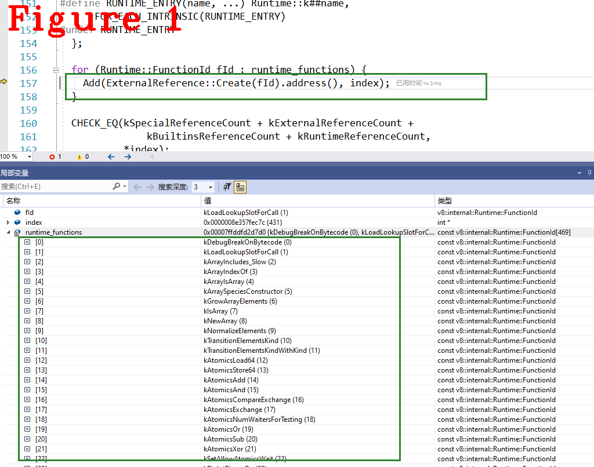
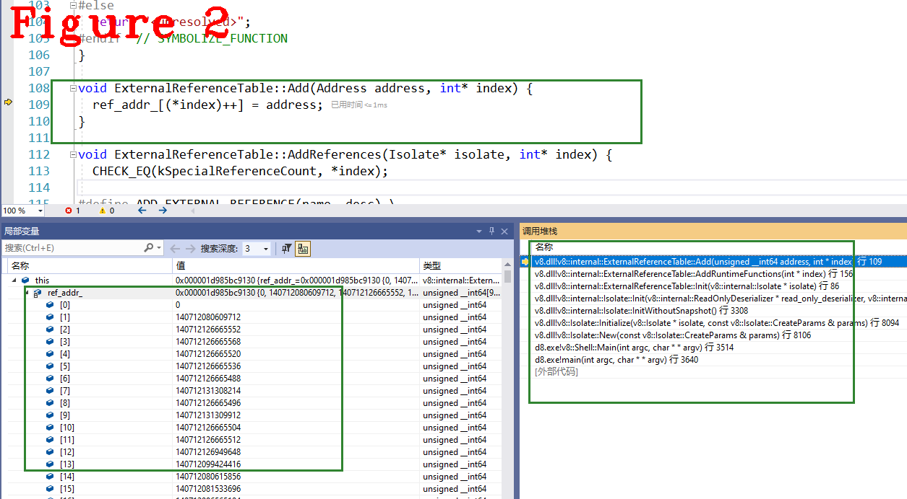

# 《Chrome V8原理讲解》第十六篇 运行时辅助类，详解加载与调用过程
 
  
# 前言  
本系列的前十三篇文章，讲解了V8执行Javascript时最基础的工作流程和原理，包括词法分析、语法分析、字节码生成、Builtins方法、ignition执行单元，等等，达到了从零做起，入门学习的目的。  
接下来的文章将以问题为导向讲解V8源码，例如：以闭包技术、或垃圾回收（GC）为专题讲解V8中的相关源码。V8代码过于庞大，以问题为导向可以使得学习主题更加明确、效果更好。同时，我争取做到每篇文章是一个独立的知识点，方便大家阅读。  
读者可以把想学的内容在文末评论区留言，我汇总后出专题文章。  
# 1 摘要 
运行时辅助类（Runtime）在Javascript执行期提供众多辅助功能，如属性访问，新建对象、正则表达式等。上篇文章对“Runtime是什么？怎么用了？”做了详细介绍，本文将重点说明“他是怎么来的？他存储在哪？”，也就是Runtime在V8中的初始化过程，初始化完后的存储位置，以及在`BytecodeHandler`中的调用细节。
# 2 Runtime初始过程  
Runtime属于V8的基础组件，在创建Isolate时完成初始化，下面是初始化阶段的源码:  
```c++
1.   bool Isolate::Init(ReadOnlyDeserializer* read_only_deserializer,
2.                      StartupDeserializer* startup_deserializer) {
3.     TRACE_ISOLATE(init);
4.     const bool create_heap_objects = (read_only_deserializer == nullptr);
5.     // We either have both or neither.
6.     DCHECK_EQ(create_heap_objects, startup_deserializer == nullptr);
7.     base::ElapsedTimer timer;
8.    //省略很多...............................
9.      handle_scope_implementer_ = new HandleScopeImplementer(this);
10.      load_stub_cache_ = new StubCache(this);
11.      store_stub_cache_ = new StubCache(this);
12.      materialized_object_store_ = new MaterializedObjectStore(this);
13.      regexp_stack_ = new RegExpStack();
14.      regexp_stack_->isolate_ = this;
15.      date_cache_ = new DateCache();
16.      heap_profiler_ = new HeapProfiler(heap());
17.      interpreter_ = new interpreter::Interpreter(this);
18.      compiler_dispatcher_ =
19.          new CompilerDispatcher(this, V8::GetCurrentPlatform(), FLAG_stack_size);
20.      // Enable logging before setting up the heap
21.      logger_->SetUp(this);
22.      {  // NOLINT
23.        ExecutionAccess lock(this);
24.        stack_guard()->InitThread(lock);
25.      }
26.      // SetUp the object heap.
27.      DCHECK(!heap_.HasBeenSetUp());
28.      heap_.SetUp();
29.      ReadOnlyHeap::SetUp(this, read_only_deserializer);
30.      heap_.SetUpSpaces();
31.      isolate_data_.external_reference_table()->Init(this);
32.      //省略很多...................
33.    }
```  
上述代码是`isolate`的初始化入口，行10~20包括了很多重要组件的初始化工作，例如`Interpreter`、`compiler_dispatcher`等等，后续文章都会讲到。Runtime的初始化由`external`负责，代码31行`Init()`方法中完成相关工作，源码如下:  
```c++
1.  void ExternalReferenceTable::Init(Isolate* isolate) {
2.    int index = 0;
3.    // kNullAddress is preserved through serialization/deserialization.
4.    Add(kNullAddress, &index);
5.    AddReferences(isolate, &index);
6.    AddBuiltins(&index);
7.    AddRuntimeFunctions(&index);
8.    AddIsolateAddresses(isolate, &index);
9.    AddAccessors(&index);
10.    AddStubCache(isolate, &index);
11.    AddNativeCodeStatsCounters(isolate, &index);
12.    is_initialized_ = static_cast<uint32_t>(true);
13.    CHECK_EQ(kSize, index);
14.  }
```  
代码4行~11行是由`external`类负责管理的初始化，这其中包括了我们多次提到的`Builtins`。`AddRuntimeFunctions(&index)`是Runtime的初始化函数，代码如下：  
```c++
1.  void ExternalReferenceTable::AddRuntimeFunctions(int* index) {
2.    CHECK_EQ(kSpecialReferenceCount + kExternalReferenceCount +
3.                 kBuiltinsReferenceCount,
4.             *index);
5.    static constexpr Runtime::FunctionId runtime_functions[] = {
6.  #define RUNTIME_ENTRY(name, ...) Runtime::k##name,
7.        FOR_EACH_INTRINSIC(RUNTIME_ENTRY)
8.  #undef RUNTIME_ENTRY
9.    };
10.    for (Runtime::FunctionId fId : runtime_functions) {
11.      Add(ExternalReference::Create(fId).address(), index);
12.    }
13.    CHECK_EQ(kSpecialReferenceCount + kExternalReferenceCount +
14.                 kBuiltinsReferenceCount + kRuntimeReferenceCount,
15.             *index);
16.  }
```  
它只有一个参数index，在本文所用的V8版本中它的值是430，代表下标，`ExternalReferenceTable`是表结构，它的核心成员是地址指针数组（ref_addr_），index代表它的下标，表示Runtime函数在`ExternalReferenceTable`成员变量ref_addr_中的位置，本文所用V8中有468个Runtime方法，初始化完成后存储在`ref_addr_`的430~430+468-1这个区间内。`ExternalReferenceTable`表结构非常简单，稍后给出。  
  
代码5行定义了Runtime的枚举变量，其中涉及的宏模板请自行展开，图1给出部分枚举变量。代码11行通过`for`循环添加函数，`Create()`方法根据`Runtime Id`创建表项，最终添加到`ExternalReferenceTable`表中，代码如下：  
```c++
1.  ExternalReference ExternalReference::Create(Runtime::FunctionId id) {
2.    return Create(Runtime::FunctionForId(id));
3.  }
4.  //分隔线........................
5.  const Runtime::Function* Runtime::FunctionForId(Runtime::FunctionId id) {
6.    return &(kIntrinsicFunctions[static_cast<int>(id)]);
7.  }
8.  //分隔线.......................
9.  ExternalReference ExternalReference::Create(const Runtime::Function* f) {
10.    return ExternalReference(
11.        Redirect(f->entry, BuiltinCallTypeForResultSize(f->result_size)));
12.  }
```  
上述代码是三个函数，依次调用。第一个函数`Create(Runtime::FunctionId id)`的参数是图1中的枚举值；第二个函数`FunctionForId(Runtime::FunctionId id)`的返回值是`kIntrinsicFunctions`类型的数据，该数据是以下几个宏代码的展开结果。
```c++
#define FUNCTION_ADDR(f) (reinterpret_cast<v8::internal::Address>(f))
#define F(name, number_of_args, result_size)                                  \
  {                                                                           \
    Runtime::k##name, Runtime::RUNTIME, #name, FUNCTION_ADDR(Runtime_##name), \
        number_of_args, result_size                                           \
  }                                                                           \
  ,


#define I(name, number_of_args, result_size)                       \
  {                                                                \
    Runtime::kInline##name, Runtime::INLINE, "_" #name,            \
        FUNCTION_ADDR(Runtime_##name), number_of_args, result_size \
  }                                                                \
  ,

static const Runtime::Function kIntrinsicFunctions[] = {
    FOR_EACH_INTRINSIC(F) FOR_EACH_INLINE_INTRINSIC(I)};

#undef I
#undef F
```  
`kIntrinsicFunctions`数据是什么类型？它是数组，每个成员又是`函数名，参数个数，返回值个数`组成的另一个数组。上一篇文章中，我定义的`MyRuntime`方法，格式是：`F(MyRuntime,1,1)`，正好和这个数据格式对应，下面是`kIntrinsicFunctions`展开的样例：  
```c++
kIntrinsicFunctions []={
  //.....................
  {                                                                           
    Runtime::kDebugPrint, Runtime::RUNTIME, "DebugPrint", (reinterpret_cast<v8::internal::Address>(Runtime_DebugPrint)), 
        1, 1 
  },
  //.....................     
``` 
`kIntrinsicFunctions`是一个二维数组，上述代码展示了其中的一组数据。下面是`void ExternalReferenceTable::AddRuntimeFunctions(int* index)`方法中11行`Add()`方法的源码：  
```c++
void ExternalReferenceTable::Add(Address address, int* index) {
  ref_addr_[(*index)++] = address;
}
```  
`index`每次添加后会增1，`ref_addr_`是什么呢？它是`ExternalReferenceTable`的成员变量，地址指针数组，下面是`ExternalReferenceTable`源码：  
```c++
1.  class ExternalReferenceTable {
2.   public:
3.    static constexpr int kSpecialReferenceCount = 1;
4.    static constexpr int kExternalReferenceCount =
5.        ExternalReference::kExternalReferenceCount;
6.    static constexpr int kBuiltinsReferenceCount =
7.  #define COUNT_C_BUILTIN(...) +1
8.        BUILTIN_LIST_C(COUNT_C_BUILTIN);
9.  #undef COUNT_C_BUILTIN
10.     static constexpr int kRuntimeReferenceCount =
11.         Runtime::kNumFunctions -
12.         Runtime::kNumInlineFunctions;  // Don't count dupe kInline... functions.
13.     static constexpr int kIsolateAddressReferenceCount = kIsolateAddressCount;
14.     static constexpr int kAccessorReferenceCount =
15.         Accessors::kAccessorInfoCount + Accessors::kAccessorSetterCount;
16.     static constexpr int kStubCacheReferenceCount = 12;
17.     static constexpr int kStatsCountersReferenceCount =
18.   #define SC(...) +1
19.         STATS_COUNTER_NATIVE_CODE_LIST(SC);
20.   #undef SC
21.   //..............省略很多............................
22.     ExternalReferenceTable() = default;
23.     void Init(Isolate* isolate);
24.    private:
25.     void Add(Address address, int* index);
26.     void AddReferences(Isolate* isolate, int* index);
27.     void AddBuiltins(int* index);
28.     void AddRuntimeFunctions(int* index);
29.     void AddIsolateAddresses(Isolate* isolate, int* index);
30.     void AddAccessors(int* index);
31.     void AddStubCache(Isolate* isolate, int* index);
32.     Address GetStatsCounterAddress(StatsCounter* counter);
33.     void AddNativeCodeStatsCounters(Isolate* isolate, int* index);
34.     STATIC_ASSERT(sizeof(Address) == kEntrySize);
35.     Address ref_addr_[kSize];
36.     static const char* const ref_name_[kSize];
37.     uint32_t is_initialized_ = 0;
38.     uint32_t dummy_stats_counter_ = 0;
39.     DISALLOW_COPY_AND_ASSIGN(ExternalReferenceTable);
40.   };
```  
代码7行给出了`Builtin`统计时使用的宏模板，代码行25~35说明了`ExternalReferenceTable`负责初始化和管理哪些数据，初始化后的数据，也就是函数地址，保存在`ref_addr_`数组中，见代码35行，它的类型`Address`是`using Address = uintptr_t;`，`typedef unsigned __int64  uintptr_t;`。  
  
图2中给出了三个关键信息，`Add()`方法的调用位置，对应的函数调用堆栈，以及展示了部分`ref_addr_`的内容。    
总结，`ExternalReferenceTable`最重要的成员是`ref_addr_`，它本质就是一个指针数组，Rumtime函数保存在下标430开始的成员中，调用时用下标值索引函数地址。  
# 3 Runtime调用  
`CallRuntime()`或`CallRuntimeWithCEntry()`负责调用`Runtime`功能，上篇文章给出了调用样例并做了实验，本文不再赘述。我们以`CallRuntime()`为例讲解，源码如下：  
```c++
1.   template <class... TArgs>
2.   TNode<Object> CallRuntime(Runtime::FunctionId function,
3.                             SloppyTNode<Object> context, TArgs... args) {
4.     return CallRuntimeImpl(function, context,
5.                            {implicit_cast<SloppyTNode<Object>>(args)...});
6.   }
7.  //分隔线.........................
8.   TNode<Object> CodeAssembler::CallRuntimeImpl(
9.       Runtime::FunctionId function, TNode<Object> context,
10.        std::initializer_list<TNode<Object>> args) {
11.      int result_size = Runtime::FunctionForId(function)->result_size;
12.      TNode<Code> centry =
13.          HeapConstant(CodeFactory::RuntimeCEntry(isolate(), result_size));
14.      return CallRuntimeWithCEntryImpl(function, centry, context, args);
15.    }
16.  //分隔线.........................
17.    TNode<Type> HeapConstant(Handle<Type> object) {
18.        return UncheckedCast<Type>(UntypedHeapConstant(object));
19.      }
20.  //分隔线.........................
21.  TNode<Object> CodeAssembler::CallRuntimeWithCEntryImpl(
22.        Runtime::FunctionId function, TNode<Code> centry, TNode<Object> context,
23.        std::initializer_list<TNode<Object>> args) {
24.      constexpr size_t kMaxNumArgs = 6;
25.      DCHECK_GE(kMaxNumArgs, args.size());
26.      int argc = static_cast<int>(args.size());
27         auto call_descriptor = Linkage::GetRuntimeCallDescriptor(zone(), function, argc, Operator::kNoProperties,
                      Runtime::MayAllocate(function) ? CallDescriptor::kNoFlags
                                     : CallDescriptor::kNoAllocate);
1.       for (auto arg : args) inputs.Add(arg);
2.       inputs.Add(ref);
3.       inputs.Add(arity);
4.       inputs.Add(context);
5.       CallPrologue();
6.       Node* return_value =
7.           raw_assembler()->CallN(call_descriptor, inputs.size(), inputs.data());
8.       HandleException(return_value);
9.       CallEpilogue();
10.      return UncheckedCast<Object>(return_value);
11.    }
```  
代码2行，`CallRuntime()`声明中，可以看到它有三个参数，第一个是FunctionId枚举类型，前面提到过；第二个参数是context，第三参数`args`是传给Runtime函数的参数列表。`CallRuntime()`调用`CallRuntimeImpl()`,在`CallRuntimeImpl`内部读取堆中的常量数据（HeapConstant），代码18行，该数据中保存了函数与下标的对应关系，用`FunctionId`在该表中查到对应的函数地址，代码27行建立调用描述符(参见之前的文章)，最终在代码34行调用Runtime函数。  
上述代码是Builtin，不能在C++级别做Debug，无法给出调用堆栈等调试信息。也许你会有疑问：为什么不用上篇文章中提到的`RUNTIME_DebugPrint`或是自定义Runtime功能做断点？答：我们现在讲的就是Runtime的调用过程，没办法使用Runtime调试自己:(((。  
要调试也是有办法的，汇编调试，汇编调试超出了V8的学习范围，我就不列出来了，对此感兴趣的朋友，评论区私信我。  
**最后，纠正《第十五篇》中的一个错误，我曾写到：“context是传给MyRuntime()的第一个参数，这是格式要求，注意：它不计在参数的数量中! 通过下面的测试代码，对MyRuntime做测试：”。** 正确的解释是：`context`不是MyRuntime()的第一个参数，它是`CallRuntime()`的第二参数，与`MyRuntime()`无关。     
好了，今天到这里，下次见。   

**恳请读者批评指正、提出宝贵意见**  
**微信：qq9123013  备注：v8交流    邮箱：v8blink@outlook.com**