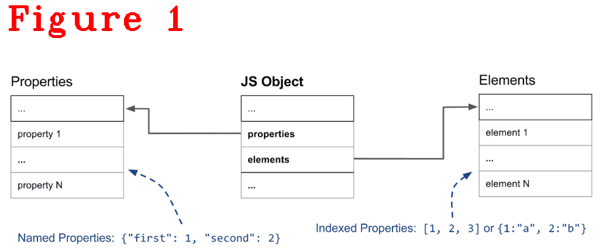
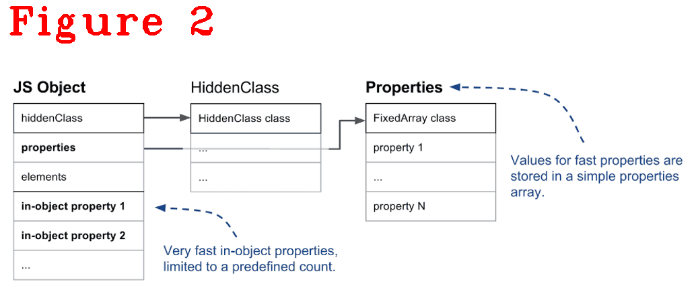
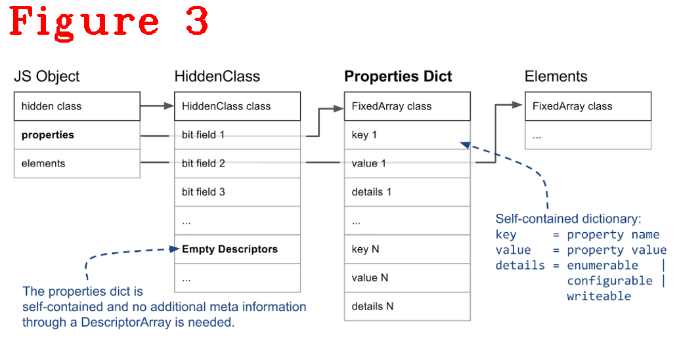
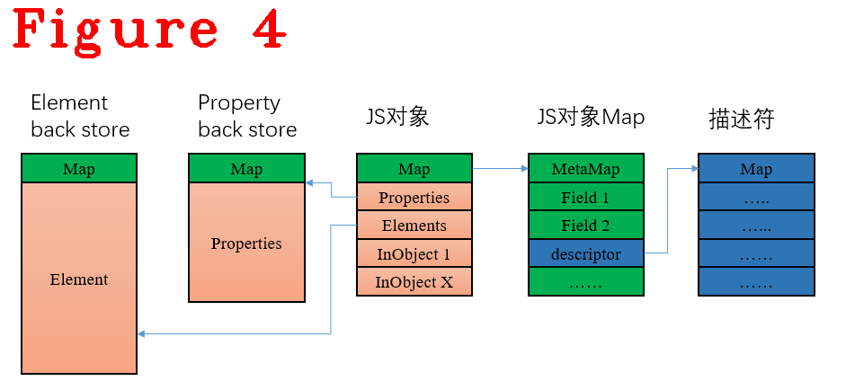
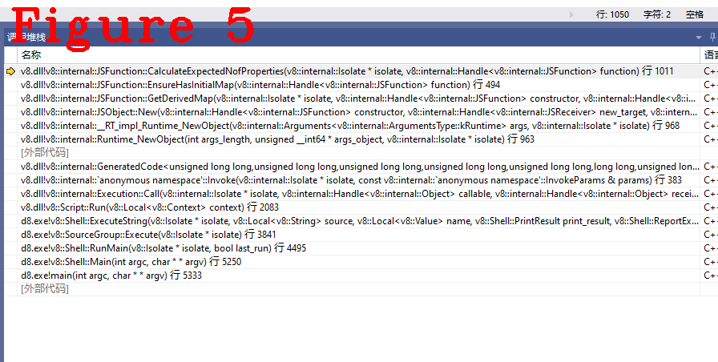

# 《Chrome V8原理讲解》第十七篇 JS对象的内存布局与创建过程

  
# 前言  
本系列的前十三篇文章，讲解了V8执行Javascript时最基础的工作流程和原理，包括词法分析、语法分析、字节码生成、Builtins方法、ignition执行单元，等等，达到了从零做起，入门学习的目的。  
接下来的文章将以问题为导向讲解V8源码，例如：以闭包技术、或垃圾回收（GC）为专题讲解V8中的相关源码。V8代码过于庞大，以问题为导向可以使得学习主题更加明确、效果更好。同时，我争取做到每篇文章是一个独立的知识点，方便大家阅读。  
读者可以把想学的内容在文末评论区留言，我汇总后出专题文章。  
# 1 摘要 
《javascript高级程序设计》中对JS对象有这样的描述:“ECMA-262 将对象定义为一组属性的无序集合。严格来说，这意味着对象就是一组没有特定顺序的值。对象的每个属性或方法都由一个名称来标识，这个名称映射到一个值。可以把ECMAScript的对象想象成一张散列表，其中的内容就是一组名/值对，值可以是数据或者函数。”v8官方文档提到这样的描述：“出于性能、亦或代码设计的考虑，V8中对数据类型的设计做了详细分类，对JS对象内部的数据成员也做了不同的设计”。  
本文深入V8内部，详细剖析JS对象的创建过程，讲解JS对象内部成员的组成方式、内存布局，以及重要数据结构。本文内容组织方式：V8中JS对象的重要概念、成员组成和内存布局（章节2）;JS对象创建过程（章节2）。
# 2 JS对象  
在V8中，JS对象的每个成员、方法都有详细的分类和内存组织规则，内部成员从数据类型看分为两大类，元素类（Element）和属性类（Property），如图1。  
  
图1（来自V8官方）中，可以看到元素和属性分开存储，原因是为提高效率。Element成员可以利用下标访问，它存在连续的地址空间中。Property成员，也是存在连的地址空间中,但不能使用下标访问成员，需要借助Map（HiddenClass）访问，Map记载了数据的描述符，通俗地说，Map描述数据的形状,数据访问方式等，参见第十四篇文章。元素类数据不需要借助Map，他的访问效率要高一些，如图2。  
  
图2（出处同图1）中，除了Element和Property之外，还有In-object property，它与前面提到的Property不同之处是访问时不需要借助Map，这提高了访问效率，但In-object property的数量有限，优先使用In-object property,用完之后使用前面提到的“正常”Property进行存储。
  
图3（出处同图1），JS对象成员的访问方式有三种：  
**（1）** In-Object，JS对象负责维护地址，它直接存在JS对象中；    
**（2）** Slow方式，需要借助Map访问的元素；  
**（3）** Self-dict，JS对象自己维护地址，不需要借助Map，采用字典方式存储数据。
self-dict是效率最差的存储方式，当数据很多并且不连续时，V8会放弃Map机制，改用self-dict方式存储，稍后在源码中做详细解释。  
图4给出一个JS对象的内存部局。 
   
申请JS对象时，对象的首地址指向Map（Map大小为：80byte），存在多个JS对象同共Map的情况，对象中还包括了Property back store和Element back store指针，其它的依据情况而定，什么样的情况稍后见代码解释。  
JS对象的成员方法存在哪里呢？文章开头处提到：它是普通的Property成员。通过下面的测试代码解释成员方法的存储方式。  
```c++
1.  function person(name) {
2.      this.name=name;
3.  	this.sayname=function(){console.log(this.name);}
4.  }
5.  worker = new person("Nicholas");
6.  worker.sayname();
7.  //分隔线..............................................................
8.  //分隔线..............................................................
9.  Bytecode Age: 0
10.           000001DAA2FA1E96 @    0 : 13 00             LdaConstant [0]
11.           000001DAA2FA1E98 @    2 : c2                Star1
12.           000001DAA2FA1E99 @    3 : 19 fe f8          Mov <closure>, r2
13.      0 E> 000001DAA2FA1E9C @    6 : 64 51 01 f9 02    CallRuntime [DeclareGlobals], r1-r2
14.    100 S> 000001DAA2FA1EA1 @   11 : 21 01 00          LdaGlobal [1], [0]
15.           000001DAA2FA1EA4 @   14 : c2                Star1
16.           000001DAA2FA1EA5 @   15 : 13 02             LdaConstant [2]
17.           000001DAA2FA1EA7 @   17 : c1                Star2
18.           000001DAA2FA1EA8 @   18 : 0b f9             Ldar r1
19.    109 E> 000001DAA2FA1EAA @   20 : 68 f9 f8 01 02    Construct r1, r2-r2, [2]
20.    107 E> 000001DAA2FA1EAF @   25 : 23 03 04          StaGlobal [3], [4]
21.    134 S> 000001DAA2FA1EB2 @   28 : 21 03 06          LdaGlobal [3], [6]
22.           000001DAA2FA1EB5 @   31 : c1                Star2
23.    141 E> 000001DAA2FA1EB6 @   32 : 2d f8 04 08       LdaNamedProperty r2, [4], [8]
24.           000001DAA2FA1EBA @   36 : c2                Star1
25.    141 E> 000001DAA2FA1EBB @   37 : 5c f9 f8 0a       CallProperty0 r1, r2, [10]
26.           000001DAA2FA1EBF @   41 : c3                Star0
27.    151 S> 000001DAA2FA1EC0 @   42 : a8                Return
28.  Constant pool (size = 5)
29.  000001DAA2FA1E29: [FixedArray] in OldSpace
30.   - map: 0x024008ac12c1 <Map>
31.   - length: 5
32.             0: 0x01daa2fa1d11 <FixedArray[2]>
33.             1: 0x01daa2fa1c09 <String[6]: #person>
34.             2: 0x01daa2fa1c39 <String[8]: #Nicholas>
35.             3: 0x01daa2fa1c21 <String[6]: #worker>
36.             4: 0x01daa2fa1c51 <String[7]: #sayname>
```  
上半部分是js源码，下半部分是Bytecode。代码19行`Construct`构建JS对象`person`，并传递参数`Nicholas`，代码16，17行从常量池中取出`Nicholas`并存储到r2寄存器。而`sayname`成员是一个方法，因为lazy编译的原因，此时不做编译，而是在代码6行执行时才做编译，如下给`sayname`成员编译后的字节码：  
```c++
Bytecode Age: 0
   29 S> 000001DAA2FA21AE @    0 : 0b 03             Ldar a0
   38 E> 000001DAA2FA21B0 @    2 : 32 02 00 00       StaNamedProperty <this>, [0], [0]
   47 S> 000001DAA2FA21B4 @    6 : 7f 01 00 01       CreateClosure [1], [0], #1
   59 E> 000001DAA2FA21B8 @   10 : 32 02 02 02       StaNamedProperty <this>, [2], [2]
         000001DAA2FA21BC @   14 : 0e                LdaUndefined
   97 S> 000001DAA2FA21BD @   15 : a8                Return
Constant pool (size = 3)
000001DAA2FA2151: [FixedArray] in OldSpace
 - map: 0x024008ac12c1 <Map>
 - length: 3
           0: 0x024008ac5379 <String[4]: #name>
           1: 0x01daa2fa20f9 <SharedFunctionInfo sayname>
           2: 0x01daa2fa1c51 <String[7]: #sayname>
```  
在上面的字节码中，看不到`console.log`，因为在此阶段V8是要执行sayname，虽然我们知道sayname的主体功能只有`console.log`，但V8还没有执行到它，所以不编译。不执行时不编译，这就是lazy思想。  
上述代码可以看出：**`sayname`虽然是一个成员方法，但在JS对象内部，它只是普通的Property成员。**   
# 3 JS对象的创建过程  
使用上面的测试用例，下面是创建`person`对象的源码位置：  
```c++
1.  RUNTIME_FUNCTION(Runtime_NewObject) {
2.    HandleScope scope(isolate);
3.    DCHECK_EQ(2, args.length());
4.    CONVERT_ARG_HANDLE_CHECKED(JSFunction, target, 0);
5.    CONVERT_ARG_HANDLE_CHECKED(JSReceiver, new_target, 1);
6.    RETURN_RESULT_OR_FAILURE(
7.        isolate,
8.        JSObject::New(target, new_target, Handle<AllocationSite>::null()));
9.  }
10.  //分隔线.....................................
11.  MaybeHandle<JSObject> JSObject::New(Handle<JSFunction> constructor,
12.                                      Handle<JSReceiver> new_target,
13.                                      Handle<AllocationSite> site) {
14.    Isolate* const isolate = constructor->GetIsolate();
15.    DCHECK(constructor->IsConstructor());
16.    DCHECK(new_target->IsConstructor());
17.    DCHECK(!constructor->has_initial_map() ||
18.           !InstanceTypeChecker::IsJSFunction(
19.               constructor->initial_map().instance_type()));
20.    Handle<Map> initial_map;
21.    ASSIGN_RETURN_ON_EXCEPTION(
22.        isolate, initial_map,
23.        JSFunction::GetDerivedMap(isolate, constructor, new_target), JSObject);
24.    int initial_capacity = V8_ENABLE_SWISS_NAME_DICTIONARY_BOOL
25.                               ? SwissNameDictionary::kInitialCapacity
26.                               : NameDictionary::kInitialCapacity;
27.    Handle<JSObject> result = isolate->factory()->NewFastOrSlowJSObjectFromMap(
28.        initial_map, initial_capacity, AllocationType::kYoung, site);
29.    isolate->counters()->constructed_objects()->Increment();
30.    isolate->counters()->constructed_objects_runtime()->Increment();
31.    return result;
32.  }
```  
创建过程由`RUNTIME_FUNCTION(Runtime_NewObject)`开始，它是一个宏模板，在上篇文章中讲过，本文不在赘述。`JSObject::New()`方法新建JS对象，进入` JSFunction::GetDerivedMap(isolate, constructor, new_target), JSObject);`方法，源码如下：  
```c++
1.  MaybeHandle<Map> JSFunction::GetDerivedMap(Isolate* isolate,
2.                                             Handle<JSFunction> constructor,
3.                                             Handle<JSReceiver> new_target) {
4.    EnsureHasInitialMap(constructor);
5.    Handle<Map> constructor_initial_map(constructor->initial_map(), isolate);
6.    if (*new_target == *constructor) return constructor_initial_map;
7.    Handle<Map> result_map;
8.    if (new_target->IsJSFunction()) {
9.      Handle<JSFunction> function = Handle<JSFunction>::cast(new_target);
10.       if (FastInitializeDerivedMap(isolate, function, constructor,
11.                                    constructor_initial_map)) {
12.         return handle(function->initial_map(), isolate);
13.       }
14.     }
15.     Handle<Object> prototype;
16.     if (new_target->IsJSFunction()) {
17.       Handle<JSFunction> function = Handle<JSFunction>::cast(new_target);
18.       if (function->has_prototype_slot()) {
19.         // Make sure the new.target.prototype is cached.
20.         EnsureHasInitialMap(function);
21.         prototype = handle(function->prototype(), isolate);
22.       } else {
23.         // No prototype property, use the intrinsict default proto further down.
24.         prototype = isolate->factory()->undefined_value();
25.       }
26.     } else {
27.  //省略很多..............
28.     }
29.     if (!prototype->IsJSReceiver()) {
30.  //省略很多..............
31.     }
32.     Handle<Map> map = Map::CopyInitialMap(isolate, constructor_initial_map);
33.     map->set_new_target_is_base(false);
34.     CHECK(prototype->IsJSReceiver());
35.     if (map->prototype() != *prototype)
36.       Map::SetPrototype(isolate, map, Handle<HeapObject>::cast(prototype));
37.     map->SetConstructor(*constructor);
38.     return map;
39.   }
```  
`Handle<JSFunction> constructor`是构造函数person（测试代码），代码16行时构造函数的Map基本完成，这里设置prototype，在这里安装prototype.代码4行，`EnsureHasInitialMap(constructor);`很重要，它的作用是计算构造函数constructor的形状并生成Map。然后使用这个Map申请内存、创建对象的实例`worker`（测试样例代码），计算的过程需要对它进行编译（之前没有编译过），代码如下：  
```c++
1.  void JSFunction::EnsureHasInitialMap(Handle<JSFunction> function) {
2.    DCHECK(function->has_prototype_slot());
3.    DCHECK(function->IsConstructor() ||
4.           IsResumableFunction(function->shared().kind()));
5.    if (function->has_initial_map()) return;
6.    Isolate* isolate = function->GetIsolate();
7.    int expected_nof_properties =
8.        CalculateExpectedNofProperties(isolate, function);
9.    if (function->has_initial_map()) return;
10.    InstanceType instance_type;
11.    if (IsResumableFunction(function->shared().kind())) {
12.      instance_type = IsAsyncGeneratorFunction(function->shared().kind())
13.                          ? JS_ASYNC_GENERATOR_OBJECT_TYPE
14.                          : JS_GENERATOR_OBJECT_TYPE;
15.    } else {
16.      instance_type = JS_OBJECT_TYPE;
17.    }
18.    int instance_size;
19.    int inobject_properties;
20.    CalculateInstanceSizeHelper(instance_type, false, 0, expected_nof_properties,
21.                                &instance_size, &inobject_properties);
22.    Handle<Map> map = isolate->factory()->NewMap(instance_type, instance_size,
23.                                                 TERMINAL_FAST_ELEMENTS_KIND,
24.                                                 inobject_properties);
25.    Handle<HeapObject> prototype;
26.    if (function->has_instance_prototype()) {
27.      prototype = handle(function->instance_prototype(), isolate);
28.    } else {
29.      prototype = isolate->factory()->NewFunctionPrototype(function);
30.    }
31.    DCHECK(map->has_fast_object_elements());
32.    DCHECK(prototype->IsJSReceiver());
33.    JSFunction::SetInitialMap(isolate, function, map, prototype);
34.    map->StartInobjectSlackTracking();
35.  }
```  
代码5行，如果已经有Map，不用再计算了，返回。代码7行，计算构造函数的属性值，这里进行编译。代26~30行，生成prototype（注意区分：这里是生成，然后才是前面提到的设置和安全），构造函数是第一次生成，没有prototype，进入代码29行。注意： 这里可以看出，同一个构函数的不同实例之间是共用一个prototype，因为prototype是设置在构造函数person上，我们用person实例多个对象时，只有在person初次生成时才执行代码29行。    
再来看代码7行，源码如下：  
```c++
1.  int JSFunction::CalculateExpectedNofProperties(Isolate* isolate,
2.                                                 Handle<JSFunction> function) {
3.    int expected_nof_properties = 0;
4.    for (PrototypeIterator iter(isolate, function, kStartAtReceiver);
5.         !iter.IsAtEnd(); iter.Advance()) {
6.      Handle<JSReceiver> current =
7.          PrototypeIterator::GetCurrent<JSReceiver>(iter);
8.      if (!current->IsJSFunction()) break;
9.      Handle<JSFunction> func = Handle<JSFunction>::cast(current);
10.      Handle<SharedFunctionInfo> shared(func->shared(), isolate);
11.      IsCompiledScope is_compiled_scope(shared->is_compiled_scope(isolate));
12.      if (is_compiled_scope.is_compiled() ||
13.          Compiler::Compile(isolate, func, Compiler::CLEAR_EXCEPTION,
14.                            &is_compiled_scope)) {
15.        DCHECK(shared->is_compiled());
16.        int count = shared->expected_nof_properties();
17.        if (expected_nof_properties <= JSObject::kMaxInObjectProperties - count) {
18.          expected_nof_properties += count;
19.        } else {
20.          return JSObject::kMaxInObjectProperties;
21.        }
22.      } else {
23.        continue;
24.      }
25.    }
26.    if (expected_nof_properties > 0) {
27.      expected_nof_properties += 8;
28.      if (expected_nof_properties > JSObject::kMaxInObjectProperties) {
29.        expected_nof_properties = JSObject::kMaxInObjectProperties;
30.      }
31.    }
32.    return expected_nof_properties;
33.  }
```  
`Handle<JSFunction> function`是构造函数person，代码13行进行编译并计算对象的属性值数量。代码28行，会与MaxInObject比较，如果大于MaxInObject，那么属性值数量就是MaxInObject。前面提到JS对象中In-Object数量有限，MaxInObject正是它的最大数量。多出的属性值在后面会作处理----放入图1的属性值存储区。  
回到`JSObject::New()`方法中代码27行，用Map去申请JS对象的内存，后面就是对象实例化的参数设置等等，请读者根据图5的函数堆栈自行跟踪。  
    

好了，今天到这里，下次见。   

**恳请读者批评指正、提出宝贵意见**  
**微信：qq9123013  备注：v8交流    邮箱：v8blink@outlook.com**