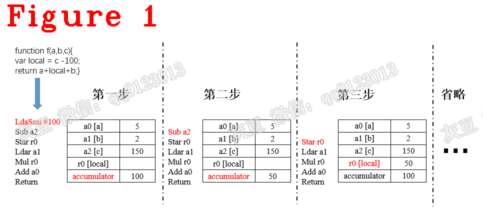
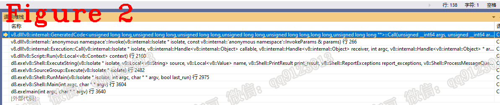
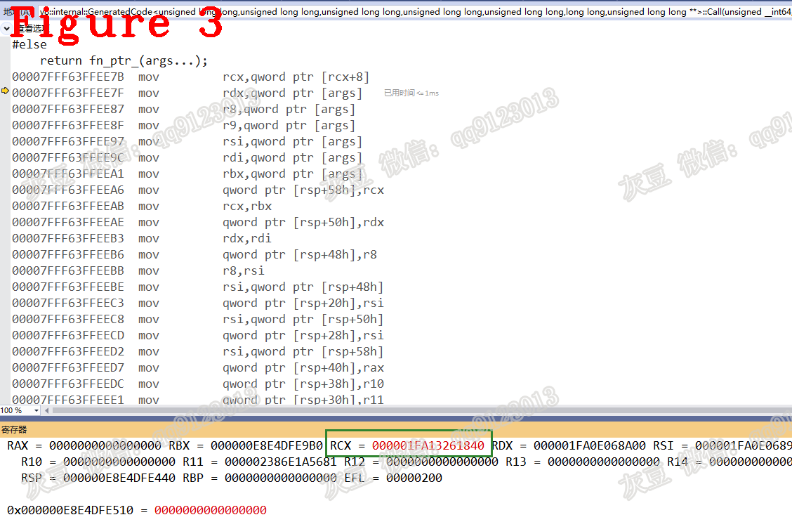
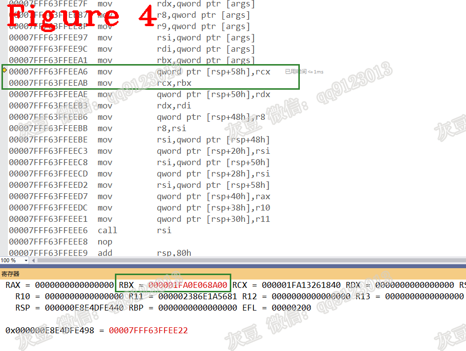
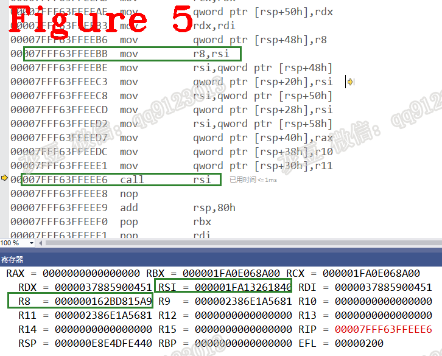
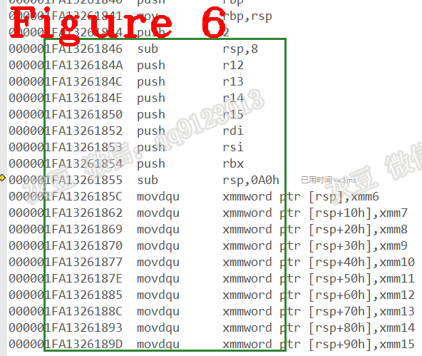
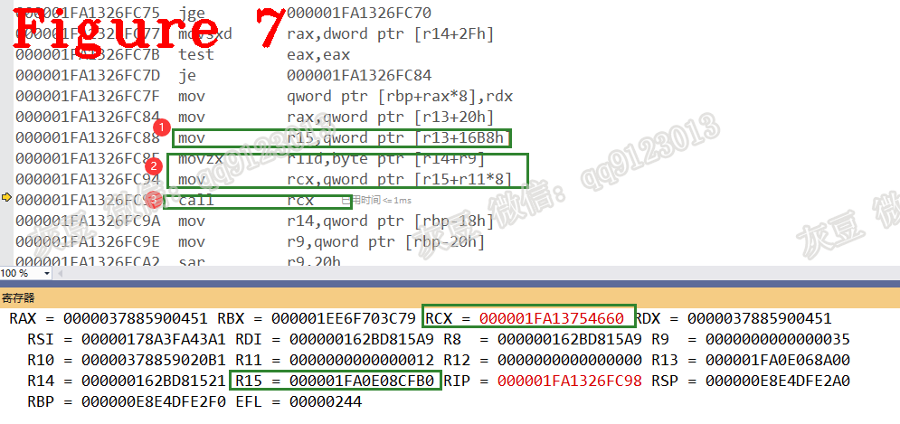
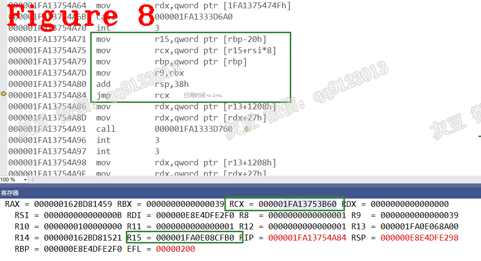

# 《Chrome V8原理讲解》第十八篇 利用汇编看V8，洞察看不见的行为
  
  
# 前言  
我认为，汇编分析无疑是调试v8的终级武器，当用C++调试无法获取更详细的信息时，汇编分析是最好的帮手，但如果不研究v8字节码或挖漏洞等，此文也许没必要看。本文与第十篇文章讲的是同一件事，但本文讲的方法能让你看到更多更详细的V8内部信息，算是第十篇文章的高配版。  

# 1 摘要  
图1是字节码（Bytecode）的执行示意图，说明了JavaScript字节码的解释执行（interpreter）过程，描绘Javascript语言这图够足用，但对学习V8源码来说，图1不够详细，它隐藏了解释器（Ignition）的工作流程，没有说明字节码的加载（load）和调度(dispatch)细节，等等。本文在图1基础上进一步深入，拆解字节码的解释细节，包括：Builtin加载与执行、字节码加载与调用等过程，详细讲解字节码解释执行过程，力求在演草纸上为读者描绘解释器的运行细节和字节码的解释过程。本文讲解思路是：利用汇编调试（debug），跟随JSFunction实例的执行，它执行到哪，就讲解到哪。本文内容组织方式：记录关键变量地址，做调试前的准备工作（章节2）；调试Bytecode解释执行过程（章节3）。  
**注意：** 字节码处理程序（BytecodeHandler）是`CodeStubAssembler`类型的Builtin功能，debug分析只能看到汇编码，无C++代码。    
  
# 2 准备工作  
测试用例是`console.log(JsPrint(6));`，它的Bytecode Array代码如下：  
```c++
162BD81556 @  0 : 12 00             LdaConstant [0]
162BD81558 @  2 : 26 fa             Star r1
162BD8155A @  4 : 0b                LdaZero
162BD8155B @  5 : 26 f9             Star r2
162BD8155D @  7 : 27 fe f8          Mov <closure>, r3
162BD81560 @ 10 : 61 2d 01 fa 03    CallRuntime [DeclareGlobals], r1-r3
162BD81565 @ 15 : a7                StackCheck
162BD81566 @ 16 : 13 01 02          LdaGlobal [1], [2]
162BD81569 @ 19 : 26 f9             Star r2
162BD8156B @ 21 : 29 f9 02          LdaNamedPropertyNoFeedback r2, [2]
162BD8156E @ 24 : 26 fa             Star r1
162BD81570 @ 26 : 0d                LdaUndefined
162BD81571 @ 27 : 26 f7             Star r4
162BD81573 @ 29 : 13 03 00          LdaGlobal [3], [0]
162BD81576 @ 32 : 26 f8             Star r3
162BD81578 @ 34 : 0c 06             LdaSmi [6]
162BD8157A @ 36 : 26 f6             Star r5
162BD8157C @ 38 : 5f f8 f7 02       CallNoFeedback r3, r4-r5
162BD81580 @ 42 : 26 f8             Star r3
162BD81582 @ 44 : 5f fa f9 02       CallNoFeedback r1, r2-r3
162BD81586 @ 48 : 26 fb             Star r0
162BD81588 @ 50 : ab                Return
```  
汇编调试存在工作量大、晦涩难懂等诸多缺点，但它最大的优点是：能看到加载、解释、调度的细节，这是其它语言不具备的优势。开始汇编调试之前，要先看懂V8堆栈构建，字节码和寄存器编码规则等知识，它是本文必用的知识，参见第七篇。`Invoke()`是最后一个可以看到C++源码的函数，源码如下：  
```c++
1.  V8_WARN_UNUSED_RESULT MaybeHandle<Object> Invoke(Isolate* isolate,
2.                                                  const InvokeParams& params) {
3.   if (params.target->IsJSFunction()) {
4.  //............省略很多...............
5.   }
6.    Object value;
7.     Handle<Code> code =
8.         JSEntry(isolate, params.execution_target, params.is_construct);
9.     {
10.       SaveContext save(isolate);
11.       SealHandleScope shs(isolate);
12.       if (FLAG_clear_exceptions_on_js_entry) isolate->clear_pending_exception();
13.       if (params.execution_target == Execution::Target::kCallable) {
14.         using JSEntryFunction = GeneratedCode<Address(
15.             Address root_register_value, Address new_target, Address target,
16.             Address receiver, intptr_t argc, Address** argv)>;
17.         // clang-format on
18.         JSEntryFunction stub_entry =
19.             JSEntryFunction::FromAddress(isolate, code->InstructionStart());
20.         Address orig_func = params.new_target->ptr();
21.         Address func = params.target->ptr();
22.         Address recv = params.receiver->ptr();
23.         Address** argv = reinterpret_cast<Address**>(params.argv);
24.         RuntimeCallTimerScope timer(isolate, RuntimeCallCounterId::kJS_Execution);
25.         value = Object(stub_entry.Call(isolate->isolate_data()->isolate_root(),
26.                                        orig_func, func, recv, params.argc, argv));
27.       } else {
28.  //............省略很多...............
29.       }
30.     }
31.     //............省略很多...............
32.     return Handle<Object>(value, isolate);
33.   }
```
上述代码`Invoke()`为解释执行JSFunction实例做初始化工作，我们需要在此处记录JSFunction实例重要成员变量的地址：code、stub_entry、func，等等。以前的文章对这些变量知识做过讲解，本文不再赘述，直接给出结果：  
（1）code，代码7行，它是Builtin:JSEntry的基址。
地址：1FA 0E06 ED30  
（2）stub_entry，代码18行，从code中计算Builtin:JSEntry中第一条指令地址，它是Ignition工作的入口地址。JSEntry的头部填充了其它信息，要利用堆栈偏移量取出正确数值，代码如下:  
```c++
Address Code::OffHeapInstructionStart() const {
  DCHECK(is_off_heap_trampoline());
  if (Isolate::CurrentEmbeddedBlob() == nullptr) return raw_instruction_start();
  EmbeddedData d = EmbeddedData::FromBlob();
  return d.InstructionStartOfBuiltin(builtin_index());
}
```  
第一条指令地址：1FA 1326 1840    
（3）func，代码21行，是JSFunction实例地址，它的Javascript源码是`console.log(JsPrint(6));`  
地址：16 2BD8 15A9  
（4）func中使用Builtin::InterpreterEntryTrampoline，地址：52 61C0 8A41   
（5）dispatch_table，调度表基址：1FA 0E08 CFB0  
以上信息用来在debug过程中对代码进行定位，图2给出当前位置函数调用堆栈，之后进入汇编debug。  
  
# 3 调试字节码  
开始执行汇编，图3给出了`Invoke()`方法25行`stub_entry.Call()`的汇编代码和寄存器信息。  
  
RCX的值是stub_entry，是Builtin:JSEntry的第一条指令地址，code是Builtin:JSEntry的基址，RCX（stub_entry）是code中第一条指令地址。code加上偏移量得到的结果正是stub_entry，前面提到stub_entry是Ignition入口，接着执行见图4。  
  
RBX的值为1FA0E068A00，它是`Invoke()`方法25行`stub_entry.Call()`的第一个参数`isolate->isolate_data()->isolate_root()`。图4中能看到把RCX（stub_entry）存入rsp+58h，继续执行。  
  
图5中R8是func地址，`call rsi`这条指令时，RSI是stub_entry，执行Builtin:JSEntry，**Ignition开始执行。** 源码如下：  
```c++
1.  void Builtins::Generate_JSEntry(MacroAssembler* masm) {
2.    Generate_JSEntryVariant(masm, StackFrame::ENTRY,
3.                            Builtins::kJSEntryTrampoline);
4.  }
5.  //======================分隔线========================
6.  void Generate_JSEntryVariant(MacroAssembler* masm, StackFrame::Type type,
7.                               Builtins::Name entry_trampoline) {
8.    Label invoke, handler_entry, exit;
9.    Label not_outermost_js, not_outermost_js_2;
10.    {  
11.      NoRootArrayScope uninitialized_root_register(masm);
12.      __ pushq(rbp);
13.      __ movq(rbp, rsp);
14.      __ Push(Immediate(StackFrame::TypeToMarker(type)));
15.      __ AllocateStackSpace(kSystemPointerSize);
16.      __ pushq(r12);
17.      __ pushq(r13);
18.      __ pushq(r14);
19.      __ pushq(r15);
20.  #ifdef _WIN64
21.      __ pushq(rdi);  // Only callee save in Win64 ABI, argument in AMD64 ABI.
22.      __ pushq(rsi);  // Only callee save in Win64 ABI, argument in AMD64 ABI.
23.  #endif
24.      __ pushq(rbx);
25.  #ifdef _WIN64 //这个#ifdef为TRUE!!!!!!!!!!!!!!!!!!!!!!!!!!!!!!!!!
26.      // On Win64 XMM6-XMM15 are callee-save.
27.      __ AllocateStackSpace(EntryFrameConstants::kXMMRegistersBlockSize);
28.      __ movdqu(Operand(rsp, EntryFrameConstants::kXMMRegisterSize * 0), xmm6);
29.      __ movdqu(Operand(rsp, EntryFrameConstants::kXMMRegisterSize * 1), xmm7);
30.      __ movdqu(Operand(rsp, EntryFrameConstants::kXMMRegisterSize * 2), xmm8);
31.      __ movdqu(Operand(rsp, EntryFrameConstants::kXMMRegisterSize * 3), xmm9);
32.      __ movdqu(Operand(rsp, EntryFrameConstants::kXMMRegisterSize * 4), xmm10);
33.      __ movdqu(Operand(rsp, EntryFrameConstants::kXMMRegisterSize * 5), xmm11);
34.      __ movdqu(Operand(rsp, EntryFrameConstants::kXMMRegisterSize * 6), xmm12);
35.      __ movdqu(Operand(rsp, EntryFrameConstants::kXMMRegisterSize * 7), xmm13);
36.      __ movdqu(Operand(rsp, EntryFrameConstants::kXMMRegisterSize * 8), xmm14);
37.      __ movdqu(Operand(rsp, EntryFrameConstants::kXMMRegisterSize * 9), xmm15);
38.      STATIC_ASSERT(EntryFrameConstants::kCalleeSaveXMMRegisters == 10);
39.      STATIC_ASSERT(EntryFrameConstants::kXMMRegistersBlockSize ==
40.                    EntryFrameConstants::kXMMRegisterSize *
41.                        EntryFrameConstants::kCalleeSaveXMMRegisters);
42.  #endif
43.  //............省略很多..............................
44.  }
```  
上述代码12~37行，与图6中标记的汇编码完全对应，Builtin:JSEntry的功能是按标准C语言调用约定组织信息，为Builtin::InterpreterEntryTrampoline做准备。  
  
Builtin:JSEntry和Builtin::InterpreterEntryTrampoline源码请读者自行分析，不再赘述。Builtin::InterpreterEntryTrampoline源码中调用dispatch_table，进入测试用例的第一条字节码`LdaConstant`，图7给出加载dispatch_table，并计算和调用`LdaConstant`的过程。  
  
R15寄存器是dispatch_table基址，R15是V8维护的指令调度专用物理寄器，图7中（1）加载dispatch_table基址；（2）计算LdaConstant地址；（3）调用LdaConstant。  
**总结：图7中，三个功能的组合，实现了指令调度，也就是每个字节码处理程序都有的尾部调用（TailCall）方法`Dispatch()`**  
继续执行，进入`LdaConstant`的处理程序，代码如下：
```c++
1.  IGNITION_HANDLER(LdaConstant, InterpreterAssembler) {
2.    TNode<Object> constant = LoadConstantPoolEntryAtOperandIndex(0);
3.    SetAccumulator(constant);
4.    Dispatch();
5.  }
```
汇编码篇幅太长，字节码处理程序内部的汇编过程不做讲解，代码第4行`Dispatch();`调度下一条字节码`Star`，图8是调度的汇编码。  
  
图8中，R15依旧是dispatch_table基址，这正是V8官方文档中提到的:“用物理寄存器维护dispatch table”。  接下进入`Star`开始执行，剩余代码请读者自行分析。  
  
总结，本文从汇编角度对`console.log(JsPrint(6));`做了细致讲解，包括：Builtin::JSEntry、InterpreterEntryTrampoline的执行，字节码的加载（load）、解释（interpreter）以及调度（disaptch）四方面内容，描绘了Ignition从启动到解释字节码的全流程。    
好了，今天到这里，下次见。   

**恳请读者批评指正、提出宝贵意见**  
**微信：qq9123013  备注：v8交流    邮箱：v8blink@outlook.com**