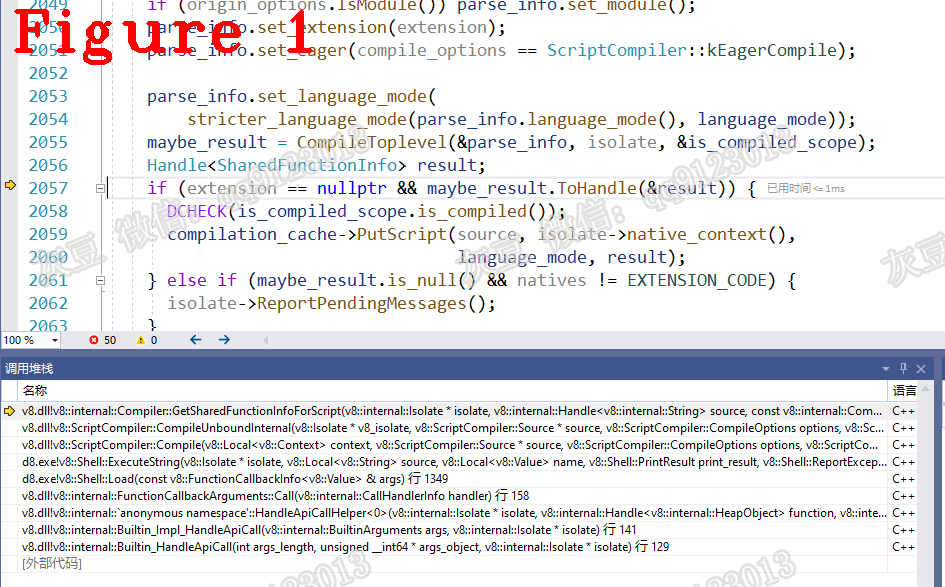

# 《Chrome V8原理》第十九篇 V8 Isolate核心组件：编译缓存
  
# 1 摘要 
Isolate是V8虚拟机的实例，它负责为Javascript源码创建执行环境，管理堆栈、编译、执行、context等所有组件。编译缓存（CompilationCache），是Isolate的核心组件，也是Isolate创建的第一个组件，它属于编译阶段的能性优化技术，保存Javascript源码的编译结果（Sharedfunction），再次编译相同的Javascript源码时省去编译过程，直接使用缓存结果。编译缓存由Isoate::new负责创建，在Javascript源码编译前查询、编译后更新，本文详细它的创建、使用场景及以重要数据结构。  
# 2 CompilationCache源码分析  
`CompilationCache`的创建由Isolate负责，代码如下:  
```c++
bool Isolate::Init(ReadOnlyDeserializer* read_only_deserializer,
                   StartupDeserializer* startup_deserializer) {
//省略很多....................
#define ASSIGN_ELEMENT(CamelName, hacker_name)                  \
  isolate_addresses_[IsolateAddressId::k##CamelName##Address] = \
      reinterpret_cast<Address>(hacker_name##_address());
  FOR_EACH_ISOLATE_ADDRESS_NAME(ASSIGN_ELEMENT)
#undef ASSIGN_ELEMENT

  compilation_cache_ = new CompilationCache(this);
```  
最后一行是`CompilationCache()`的初始化，给出CompilationCache类源码，如下：  
```c++
1.  class V8_EXPORT_PRIVATE CompilationCache {
2.   public:
3.    MaybeHandle<SharedFunctionInfo> LookupScript(
4.        Handle<String> source, MaybeHandle<Object> name, int line_offset,
5.        int column_offset, ScriptOriginOptions resource_options,
6.        Handle<Context> native_context, LanguageMode language_mode);
7.    InfoCellPair LookupEval(Handle<String> source,
8.                            Handle<SharedFunctionInfo> outer_info,
9.                            Handle<Context> context, LanguageMode language_mode,
10.                            int position);
11.    MaybeHandle<FixedArray> LookupRegExp(Handle<String> source,
12.                                         JSRegExp::Flags flags);
13.    void PutScript(Handle<String> source, Handle<Context> native_context,
14.                   LanguageMode language_mode,
15.                   Handle<SharedFunctionInfo> function_info);
16.    void PutEval(Handle<String> source, Handle<SharedFunctionInfo> outer_info,
17.                 Handle<Context> context,
18.                 Handle<SharedFunctionInfo> function_info,
19.                 Handle<FeedbackCell> feedback_cell, int position);
20.    void PutRegExp(Handle<String> source, JSRegExp::Flags flags,
21.                   Handle<FixedArray> data);
22.    void Clear();
23.    void Remove(Handle<SharedFunctionInfo> function_info);
24.    void Iterate(RootVisitor* v);
25.    void MarkCompactPrologue();
26.    void Enable();
27.    void Disable();
28.   private:
29.    explicit CompilationCache(Isolate* isolate);
30.    ~CompilationCache() = default;
31.    base::HashMap* EagerOptimizingSet();
32.    static const int kSubCacheCount = 4;
33.    bool IsEnabled() const { return FLAG_compilation_cache && enabled_; }
34.    Isolate* isolate() const { return isolate_; }
35.    Isolate* isolate_;
36.    CompilationCacheScript script_;
37.    CompilationCacheEval eval_global_;
38.    CompilationCacheEval eval_contextual_;
39.    CompilationCacheRegExp reg_exp_;
40.    CompilationSubCache* subcaches_[kSubCacheCount];
41.    bool enabled_;
42.    friend class Isolate;
43.    DISALLOW_COPY_AND_ASSIGN(CompilationCache);
44.  };
```  
**（1）** 代码3行`LookupScript()`。在Cache中查找对应的SharedFunction，返回值为SharedFunction对象或空值。使用场景：编译Javascript源码前，使用`LookupScript()`查Cache，如果找到SharedFunction，则省去编译过程。  
**（2）** 代码13行`PutScript()`。用Javascript源码生成hash，与对应的SharedFunction一起填充进Cache。使用场景：Javascript源码编译后，使用`PutScript()`把结果填充进Cache。  
**（3）** 代码7，16行`LookupEval()`和`PutEval()`的作用与前面两个方法一样，是为`eval()`方法单独设置的查询和填充操作。理由：`eval(xxxx)`方法的使用离不开`context`上下文环境，它的Sharedfunction也必须绑定正确的`context`，所以填充或查找时都需要`context`，其它的Javascript源码编译后的Sharedfunction对`context`没有要求。  
`CompilationCache`利用了程序访问的局部性原理，省去重复的编译过程，提高V8性能，通俗地说就是把经常用到的数据放在cache中。  
`LookupScript()`的源码如下：  
```c++
1.  MaybeHandle<SharedFunctionInfo> CompilationCache::LookupScript(
2.      Handle<String> source, MaybeHandle<Object> name, int line_offset,
3.      int column_offset, ScriptOriginOptions resource_options,
4.      Handle<Context> native_context, LanguageMode language_mode) {
5.    if (!IsEnabled()) return MaybeHandle<SharedFunctionInfo>();
6.    return script_.Lookup(source, name, line_offset, column_offset,
7.                          resource_options, native_context, language_mode);
8.  }
9.  //..................分隔线..........................
10.  //..................分隔线..........................
11.  MaybeHandle<SharedFunctionInfo> CompilationCacheScript::Lookup(
12.      Handle<String> source, MaybeHandle<Object> name, int line_offset,
13.      int column_offset, ScriptOriginOptions resource_options,
14.      Handle<Context> native_context, LanguageMode language_mode) {
15.    MaybeHandle<SharedFunctionInfo> result;
16.    {
17.      HandleScope scope(isolate());
18.      const int generation = 0;
19.      DCHECK_EQ(generations(), 1);
20.      Handle<CompilationCacheTable> table = GetTable(generation);
21.      MaybeHandle<SharedFunctionInfo> probe = CompilationCacheTable::LookupScript(
22.          table, source, native_context, language_mode);
23.      Handle<SharedFunctionInfo> function_info;
24.      if (probe.ToHandle(&function_info)) {
25.        if (HasOrigin(function_info, name, line_offset, column_offset,
26.                      resource_options)) {
27.          result = scope.CloseAndEscape(function_info);
28.        }
29.      }
30.    }
31.    Handle<SharedFunctionInfo> function_info;
32.    if (result.ToHandle(&function_info)) {
33.  #ifdef DEBUG
34.      DCHECK(HasOrigin(function_info, name, line_offset, column_offset,
35.                       resource_options));
36.  #endif
37.      isolate()->counters()->compilation_cache_hits()->Increment();
38.      LOG(isolate(), CompilationCacheEvent("hit", "script", *function_info));
39.    } else {
40.      isolate()->counters()->compilation_cache_misses()->Increment();
41.    }
42.    return result;
43.  }
```  
`LookupScript()`是入口函数，主要工作由`Lookup()`完成。`Lookup()`核心功能说明如下：  
**（1）** 参数`source`是Javascript源码， 参数`line_offset`和`column_offset`是行、列偏移量，用于在`source`上定位代码块的位置。  
**（2）** 代码20行，取出CacheTable，它是CompilationCache的存储结构。初次执行时，它为空，编译结果由`PutScript()`填充进CacheTable，稍后讲解`PutScript()`时做详细说明。  
**（3）** 代码21行，`LookupScript()`是hash查找，在CacheTable中查找Sharedfunction。  
**（4）** 代码25行，判断找到的Sharedfuncion是否符合要求，`HasOrigin()`源码如下：  
```c++
1.  // We only re-use a cached function for some script source code if the
2.  // script originates from the same place. This is to avoid issues
3.  // when reporting errors, etc.
4.  bool CompilationCacheScript::HasOrigin(Handle<SharedFunctionInfo> function_info,
5.                                         MaybeHandle<Object> maybe_name,
6.                                         int line_offset, int column_offset,
7.                                         ScriptOriginOptions resource_options) {
8.    Handle<Script> script =
9.        Handle<Script>(Script::cast(function_info->script()), isolate());
10.    Handle<Object> name;
11.    if (!maybe_name.ToHandle(&name)) {
12.      return script->name().IsUndefined(isolate());
13.    }
14.    if (line_offset != script->line_offset()) return false;
15.    if (column_offset != script->column_offset()) return false;
16.    if (!name->IsString() || !script->name().IsString()) return false;
17.    if (resource_options.Flags() != script->origin_options().Flags())
18.      return false;
19.    return String::Equals(
20.        isolate(), Handle<String>::cast(name),
21.        Handle<String>(String::cast(script->name()), isolate()));
22.  }
```  
代码1-3行的注释说明了它的判断规则，代码14~18行可以看出规则的具体实现方法是：使用行、列偏移量计算出代码块，判断Sharedfunction是否包含该代码块。  
回到`CompilationCacheScript::Lookup()`代码27行，`HasOrigin()`结果为真说明找到了正解的Sharedfunction，代码40行返回。  
`CompilationCache::PutScript()`负责填充Cache，源码如下：  
```c++
1.  void CompilationCache::PutScript(Handle<String> source,
2.                                   Handle<Context> native_context,
3.                                   LanguageMode language_mode,
4.                                   Handle<SharedFunctionInfo> function_info) {
5.    if (!IsEnabled()) return;
6.    LOG(isolate(), CompilationCacheEvent("put", "script", *function_info));
7.    script_.Put(source, native_context, language_mode, function_info);
8.  }
9.  //.......................分隔线............................
10.  void CompilationCacheScript::Put(Handle<String> source,
11.                                   Handle<Context> native_context,
12.                                   LanguageMode language_mode,
13.                                   Handle<SharedFunctionInfo> function_info) {
14.    HandleScope scope(isolate());
15.    Handle<CompilationCacheTable> table = GetFirstTable();
16.    SetFirstTable(CompilationCacheTable::PutScript(table, source, native_context,
17.                                                   language_mode, function_info));
18.  }
```  
`CompilationCache::PutScript()`是入口函数，主要工作由`Put()`完成，它的参数`source`是源码、`function_info`是编译结果。代码15行，先获取`CacheTable`，代码18行是把结果写入table，也就是填充`CacheTable`。CacheTable源码如下：  
```c++
1.  // This cache is used in two different variants. For regexp caching, it simply
2.  // maps identifying info of the regexp to the cached regexp object. Scripts and
3.  // eval code only gets cached after a second probe for the code object. To do
4.  // so, on first "put" only a hash identifying the source is entered into the
5.  // cache, mapping it to a lifetime count of the hash. On each call to Age all
6.  // such lifetimes get reduced, and removed once they reach zero. If a second put
7.  // is called while such a hash is live in the cache, the hash gets replaced by
8.  // an actual cache entry. Age also removes stale live entries from the cache.
9.  // Such entries are identified by SharedFunctionInfos pointing to either the
10.  // recompilation stub, or to "old" code. This avoids memory leaks due to
11.  // premature caching of scripts and eval strings that are never needed later.
12.  class CompilationCacheTable
13.      : public HashTable<CompilationCacheTable, CompilationCacheShape> {
14.   public:
15.    NEVER_READ_ONLY_SPACE
16.    static MaybeHandle<SharedFunctionInfo> LookupScript(
17.        Handle<CompilationCacheTable> table, Handle<String> src,
18.        Handle<Context> native_context, LanguageMode language_mode);
19.    static InfoCellPair LookupEval(Handle<CompilationCacheTable> table,
20.                                   Handle<String> src,
21.                                   Handle<SharedFunctionInfo> shared,
22.                                   Handle<Context> native_context,
23.                                   LanguageMode language_mode, int position);
24.    Handle<Object> LookupRegExp(Handle<String> source, JSRegExp::Flags flags);
25.    static Handle<CompilationCacheTable> PutScript(
26.        Handle<CompilationCacheTable> cache, Handle<String> src,
27.        Handle<Context> native_context, LanguageMode language_mode,
28.        Handle<SharedFunctionInfo> value);
//省略部分代码......................
1.   };
```
重点是代码1~11行的注释，它说明了填充Cache时需要满足的条件，这是V8在编译缓存方面的优化策略，`CacheTable`结构非常简单，不做详细说明。  
回到`CompilationCacheScript::Put()`，代码16行`CompilationCacheTable::PutScript()`，它负责把Javascript源码和Sharedfunction组织成一个表项，该表项由`SetFirstTable()`填充进入Cache，源码如下：    
```c++
1.  Handle<CompilationCacheTable> CompilationCacheTable::PutScript(
2.      Handle<CompilationCacheTable> cache, Handle<String> src,
3.      Handle<Context> native_context, LanguageMode language_mode,
4.      Handle<SharedFunctionInfo> value) {
5.    Isolate* isolate = native_context->GetIsolate();
6.    Handle<SharedFunctionInfo> shared(native_context->empty_function().shared(),
7.                                      isolate);
8.    src = String::Flatten(isolate, src);
9.    StringSharedKey key(src, shared, language_mode, kNoSourcePosition);
10.    Handle<Object> k = key.AsHandle(isolate);
11.    cache = EnsureCapacity(isolate, cache, 1);
12.    int entry = cache->FindInsertionEntry(key.Hash());
13.    cache->set(EntryToIndex(entry), *k);
14.    cache->set(EntryToIndex(entry) + 1, *value);
15.    cache->ElementAdded();
16.    return cache;
17.  }
```   
代码8行，先对源码做flatten处理，代码9~15行计算hash生成表项。  
以`LookUpScript`和`PutScript`为例，说明了`CompilationCache`的工作流程、Cache的填充策略，`LookupEval`和`PutEval`请读者自行为分析。分析CompilationCache时，要注意区分以下几点：    
**（1）** `CompilationCache::LookupScript()`是入口函数；  
**（2）** lookup的主要工作由`CompilationCacheScript::Lookup()`和`CompilationCacheTable::LookupScript()`完成;  
**（3）** `CompilationCacheTable`类负责实现编译缓存，注意区分`CompilationCache`、`CompilationCacheScript`、`CompilationCacheTable`三者关系。  
# 3 CompilationCache的查询与更新 
代码如下：  
```c++
1.   MaybeHandle<SharedFunctionInfo> Compiler::GetSharedFunctionInfoForScript(
2.       Isolate* isolate, Handle<String> source,
3.       const Compiler::ScriptDetails& script_details,
4.       ScriptOriginOptions origin_options, v8::Extension* extension,
5.       ScriptData* cached_data, ScriptCompiler::CompileOptions compile_options,
6.       ScriptCompiler::NoCacheReason no_cache_reason, NativesFlag natives) {
7.  //省略很多.....................
8.       if (extension == nullptr) {
9.         bool can_consume_code_cache =
10.             compile_options == ScriptCompiler::kConsumeCodeCache;
11.         if (can_consume_code_cache) {
12.           compile_timer.set_consuming_code_cache();
13.         }
14.         maybe_result = compilation_cache->LookupScript(//在这里！！！！！！
15.             source, script_details.name_obj, script_details.line_offset,
16.             script_details.column_offset, origin_options, isolate->native_context(),
17.             language_mode);
18.         if (!maybe_result.is_null()) {
19.           compile_timer.set_hit_isolate_cache();
20.         } else if (can_consume_code_cache) {
21.  //省略很多.....................
22.           if (CodeSerializer::Deserialize(isolate, cached_data, source,
23.                                           origin_options)
24.                   .ToHandle(&inner_result) &&
25.               inner_result->is_compiled()) {
26.             is_compiled_scope = inner_result->is_compiled_scope();
27.             DCHECK(is_compiled_scope.is_compiled());
28.     		//在这里！！！！！！！！！！！！！
29.             compilation_cache->PutScript(source, isolate->native_context(),
30.                                          language_mode, inner_result);
31.             Handle<Script> script(Script::cast(inner_result->script()), isolate);
32.             maybe_result = inner_result;
33.           } else {
34.             compile_timer.set_consuming_code_cache_failed();
35.           }
36.         }
37.       }
38.       return maybe_result;
39.     }
```  
`GetSharedFunctionInfoForScript()`中，代码14行查询CacheTable并获取Sharedfunction，获取失败时在代码21行编译Javascript代码，代码29行把编译生成的sharedfunction填充进CompilationCacheTable。图1给出`GetSharedFunctionInfoForScript()`的函数调用堆栈，供读者复现。   
  
在分析`LookupEval`和`PutEval`时Javascript源码中要有`eval`方法，否则不会触发这两个函数执行。  
好了，今天到这里，下次见。   

**恳请读者批评指正、提出宝贵意见**  
**微信：qq9123013  备注：v8交流    邮箱：v8blink@outlook.com**
