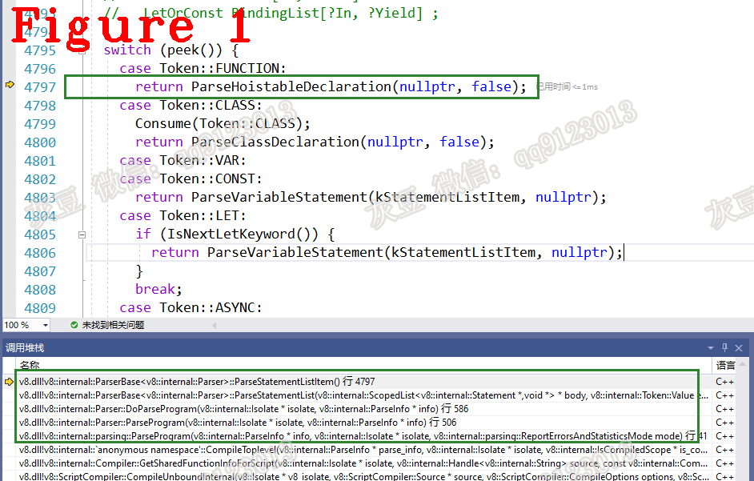

# 《Chrome V8源码》21 编译链2：Token和AST，被忽略的秘诀  
   
# 1 摘要  
本篇是编译链专题的第二篇，详细解释Javascript源码到Token，再到抽象语法树（AST）的转换过程。本文组织方式，词法分析器与Token（章节2）；抽象语法树（章节3）。    
# 2 词法分析器与Token生成    
接前文说，Parser实例化后，开始语法分析，源码如下：  
```c++
1.  FunctionLiteral* Parser::ParseProgram(Isolate* isolate, ParseInfo* info) {
2.  //省略很多....................
3.    scanner_.Initialize();
4.    scanner_.SkipHashBang();
5.    FunctionLiteral* result = DoParseProgram(isolate, info);
6.    MaybeResetCharacterStream(info, result);
7.    MaybeProcessSourceRanges(info, result, stack_limit_);
8.    HandleSourceURLComments(isolate, info->script());
9.  //省略很多....................
10.    return result;
11.  }
```  
语法分析的输入数据是Token，Token由词法分析器提供，代码3行是词法分析器初始化的入口，源码如下：  
```c++
1.  void Scanner::Initialize() {
2.    Init();
3.    next().after_line_terminator = true;
4.    Scan();
5.  }
```  
代码2行，词法分析器初始化，初始化完成后执行代码4行生成一个Token，**注意** 只生成一个！。`Init()`源码如下：  
```c++
1.  void Init() {
2.    Advance();
3.    current_ = &token_storage_[0];
4.    next_ = &token_storage_[1];
5.    next_next_ = &token_storage_[2];
6.    found_html_comment_ = false;
7.    scanner_error_ = MessageTemplate::kNone;
8.  }
9.  //分隔线.........................
10.  template <bool capture_raw = false>
11.  void Advance() {
12.    if (capture_raw) {
13.      AddRawLiteralChar(c0_);
14.    }
15.    c0_ = source_->Advance();
16.  }
17.  //分隔线..................
18.  inline uc32 Advance() {
19.     uc32 result = Peek();
20.     buffer_cursor_++;
21.     return result;
22.   }
23.   //分隔线....................
24.   inline uc32 Peek() {
25.     if (V8_LIKELY(buffer_cursor_ < buffer_end_)) {
26.       return static_cast<uc32>(*buffer_cursor_);
27.     } else if (ReadBlockChecked()) {
28.       return static_cast<uc32>(*buffer_cursor_);
29.     } else {
30.       return kEndOfInput;
31.     }
32.   }
```  
代码2行，`Advance()`前进一个字符，即读取源码中的下一个字符，代码11行是`Advance()`源码；代码15行`c0_`保存下一个字符，也就是将要分析的字符，`source_->Advance()`取出一个字符给`c0_`，它的源码在代码18行；代码20行`buffer_cursor_`是字符串指针，指针Javascript源码，输出一个字符给`c0_`之后，`++`操作是指向下一个字符；`Peek()`源码在24行。  
返回`void Init()`方法，代码3~5行 `current_,next_,next_next_`是三个Token存储单元，分别保存了当前、下个、下下个Token。  
返回`void Scanner::Initialize()`,代码4行，执行扫描，源码如下：  
```c++
1.  void Scanner::Scan() { Scan(next_); }
2.  //分隔线.....................
3.  void Scanner::Scan(TokenDesc* next_desc) {
4.    next_desc->token = ScanSingleToken();
5.    DCHECK_IMPLIES(has_parser_error(), next_desc->token == Token::ILLEGAL);
6.    next_desc->location.end_pos = source_pos();
7.  }
8.  //分隔线......................
9.  V8_INLINE Token::Value Scanner::ScanSingleToken() {
10.    Token::Value token;
11.    do {
12.      next().location.beg_pos = source_pos();
13.      if (V8_LIKELY(static_cast<unsigned>(c0_) <= kMaxAscii)) {
14.        token = one_char_tokens[c0_];
15.        switch (token) {//省略很多代码.....................
16.          case Token::IDENTIFIER:
17.            return ScanIdentifierOrKeyword();
18.          default:
19.            UNREACHABLE();
20.        }
21.      }
22.      if (IsIdentifierStart(c0_) ||
23.          (CombineSurrogatePair() && IsIdentifierStart(c0_))) {
24.        return ScanIdentifierOrKeyword();
25.      }
26.      if (c0_ == kEndOfInput) {
27.        return source_->has_parser_error() ? Token::ILLEGAL : Token::EOS;
28.      }
29.      token = SkipWhiteSpace();
30.      // Continue scanning for tokens as long as we're just skipping whitespace.
31.    } while (token == Token::WHITESPACE);
32.    return token;
33.  }
```
代码4行，扫描一个Token，扫描时需要对js源码进行拆分，拆分时使用了预先定义的模板，我们的测试代码中第一个字符是`f`，根据变量的定义规则，`f`是一个标识符，它可以是一个普通的变量名，也可以是`function`的首字母，所以进入代码16~17行。生成Token是根据预先设定的条件对源码中字符、单词进行逐个判断，其本质是有限状态自动机，预先设定的条件和字符匹配模板参见第三、四两篇文章。代码17行，进入`ScanIdentifierOrKeyword()`函数，源码如下：  
```c++
1.  V8_INLINE Token::Value Scanner::ScanIdentifierOrKeywordInner() {
2.    STATIC_ASSERT(arraysize(character_scan_flags) == kMaxAscii + 1);
3.    if (V8_LIKELY(static_cast<uint32_t>(c0_) <= kMaxAscii)) {
4.      if (V8_LIKELY(c0_ != '\\')) {
5.        uint8_t scan_flags = character_scan_flags[c0_];
6.        DCHECK(!TerminatesLiteral(scan_flags));
7.  //省略很多....................
8.         AdvanceUntil([this, &scan_flags](uc32 c0) {
9.           if (V8_UNLIKELY(static_cast<uint32_t>(c0) > kMaxAscii)) {
10.              scan_flags |=
11.                  static_cast<uint8_t>(ScanFlags::kIdentifierNeedsSlowPath);
12.              return true;
13.            }
14.            uint8_t char_flags = character_scan_flags[c0];
15.            scan_flags |= char_flags;
16.          });
17.          if (V8_LIKELY(!IdentifierNeedsSlowPath(scan_flags))) {
18.  			//省略很多...................
19.          }
20.          can_be_keyword = CanBeKeyword(scan_flags);
21.        } else {
22.    //省略很多................
23.        }
24.      }
25.      return ScanIdentifierOrKeywordInnerSlow(escaped, can_be_keyword);
26.    }
```   
上面的流程完成一次，生成一个Token，词法分析器返回给Token给语法分析器。  
# 3 AST树生成  
AST的生成由`DoParseProgram()`函数负责，源码如下：  
```c++
1.  FunctionLiteral* Parser::DoParseProgram(Isolate* isolate, ParseInfo* info) {
2.    ParsingModeScope mode(this, allow_lazy_ ? PARSE_LAZILY : PARSE_EAGERLY);
3.    FunctionLiteral* result = nullptr;
4.    {
5.      DeclarationScope* scope = outer->AsDeclarationScope();
6.      scope->set_start_position(0);
7.      FunctionState function_state(&function_state_, &scope_, scope);
8.      ScopedPtrList<Statement> body(pointer_buffer());
9.      int beg_pos = scanner()->location().beg_pos;
10.      if (parsing_module_) {
11.  //省略很多................
12.      } else if (info->is_wrapped_as_function()) {
13.        ParseWrapped(isolate, info, &body, scope, zone());
14.      } else {
15.        this->scope()->SetLanguageMode(info->language_mode());
16.        ParseStatementList(&body, Token::EOS);
17.      }
18.      scope->set_end_position(peek_position());
19.      if (is_strict(language_mode())) {
20.        CheckStrictOctalLiteral(beg_pos, end_position());
21.      }
22.      if (is_sloppy(language_mode())) {
23.        InsertSloppyBlockFunctionVarBindings(scope);
24.      }
25.      if (info->is_eval()) {
26.        DCHECK(parsing_on_main_thread_);
27.        info->ast_value_factory()->Internalize(isolate);
28.      }
29.      CheckConflictingVarDeclarations(scope);
30.    }
31.    info->set_max_function_literal_id(GetLastFunctionLiteralId());
32.    return result;
33.  }
```   
代码2行，获取lazy选项；代码8行创建body对象，该对象用于暂存AST树，代码16行以body为输入，开始语法分析，源码如下：  
```c++
1.  void ParserBase<Impl>::ParseStatementList(StatementListT* body,
2.                                            Token::Value end_token) {
3.    DCHECK_NOT_NULL(body);
4.    while (peek() == Token::STRING) {
5.  //省略代码.........
6.    }
7.    TargetScopeT target_scope(this);
8.    while (peek() != end_token) {
9.      StatementT stat = ParseStatementListItem();
10.      if (impl()->IsNull(stat)) return;
11.      if (stat->IsEmptyStatement()) continue;
12.      body->Add(stat);
13.    }
14.  }
```  
代码4行，`peek()`方法查看当前Token，判断Token类型是否为字符串,此时token是`function`,它的类型是标识符，执行代码9行，`ParseStatementListItem()`,源码如下：  
```c++
1.  ParserBase<Impl>::ParseStatementListItem() {
2.    switch (peek()) {
3.      case Token::FUNCTION:
4.        return ParseHoistableDeclaration(nullptr, false);
5.      case Token::CLASS:
6.        Consume(Token::CLASS);
7.        return ParseClassDeclaration(nullptr, false);
8.      case Token::VAR:
9.      case Token::CONST:
10.        return ParseVariableStatement(kStatementListItem, nullptr);
11.      case Token::LET:
12.        if (IsNextLetKeyword()) {
13.          return ParseVariableStatement(kStatementListItem, nullptr);
14.        }
15.        break;
16.      case Token::ASYNC:
17.        if (PeekAhead() == Token::FUNCTION &&
18.            !scanner()->HasLineTerminatorAfterNext()) {
19.          Consume(Token::ASYNC);
20.          return ParseAsyncFunctionDeclaration(nullptr, false);
21.        }
22.        break;
23.      default:
24.        break;
25.    }
26.    return ParseStatement(nullptr, nullptr, kAllowLabelledFunctionStatement);
27.  }
```  
通过上述代码中的`case`条件，决定下一步如何分析代码。在我们的测试代码中，function是第一个字符串，也是一个定义函数时的开始字符串。书写一条javascript语句时，能做“开始字符串”的类型有哪些？变量定义、常量定义、类定义都可以做“开始字符串”，这和上述代码的中`case`对应。前面提到token的类型是标识符，所以执行代码4行，分析函数声明定义，图1给出了V8的调用堆栈。  
    
`ParseVariableStatement()`的作用是对语句进行分析。一条语句，可以是变量定义、函数定义等，js源码是由很多语句组成，所以会反复调用`ParseStatementListItem()`，最终生成语法树。  
**要点总结：**    
**（1）** 被忽略的秘诀是有限状态自动机，语法分过程的实现原理是有限自动机，在C++中使用`switch case`实现。弄明白各种宏模板和`switch case`，再看v8编译会事半功倍；  
**（2）** 以函数为单位生成语法树，每个函数生成一棵抽象语法树；  
**（3）** 因为有lazy编译技术，函数执行时才会编译；  
**（4）** 抽象语法树保存在`FunctionLiteral`类结构中； 
**（5）** 语法分析器驱动词法分析器工作，词法分析的token定义主要由以下几个宏模板组成。  
```c++
1.  #define IGNORE_TOKEN(name, string, precedence)
2.  /* Binary operators */
3.  /* ADD and SUB are at the end since they are UnaryOp */
4.  #define BINARY_OP_TOKEN_LIST(T, E) \
5.  #define EXPAND_BINOP_ASSIGN_TOKEN(T, name, string, precedence) \
6.    T(ASSIGN_##name, string "=", 2)
7.  #define EXPAND_BINOP_TOKEN(T, name, string, precedence) \
8.    T(name, string, precedence)
9.  #define TOKEN_LIST(T, K)                                           \
10.    T(TEMPLATE_SPAN, nullptr, 0)                                     \
11.    T(TEMPLATE_TAIL, nullptr, 0)                                     \
12.    /* BEGIN Property */                                             \
13.    T(PERIOD, ".", 0)                                                \
14.    T(LBRACK, "[", 0)                                                \
15.    /* END Property */                                               \
16.    /* END Member */                                                 \
17.    T(QUESTION_PERIOD, "?.", 0)                                      \
18.    T(LPAREN, "(", 0)                                                \
19.    /* END PropertyOrCall */                                         \
```
好了，今天到这里，下次见。   

**恳请读者批评指正、提出宝贵意见**  
**微信：qq9123013  备注：v8交流    邮箱：v8blink@outlook.com**


