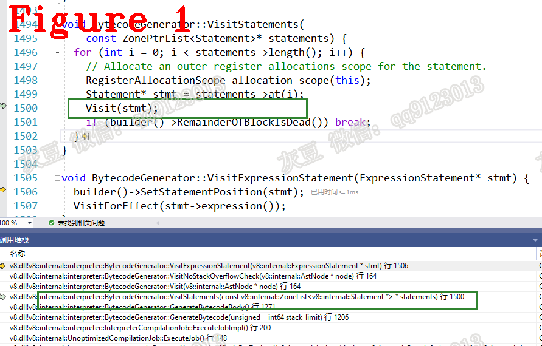

# 《Chrome V8源码》22.编译链3：Bytecode的秘密——常量池  
   
# 1 摘要  
本篇是编译链专题的第三篇，详细讲解AST到字节码的转换过程。本文组织方式：字节码生成（章节2）；延期常量池（章节3）；编译收尾工作（章节4）。 
# 2.字节码生成  
把AST树翻译成字节码，入口函数源码如下：  
```c++
1.  MaybeHandle<SharedFunctionInfo> GenerateUnoptimizedCodeForToplevel(
2.      Isolate* isolate, ParseInfo* parse_info, AccountingAllocator* allocator,
3.      IsCompiledScope* is_compiled_scope) {
4.  //省略............
5.     while (!functions_to_compile.empty()) {
6.  //省略............
7.       if (job->ExecuteJob() == CompilationJob::FAILED ||
8.           FinalizeUnoptimizedCompilationJob(job.get(), shared_info, isolate) ==
9.               CompilationJob::FAILED) {
10.           return MaybeHandle<SharedFunctionInfo>();
11.         }
12.         if (FLAG_stress_lazy_source_positions) {
13.           SharedFunctionInfo::EnsureSourcePositionsAvailable(isolate, shared_info);
14.         }
15.         if (shared_info.is_identical_to(top_level)) {
16.           *is_compiled_scope = shared_info->is_compiled_scope();
17.           DCHECK(is_compiled_scope->is_compiled());
18.         }
19.       }
20.       parse_info->ResetCharacterStream();
21.       return top_level;
22.     }
```   
上面第7行代码`job->ExecuteJob()`的作用是生成字节码，它与AST一样以函数为单位生成字节码，最终进入下面的源码：  
```c++
1.  void BytecodeGenerator::GenerateBytecodeBody() {
2.    VisitArgumentsObject(closure_scope()->arguments());
3.    VisitNewTargetVariable(closure_scope()->new_target_var());
4.    FunctionLiteral* literal = info()->literal();
5.    if (IsResumableFunction(literal->kind())) {
6.      BuildGeneratorObjectVariableInitialization();
7.    }
8.    if (FLAG_trace) builder()->CallRuntime(Runtime::kTraceEnter);
9.  //省略.........................
10.    BuildIncrementBlockCoverageCounterIfEnabled(literal, SourceRangeKind::kBody);
11.    VisitDeclarations(closure_scope()->declarations());
12.    VisitModuleNamespaceImports();
13.    builder()->StackCheck(literal->start_position());
14.    if (IsBaseConstructor(function_kind())) {
15.      if (literal->requires_brand_initialization()) {
16.        BuildPrivateBrandInitialization(builder()->Receiver());
17.      }
18.      if (literal->requires_instance_members_initializer()) {
19.        BuildInstanceMemberInitialization(Register::function_closure(),
20.                                          builder()->Receiver());
21.      }
22.    }
23.    VisitStatements(literal->body());
24.    if (!builder()->RemainderOfBlockIsDead()) {
25.      builder()->LoadUndefined();
26.      BuildReturn();
27.    }
28.  }
```  
上面第11行代码的作用是分析全局变量、生成bytecode。分析样例代码的全局变量时会执行以下功能：  
```c++
1.  BytecodeArrayBuilder& BytecodeArrayBuilder::LoadConstantPoolEntry(
2.      size_t entry) {
3.    OutputLdaConstant(entry);
4.    return *this;
5.  }
6.  //分隔线============================
7.  #define DEFINE_BYTECODE_OUTPUT(name, ...) 
```
上面第3行代码的作用是把全局变量名称写入常量池（稍后解释）。在Bytecode运行期间，通过`LdaGlobal`指令取出常量值。`OutputLdaConstant()`方法由宏模板`DEFINE_BYTECODE_OUTPUT`实现，请读者自行展开。最终进入`EmitBytecode()`方法，该方法会生成字节码，源码如下：  
```c++
1.  void BytecodeArrayWriter::EmitBytecode(const BytecodeNode* const node) {
2.  //省略..........
3.     for (int i = 0; i < operand_count; ++i) {
4.       switch (operand_sizes[i]) {
5.         case OperandSize::kNone:
6.           UNREACHABLE();
7.           break;
8.         case OperandSize::kByte:
9.           bytecodes()->push_back(static_cast<uint8_t>(operands[i]));
10.           break;
11.         case OperandSize::kShort: {
12.           uint16_t operand = static_cast<uint16_t>(operands[i]);
13.           const uint8_t* raw_operand = reinterpret_cast<const uint8_t*>(&operand);
14.           bytecodes()->push_back(raw_operand[0]);
15.           bytecodes()->push_back(raw_operand[1]);
16.           break;
17.         }
18.         case OperandSize::kQuad: {
19.           const uint8_t* raw_operand =
20.               reinterpret_cast<const uint8_t*>(&operands[i]);
21.           bytecodes()->push_back(raw_operand[0]);
22.           bytecodes()->push_back(raw_operand[1]);
23.           bytecodes()->push_back(raw_operand[2]);
24.           bytecodes()->push_back(raw_operand[3]);
25.           break;
26.         }
27.       }
28.     }
29.   }
```    
根据`case`条件生成不同的Bytecdoe，把Bytecdoe用`bytecodes()->push_back()`写入BytecodeArray。  
返回到GenerateBytecodeBody()的第23行代码，`VisitStatements()`的作用是分析AST并生成Bytecode，源码如下：  
```c++
void BytecodeGenerator::VisitStatements(
    const ZonePtrList<Statement>* statements) {
  for (int i = 0; i < statements->length(); i++) {
    // Allocate an outer register allocations scope for the statement.
    RegisterAllocationScope allocation_scope(this);
    Statement* stmt = statements->at(i);
    Visit(stmt);
    if (builder()->RemainderOfBlockIsDead()) break;
  }
}
```  
遍历AST生成Bytecode时，会递归调用`VisitStatements()`方法，图1给出了调用堆栈，供读者分析。  
  
# 3 延期常量池   
**注意** `常量`不是编程语言中的常量，而是编译器生成的包括各种标识符在内的信息表，即延期常量池，请注意区分！  
`延期`的含义是要为在编译阶段无法确定的执行路径预留位置，待后面确定时再填充，举例说明如下：  
```c++
function test(x)
{
 if(x>0)
 add3(x);//x=x+3
 dosomething........
}
```  
生成`test()`的字节码时，要把`add3()`的调用地址填充到常量池中。如果此时`add3()`还没有被编译，就预留一个位置，等到`add3()`有调用地址时再填充，这就是延期填充。
生成字节码的入口函数如下：   
```c++
1.  Handle<BytecodeArray> BytecodeGenerator::FinalizeBytecode(
2.      Isolate* isolate, Handle<Script> script) {
3.    DCHECK_EQ(ThreadId::Current(), isolate->thread_id());
4.    AllocateDeferredConstants(isolate, script);
5.    if (block_coverage_builder_) {
6.      info()->set_coverage_info(
7.          isolate->factory()->NewCoverageInfo(block_coverage_builder_->slots()));
8.      if (FLAG_trace_block_coverage) {
9.        info()->coverage_info()->Print(info()->literal()->GetDebugName());
10.      }
11.    }
12.    if (HasStackOverflow()) return Handle<BytecodeArray>();
13.    Handle<BytecodeArray> bytecode_array = builder()->ToBytecodeArray(isolate);
14.    if (incoming_new_target_or_generator_.is_valid()) {
15.      bytecode_array->set_incoming_new_target_or_generator_register(
16.          incoming_new_target_or_generator_);
17.    }
18.    return bytecode_array;
19.  }
```  
上面第4行代码的作用是构建延期常量池（DeferredConstants），源码如下： 
```c++
1.  void BytecodeGenerator::AllocateDeferredConstants(Isolate* isolate,
2.                                                    Handle<Script> script) {
3.    // Build global declaration pair arrays.
4.    for (GlobalDeclarationsBuilder* globals_builder : global_declarations_) {
5.      Handle<FixedArray> declarations =
6.          globals_builder->AllocateDeclarations(info(), script, isolate);
7.      if (declarations.is_null()) return SetStackOverflow();
8.      builder()->SetDeferredConstantPoolEntry(
9.          globals_builder->constant_pool_entry(), declarations);
10.     }
11.     // Find or build shared function infos.
12.     for (std::pair<FunctionLiteral*, size_t> literal : function_literals_) {
13.    //省略..................
14.     }
15.     // Find or build shared function infos for the native function templates.
16.     for (std::pair<NativeFunctionLiteral*, size_t> literal :
17.          native_function_literals_) {
18.   //省略..................
19.     }
20.     // Build object literal constant properties
21.     for (std::pair<ObjectLiteral*, size_t> literal : object_literals_) {
22.       ObjectLiteral* object_literal = literal.first;
23.   //省略..................
24.       }
25.     }
26.     // Build array literal constant elements
27.     for (std::pair<ArrayLiteral*, size_t> literal : array_literals_) {
28.   //省略..................
29.     }
30.     // Build class literal boilerplates.
31.     for (std::pair<ClassLiteral*, size_t> literal : class_literals_) {
32.   //省略..................
33.     }
34.     // Build template literals.
35.     for (std::pair<GetTemplateObject*, size_t> literal : template_objects_) {
36.   //省略..................
37.     }
38.   }
```  
上面第4~10行代码：取出全局变量信息存入常量池。其中第9行代码`constant_pool_entry()`的作用是获取常量池入口，其余代码负责把引用的sharedfunction、constant property等添加到常量池。常量池的类型是FixedArray，请读者自行分析。
# 4 收尾工作  
返回到`FinalizeBytecode()`函数的第13行，源码如下：  
```c++
1.  Handle<BytecodeArray> BytecodeArrayBuilder::ToBytecodeArray(Isolate* isolate) {
2.    DCHECK(RemainderOfBlockIsDead());
3.    DCHECK(!bytecode_generated_);
4.    bytecode_generated_ = true;
5.    int register_count = total_register_count();
6.    if (register_optimizer_) {
7.  //寄存器优化，请自行分析
8.    }
9.    Handle<ByteArray> handler_table =
10.        handler_table_builder()->ToHandlerTable(isolate);
11.    return bytecode_array_writer_.ToBytecodeArray(
12.        isolate, register_count, parameter_count(), handler_table);
13.  }
```  
上面第9行代码：获取bytecode handler table（字节码处理程序表），它保存了字节码处理程序的地址。第11行代码进入ToBytecodeArray(),源码如下：  
```c++
1.  Handle<BytecodeArray> BytecodeArrayWriter::ToBytecodeArray(
2.      Isolate* isolate, int register_count, int parameter_count,
3.      Handle<ByteArray> handler_table) {
4.    DCHECK_EQ(0, unbound_jumps_);
5.    int bytecode_size = static_cast<int>(bytecodes()->size());
6.    int frame_size = register_count * kSystemPointerSize;
7.    Handle<FixedArray> constant_pool =
8.        constant_array_builder()->ToFixedArray(isolate);
9.    Handle<BytecodeArray> bytecode_array = isolate->factory()->NewBytecodeArray(
10.        bytecode_size, &bytecodes()->front(), frame_size, parameter_count,
11.        constant_pool);
12.    bytecode_array->set_handler_table(*handler_table);
13.    return bytecode_array;
14.  }
```  
上面第7行代码生成常量池，第9行代码进入NewBytecodeArray()方法，源码如下：  
```c++
1.  Handle<BytecodeArray> Factory::NewBytecodeArray(
2.      int length, const byte* raw_bytecodes, int frame_size, int parameter_count,
3.      Handle<FixedArray> constant_pool) {
4.    DCHECK_LE(0, length);
5.    if (length > BytecodeArray::kMaxLength) {
6.      isolate()->heap()->FatalProcessOutOfMemory("invalid array length");
7.    }
8.    // Bytecode array is AllocationType::kOld, so constant pool array should be
9.    // too.
10.    DCHECK(!Heap::InYoungGeneration(*constant_pool));
11.    int size = BytecodeArray::SizeFor(length);
12.    HeapObject result = AllocateRawWithImmortalMap(size, AllocationType::kOld,
13.                                                   *bytecode_array_map());
14.    Handle<BytecodeArray> instance(BytecodeArray::cast(result), isolate());
15.    instance->set_length(length);
16.    instance->set_frame_size(frame_size);
17.    instance->set_parameter_count(parameter_count);
18.    instance->set_incoming_new_target_or_generator_register(
19.        interpreter::Register::invalid_value());
20.    instance->set_osr_loop_nesting_level(0);
21.    instance->set_bytecode_age(BytecodeArray::kNoAgeBytecodeAge);
22.    instance->set_constant_pool(*constant_pool);
23.    instance->set_handler_table(*empty_byte_array());
24.    instance->set_source_position_table(*undefined_value());
25.    CopyBytes(reinterpret_cast<byte*>(instance->GetFirstBytecodeAddress()),
26.              raw_bytecodes, length);
27.    instance->clear_padding();
28.    return instance;
29.  }
```   
上面第12行代码的作用是申请一段heap内存（堆对象），该内存用于存储生成的字节码，15~27行代码把生成的字节码存储到刚创建的堆对象中。  
**技术总结**  
**（1）** 常量池的作用是提供属性名称。在运行期间此名称可以找到对应的属性，提供被调用函数的地址等等，起到了辅助字节码执行的作用。常量池存储在字节码数组的0位置；  
**（2）** 字节码生成后存储在堆对象中，该对象的类型是FixedArray；  
**（3）** 字节码生成的本质是遍历AST树；   
**（4）** 看懂并理解AST树节点的类型再分析字节码的生成会十分容易。    
好了，今天到这里，下次见。   

**个人能力有限，有不足与纰漏，欢迎批评指正**  
**微信：qq9123013  备注：v8交流    邮箱：v8blink@outlook.com**  
本文由灰豆原创发布  
转载出处： https://www.anquanke.com/post/id/259229   
安全客 - 有思想的安全新媒体  


