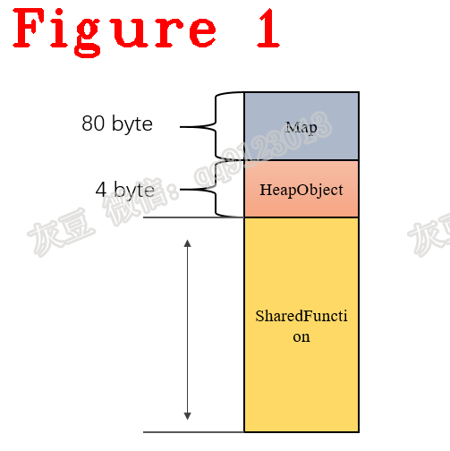
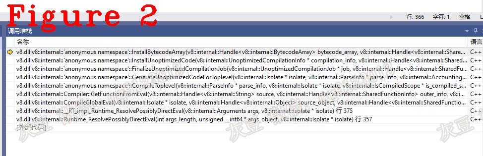

# 《Chrome V8源码》24.编译5：SharedFunction与JSFunction的渊源    
  
# 1 介绍  
SharedFunction是一个包含BytecodeArray和stub_entry等信息的数据集合，该集合是V8编译器的输出结果，由SharedFunction类管理。
本文的组织方式：SharedFunction的内存布局和重要成员（章节2）；SharedFunction的初始化（章节3）；SharedFunction与JSFunction之间关系（章节4）。 
# 2 SharedFunction内存布局  
V8编译器以Function为粒度对源码进行编译，生成的结果叫SharedFunction。SharedFunction的特点是共享（Shared）,即可以在其他代码中使用。下面是SharedFunction的数据结构：  
```c++
1.  // SharedFunctionInfo describes the JSFunction information that can be
2.  // shared by multiple instances of the function.
3.  class SharedFunctionInfo : public HeapObject {
4.  public:
5.  V8_EXPORT_PRIVATE Code GetCode() const;
6.  V8_EXPORT_PRIVATE static void SetScript(
7.      Handle<SharedFunctionInfo> shared, Handle<Object> script_object,
8.       int function_literal_id, bool reset_preparsed_scope_data = true);
9.   V8_EXPORT_PRIVATE int EndPosition() const;
10.    V8_EXPORT_PRIVATE int StartPosition() const;
11.    V8_EXPORT_PRIVATE void SetPosition(int start_position, int end_position);
12.    inline bool IsApiFunction() const;
13.    inline bool is_class_constructor() const;
14.    inline FunctionTemplateInfo get_api_func_data();
15.    inline void set_api_func_data(FunctionTemplateInfo data);
16.    inline bool HasBytecodeArray() const;
17.    inline BytecodeArray GetBytecodeArray() const;
18.    inline void set_bytecode_array(BytecodeArray bytecode);
19.    inline Code InterpreterTrampoline() const;
20.    inline bool HasInterpreterData() const;
21.    inline InterpreterData interpreter_data() const;
22.    inline void set_interpreter_data(InterpreterData interpreter_data);
23.    // builtin_id corresponds to the auto-generated Builtins::Name id.
24.    inline bool HasBuiltinId() const;
25.    inline int builtin_id() const;
26.    inline void set_builtin_id(int builtin_id);
27.    inline bool HasUncompiledData() const;
28.    inline UncompiledData uncompiled_data() const;
29.    inline void set_uncompiled_data(UncompiledData data);
30.    inline bool HasUncompiledDataWithPreparseData() const;
31.    inline UncompiledDataWithPreparseData uncompiled_data_with_preparse_data()
32.        const;
33.    inline void set_uncompiled_data_with_preparse_data(
34.        UncompiledDataWithPreparseData data);
35.    inline bool HasUncompiledDataWithoutPreparseData() const;
36.    inline LanguageMode language_mode() const;
37.    inline void set_language_mode(LanguageMode language_mode);
38.    DECL_PRIMITIVE_ACCESSORS(syntax_kind, FunctionSyntaxKind)
39.    inline bool is_wrapped() const;
40.    DECL_BOOLEAN_ACCESSORS(has_duplicate_parameters)
41.    DECL_BOOLEAN_ACCESSORS(native)
42.    DECL_BOOLEAN_ACCESSORS(is_asm_wasm_broken)
43.    DECL_BOOLEAN_ACCESSORS(name_should_print_as_anonymous)
44.    DECL_BOOLEAN_ACCESSORS(is_oneshot_iife)
45.    DECL_BOOLEAN_ACCESSORS(are_properties_final)
46.    DECL_BOOLEAN_ACCESSORS(is_safe_to_skip_arguments_adaptor)
47.    DECL_BOOLEAN_ACCESSORS(has_reported_binary_coverage)
48.    DECL_BOOLEAN_ACCESSORS(private_name_lookup_skips_outer_class)
49.    inline FunctionKind kind() const;
50.    DECL_INT_ACCESSORS(function_map_index)
51.    inline void clear_padding();
52.    inline void UpdateFunctionMapIndex();
53.    inline bool optimization_disabled() const;
54.    inline BailoutReason disable_optimization_reason() const;
55.    void DisableOptimization(BailoutReason reason);
56.    DECL_BOOLEAN_ACCESSORS(requires_instance_members_initializer)
57.    bool HasSourceCode() const;
58.    static Handle<Object> GetSourceCode(Handle<SharedFunctionInfo> shared);
59.    static Handle<Object> GetSourceCodeHarmony(Handle<SharedFunctionInfo> shared);
60.    inline bool IsSubjectToDebugging();
61.    inline bool IsUserJavaScript();
62.    inline bool CanDiscardCompiled() const;
63.    void UpdateExpectedNofPropertiesFromEstimate(FunctionLiteral* literal);
64.    void UpdateAndFinalizeExpectedNofPropertiesFromEstimate(
65.        FunctionLiteral* literal);
66.    DECL_CAST(SharedFunctionInfo)
67.    // Constants.
68.    static const uint16_t kDontAdaptArgumentsSentinel = static_cast<uint16_t>(-1);
69.    static const int kMaximumFunctionTokenOffset = kMaxUInt16 - 1;
70.    static const uint16_t kFunctionTokenOutOfRange = static_cast<uint16_t>(-1);
71.    STATIC_ASSERT(kMaximumFunctionTokenOffset + 1 == kFunctionTokenOutOfRange);
72.    DEFINE_FIELD_OFFSET_CONSTANTS(HeapObject::kHeaderSize,
73.                                  TORQUE_GENERATED_SHARED_FUNCTION_INFO_FIELDS)
74.    static const int kAlignedSize = POINTER_SIZE_ALIGN(kSize);
75.    class BodyDescriptor;
76.  #define FLAGS_BIT_FIELDS(V, _)                               \
77.    /* Have FunctionKind first to make it cheaper to access */ \
78.    V(FunctionKindBits, FunctionKind, 5, _)                    \
79.    V(IsNativeBit, bool, 1, _)                                 \
80.    V(IsStrictBit, bool, 1, _)                                 \
81.    V(FunctionSyntaxKindBits, FunctionSyntaxKind, 3, _)        \
82.    V(IsClassConstructorBit, bool, 1, _)                       \
83.    V(HasDuplicateParametersBit, bool, 1, _)                   \
84.    V(AllowLazyCompilationBit, bool, 1, _)                     \
85.    V(NeedsHomeObjectBit, bool, 1, _)                          \
86.    V(IsAsmWasmBrokenBit, bool, 1, _)                          \
87.    V(FunctionMapIndexBits, int, 5, _)                         \
88.    V(DisabledOptimizationReasonBits, BailoutReason, 4, _)     \
89.     V(RequiresInstanceMembersInitializer, bool, 1, _)          \
90.     V(ConstructAsBuiltinBit, bool, 1, _)                       \
91.      V(NameShouldPrintAsAnonymousBit, bool, 1, _)               \
92.      V(HasReportedBinaryCoverageBit, bool, 1, _)                \
93.      V(IsTopLevelBit, bool, 1, _)                               \
94.      V(IsOneshotIIFEOrPropertiesAreFinalBit, bool, 1, _)        \
95.      V(IsSafeToSkipArgumentsAdaptorBit, bool, 1, _)             \
96.      V(PrivateNameLookupSkipsOuterClassBit, bool, 1, _)
97.      DEFINE_BIT_FIELDS(FLAGS_BIT_FIELDS)
98.    #undef FLAGS_BIT_FIELDS
99.    };
```
上面第1行代码的注释说明了SharedFunction可以被多个实例共享。
下面对SharedFunction的重要成员进行解释：  
**（1）** 第5行代码`Code GetCode() const`的作用是获得函数的源码。不要把“源码”误认为字节码，在大多数情况下，“源码”是Builtin，其作用是构建函数入口并调用第一条字节码；  
**（2）** 第6行代码`static void SetScript()`的作用是设置JavaScript源码的成员变量；  
**（3）** 第9~11行代码`EndPosition()、StartPosition()、SetPosition()`的作用是设置JavaScript源码的位置。源码开始和结束位置标记的代码块是SharedFunction中BytecodeArray对应的JavaScript源码；  
**（4）** 第12-15行代码`IsApiFunction() const、get_api_func_data()、set_api_func_data()`的作用分别是：判断SharedFunction是不是API、获取ApiFun、设置ApiFun；  
**（5）** 第16-18行代码`HasBytecodeArray()、set_bytecode_array()、GetBytecodeArray()`的作用分别是：判断BytecodeArray是否存在、设置BytecodeArray，获取BytecodeArray；  
**（6）** 第19行代码`InterpreterTrampoline`的作用是获取InterpreterTrampoline的地址指针。InterpreterTrampoline为Bytecode的执行做准备，具体参见相关源码，以后我会详细讲解；   
**（7）** 第20-22行代码`HasInterpreterData()、interpreter_data()、set_interpreter_data()`的作用分别是判断、获取和设置解释器数据；   
**（8）** 第24-26行代码`HasBuiltinId()、builtin_id()、set_builtin_id`的作用分别是判断、获取和设置BuiltinId;  
**（9）** 第27-35行代码中名字中包含`Uncompile`方法的作用是设置SharedFunction的优化机制。Ignition执行JSFunction时会记录Feedback，V8根据Feedback决定是否把SharedFunction（与JSFunction对应的SharedFunction）翻译为hot code。SharedFunction的优化源码如下：  
```c++
#define BAILOUT_MESSAGES_LIST(V)                                            \
  V(kNoReason, "no reason")                                                 \
                                                                            \
  V(kBailedOutDueToDependencyChange, "Bailed out due to dependency change") \
  V(kCodeGenerationFailed, "Code generation failed")                        \
  V(kCyclicObjectStateDetectedInEscapeAnalysis,                             \
    "Cyclic object state detected by escape analysis")                      \
  V(kFunctionBeingDebugged, "Function is being debugged")                   \
  V(kGraphBuildingFailed, "Optimized graph construction failed")            \
  V(kFunctionTooBig, "Function is too big to be optimized")                 \
  V(kLiveEdit, "LiveEdit")                                                  \
  V(kNativeFunctionLiteral, "Native function literal")                      \
  V(kNotEnoughVirtualRegistersRegalloc,                                     \
    "Not enough virtual registers (regalloc)")                              \
  V(kOptimizationDisabled, "Optimization disabled")                         \
  V(kNeverOptimize, "Optimization is always disabled")
```    
**（10）** 第36、37行代码`language_mode()、set_language_mode()`的作用是把JavaScript模式设置为strict或者sloppy；  
**（11）** 第40~48行代码`DECL_BOOLEAN_ACCESSORS`的源码如下：  
```c++
#define DECL_PRIMITIVE_ACCESSORS(name, type) \
  inline type name() const;                  \
  inline void set_##name(type value);

#define DECL_BOOLEAN_ACCESSORS(name) DECL_PRIMITIVE_ACCESSORS(name, bool)
```   
**（12）** 第72行代码`DEFINE_FIELD_OFFSET_CONSTANTS`的作用是描述SharedFunction的内存布局，源码如下：  
```c++
#define DEFINE_FIELD_OFFSET_CONSTANTS(StartOffset, LIST_MACRO) \
  enum {                                                       \
    LIST_MACRO##_StartOffset = StartOffset - 1,                \
    LIST_MACRO(DEFINE_ONE_FIELD_OFFSET)                        \
  };
//==================分隔线===========================
#define TORQUE_GENERATED_SHARED_FUNCTION_INFO_FIELDS(V) \
V(kStartOfWeakFieldsOffset, 0) \
V(kFunctionDataOffset, kTaggedSize) \
V(kEndOfWeakFieldsOffset, 0) \
V(kStartOfStrongFieldsOffset, 0) \
V(kNameOrScopeInfoOffset, kTaggedSize) \
V(kOuterScopeInfoOrFeedbackMetadataOffset, kTaggedSize) \
V(kScriptOrDebugInfoOffset, kTaggedSize) \
V(kEndOfStrongFieldsOffset, 0) \
V(kLengthOffset, kUInt16Size) \
V(kFormalParameterCountOffset, kUInt16Size) \
V(kExpectedNofPropertiesOffset, kUInt16Size) \
V(kFunctionTokenOffsetOffset, kUInt16Size) \
V(kFlagsOffset, kInt32Size) \
V(kFunctionLiteralIdOffset, kInt32Size) \
V(kUniqueIdOffset, kInt32Size) \
V(kSize, 0) \
//============== 分隔线======================
#define FLAGS_BIT_FIELDS(V, _)//见上面第70行代码
```  
SharedFunction实例的内存布局如图1所示。  
  
实例包括Map头和HeapObject头，Map和HeapObject长度分别是80byte和4byte，SharedFunction的长度请读者自行计算（参考第十二篇文章的章节3），Map长度的计算方法见第十四篇文章的章节2。
# 3 SharedFunction初始化  
下面讲述创建SharedFunction实例的过程。  
**（1）** 初始化，源码如下：  
```c++
1.  void SharedFunctionInfo::InitFromFunctionLiteral(
2.      Handle<SharedFunctionInfo> shared_info, FunctionLiteral* lit,
3.      bool is_toplevel) {
4.    Isolate* isolate = shared_info->GetIsolate();
5.    bool needs_position_info = true;
6.    shared_info->set_internal_formal_parameter_count(lit->parameter_count());
7.    shared_info->SetFunctionTokenPosition(lit->function_token_position(),
8.                                          lit->start_position());
9.    if (shared_info->scope_info().HasPositionInfo()) {
10.      shared_info->scope_info().SetPositionInfo(lit->start_position(),
11.                                                lit->end_position());
12.      needs_position_info = false;
13.    }
14.    shared_info->set_syntax_kind(lit->syntax_kind());
15.    shared_info->set_allows_lazy_compilation(lit->AllowsLazyCompilation());
16.    shared_info->set_language_mode(lit->language_mode());
17.    shared_info->set_function_literal_id(lit->function_literal_id());
18.    shared_info->set_needs_home_object(lit->scope()->NeedsHomeObject());
19.    shared_info->set_requires_instance_members_initializer(
20.        lit->requires_instance_members_initializer());
21.    shared_info->set_is_toplevel(is_toplevel);
22.    DCHECK(shared_info->outer_scope_info().IsTheHole());
23.    if (!is_toplevel) {
24.    }
25.    shared_info->set_length(lit->function_length());
26.    if (lit->ShouldEagerCompile()) {
27.      shared_info->set_has_duplicate_parameters(lit->has_duplicate_parameters());
28.      shared_info->UpdateAndFinalizeExpectedNofPropertiesFromEstimate(lit);
29.      shared_info->set_is_safe_to_skip_arguments_adaptor(
30.          lit->SafeToSkipArgumentsAdaptor());
31.      DCHECK_NULL(lit->produced_preparse_data());
32.      needs_position_info = false;
33.    } else {
34.    }
35.    if (needs_position_info) {
36.    }
37.  }
```  
第14-21行设置编译模式、语法树ID等信息，第25行代码设置函数长度。  
**（2）** 安装BytecodeArray到SharedFunction中，源码如下：  
```c++
void InstallUnoptimizedCode(UnoptimizedCompilationInfo* compilation_info,
                            Handle<SharedFunctionInfo> shared_info,
                            ParseInfo* parse_info, Isolate* isolate) {
//省略代码....................
    InstallBytecodeArray(compilation_info->bytecode_array(), shared_info,
                         parse_info, isolate);

}
//===================分隔线================
void InstallBytecodeArray(Handle<BytecodeArray> bytecode_array,
                          Handle<SharedFunctionInfo> shared_info,
                          ParseInfo* parse_info, Isolate* isolate) {
  if (!FLAG_interpreted_frames_native_stack) {
    shared_info->set_bytecode_array(*bytecode_array);
    return;
  }
//===================分隔线================
void SharedFunctionInfo::set_bytecode_array(BytecodeArray bytecode) {
  DCHECK(function_data() == Smi::FromEnum(Builtins::kCompileLazy) ||
         HasUncompiledData());
  set_function_data(bytecode);
}
```   
看上面的代码，安装BytecodeArray的入口是`InstallUnoptimizedCode()`，`InstallBytecodeArray()`负责安装BytecodeArray，安装的具体操作由`set_function_data()`方法实现。图2给出调用堆栈。  
  
# 4 SharedFunction与JSFunction的差异  
`NewFunctionFromSharedFunctionInfo()`方法的输入是SharedFunction，输出是JSFunction，源码如下： 
```c++
1.  Handle<JSFunction> Factory::NewFunctionFromSharedFunctionInfo(
2.      Handle<SharedFunctionInfo> info, Handle<Context> context,
3.      AllocationType allocation) {
4.    Handle<Map> initial_map(
5.        Map::cast(context->native_context().get(info->function_map_index())),
6.        isolate());
7.    return NewFunctionFromSharedFunctionInfo(initial_map, info, context,
8.                                             allocation);
9.  }
10.  //==============分隔线============
11.  Handle<JSFunction> Factory::NewFunction(Handle<Map> map,
12.                                          Handle<SharedFunctionInfo> info,
13.                                          Handle<Context> context,
14.                                          AllocationType allocation) {
15.    Handle<JSFunction> function(JSFunction::cast(New(map, allocation)),
16.                                isolate());
17.    function->initialize_properties(isolate());
18.    function->initialize_elements();
19.    function->set_shared(*info);
20.    function->set_code(info->GetCode());
21.    function->set_context(*context);
22.    function->set_raw_feedback_cell(*many_closures_cell());
23.    int header_size;
24.    if (map->has_prototype_slot()) {
25.      header_size = JSFunction::kSizeWithPrototype;
26.      function->set_prototype_or_initial_map(*the_hole_value());
27.    } else {
28.      header_size = JSFunction::kSizeWithoutPrototype;
29.    }
30.    InitializeJSObjectBody(function, map, header_size);
31.    return function;
32.  }
```  
第4行代码获取JSFunction的初始Map。V8初始化时为每个类型都创建了初始Map，存放在root_table中，详见以前的文章。第7行代码`NewFunctionFromSharedFunctionInfo()`方法会调用第11行`NewFunction()`方法。通过对17~30行代码的分析可知SharedFunction与JSFunction的差异为：  
**（1）** 第17，18行代码表明JSFunction中有属性和元素，SharedFunction中没有属性和元素；  
**（2）** 第21行代码表明JSFuncion绑定current context，SharedFunction不绑定；  
**（3）** 第19,20代码表明从SharedFunction中获取stub_entry信息并设置到JSFunction中；  
**（4）** 第30行代码表明需要在JSFunction中安装JSObject。  

好了，今天到这里，下次见。   

**恳请读者批评指正、提出宝贵意见**  
**微信：qq9123013  备注：v8交流    知乎：https://www.zhihu.com/people/v8blink**    
&nbsp;&nbsp;&nbsp;  
本文由灰豆原创发布  
转载出处： https://www.anquanke.com/post/id/259502  
安全客 - 有思想的安全新媒体


