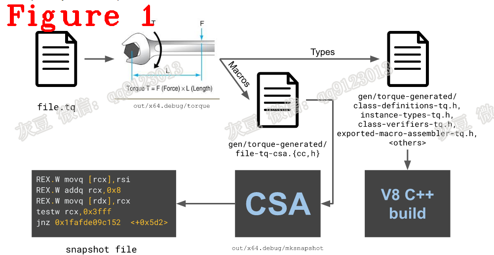
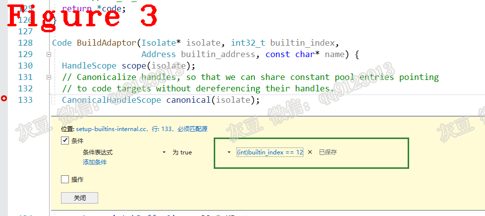
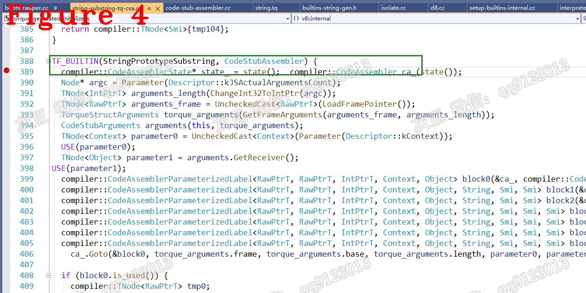

# 《Chrome V8源码》25.最难啃的骨头——Builtin！
   
# 前言  
接下来的几篇文章对Builtin做专题讲解。Builtin实现了V8中大量的核心功能，可见它的重要性。但大多数的Builtin采用CAS和TQ实现，CAS和TQ与汇编类似，这给我们阅读源码带来了不少困难，更难的是无法在V8运行期间调试Builtin，这让学习Builtin愈加困难。因此，本专题将详细讲解Builtin的学习方法和调试方法，希望能起到抛砖引玉的作用。
# 1 摘要   
本篇文章是Builtin专题的第一篇，讲解Built-in Functions（Builtin）是什么，以及它的初始化。Built-in Functions（Builtin）作为V8的内建功能，实现了很多重要功能，例如ignition、bytecode handler、JavaScript API。因此学会Builtin有助于理解V8的执行逻辑，例如可以看到bytecode是怎么执行的、字符串的substring方法是怎么实现的。本文主要内容介绍Builtin的实现方法（章节2）；Builtin初始化（章节3）。

# 2 Builtin的实现方法  
Builtin的实现方法有Platform-dependent assembly language、C++、JavaScript、CodeStubAssembler和Torque，这五种方式在使用的难易度和性能方面有明显不同。引用官方内容如下：  
**（1）** Platform-dependent assembly language: can be highly efficient, but need manual ports to all platforms and are difficult to maintain.  
**（2）** C++: very similar in style to runtime functions and have access to V8’s powerful runtime functionality, but usually not suited to performance-sensitive areas.  
**（3）** JavaScript: concise and readable code, access to fast intrinsics, but frequent usage of slow runtime calls, subject to unpredictable performance through type pollution, and subtle issues around (complicated and non-obvious) JS semantics. Javascript builtins are deprecated and should not be added anymore.  
**（4）** CodeStubAssembler: provides efficient low-level functionality that is very close to assembly language while remaining platform-independent and preserving readability.  
**（5）** V8 Torque: is a V8-specific domain-specific language that is translated to CodeStubAssembler. As such, it extends upon CodeStubAssembler and offers static typing as well as readable and expressive syntax.  
Torque是CodeStubAssembler的改进版，强调在不损失性能的前提下尽量降低使用难度，让Builtin的开发更加容易一些。  
  
图1（来自官方）说明了使用Torque创建Builtin的过程。  
首先，开发者编写的file.tq被Torque编译器翻译为*-tq-csa.cc/.h文件；  
其次，*-tq-csa.cc/.h被编译进可执行文件mksnapshot中；  
最后，mksnapshot生成snapshot.bin文件，该文件存储Builtin的二进制序列。  
**再次强调：** *-tq-csa.cc/.h是由file.tq指导Torque编译器生成的Builtin源码。  
V8通过反序列化方式加载snapshot文件时没有符号表，所以调试V8源码时不能看到Torque Builtin源码，CodeStubAssembler Builtin也存储在snapshot.bin文件中，所以调试时也看不到源码。调试方法请参见mksnapshot，下面讲解我的调试方法。  
# 3 Builtin初始化  
讲解源码之前先说注意事项，调试方法采用7.9版本和v8_use_snapshot选项，因为新版本不再支持v8_use_snapshot = false，无法调试Builtin的初始化。v8_use_snapshot = false会禁用snapshot.bin文件，这就意味着V8启动时会使用C++源码创建和初始化Builtin，而这正是我们想要看的内容。  
我认为C++、CodeStubAssembler和Torque三种Builtin最重要，因为ignition、bytecode handler、Javascript API等核心功能基本由这三种Builtin实现，下面对这三种Builtin做详细说明。Builtin的初始化入口代码如下：  
```c++
bool Isolate::InitWithoutSnapshot() { return Init(nullptr, nullptr); }
```
从`InitWithoutSnapshot()`函数的名字也可看出禁用了snapshot.bin文件，`InitWithoutSnapshot()`函数执行以下代码：  
```c++
1.  bool Isolate::Init(ReadOnlyDeserializer* read_only_deserializer,
2.                     StartupDeserializer* startup_deserializer) {
3.  //..............省略...............
4.    bootstrapper_->Initialize(create_heap_objects);
5.    if (FLAG_embedded_builtins && create_heap_objects) {
6.      builtins_constants_table_builder_ = new BuiltinsConstantsTableBuilder(this);
7.    }
8.    setup_delegate_->SetupBuiltins(this);
9.    if (FLAG_embedded_builtins && create_heap_objects) {
10.      builtins_constants_table_builder_->Finalize();
11.      delete builtins_constants_table_builder_;
12.      builtins_constants_table_builder_ = nullptr;
13.      CreateAndSetEmbeddedBlob();
14.    }
15.//..............省略...............
16.    return true;
17.  }
```    
上述第8行代码进入`SetupBuiltins()`，在`SetupBuiltins()`中调用`SetupBuiltinsInternal()`以完成Builtin的初始化。`SetupBuiltinsInternal()`的源码如下：  
```c++
1.  void SetupIsolateDelegate::SetupBuiltinsInternal(Isolate* isolate) {
2.    Builtins* builtins = isolate->builtins();
3.  //省略...................
4.    int index = 0;
5.    Code code;
6.  #define BUILD_CPP(Name)                                                      \
7.    code = BuildAdaptor(isolate, index, FUNCTION_ADDR(Builtin_##Name), #Name); \
8.    AddBuiltin(builtins, index++, code);
9.  #define BUILD_TFJ(Name, Argc, ...)                              \
10.    code = BuildWithCodeStubAssemblerJS(                          \
11.        isolate, index, &Builtins::Generate_##Name, Argc, #Name); \
12.    AddBuiltin(builtins, index++, code);
13.  #define BUILD_TFC(Name, InterfaceDescriptor)                      \
14.    /* Return size is from the provided CallInterfaceDescriptor. */ \
15.    code = BuildWithCodeStubAssemblerCS(                            \
16.        isolate, index, &Builtins::Generate_##Name,                 \
17.        CallDescriptors::InterfaceDescriptor, #Name);               \
18.    AddBuiltin(builtins, index++, code);
19.  #define BUILD_TFS(Name, ...)                                                   \
20.    /* Return size for generic TF builtins (stub linkage) is always 1. */        \
21.    code =                                                                       \
22.        BuildWithCodeStubAssemblerCS(isolate, index, &Builtins::Generate_##Name, \
23.                                     CallDescriptors::Name, #Name);              \
24.    AddBuiltin(builtins, index++, code);
25.  #define BUILD_TFH(Name, InterfaceDescriptor)              \
26.    /* Return size for IC builtins/handlers is always 1. */ \
27.    code = BuildWithCodeStubAssemblerCS(                    \
28.        isolate, index, &Builtins::Generate_##Name,         \
29.        CallDescriptors::InterfaceDescriptor, #Name);       \
30.    AddBuiltin(builtins, index++, code);
31.  #define BUILD_BCH(Name, OperandScale, Bytecode)                           \
32.    code = GenerateBytecodeHandler(isolate, index, OperandScale, Bytecode); \
33.    AddBuiltin(builtins, index++, code);
34.  #define BUILD_ASM(Name, InterfaceDescriptor)                                \
35.    code = BuildWithMacroAssembler(isolate, index, Builtins::Generate_##Name, \
36.                                   #Name);                                    \
37.    AddBuiltin(builtins, index++, code);
38.    BUILTIN_LIST(BUILD_CPP, BUILD_TFJ, BUILD_TFC, BUILD_TFS, BUILD_TFH, BUILD_BCH,
39.                 BUILD_ASM);
40.  //省略...........................
41.  }
```   
`SetupBuiltinsInternal()`的三大核心功能解释如下：  
**（1）** BUILD_CPP, BUILD_TFJ, BUILD_TFC, BUILD_TFS, BUILD_TFH, BUILD_BCH和BUILD_ASM从功能上对Builtin做了区分，注释如下： 
```c++
// CPP: Builtin in C++. Entered via BUILTIN_EXIT frame.
//      Args: name
// TFJ: Builtin in Turbofan, with JS linkage (callable as Javascript function).
//      Args: name, arguments count, explicit argument names...
// TFS: Builtin in Turbofan, with CodeStub linkage.
//      Args: name, explicit argument names...
// TFC: Builtin in Turbofan, with CodeStub linkage and custom descriptor.
//      Args: name, interface descriptor
// TFH: Handlers in Turbofan, with CodeStub linkage.
//      Args: name, interface descriptor
// BCH: Bytecode Handlers, with bytecode dispatch linkage.
//      Args: name, OperandScale, Bytecode
// ASM: Builtin in platform-dependent assembly.
//      Args: name, interface descriptor
```  
**（2）** `SetupBuiltinsInternal()`的第38行代码BUILTIN_LIST定义了所有的Builtin,源码如下：  
```c++
1.  #define BUILTIN_LIST(CPP, TFJ, TFC, TFS, TFH, BCH, ASM)  \
2.    BUILTIN_LIST_BASE(CPP, TFJ, TFC, TFS, TFH, ASM)        \
3.    BUILTIN_LIST_FROM_TORQUE(CPP, TFJ, TFC, TFS, TFH, ASM) \
4.    BUILTIN_LIST_INTL(CPP, TFJ, TFS)                       \
5.    BUILTIN_LIST_BYTECODE_HANDLERS(BCH)
6.  //================分隔线=================================
7.  #define BUILTIN_LIST_FROM_TORQUE(CPP, TFJ, TFC, TFS, TFH, ASM) \
8.  //...............省略............................
9.  TFJ(StringPrototypeToString, 0, kReceiver) \
10.  TFJ(StringPrototypeValueOf, 0, kReceiver) \
11.  TFS(StringToList, kString) \
12.  TFJ(StringPrototypeCharAt, 1, kReceiver, kPosition) \
13.  TFJ(StringPrototypeCharCodeAt, 1, kReceiver, kPosition) \
14.  TFJ(StringPrototypeCodePointAt, 1, kReceiver, kPosition) \
15.  TFJ(StringPrototypeConcat, SharedFunctionInfo::kDontAdaptArgumentsSentinel) \
16.  TFJ(StringConstructor, SharedFunctionInfo::kDontAdaptArgumentsSentinel) \
17.  TFS(StringAddConvertLeft, kLeft, kRight) \
18.  TFS(StringAddConvertRight, kLeft, kRight) \
19.  TFJ(StringPrototypeEndsWith, SharedFunctionInfo::kDontAdaptArgumentsSentinel) \
20.  TFS(CreateHTML, kReceiver, kMethodName, kTagName, kAttr, kAttrValue) \
21.  TFJ(StringPrototypeAnchor, SharedFunctionInfo::kDontAdaptArgumentsSentinel) \
22.  TFJ(StringPrototypeBig, SharedFunctionInfo::kDontAdaptArgumentsSentinel) \
23.  TFJ(StringPrototypeIterator, 0, kReceiver) \
24.  TFJ(StringIteratorPrototypeNext, 0, kReceiver) \
25.  TFJ(StringPrototypePadStart, SharedFunctionInfo::kDontAdaptArgumentsSentinel) \
26.  TFJ(StringPrototypePadEnd, SharedFunctionInfo::kDontAdaptArgumentsSentinel) \
27.  TFS(StringRepeat, kString, kCount) \
28.  TFJ(StringPrototypeRepeat, 1, kReceiver, kCount) \
29.  TFJ(StringPrototypeSlice, SharedFunctionInfo::kDontAdaptArgumentsSentinel) \
30.  TFJ(StringPrototypeStartsWith, SharedFunctionInfo::kDontAdaptArgumentsSentinel) \
31.  TFJ(StringPrototypeSubstring, SharedFunctionInfo::kDontAdaptArgumentsSentinel) \
```  
BUILTIN_LIST和BUILTIN_LIST_FROM_TORQUE配合使用可以看到所有的Builtin名字，第9-31行代码可以看到实现字符串方法的Builtin的名字，例如substring的Builtin是StringPrototypeSubstring。  
**（3）** BUILD_CPP, BUILD_TFJ等七个宏和BUILTIN_LIST的共同配合完成所有Builtin的初始化。以`SetupBuiltinsInternal()`的BUILD_CPP为例进一步分析，源码如下：  
```c++
1.    int index = 0;
2.    Code code;
3.  #define BUILD_CPP(Name)                                                      \
4.    code = BuildAdaptor(isolate, index, FUNCTION_ADDR(Builtin_##Name), #Name); \
5.    AddBuiltin(builtins, index++, code);
//...................分隔线.................
// FUNCTION_ADDR(f) gets the address of a C function f.
#define FUNCTION_ADDR(f) (reinterpret_cast<v8::internal::Address>(f))
```  
index的初始值为0，code是一个基于HeapObject的地址指针，用于保存生成的Builtin地址。`FUNCTION_ADDR(Builtin_##Name)`创建Builtin的地址指针，在`BuildAdaptor()`中完成Builtin的创建时会使用该指针。`BuildAdaptor()`的源码如下：    
```c++
Code BuildAdaptor(Isolate* isolate, int32_t builtin_index,
                  Address builtin_address, const char* name) {
  HandleScope scope(isolate);
  // Canonicalize handles, so that we can share constant pool entries pointing
  // to code targets without dereferencing their handles.
  CanonicalHandleScope canonical(isolate);
  constexpr int kBufferSize = 32 * KB;
  byte buffer[kBufferSize];
  MacroAssembler masm(isolate, BuiltinAssemblerOptions(isolate, builtin_index),
                      CodeObjectRequired::kYes,
                      ExternalAssemblerBuffer(buffer, kBufferSize));
  masm.set_builtin_index(builtin_index);
  DCHECK(!masm.has_frame());
  Builtins::Generate_Adaptor(&masm, builtin_address);
  CodeDesc desc;
  masm.GetCode(isolate, &desc);
  Handle<Code> code = Factory::CodeBuilder(isolate, desc, Code::BUILTIN)
                          .set_self_reference(masm.CodeObject())
                          .set_builtin_index(builtin_index)
                          .Build();
  return *code;
}
```  
上述代码中，通过`Generate_Adaptor`和`Factory::CodeBuilder`完成Builtin的创建，code表示Builtin的地址。  
返回到`#define BUILD_CPP(Name)`，进入`AddBuiltin`，源码如下：  
```c++
void SetupIsolateDelegate::AddBuiltin(Builtins* builtins, int index,
                                      Code code) {
  DCHECK_EQ(index, code.builtin_index());
  builtins->set_builtin(index, code);
}
//..............分隔线.......................
void Builtins::set_builtin(int index, Code builtin) {
  isolate_->heap()->set_builtin(index, builtin);
}
//.............分隔线..........................
void Heap::set_builtin(int index, Code builtin) {
  DCHECK(Builtins::IsBuiltinId(index));
  DCHECK(Internals::HasHeapObjectTag(builtin.ptr()));
  // The given builtin may be completely uninitialized thus we cannot check its
  // type here.
  isolate()->builtins_table()[index] = builtin.ptr();
}
```  
上述代码中，`Builtins::set_builtin()`调用`Heap::set_builtin()`把Builtin存储到`isolate()->builtins_table()`中。`builtin_table`是`V8_INLINE Address*`类型的数组，`index`是数组下标，该数组存储了所有的Builtin。至此，Builtin初始化完成，图2是函数调用堆栈。  
  
Buitlin的调试方法总结如下：  
**（1）** 把BUILTIN_LIST宏展开，得到每个Builtin的编号index。可以借助VS2019的预处理来展开宏。  
**（2）** 使用index设置条件断点，图3展示了跟踪12号Builtin的方法。    
  
在Builtin的源码下断点是最简单直接的方法，如果你不知道Builtin是用哪种方式实现的（如`BUILD_CPP`或`BUILD_TFS`），那就在每个方法中都设置条件断点。图4中是在Substring源码中下的断点。  
  
**技术总结**    
**（1）** 调试Bultin时要使用7.x版的V8,高版本中已经没有v8_use_snapshot了；  
**（2）** 编译V8时需要设置v8_optimized_debug = false，关闭compiler optimizations；  
**（3）** 因为builtin_index是int32_t，设置条件断点时要用使用(int)builtin_index。  

好了，今天到这里，下次见。   

**恳请读者批评指正、提出宝贵意见**  
**微信：qq9123013  备注：v8交流    知乎：https://www.zhihu.com/people/v8blink**    
&nbsp;&nbsp;&nbsp;  
本文由灰豆原创发布  
转载出处： https://www.anquanke.com/post/id/260029  
安全客 - 有思想的安全新媒体 


