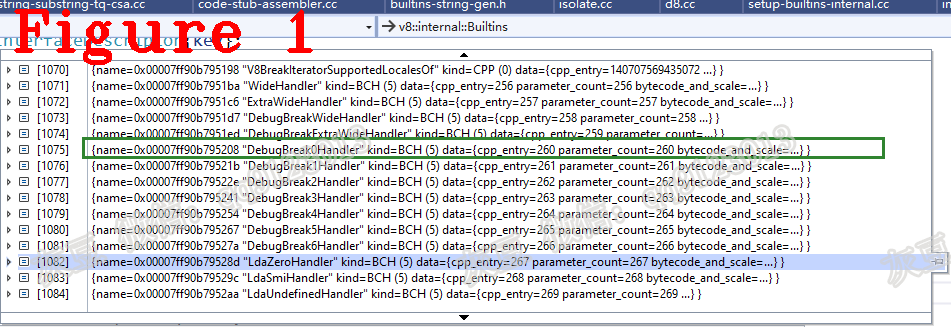
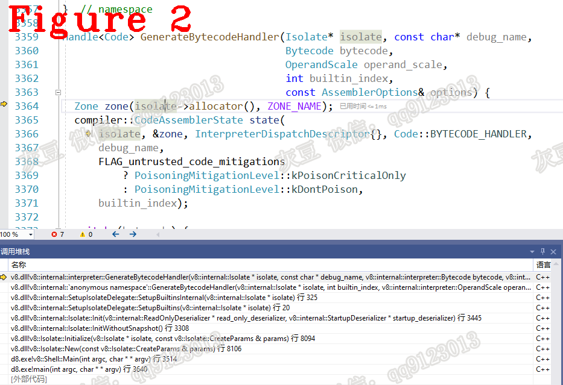

# 《Chrome V8源码》26.Bytecode Handler，字节码的核心
   
# 1 摘要   
本篇文章是Builtin专题的第二篇，讲解Bytecode Handler的初始化过程以及相关数据结构。Bytecode handler是采用CAS方式编写的Builtin，它实现了Bytecode的功能，每一条Bytecode对应一条Bytecode handler。本文内容组织方法：Bytecode handler介绍（章节2）；Bytecode Handler初始化（章节3）。  
# 2 Bytecode Handler介绍  
Bytecode handler的地址保存在Dispatch_table数组中，Dispatch_table保存在Isolate中。每一条Bytecode执行完毕后通过Dispatch_table找到下一条Bytecode并完成跳转。Bytecode handler的源码在interpreter-generator.cc文件中，其中Star和Mov的源码如下：  
```c++
1.  // Store accumulator to register <dst>.
2.  IGNITION_HANDLER(Star, InterpreterAssembler) {
3.    TNode<Object> accumulator = GetAccumulator();
4.    StoreRegisterAtOperandIndex(accumulator, 0);
5.    Dispatch();
6.  }
7.  // Mov <src> <dst>
8.  //
9.  // Stores the value of register <src> to register <dst>.
10.  IGNITION_HANDLER(Mov, InterpreterAssembler) {
11.    TNode<Object> src_value = LoadRegisterAtOperandIndex(0);
12.    StoreRegisterAtOperandIndex(src_value, 1);
13.    Dispatch();
14.  }
```  
上述代码中，`Dispatch()`利用Isolate读取Dispatch_table并跳转到下一条指令。  
# 3 Bytecode Handler初始化   
Bytecode handler是用CodeStubAssembler编写的Builtin。第一个Isolate创建时，Bytecode handler完成初始化并存储在dispatch_table中，后续创建新的Isoalte时无需再做初始化，只需要拷贝即可。  
Bytecode Handler初始化的入口源码如下：
```c++
1.  void SetupIsolateDelegate::SetupBuiltinsInternal(Isolate* isolate) {
2.    Builtins* builtins = isolate->builtins();
3.    int index = 0;
4.    Code code;
5.    //...........省略............................
6.  #define BUILD_BCH(Name, OperandScale, Bytecode)                           \
7.    code = GenerateBytecodeHandler(isolate, index, OperandScale, Bytecode); \
8.    AddBuiltin(builtins, index++, code);
9.   BUILTIN_LIST(BUILD_CPP, BUILD_TFJ, BUILD_TFC, BUILD_TFS, BUILD_TFH, BUILD_BCH,
10.                 BUILD_ASM);
11.    //.........省略............................
12.  }
```  
`BUILD_BCH`、`BUILTIN_LIST`和`GenerateBytecodeHandler()`共同完成所有Bytecode handler的创建，`GenerateBytecodeHandler()`源码如下：  
```c++
Code GenerateBytecodeHandler(Isolate* isolate, int builtin_index,
                             interpreter::OperandScale operand_scale,
                             interpreter::Bytecode bytecode) {
  DCHECK(interpreter::Bytecodes::BytecodeHasHandler(bytecode, operand_scale));
  Handle<Code> code = interpreter::GenerateBytecodeHandler(
      isolate, Builtins::name(builtin_index), bytecode, operand_scale,
      builtin_index, BuiltinAssemblerOptions(isolate, builtin_index));
  return *code;
}
```  
上述代码中`Builtins::name(builtin_index)`获取Bytecode的名字，源码如下： 
```c++
const char* Builtins::name(int index) {
  DCHECK(IsBuiltinId(index));
  return builtin_metadata[index].name;
}
//................分隔线.......................
#define DECL_CPP(Name, ...) \
  {#Name, Builtins::CPP, {FUNCTION_ADDR(Builtin_##Name)}},
#define DECL_TFJ(Name, Count, ...) {#Name, Builtins::TFJ, {Count, 0}},
#define DECL_TFC(Name, ...) {#Name, Builtins::TFC, {}},
#define DECL_TFS(Name, ...) {#Name, Builtins::TFS, {}},
#define DECL_TFH(Name, ...) {#Name, Builtins::TFH, {}},
#define DECL_BCH(Name, OperandScale, Bytecode) \
  {#Name, Builtins::BCH, {Bytecode, OperandScale}},
#define DECL_ASM(Name, ...) {#Name, Builtins::ASM, {}},
const BuiltinMetadata builtin_metadata[] = {BUILTIN_LIST(
    DECL_CPP, DECL_TFJ, DECL_TFC, DECL_TFS, DECL_TFH, DECL_BCH, DECL_ASM)};
```
上述代码中`builtin_metadata`数组保存每一条Bytecode的名字、类型和地址指针。如图1中所示，1075号Builtin的名字是DebugBreak0Handler，类型是BCH（Bytecode handler）,函数地址是data。 
  

在`Code GenerateBytecodeHandler()`中调用`interpreter::GenerateBytecodeHandler()`，源码如下：  
```c++
1.  Handle<Code> GenerateBytecodeHandler(Isolate* isolate, const char* debug_name,
2.                                       Bytecode bytecode,
3.                                       OperandScale operand_scale,
4.                                       int builtin_index,
5.                                       const AssemblerOptions& options) {
6.    Zone zone(isolate->allocator(), ZONE_NAME);
7.    compiler::CodeAssemblerState state(
8.        isolate, &zone, InterpreterDispatchDescriptor{}, Code::BYTECODE_HANDLER,
9.        debug_name,
10.        FLAG_untrusted_code_mitigations
11.            ? PoisoningMitigationLevel::kPoisonCriticalOnly
12.            : PoisoningMitigationLevel::kDontPoison,
13.        builtin_index);
14.    switch (bytecode) {
15.  #define CALL_GENERATOR(Name, ...)                     \
16.    case Bytecode::k##Name:                             \
17.      Name##Assembler::Generate(&state, operand_scale); \
18.      break;
19.      BYTECODE_LIST(CALL_GENERATOR);
20.  #undef CALL_GENERATOR
21.    }
22.    Handle<Code> code = compiler::CodeAssembler::GenerateCode(&state, options);
23.    return code;
24.  }
```  

上述代码中，`Bytecode bytecode`是枚举变量，源码如下：  
```c++
// Enumeration of interpreter bytecodes.
enum class Bytecode : uint8_t {
#define DECLARE_BYTECODE(Name, ...) k##Name,
  BYTECODE_LIST(DECLARE_BYTECODE)
#undef DECLARE_BYTECODE
#define COUNT_BYTECODE(x, ...) +1
  // The COUNT_BYTECODE macro will turn this into kLast = -1 +1 +1... which will
  // evaluate to the same value as the last real bytecode.
  kLast = -1 BYTECODE_LIST(COUNT_BYTECODE)
#undef COUNT_BYTECODE
};
```  
`GenerateBytecodeHandler()`的第14行代码：根据`bytecode`的类型执行对应的`case`以完成Bytecode handler的初始化。`BYTECODE_LIST`源码如下：   
```c++
// The list of bytecodes which are interpreted by the interpreter.
// Format is V(<bytecode>, <accumulator_use>, <operands>).
#define BYTECODE_LIST(V)                                                       \
  /* Extended width operands */                                                \
  V(Wide, AccumulatorUse::kNone)                                               \
  V(ExtraWide, AccumulatorUse::kNone)                                          \
                                                                               \
  /* Debug Breakpoints - one for each possible size of unscaled bytecodes */   \
  /* and one for each operand widening prefix bytecode                    */   \
  V(DebugBreakWide, AccumulatorUse::kReadWrite)                                \
  V(DebugBreakExtraWide, AccumulatorUse::kReadWrite)                           \
  V(DebugBreak0, AccumulatorUse::kReadWrite)                                   \
  V(DebugBreak1, AccumulatorUse::kReadWrite, OperandType::kReg)                \
  V(DebugBreak2, AccumulatorUse::kReadWrite, OperandType::kReg,                \
    OperandType::kReg)                                                         \
  V(DebugBreak3, AccumulatorUse::kReadWrite, OperandType::kReg,                \
    OperandType::kReg, OperandType::kReg)                                      \
    //省略...................................
//.................................分隔线.......................................
switch (bytecode) {
    case Bytecode::kWide:                             \
      WideAssembler::Generate(&state, operand_scale); \
      break;
    case Bytecode::kLdaSmi:                             \
      LdaSmiAssembler::Generate(&state, operand_scale); \
      break;
//省略...................................
}
```  
通过展开`kWide`和`KLdaSmi`可以看到各自的生成函数，图2给出了此时的调用堆栈。  
  
下面讲解`LdaSmi`的初始化，`LdaSmi`的初始化函数由宏`IGNITION_HANDLER`和`IGNITION_HANDLER(LdaSmi, InterpreterAssembler)`共同组成，展开后的源码如下：  
```c++
1.    class LdaSmiAssembler : public InterpreterAssembler { 
2.     public:                                                        
3.      explicit LdaSmiAssembler(compiler::CodeAssemblerState* state,    
4.                               Bytecode bytecode, OperandScale scale)  
5.          : InterpreterAssembler(state, bytecode, scale) {}                 
6.      static void Generate(compiler::CodeAssemblerState* state,        
7.                           OperandScale scale);                        
8.     private:                                                           
9.      void GenerateImpl();                                              
10.      DISALLOW_COPY_AND_ASSIGN(LdaSmiAssembler);                        
11.    };                                                                  
12.    void LdaSmiAssembler::Generate(compiler::CodeAssemblerState* state, 
13.                                   OperandScale scale) {                
14.      LdaSmiAssembler assembler(state, Bytecode::kLdaSmi, scale);       
15.      state->SetInitialDebugInformation("LdaSmi", __FILE__, __LINE__);  
16.      assembler.GenerateImpl();                                        
17.    }                                                                 
18.    void LdaSmiAssembler::GenerateImpl(){
19.    TNode<Smi> smi_int = BytecodeOperandImmSmi(0);
20.    SetAccumulator(smi_int);
21.    Dispatch();
22.  }
```  
上述代码满足`case Bytecode::kLdaSmi`条件，执行第12行代码`Generate()`;在`Generate()`中调用`GenerateImpl()`（第18行代码）;第19行代码生成小整数`smi_int`;第20行代码把`smi_int`存入累加寄存器。第1行代码`InterpreterAssembler`的父类`InterpreterAssembler`实现了很多Bytecode handler的基础功能，源码如下： 
```c++
TNode<Object> InterpreterAssembler::GetAccumulator() {
  DCHECK(Bytecodes::ReadsAccumulator(bytecode_));
  accumulator_use_ = accumulator_use_ | AccumulatorUse::kRead;
  return TaggedPoisonOnSpeculation(GetAccumulatorUnchecked());
}
//分隔线.................................
void InterpreterAssembler::SetAccumulator(SloppyTNode<Object> value) {
  DCHECK(Bytecodes::WritesAccumulator(bytecode_));
  accumulator_use_ = accumulator_use_ | AccumulatorUse::kWrite;
  accumulator_ = value;
}
//分隔线.................................
TNode<ExternalReference> InterpreterAssembler::DispatchTablePointer() {
  if (Bytecodes::MakesCallAlongCriticalPath(bytecode_) && made_call_ &&
      (dispatch_table_.value() ==
       Parameter(InterpreterDispatchDescriptor::kDispatchTable))) {
    dispatch_table_ = ExternalConstant(
        ExternalReference::interpreter_dispatch_table_address(isolate()));
  }
  return dispatch_table_.value();
}
```  
上述代码中`GetAccumulator()`获取累加器的值；`SetAccumulator`设置累加器的值；`DispatchTablePointer()`获取dispatch_table_的地址；这些函数的源码在interpreter-assembler.cc文件中。  
**技术总结**  
**（1）** 调试Bytecode handler的方法是在`Code GenerateBytecodeHandler()`中设置断点;  
**（2）** Bytecode在宏BYTECODE_LIST中的位置是Bytecode的编号index，index是Bytecode handler在dispatch_table_中的下标；  
**（3）** `InterpreterAssembler`中定义了Bytecode handler的底层功能，`CodeAssembler`中定义了更底层的原子操作。  

好了，今天到这里，下次见。   

**个人能力有限，有不足与纰漏，欢迎批评指正**  
**微信：qq9123013  备注：v8交流    邮箱：v8blink@outlook.com**   
   
   
本文由灰豆原创发布
转载出处： https://www.anquanke.com/post/id/260062
安全客 - 有思想的安全新媒体
