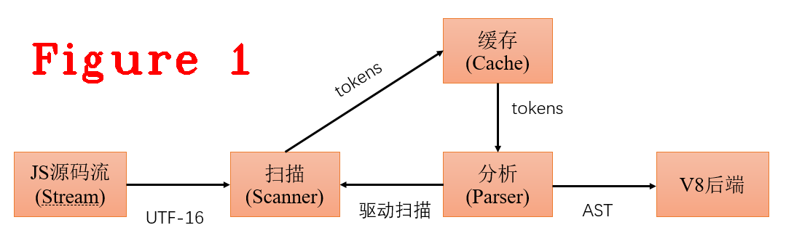
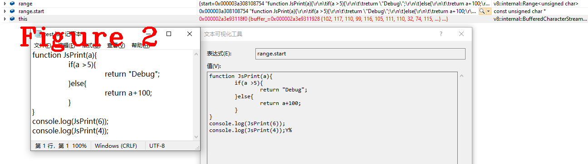
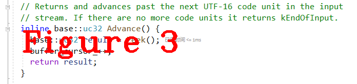
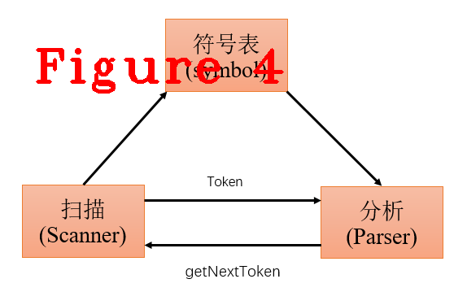
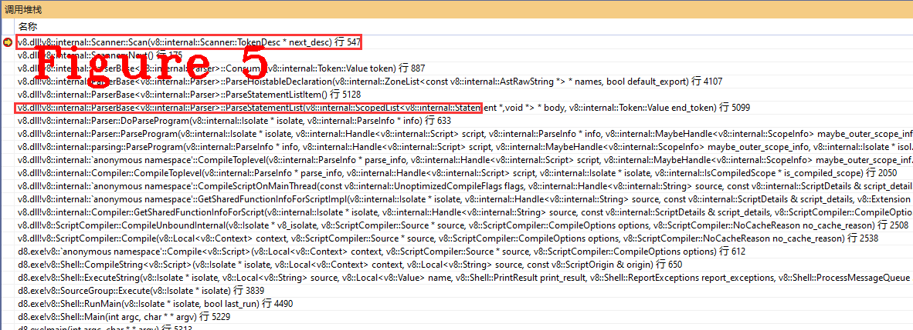

# 连载《Chrome V8 原理讲解》第三篇 看V8编译流程，学习词法分析


  
# 本篇内容
本次是第三篇，讲解V8中词法分析（scanner）的实现，这中间涉及到几个重要的数据结构和一些相关的编译知识，本文也尽量全面讲解相关的编译知识，争取让读者有一个全面的认识。**注：本文不涉及V8的优化编译**
# 1.V8编译流程
总体来说，V8的编译过程是同步实现的，主体流程是扫描在初始化时先生成一个token字，并放入缓存（cache），然后开始分析（parser），从缓存中取一个token做分析，然后生成抽象语法树的一个节点，再取下一个token进行分析，如此循环。如果缓存未命中(cache miss),便启动扫描去生成token，如图1所示。  
  
下面看一下V8中的代码实现，Parser::ParseProgram方法，是图1中扫描器(scanner)的入口点。在这段代码中可以看到scanner_.Initialize()和FunctionLiteral* result = DoParseProgram(isolate, info)，这两个方法的作用是：  
**1.初始化扫描器(scanner)：** 生成第一个token字，scanner.c0_指向第一个开始的字符，也就是要扫描的第一个字符。  
**2.DoParseProgram(isolate, info)：** 读取token字，生成AST的body，最终所有body汇聚成AST语法树。  
```c++
void Parser::ParseProgram(Isolate* isolate, Handle<Script> script,
                          ParseInfo* info,
                          MaybeHandle<ScopeInfo> maybe_outer_scope_info) {
  DCHECK_EQ(script->id(), flags().script_id());

  // It's OK to use the Isolate & counters here, since this function is only
  // called in the main thread.
  DCHECK(parsing_on_main_thread_);
  RCS_SCOPE(runtime_call_stats_, flags().is_eval()
                                     ? RuntimeCallCounterId::kParseEval
                                     : RuntimeCallCounterId::kParseProgram);
  TRACE_EVENT0(TRACE_DISABLED_BY_DEFAULT("v8.compile"), "V8.ParseProgram");
  base::ElapsedTimer timer;
  if (V8_UNLIKELY(FLAG_log_function_events)) timer.Start();

  // Initialize parser state.
  DeserializeScopeChain(isolate, info, maybe_outer_scope_info,
                        Scope::DeserializationMode::kIncludingVariables);

  DCHECK_EQ(script->is_wrapped(), info->is_wrapped_as_function());
  if (script->is_wrapped()) {
    maybe_wrapped_arguments_ = handle(script->wrapped_arguments(), isolate);
  }

  scanner_.Initialize();
  FunctionLiteral* result = DoParseProgram(isolate, info);
  MaybeResetCharacterStream(info, result);
  MaybeProcessSourceRanges(info, result, stack_limit_);
  PostProcessParseResult(isolate, info, result);

  HandleSourceURLComments(isolate, script);

  if (V8_UNLIKELY(FLAG_log_function_events) && result != nullptr) {
    double ms = timer.Elapsed().InMillisecondsF();
    const char* event_name = "parse-eval";
    int start = -1;
    int end = -1;
    if (!flags().is_eval()) {
      event_name = "parse-script";
      start = 0;
      end = String::cast(script->source()).length();
    }
    LOG(isolate,
        FunctionEvent(event_name, flags().script_id(), ms, start, end, "", 0));
  }
}
```
上述这段代码（Parser::ParseProgram）是分析V8中编译代码的最近入口点，从此处进入跟踪，可以看到编译的全流程。这个方法的外层也有很多调用者（caller）,但这些调用者的任务仅仅是做准备工作，这个方法开始进入了真正的编译，尤其要注意，在scanner的初始化阶段（scanner_.Initialize）就已经开始做了第一次扫描。  
# 2.V8词法分析(scanner)工作流程 
编译器的第一个步骤称为词法分析（lexical analysis）或扫描（scanning），在编译原理这门课程中，我的老师用“词法分析”这个名词，当我看编译器源码，面对工程实现时，看到是“扫描”这个名词，这两种叫法一个是注重原理，另一个是注重实现。词法分析器读入源程序的字符流，并且将他们组织成为有意义的词素（lexeme）的序列，再生成相应的词法单元(token)。  
在V8中，源程序的字符流是UTF-16编码，存储字符流的数据结构如下：  
```c++
// ---------------------------------------------------------------------
// Buffered stream of UTF-16 code units, using an internal UTF-16 buffer.
// A code unit is a 16 bit value representing either a 16 bit code point
// or one part of a surrogate pair that make a single 21 bit code point.
class Utf16CharacterStream {
 public:
  static constexpr base::uc32 kEndOfInput = static_cast<base::uc32>(-1);

  virtual ~Utf16CharacterStream() = default;

  V8_INLINE void set_parser_error() {
    buffer_cursor_ = buffer_end_;
    has_parser_error_ = true;
  }
  V8_INLINE void reset_parser_error_flag() { has_parser_error_ = false; }
  V8_INLINE bool has_parser_error() const { return has_parser_error_; }

  inline base::uc32 Peek() {
    if (V8_LIKELY(buffer_cursor_ < buffer_end_)) {
      return static_cast<base::uc32>(*buffer_cursor_);
    } else if (ReadBlockChecked()) {
      return static_cast<base::uc32>(*buffer_cursor_);
    } else {
      return kEndOfInput;
    }
  }

  // Returns and advances past the next UTF-16 code unit in the input
  // stream. If there are no more code units it returns kEndOfInput.
  inline base::uc32 Advance() {
    base::uc32 result = Peek();
    buffer_cursor_++;
    return result;
  }

//...............
//中间省略很多代码.....
//..............


  // Read more data, and update buffer_*_ to point to it.
  // Returns true if more data was available.
  //
  // ReadBlock() may modify any of the buffer_*_ members, but must sure that
  // the result of pos() remains unaffected.
  //
  // Examples:
  // - a stream could either fill a separate buffer. Then buffer_start_ and
  //   buffer_cursor_ would point to the beginning of the buffer, and
  //   buffer_pos would be the old pos().
  // - a stream with existing buffer chunks would set buffer_start_ and
  //   buffer_end_ to cover the full chunk, and then buffer_cursor_ would
  //   point into the middle of the buffer, while buffer_pos_ would describe
  //   the start of the buffer.
  virtual bool ReadBlock() = 0;

  const uint16_t* buffer_start_;
  const uint16_t* buffer_cursor_;
  const uint16_t* buffer_end_;
  size_t buffer_pos_;
  RuntimeCallStats* runtime_call_stats_;
  bool has_parser_error_ = false;
};
```
上述代码中，省略了很多中间代码，我保留最开始的英文注释和最后几个重要成员的英文注释，这几个重要的成员分别是buffer_start_，buffer_cursor_，buffer_end_，它们的作用是用来记录源码流，详细见代码中的注释。下面通过一个示例来看下class Utf16CharacterStream的应用场景。  
  
图2中左侧是js源代码，右侧是源码被读进内存，准备编译，通过下面的代码移交给buffer_start_进行管理。  
```c++
  bool ReadBlock() final {
    size_t position = pos();
    buffer_pos_ = position;
    buffer_start_ = &buffer_[0];
    buffer_cursor_ = buffer_start_;

    DisallowGarbageCollection no_gc;
    Range<uint8_t> range =
        byte_stream_.GetDataAt(position, runtime_call_stats(), &no_gc);
    if (range.length() == 0) {
      buffer_end_ = buffer_start_;
      return false;
    }

    size_t length = std::min({kBufferSize, range.length()});
    i::CopyChars(buffer_, range.start, length);
    buffer_end_ = &buffer_[length];
    return true;
  }
```
代码的buffer_start_ = &buffer_[0]，这一句是用buffer_start_指向待编译源码的第一个字符。图3给出的是Utf16CharacterStream类中重要的函数。这个函数是读取一个块代码(code unit)，是后续生成token时的输入字符串。  
  
前面提到的scanner.c0_这个成员，始终是指向即将开始token生成的字符串，下面的代码也说明了c0_的作用。
```C++
  void Advance() {
    if (capture_raw) {
      AddRawLiteralChar(c0_);
    }
    c0_ = source_->Advance();//看这里
  }
```
在scanner初始化的最后一步调用了下面这个方法，生成一个token。  
```C++
void Scanner::Scan(TokenDesc* next_desc) {
  DCHECK_EQ(next_desc, &next());

  next_desc->token = ScanSingleToken();
  DCHECK_IMPLIES(has_parser_error(), next_desc->token == Token::ILLEGAL);
  next_desc->location.end_pos = source_pos();

#ifdef DEBUG
  SanityCheckTokenDesc(current());
  SanityCheckTokenDesc(next());
  SanityCheckTokenDesc(next_next());
#endif
}
```  
我们可以看到next_desc->token = ScanSingleToken()这句代码就是在生成一个token，可以看到next_desc是描述token字的关键结构，他是在Scanner中定义的一个结构体，代码如下：  
```c++
  struct TokenDesc {
    Location location = {0, 0};
    LiteralBuffer literal_chars;
    LiteralBuffer raw_literal_chars;
    Token::Value token = Token::UNINITIALIZED;
    MessageTemplate invalid_template_escape_message = MessageTemplate::kNone;
    Location invalid_template_escape_location;
    uint32_t smi_value_ = 0;
    bool after_line_terminator = false;

#ifdef DEBUG
    bool CanAccessLiteral() const {
      return token == Token::PRIVATE_NAME || token == Token::ILLEGAL ||
             token == Token::ESCAPED_KEYWORD || token == Token::UNINITIALIZED ||
             token == Token::REGEXP_LITERAL ||
             base::IsInRange(token, Token::NUMBER, Token::STRING) ||
             Token::IsAnyIdentifier(token) || Token::IsKeyword(token) ||
             base::IsInRange(token, Token::TEMPLATE_SPAN, Token::TEMPLATE_TAIL);
    }
    bool CanAccessRawLiteral() const {
      return token == Token::ILLEGAL || token == Token::UNINITIALIZED ||
             base::IsInRange(token, Token::TEMPLATE_SPAN, Token::TEMPLATE_TAIL);
    }
#endif  // DEBUG
  };
```
到此，词法分析的初始化完了，后面由Parse驱动它进行工作，词法分析工作的入口点如下。  
```C++
void Scanner::Scan(TokenDesc* next_desc) {
  DCHECK_EQ(next_desc, &next());

  next_desc->token = ScanSingleToken();
  DCHECK_IMPLIES(has_parser_error(), next_desc->token == Token::ILLEGAL);
  next_desc->location.end_pos = source_pos();

#ifdef DEBUG
  SanityCheckTokenDesc(current());
  SanityCheckTokenDesc(next());
  SanityCheckTokenDesc(next_next());
#endif
}
```
# 3.V8词法分析的知识点
编译技术是一个庞大的知识领域，涉及很多方面的理论知识，一个编译器的具体实现主要包括：词法分析、语义分析、中间代码、机器无关代码，机器码等多个阶段，此外，还有各种优化技术，例如：控制流优化、数据流优化、寄存器优化等等，这些优化技术与这些阶段交错执行，最终生成目标程序。从编译技术的角度看，V8的编译的每段代码都有相对应的理论支撑，看懂了这些理论，再来看V8编译源码，会很容易的。我们来看一下V8词法分析的知识点。
词法分析是编译的第一个阶段。词法分析器的主要任务是读入源程序的输入字符、将它他们组成词素（lexeme），生成并输出一个词法单元（token），每个词法单元对应一个词素，这个词法单元被输出到语法分析器进行语法分析。当词法分析器发现一个标识符时，还会利用符号表进行保存。词法分析的工作流程、与符号表的交互过程都是由语法分析器驱动，如图4。  
  
图4中，getNextToken是驱动词法分析器工作,向其索取token的命令,直到它识别出下一个词素为止，然后将生成的token返回给语法分析器。看一下V8的这个过程的实现方法。  
```C++
void ParserBase<Impl>::ParseStatementList(StatementListT* body,
                                          Token::Value end_token) {
  // StatementList ::
  //   (StatementListItem)* <end_token>
  DCHECK_NOT_NULL(body);

  while (peek() == Token::STRING) {
    bool use_strict = false;
#if V8_ENABLE_WEBASSEMBLY
    bool use_asm = false;
#endif  // V8_ENABLE_WEBASSEMBLY

    Scanner::Location token_loc = scanner()->peek_location();

    if (scanner()->NextLiteralExactlyEquals("use strict")) {
      use_strict = true;
#if V8_ENABLE_WEBASSEMBLY
    } else if (scanner()->NextLiteralExactlyEquals("use asm")) {
      use_asm = true;
#endif  // V8_ENABLE_WEBASSEMBLY
    }

    StatementT stat = ParseStatementListItem();
//.......................
//省略很多....
//.......................
  }

  while (peek() != end_token) {
    StatementT stat = ParseStatementListItem();
    if (impl()->IsNull(stat)) return;
    if (stat->IsEmptyStatement()) continue;
    body->Add(stat);
  }
}
```
这段代码很长，而且我们在调式过程中，由于选取的调试用例不同，不一定能覆盖到每一条语句。我们只看最后的一部分,我的调试代码触发了最后这个while()的执行，其中最重要是 ParseStatementListItem()，图5给出了Parse驱动SCanner的调用堆栈，堆栈中的函数调用流程，也就是图4中的getNextToken的具体实现。  
  
在图5中还能看到前面(图1)提到的缓存(cache)，它在v8中的实现是Consum方法。下面给出V8中Token生成的详细实现。
```c++
V8_INLINE Token::Value Scanner::ScanSingleToken() {
  Token::Value token;
  do {
    next().location.beg_pos = source_pos();

    if (V8_LIKELY(static_cast<unsigned>(c0_) <= kMaxAscii)) {
      token = one_char_tokens[c0_];

      switch (token) {
//..............
//代码太长，省略很多
//..............

        case Token::CONDITIONAL:
          // ? ?. ?? ??=
          Advance();
          if (c0_ == '.') {
            Advance();
            if (!IsDecimalDigit(c0_)) return Token::QUESTION_PERIOD;
            PushBack('.');
          } else if (c0_ == '?') {
            return Select('=', Token::ASSIGN_NULLISH, Token::NULLISH);
          }
          return Token::CONDITIONAL;

        case Token::STRING:
          return ScanString();

        case Token::LT:
          // < <= << <<= <!--
          Advance();
          if (c0_ == '=') return Select(Token::LTE);
          if (c0_ == '<') return Select('=', Token::ASSIGN_SHL, Token::SHL);
          if (c0_ == '!') {
            token = ScanHtmlComment();
            continue;
          }
          return Token::LT;
        case Token::ASSIGN:
          // = == === =>
          Advance();
          if (c0_ == '=') return Select('=', Token::EQ_STRICT, Token::EQ);
          if (c0_ == '>') return Select(Token::ARROW);
          return Token::ASSIGN;

        case Token::NOT:
          // ! != !==
          Advance();
          if (c0_ == '=') return Select('=', Token::NE_STRICT, Token::NE);
          return Token::NOT;

        case Token::ADD:
          // + ++ +=
          Advance();
          if (c0_ == '+') return Select(Token::INC);
          if (c0_ == '=') return Select(Token::ASSIGN_ADD);
          return Token::ADD;
//..............
//代码太长，省略很多
//..............

        default:
          UNREACHABLE();
      }
    }

    if (IsIdentifierStart(c0_) ||
        (CombineSurrogatePair() && IsIdentifierStart(c0_))) {
      return ScanIdentifierOrKeyword();
    }
    if (c0_ == kEndOfInput) {
      return source_->has_parser_error() ? Token::ILLEGAL : Token::EOS;
    }
    token = SkipWhiteSpace();

    // Continue scanning for tokens as long as we're just skipping whitespace.
  } while (token == Token::WHITESPACE);

  return token;
}
```
从代码中可以看出，生成token的过程就是这个switch case，它是一个自动机，token生成的过程也大量用到了正则表达。总结一句：token的生成过程就是字符匹配的过程，在V8中预先定义了token模板（TOKEN_LIST），再利用switch case完成字符匹配，生成token。
好了，今天到这里，下次见。  
**微信：qq9123013  备注：v8交流学习    邮箱：v8blink@outlook.com**