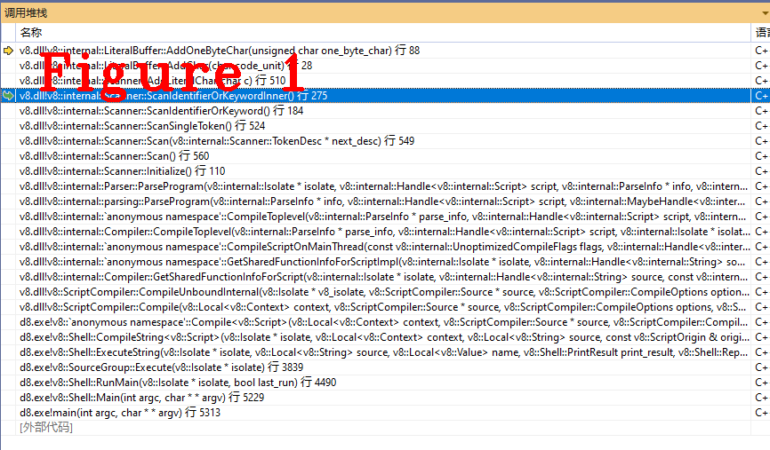
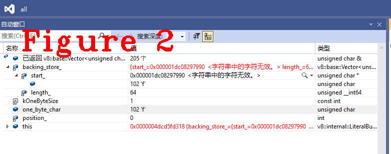
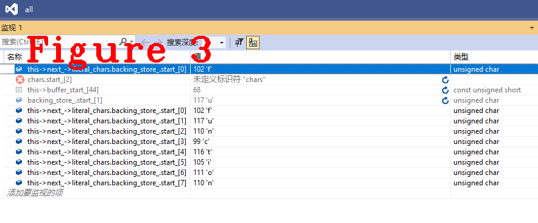
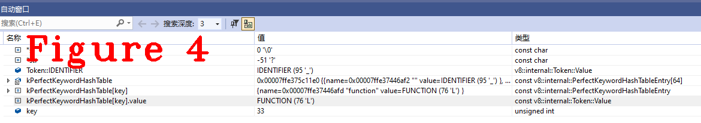
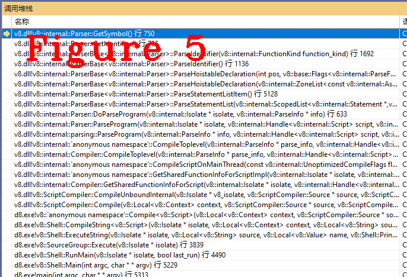

# 连载《Chrome V8 原理讲解》第四篇 V8词法分析源码讲解，Token字生成

  
# 本篇内容
本次是第四篇，以“测试样例代码”为V8的输入，跟随样例代码在词法分析(scanner)阶段的处理过程,剖析V8词法分析的源码实现。本文通过讲解样例代码中前两个token字（`function`、`JsPrint`）的生成过程，将V8词法分析的核心源码、主要工作流程以及重要数据结构呈现给大家。

# 测试样例代码
**注意：** 测试代码语法简单，因此不会覆盖词法分析的全部流程。token字的生成过程是自动机，由`switch case`实现，“不能全覆盖”是指测试代码不会触发所有的case条件，但这不会影响我们的学习，原理详见上一篇文章。
```Javascript
function JsPrint(a){
	if(a >5){
		return "Debug";
	}
}
console.log(JsPrint(6));
```
# 词法分析概述
谈及词法分析时，有三个重要的术语需要知道，词法单元（token）、模式描述（pattern）、词素（lexeme）。词法分析的工作流程是先找到一个词法单元，再找这个词法单元的所有的可选属性--模式描述和词素的组合，循环往复去找下一个词法单元，详细说明见上一篇文章。
# 1.扫描词法单元`function`和`JsPrint`
V8_INLINE Token::Value Scanner::ScanSingleToken()，这个方法是扫描token字的入口。`c0_`在初始化阶段已经指向了源代码的第一个字符(初始化流程，见上篇文章)，在本文的样例代码中，它代表“f”。
```c++
V8_INLINE Token::Value Scanner::ScanSingleToken() {
  Token::Value token;
  do {
    next().location.beg_pos = source_pos();

    if (V8_LIKELY(static_cast<unsigned>(c0_) <= kMaxAscii)) {
      token = one_char_tokens[c0_];

      switch (token) {
        case Token::LPAREN:
        case Token::RPAREN:
        case Token::LBRACE:
        case Token::RBRACE:
        case Token::LBRACK:
        case Token::RBRACK:
        case Token::COLON:
        case Token::SEMICOLON:
        case Token::COMMA:
        case Token::BIT_NOT:
        case Token::ILLEGAL:
          // One character tokens.
          return Select(token);

        case Token::CONDITIONAL:
          // ? ?. ?? ??=
          Advance();
          if (c0_ == '.') {
            Advance();
            if (!IsDecimalDigit(c0_)) return Token::QUESTION_PERIOD;
            PushBack('.');
          } else if (c0_ == '?') {
            return Select('=', Token::ASSIGN_NULLISH, Token::NULLISH);
          }
          return Token::CONDITIONAL;

        case Token::STRING:
          return ScanString();

        case Token::LT:
          // < <= << <<= <!--
          Advance();
          if (c0_ == '=') return Select(Token::LTE);
          if (c0_ == '<') return Select('=', Token::ASSIGN_SHL, Token::SHL);
          if (c0_ == '!') {
            token = ScanHtmlComment();
            continue;
          }
          return Token::LT;

        case Token::GT:
          // > >= >> >>= >>> >>>=
          Advance();
          if (c0_ == '=') return Select(Token::GTE);
          if (c0_ == '>') {
            // >> >>= >>> >>>=
            Advance();
            if (c0_ == '=') return Select(Token::ASSIGN_SAR);
            if (c0_ == '>') return Select('=', Token::ASSIGN_SHR, Token::SHR);
            return Token::SAR;
          }
          return Token::GT;

        case Token::ASSIGN:
          // = == === =>
          Advance();
          if (c0_ == '=') return Select('=', Token::EQ_STRICT, Token::EQ);
          if (c0_ == '>') return Select(Token::ARROW);
          return Token::ASSIGN;

        case Token::NOT:
          // ! != !==
          Advance();
          if (c0_ == '=') return Select('=', Token::NE_STRICT, Token::NE);
          return Token::NOT;
//........................
//代码太多，省略....................
//........................
        case Token::PERIOD:
          // . Number
          Advance();
          if (IsDecimalDigit(c0_)) return ScanNumber(true);
          if (c0_ == '.') {
            if (Peek() == '.') {
              Advance();
              Advance();
              return Token::ELLIPSIS;
            }
          }
          return Token::PERIOD;

        case Token::TEMPLATE_SPAN:
          Advance();
          return ScanTemplateSpan();

        case Token::PRIVATE_NAME:
          if (source_pos() == 0 && Peek() == '!') {
            token = SkipSingleLineComment();
            continue;
          }
          return ScanPrivateName();

        case Token::WHITESPACE:
          token = SkipWhiteSpace();
          continue;

        case Token::NUMBER:
          return ScanNumber(false);

        case Token::IDENTIFIER:
          return ScanIdentifierOrKeyword();

        default:
          UNREACHABLE();
      }
    }

    if (IsIdentifierStart(c0_) ||
        (CombineSurrogatePair() && IsIdentifierStart(c0_))) {
      return ScanIdentifierOrKeyword();
    }
    if (c0_ == kEndOfInput) {
      return source_->has_parser_error() ? Token::ILLEGAL : Token::EOS;
    }
    token = SkipWhiteSpace();

    // Continue scanning for tokens as long as we're just skipping whitespace.
  } while (token == Token::WHITESPACE);

  return token;
}
```
上面是`ScanSingleToken()`的源码，内容太多，仅保留了测试样例用到的代码，下面对代码中关键语句进行说明。  
**(1)：**`if(V8_LIKELY(static_cast<unsigned>(c0_) <= kMaxAscii))`判断`c0_`是不是Ascii，结果是为真(它是`f`)。  
**(2)：**`token = one_char_tokens[c0_];`这是取获取`c0_`的类型，上篇文章提到的“预定义模板”，说的就是`one_char_tokens`这样的数组，还有其它的宏定义(碰到时再讲)。下面看这个数组的定义：
```C++
constexpr Token::Value GetOneCharToken(char c) {
  // clang-format off
  return
      c == '(' ? Token::LPAREN :
      c == ')' ? Token::RPAREN :
  //.....................
  //代码太多，省略
  //.....................
      // IsDecimalDigit must be tested before IsAsciiIdentifier
      IsDecimalDigit(c) ? Token::NUMBER :
      IsAsciiIdentifier(c) ? Token::IDENTIFIER :
      Token::ILLEGAL;
  // clang-format on
}
//====分割线========================================================
#define INT_0_TO_127_LIST(V)                                          \
V(0)   V(1)   V(2)   V(3)   V(4)   V(5)   V(6)   V(7)   V(8)   V(9)   \
V(10)  V(11)  V(12)  V(13)  V(14)  V(15)  V(16)  V(17)  V(18)  V(19)  \
V(20)  V(21)  V(22)  V(23)  V(24)  V(25)  V(26)  V(27)  V(28)  V(29)  \
V(30)  V(31)  V(32)  V(33)  V(34)  V(35)  V(36)  V(37)  V(38)  V(39)  \
V(40)  V(41)  V(42)  V(43)  V(44)  V(45)  V(46)  V(47)  V(48)  V(49)  \
V(50)  V(51)  V(52)  V(53)  V(54)  V(55)  V(56)  V(57)  V(58)  V(59)  \
V(60)  V(61)  V(62)  V(63)  V(64)  V(65)  V(66)  V(67)  V(68)  V(69)  \
V(70)  V(71)  V(72)  V(73)  V(74)  V(75)  V(76)  V(77)  V(78)  V(79)  \
V(80)  V(81)  V(82)  V(83)  V(84)  V(85)  V(86)  V(87)  V(88)  V(89)  \
V(90)  V(91)  V(92)  V(93)  V(94)  V(95)  V(96)  V(97)  V(98)  V(99)  \
V(100) V(101) V(102) V(103) V(104) V(105) V(106) V(107) V(108) V(109) \
V(110) V(111) V(112) V(113) V(114) V(115) V(116) V(117) V(118) V(119) \
V(120) V(121) V(122) V(123) V(124) V(125) V(126) V(127)

//====分割线========================================================
static const constexpr Token::Value one_char_tokens[128] = {
#define CALL_GET_SCAN_FLAGS(N) GetOneCharToken(N),
    INT_0_TO_127_LIST(CALL_GET_SCAN_FLAGS)
#undef CALL_GET_SCAN_FLAGS
};
```
上面的代码，用“分割线”分成了三部分，这三部分实现了`one_char_tokens`数组的定义，`c0_`的值是`f`，它符合`IsAsciiIdentifier(c)`,所以它的类型是`Token::IDENTIFIER`。`IsAsciiIdentifier(c)`的源码如下：
```c++
inline constexpr bool IsAsciiIdentifier(base::uc32 c) {
  return IsAlphaNumeric(c) || c == '$' || c == '_';
}
```  
**(3):** 回到`ScanSingleToken()`方法。`c0_`的类型为`Token::IDENTIFIER`，所以进入`ScanIdentifierOrKeyword()`,在这个方法中调用了其它的几个方法，它们的作用是包装类之关的关系，图1给出了这些方法的函数调用堆栈，请读者自行调试跟踪，这里不详细说明。  

在V8源码中找到相应的位置，下断点，使用样例代码即可还原图1的堆栈。  
**(4):**`c0_`内容是`f`，下面要继续去找`f`后面的字符，需要存储`f`，`c0_`指向下一个字符，下面是存储方法的代码。  
```c++
 V8_INLINE void AddOneByteChar(byte one_byte_char) {//c0_是实参
    DCHECK(is_one_byte());
    if (position_ >= backing_store_.length()) ExpandBuffer();
    backing_store_[position_] = one_byte_char;
    position_ += kOneByteSize;
  }
```
可以看到，`one_byte_char`就是`c0_`，存储到`backing_store_`中，图2给出了调式模式下`backing_store_`的值。  
  
图2中可以看到`one_byte_char`和`backing_store_`都是`f`。下面开始下一个字符的分析流程。
```C++
AdvanceUntil([this, &scan_flags](base::uc32 c0) {
  if (V8_UNLIKELY(static_cast<uint32_t>(c0) > kMaxAscii)) {
    // A non-ascii character means we need to drop through to the slow
    // path.
    // TODO(leszeks): This would be most efficient as a goto to the slow
    // path, check codegen and maybe use a bool instead.
    scan_flags |=
        static_cast<uint8_t>(ScanFlags::kIdentifierNeedsSlowPath);
    return true;
  }
  uint8_t char_flags = character_scan_flags[c0];
  scan_flags |= char_flags;
  if (TerminatesLiteral(char_flags)) {
    return true;
  } else {
    AddLiteralChar(static_cast<char>(c0));
    return false;
  }
});
```
上面这个`AdvanceUntil`方法会读取每个字符，至到它遇到一个终结符，图3给出了完成token字`function`分析后的存储信息。  
  
图3中，最后的八个值正好是样例代码的第一个字符串`function`，现在已经得到了一个完整的token字，接下来要判断这个token是关键字或标识符，代码如下。  
```c++
V8_INLINE Token::Value KeywordOrIdentifierToken(const uint8_t* input,
                                                int input_length) {
  DCHECK_GE(input_length, 1);
  return PerfectKeywordHash::GetToken(reinterpret_cast<const char*>(input),
                                      input_length);
}
//==============分割线，这是两段代码===============
inline Token::Value PerfectKeywordHash::GetToken(const char* str, int len) {
  if (base::IsInRange(len, MIN_WORD_LENGTH, MAX_WORD_LENGTH)) {
    unsigned int key = Hash(str, len) & 0x3f;

    DCHECK_LT(key, arraysize(kPerfectKeywordLengthTable));
    DCHECK_LT(key, arraysize(kPerfectKeywordHashTable));
    if (len == kPerfectKeywordLengthTable[key]) {
      const char* s = kPerfectKeywordHashTable[key].name;

      while (*s != 0) {
        if (*s++ != *str++) return Token::IDENTIFIER;
      }
      return kPerfectKeywordHashTable[key].value;
    }
  }
  return Token::IDENTIFIER;
}
```
上面给出了两段代码，`GetToken`是判断关键字或标识的具体方法，其原理是预先定义hash表，通过查表确定token的类型，图4给出了这方法执行期间的成员信息。  
  
在图4中可以看到，`kPerfectKeywordHashTable[key].value	FUNCTION (76 'L')	const v8::internal::Token::Value`，与ECMA规范要求完全一致。  

至此，token字`function`生成完毕，它的类型是`Token::FUNCTION`。token字`JsPrint`的生成过程与之类似，不再赘述，它的类型是`Token::IDENTIFIER`。
# 2.`function`和`JsPrint`之间的关系
在测试样例代码中，`function`定义函数，`JsPrint`是函数名，这是他们之间的关系。我们在词法分析器中可以看到如下代码：  

```C++
ParserBase<Impl>::ParseHoistableDeclaration(
    int pos, ParseFunctionFlags flags, ZonePtrList<const AstRawString>* names,
    bool default_export) {
  CheckStackOverflow();

  DCHECK_IMPLIES((flags & ParseFunctionFlag::kIsAsync) != 0,
                 (flags & ParseFunctionFlag::kIsGenerator) == 0);

  if ((flags & ParseFunctionFlag::kIsAsync) != 0 && Check(Token::MUL)) {
    // Async generator
    flags |= ParseFunctionFlag::kIsGenerator;
  }

  IdentifierT name;
  FunctionNameValidity name_validity;
  IdentifierT variable_name;
  if (peek() == Token::LPAREN) {
    if (default_export) {
      impl()->GetDefaultStrings(&name, &variable_name);
      name_validity = kSkipFunctionNameCheck;
    } else {
      ReportMessage(MessageTemplate::kMissingFunctionName);
      return impl()->NullStatement();
    }
  } else {
    bool is_strict_reserved = Token::IsStrictReservedWord(peek());
    name = ParseIdentifier();
    name_validity = is_strict_reserved ? kFunctionNameIsStrictReserved
                                       : kFunctionNameValidityUnknown;
    variable_name = name;
  }

  FuncNameInferrerState fni_state(&fni_);
  impl()->PushEnclosingName(name);

  FunctionKind function_kind = FunctionKindFor(flags);

  FunctionLiteralT function = impl()->ParseFunctionLiteral(
      name, scanner()->location(), name_validity, function_kind, pos,
      FunctionSyntaxKind::kDeclaration, language_mode(), nullptr);
  //省略很多.......
  //.........
```
上面的代码是对这两个token进行语法分析(parser)，我们明确一点，词法分析(scanner)只负责识别token，它们之间的关系是由语法分析负责识别。
```C++
typename ParserBase<Impl>::IdentifierT ParserBase<Impl>::ParseIdentifier(
    FunctionKind function_kind) {
  Token::Value next = Next();

  if (!Token::IsValidIdentifier(
          next, language_mode(), IsGeneratorFunction(function_kind),
          flags().is_module() ||
              IsAwaitAsIdentifierDisallowed(function_kind))) {
    ReportUnexpectedToken(next);
    return impl()->EmptyIdentifierString();
  }

  return impl()->GetIdentifier();
}
```
在ParserBase<Impl>::ParseHoistableDeclaration()中，会调用上面的这个方法，在目前，`ParseIdentifier`方法是对`function`和`JsPrint`的分析，它又会引导我们进入下面的符号表(symbol)方法。  
```c++
  V8_INLINE const AstRawString* GetSymbol() const {
    const AstRawString* result = scanner()->CurrentSymbol(ast_value_factory());
    DCHECK_NOT_NULL(result);
    return result;
  }
```
在符号表中，程序源代码中的每个标识符都和它的声明或使用信息绑定在一起，`JsPrint`是用`function`定义的一个函数名，所以它两要在符号表中绑定。图5给出了进入符号表时的调用堆栈。  
  

正是因为有符号表的存在，我们在调试程序时才能够看到源代码，它是编译阶段生成的数据结构，准确地说符号表在词法分析阶段生成，在语法分析阶段完善和补充。  
好了，今天到这里，下次见。  
**微信：qq9123013  备注：v8交流学习    邮箱：v8blink@outlook.com**