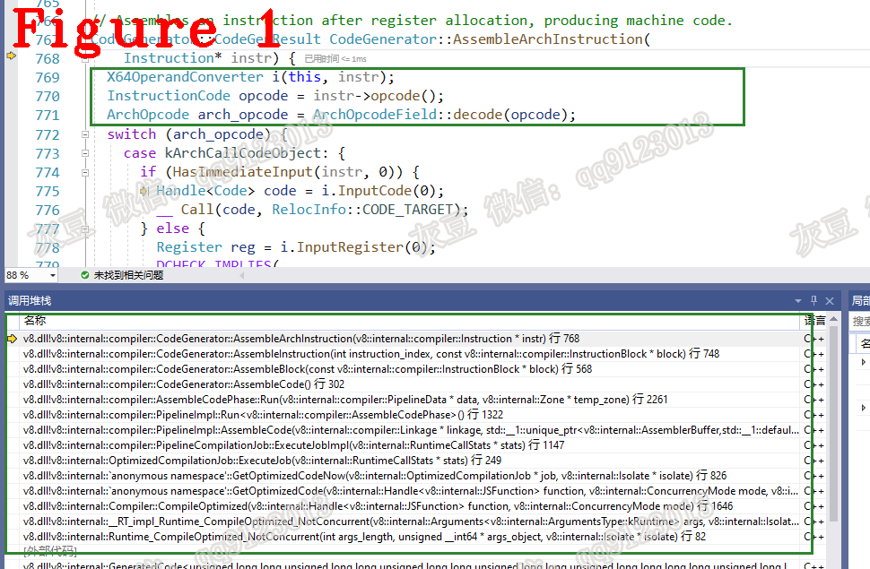

# 《Chrome V8 源码》43. Turbofan 源码分析  
   
# 1 介绍  
接上一篇文章继续说，本文讲解 Turbofan 的工作流程、梳理 PrepareJob、ExecuteJob 和 FinalizeJob 的主要功能以及重要数据结构。  
# 2 Turbofan 工作流程  
前文提到，Turbofan 分为 NotConcurrent 和 Concurrent 两种工作方式，它们的区别是 NotConcurrent 立即启动优化工作，而 Concurrent 把工作放进同步分发队列。  
Concurrent 方式由 GetOptimizedCodeLater() 函数负责，其源码如下：   
```c++
1.  bool GetOptimizedCodeLater(OptimizedCompilationJob* job, Isolate* isolate) {
2.    OptimizedCompilationInfo* compilation_info = job->compilation_info();
3.    if (!isolate->optimizing_compile_dispatcher()->IsQueueAvailable()) {
4.      if (FLAG_trace_concurrent_recompilation) {
5.  //省略................
6.      }
7.      return false;
8.    }
9.    if (isolate->heap()->HighMemoryPressure()) {
10.      if (FLAG_trace_concurrent_recompilation) {
11.  //省略................
12.      }
13.      return false;
14.    }
15.    TimerEventScope<TimerEventRecompileSynchronous> timer(isolate);
16.    RuntimeCallTimerScope runtimeTimer(
17.        isolate, RuntimeCallCounterId::kOptimizeConcurrentPrepare);
18.    TRACE_EVENT0(TRACE_DISABLED_BY_DEFAULT("v8.compile"),
19.                 "V8.OptimizeConcurrentPrepare");
20.    if (job->PrepareJob(isolate) != CompilationJob::SUCCEEDED) return false;
21.    isolate->optimizing_compile_dispatcher()->QueueForOptimization(job);
22.    if (FLAG_trace_concurrent_recompilation) {
23.      PrintF("  ** Queued ");
24.      compilation_info->closure()->ShortPrint();
25.      PrintF(" for concurrent optimization.\n");
26.    }
27.    return true;
28.  }
```   
上述代码中，第 4-14 行检测工作队列和内存是否满足要求，不满足则停止优化编译。停止优化编译不影响当前 JavaScript 程序的运行，因为 JavaScript 程序正在被解释执行。
第 15-20 行统计 V8 运行信息，与优化编译的功能无关；  
第 21 行把优化编译工作 job 添加到工作队列中，并返回结果 true。  
NotConcurrent 方式由 GetOptimizedCodeNow() 函数负责，其源码如下：  
```c++
1.  bool GetOptimizedCodeNow(OptimizedCompilationJob* job, Isolate* isolate) {
2.    TimerEventScope<TimerEventRecompileSynchronous> timer(isolate);
3.    RuntimeCallTimerScope runtimeTimer(
4.        isolate, RuntimeCallCounterId::kOptimizeNonConcurrent);
5.    OptimizedCompilationInfo* compilation_info = job->compilation_info();
6.    TRACE_EVENT0(TRACE_DISABLED_BY_DEFAULT("v8.compile"),
7.                 "V8.OptimizeNonConcurrent");
8.    if (job->PrepareJob(isolate) != CompilationJob::SUCCEEDED ||
9.        job->ExecuteJob(isolate->counters()->runtime_call_stats()) !=
10.            CompilationJob::SUCCEEDED ||
11.        job->FinalizeJob(isolate) != CompilationJob::SUCCEEDED) {
12.      if (FLAG_trace_opt) {
13.        CodeTracer::Scope scope(isolate->GetCodeTracer());
14.        PrintF(scope.file(), "[aborted optimizing ");
15.        compilation_info->closure()->ShortPrint(scope.file());
16.        PrintF(scope.file(), " because: %s]\n",
17.               GetBailoutReason(compilation_info->bailout_reason()));
18.      }
19.      return false;
20.    }
21.    // Success!
22.    job->RecordCompilationStats(OptimizedCompilationJob::kSynchronous, isolate);
23.    DCHECK(!isolate->has_pending_exception());
24.    InsertCodeIntoOptimizedCodeCache(compilation_info);
25.    job->RecordFunctionCompilation(CodeEventListener::LAZY_COMPILE_TAG, isolate);
26.    return true;
27.  }
```  
上述代码中， 第 2-7 行统计 V8 运行信息，与优化编译的功能无关；  
第 8-9 行完成优化编译的所有工作，这些工作由 PrepareJob、ExecuteJob 以及 FinalizeJob 三个函数负责；  
第 10-25 行更新编译状态等信息并返回 true。 优化编译同步进行，也就意味着暂停解释执行并等待优化编译的结果。  
# 3 准备 PrepareJob  
源码如下：  
```c++
1.  CompilationJob::Status OptimizedCompilationJob::PrepareJob(Isolate* isolate) {
2.    DCHECK_EQ(ThreadId::Current(), isolate->thread_id());
3.    DisallowJavascriptExecution no_js(isolate);
4.    if (FLAG_trace_opt && compilation_info()->IsOptimizing()) {
5.  //省略..............
6.    }
7.    // Delegate to the underlying implementation.
8.    DCHECK_EQ(state(), State::kReadyToPrepare);
9.    ScopedTimer t(&time_taken_to_prepare_);
10.    return UpdateState(PrepareJobImpl(isolate), State::kReadyToExecute);
11.  }
```  
上述代码中，第 2-3 行做状态检测、第 4-6 行设置打印出输信息；第 10 行 UpdateState 更新状态信息，PrepareJobImpl 完成初始化工作，其源码如下：  
```c++
1.  PipelineCompilationJob::Status PipelineCompilationJob::PrepareJobImpl(
2.      Isolate* isolate) {
3.    PipelineJobScope scope(&data_, isolate->counters()->runtime_call_stats());
4.    if (compilation_info()->bytecode_array()->length() >
5.        FLAG_max_optimized_bytecode_size) {
6.      return AbortOptimization(BailoutReason::kFunctionTooBig);
7.    }
8.    if (!FLAG_always_opt) {
9.      compilation_info()->MarkAsBailoutOnUninitialized();
10.    }
11.    if (FLAG_turbo_loop_peeling) {
12.      compilation_info()->MarkAsLoopPeelingEnabled();
13.    }
14.    if (FLAG_turbo_inlining) {
15.      compilation_info()->MarkAsInliningEnabled();
16.    }
17.    PoisoningMitigationLevel load_poisoning =
18.        PoisoningMitigationLevel::kDontPoison;
19.    if (FLAG_untrusted_code_mitigations) {
20.      load_poisoning = PoisoningMitigationLevel::kPoisonCriticalOnly;
21.    }
22.    compilation_info()->SetPoisoningMitigationLevel(load_poisoning);
23.    if (FLAG_turbo_allocation_folding) {
24.      compilation_info()->MarkAsAllocationFoldingEnabled();
25.    }
26.    if (compilation_info()->closure()->raw_feedback_cell().map() ==
27.            ReadOnlyRoots(isolate).one_closure_cell_map() &&
28.        !compilation_info()->is_osr()) {
29.      compilation_info()->MarkAsFunctionContextSpecializing();
30.      data_.ChooseSpecializationContext();
31.    }
32.    if (compilation_info()->is_source_positions_enabled()) {
33.      SharedFunctionInfo::EnsureSourcePositionsAvailable(
34.          isolate, compilation_info()->shared_info());
35.    }
36.    data_.set_start_source_position(
37.        compilation_info()->shared_info()->StartPosition());
38.    linkage_ = new (compilation_info()->zone()) Linkage(
39.        Linkage::ComputeIncoming(compilation_info()->zone(), compilation_info()));
40.    if (compilation_info()->is_osr()) data_.InitializeOsrHelper();
41.    Deoptimizer::EnsureCodeForDeoptimizationEntries(isolate);
42.    pipeline_.Serialize();
43.    if (!data_.broker()->is_concurrent_inlining()) {
44.      if (!pipeline_.CreateGraph()) {
45.        CHECK(!isolate->has_pending_exception());
46.        return AbortOptimization(BailoutReason::kGraphBuildingFailed);
47.      }
48.    }
49.    return SUCCEEDED;
50.  }
```  
上述代码中，第 4-7 行检查 BytecodeArray 的长度是否超过最大长度限制；  
第 8-10 行检查 always_optimization 使能标记，它的作用是 always try to optimize functions；  
第 11-25 行检测 loop_peeling、inling、allocation_folding 使能标记，详细说明参见 flag-definitions.h 文件；  
第 26-37 行设置 context、OSR、源码信息；  
第 38 行创建编译需要的 link 信息；  
第 44 行创建 V8.TFGraph，这之后不再需要 `T<Node>`了；  
# 4 编译 ExecuteJob   
ExecuteJob() 中调用 ExecuteJobImpl() 来完成优化编译的主体工作，其源码如下：  
```c++ 
1.  PipelineCompilationJob::Status PipelineCompilationJob::ExecuteJobImpl(
2.    RuntimeCallStats* stats) {
3.  PipelineJobScope scope(&data_, stats);
4.  if (data_.broker()->is_concurrent_inlining()) {
5.  //省略.....
6.  }
7.  bool success;
8.   if (FLAG_turboprop) {
9.     success = pipeline_.OptimizeGraphForMidTier(linkage_);
10.   } else {
11.     success = pipeline_.OptimizeGraph(linkage_);
12.   }
13.   if (!success) return FAILED;
14.   pipeline_.AssembleCode(linkage_);
15.   return SUCCEEDED;
```  
上述代码的核心功能就两个，一个基于图的优化功能（OptimizeGraphForMidTier 和 OptimizeGraph），另一个汇编生成器（AssembleCode）。优化功能的源码如下：  
```c++
bool PipelineImpl::OptimizeGraphForMidTier(Linkage* linkage) {
 Run<TyperPhase>(data->CreateTyper());
 RunPrintAndVerify(TyperPhase::phase_name());
 Run<TypedLoweringPhase>();
 RunPrintAndVerify(TypedLoweringPhase::phase_name());
 Run<LoopExitEliminationPhase>();
 //省略..............
}
//分隔线....................
bool PipelineImpl::OptimizeGraph(Linkage* linkage) {
  PipelineData* data = this->data_;
  data->BeginPhaseKind("V8.TFLowering");
  Run<TyperPhase>(data->CreateTyper());
  RunPrintAndVerify(TyperPhase::phase_name());
  Run<TypedLoweringPhase>();
  RunPrintAndVerify(TypedLoweringPhase::phase_name());
  //省略..............
}
```  
上述代码中，每一个 Run 方法代表过了一种优化技术，每种优化技术的实现都有对应的数据结构，本文不做讲解。  
汇编生成器（AssembleCode）的源码如下： 
```c++
1.  void PipelineImpl::AssembleCode(Linkage* linkage,
2.                                  std::unique_ptr<AssemblerBuffer> buffer) {
3.    PipelineData* data = this->data_;
4.    data->BeginPhaseKind("V8.TFCodeGeneration");
5.    data->InitializeCodeGenerator(linkage, std::move(buffer));
6.    Run<AssembleCodePhase>();
7.  //省略.....
8.  }
9.  //分隔.................
10.  CodeGenerator::CodeGenResult CodeGenerator::AssembleArchInstruction(
11.      Instruction* instr) {
12.    switch (arch_opcode) {
13.      case kArchCallCodeObject: {
14.        if (HasImmediateInput(instr, 0)) {
15.  //省略.......................
16.        } else {
17.          Register reg = i.InputRegister(0);
18.          DCHECK_IMPLIES(
19.              HasCallDescriptorFlag(instr, CallDescriptor::kFixedTargetRegister),
20.              reg == kJavaScriptCallCodeStartRegister);
21.          __ LoadCodeObjectEntry(reg, reg);
22.          if (HasCallDescriptorFlag(instr, CallDescriptor::kRetpoline)) {
23.            __ RetpolineCall(reg);
24.          } else {
25.            __ call(reg);
26.          }  }
27.        RecordCallPosition(instr);
28.        frame_access_state()->ClearSPDelta();
29.        break;
30.      }
31.      case kArchCallBuiltinPointer: {
32.  //省略.......................
33.        break;
34.  	}}
35.  }
```   
上述第 5 行代码初始 CodeGenerator，第 6 行代码 Run() 方法最终会调用第 10 行 AssembleArchInstruction() 方法以完成汇编码的生成。第 12-34 行代码采用 switch-case 为每条操作码（OPCODE）编写不同的汇编码生成规则。每条操作码对应一个 case，这个 case 描绘了把操作码转换为汇编码的规则。图 1 给出了 AssembleArchInstruction 的调用堆栈。 
   
V8 中 OPCODE 分为两类，一类是体系结构通用的操作码（COMMON_ARCH_OPCODE_LIST），另一类是体系结构专用的操作码（TARGET_ARCH_OPCODE_LIST），具体参见宏模板。
# 5 收尾 FinalizeJob  
收尾工作由 FinalizeJobImpl() 负责，源码如下：  
```c++
1.  PipelineCompilationJob::Status PipelineCompilationJob::FinalizeJobImpl(
2.      Isolate* isolate) {
3.  //省略.................
4.    MaybeHandle<Code> maybe_code = pipeline_.FinalizeCode();
5.    Handle<Code> code;
6.    if (!maybe_code.ToHandle(&code)) {
7.  //省略.................
8.    }
9.    if (!pipeline_.CommitDependencies(code)) {
10.  //省略.................
11.    }
12.    compilation_info()->SetCode(code);
13.    compilation_info()->native_context().AddOptimizedCode(*code);
14.    RegisterWeakObjectsInOptimizedCode(code, isolate);
15.    return SUCCEEDED;
16.  }
```    
上述第 4 行代码接收优化编译的结果；第 6-8 行代码优化编译失败并返回 false；第 9-11 行代码重试优化编译；第 12 行代码将优化编译结果存储进 Cache，下次再优化该 SharedFunction 时将直接使用 Cache 结果。  
**技术总结**  
**（1）** --Trace-XXX 用于打印编译状态和结果，参见 d8 --help 或 flag-definitions.h；  
**（2）** 优化编译的使能标记的定义在 flag-definitions.h 中；  
**（3）** On-Stack Replacement（OSR）是一种运行时替换函数的栈帧的方法。    
# 新文章介绍   
**《Chrome V8 Bug》** 系列文章即将上线。  
《Chrome V8 Bug》系列文章的目的是解释漏洞的产生原因，并向你展示这些漏洞如何影响 V8 的正确性。其他的漏洞文章大多从安全研究的角度分析，讲述如何设计与使用 PoC。而本系列文章是从源码研究的角度来写的，分析 PoC 在 V8 中的执行细节，讲解为什么 Poc 要这样设计。当然，学习 Poc 的设计与使用，是 V8 安全研究的很好的出发点，所以，对于希望深入学习 V8 源码和 PoC 原理的人来说，本系列文章也是很有价值的介绍性读物。  
本系列文章主要讲解 https://bugs.chromium.org/p/v8/issues 的内容，每篇文章讲解一个 issue。如果你有想学习的 issue 也可以告诉我，我会优先分析讲解。
 
好了，今天到这里，下次见。    
**个人能力有限，有不足与纰漏，欢迎批评指正**  
**微信：qq9123013  备注：v8交流    邮箱：v8blink@outlook.com**  

