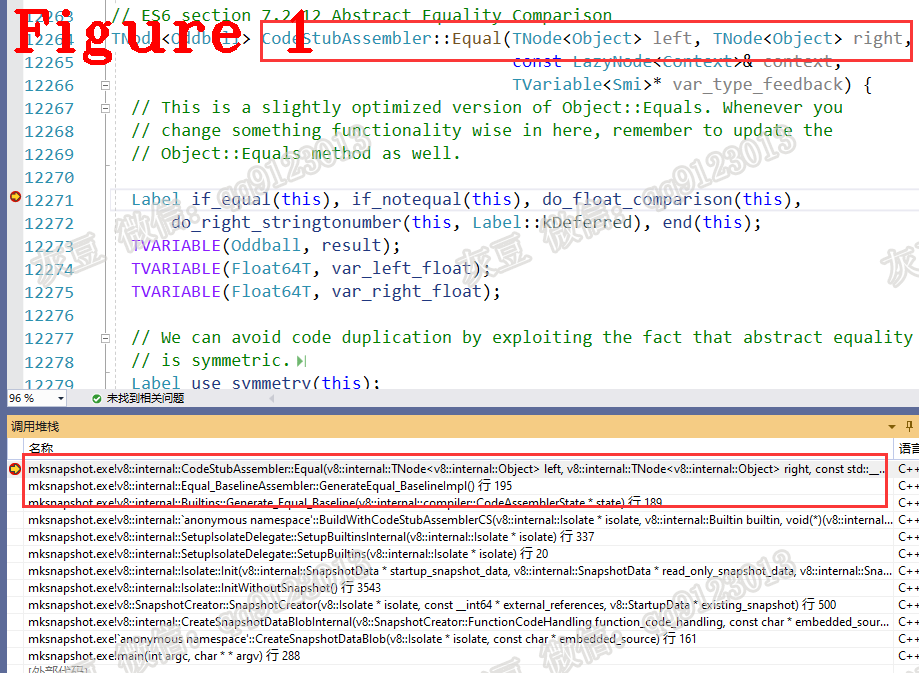

# 《Chrome V8 源码》47. "Equal" 与 "StrictEqual" 为什么不同  

   
# 1 介绍
substring、getDate、catch 等是常用的 JavaScript API，接下来的几篇文章将对 V8 中 API 的设计思想、源码和关键函数进行讲解，并通过例子讲解 JavaScript 在 V8 中的初始化、运行方式，以及它与解释器、编译器、字节码之间的关系。
本文讲解 API Equal 和 StrictEqual 的设计与实现。  
# 2 Equal 和 StrictEqual 的调用方式
来看一段 JS 源码和它的字节码：  
```c++
1.  var a="123";
2.  var b = a == 123;
3.  var c = a === 123;
4.  console.log(b);
5.  console.log(c);
6.  //分隔线............
7.  //省略...............................
8.  000000CFDD021F54 @   22 : 6a f9 04          TestEqual r1, [4]
9.  000000CFDD021F57 @   25 : 23 03 05          StaGlobal [3], [5]
10.  000000CFDD021F5A @   28 : 21 02 02          LdaGlobal [2], [2]
11.  000000CFDD021F5D @   31 : c2                Star1
12.  000000CFDD021F5E @   32 : 0d 7b             LdaSmi [123]
13.  000000CFDD021F60 @   34 : 6b f9 07          TestEqualStrict r1, [7]
14.  //省略...............................
```
上述代码中，第 2 行代码 '==' 的字节码是第 8 行代码 TestEqual；
第 3 行代码 '===' 的字节码是第 13 行代码 TestEqualStrict;
下面讲解字节码 TestEqual 和 TestEqualStrict，源码如下：
```c++
IGNITION_HANDLER(TestEqual, InterpreterCompareOpAssembler) {
  CompareOpWithFeedback(Operation::kEqual);
}
//分隔线............
IGNITION_HANDLER(TestEqualStrict, InterpreterCompareOpAssembler) {
  CompareOpWithFeedback(Operation::kStrictEqual);
}
```
上述两条字节码中都使用了 CompareOpWithFeedback()，区别是参数不同，CompareOpWithFeedback 源码如下：  
```c++
1.    void CompareOpWithFeedback(Operation compare_op) {
2.      TNode<Object> lhs = LoadRegisterAtOperandIndex(0);
3.      TNode<Object> rhs = GetAccumulator();
4.      TNode<Context> context = GetContext();
5.  //省略.......................
6.      TVARIABLE(Smi, var_type_feedback);
7.      TNode<Oddball> result;
8.      switch (compare_op) {
9.        case Operation::kEqual:
10.          result = Equal(lhs, rhs, context, &var_type_feedback);
11.          break;
12.        case Operation::kStrictEqual:
13.          result = StrictEqual(lhs, rhs, &var_type_feedback);
14.          break;
15.        case Operation::kLessThan:
16.        case Operation::kGreaterThan:
17.        case Operation::kLessThanOrEqual:
18.        case Operation::kGreaterThanOrEqual:
19.          result = RelationalComparison(compare_op, lhs, rhs, context,
20.                                        &var_type_feedback);
21.          break;
22.        default:
23.          UNREACHABLE();
24.      }
25.  //省略.......................
26.      SetAccumulator(result);
27.      Dispatch();
28.    }
```   
上述代码中，第 2 行取出左操作数 lhs；
第 3 行取出右操作数 rhs。rhs 存储在累加器中，所以字节码 TestEqual 的操作数只有 r1，也就是 lhs。[4] 不属于 TestEqual 的操作数，它用于信息收集。TestEqualStrict 的情况也一样。  
第 8 行代码根据 compare_op 选择 Equal 或是 StrictEqual。  
第 15~19 行代码是小于、大于等操作的实现，本文不做讲解。    
# 3 Equal 源码分析  
图 1 给出了 Equal 的源码和函数调用堆栈，需要使用 mksnapshot 进行跟踪。   

下面讲解 Equal 源码。  
```c++
1.  TNode<Oddball> CodeStubAssembler::Equal(/*省略*/) {
2.    //省略................
3.  TVARIABLE(Object, var_left, left);
4.  TVARIABLE(Object, var_right, right);
5.    //省略...............
6.   BIND(&loop);
7.  {
8.  left = var_left.value();
9.  right = var_right.value();
10.  Label if_notsame(this);
11.  GotoIf(TaggedNotEqual(left, right), &if_notsame);
12.  {GenerateEqual_Same(left, &if_equal, &if_notequal, var_type_feedback);}
13.  BIND(&if_notsame);
14.  Label if_left_smi(this), if_left_not_smi(this);
15.  Branch(TaggedIsSmi(left), &if_left_smi, &if_left_not_smi);
16.  BIND(&if_left_smi);
17.  {
18.    Label if_right_smi(this), if_right_not_smi(this);
19.    CombineFeedback(var_type_feedback,
20.                    CompareOperationFeedback::kSignedSmall);
21.    Branch(TaggedIsSmi(right), &if_right_smi, &if_right_not_smi);
22.    BIND(&if_right_smi);
23.    { Goto(&if_notequal);   }
24.    BIND(&if_right_not_smi);
25.    { TNode<Map> right_map = LoadMap(CAST(right));
26.      Label if_right_heapnumber(this), if_right_oddball(this),
27.          if_right_bigint(this, Label::kDeferred),
28.          if_right_receiver(this, Label::kDeferred);
29.      GotoIf(IsHeapNumberMap(right_map), &if_right_heapnumber);
30.      TNode<Uint16T> right_type = LoadMapInstanceType(right_map);
31.      GotoIf(IsStringInstanceType(right_type), &do_right_stringtonumber);
32.      GotoIf(IsOddballInstanceType(right_type), &if_right_oddball);
33.      GotoIf(IsBigIntInstanceType(right_type), &if_right_bigint);
34.      GotoIf(IsJSReceiverInstanceType(right_type), &if_right_receiver);
35.      CombineFeedback(var_type_feedback, CompareOperationFeedback::kAny);
36.      Goto(&if_notequal); }  }
37.  BIND(&if_left_not_smi);
38.  { GotoIf(TaggedIsSmi(right), &use_symmetry);
39.    Label if_left_symbol(this), if_left_number(this),
40.        if_left_string(this, Label::kDeferred),
41.        if_left_bigint(this, Label::kDeferred), if_left_oddball(this),
42.         if_left_receiver(this);
43.     TNode<Map> left_map = LoadMap(CAST(left));
44.     TNode<Map> right_map = LoadMap(CAST(right));
45.     TNode<Uint16T> left_type = LoadMapInstanceType(left_map);
46.     TNode<Uint16T> right_type = LoadMapInstanceType(right_map);
47.     GotoIf(IsStringInstanceType(left_type), &if_left_string);
48.     GotoIf(IsSymbolInstanceType(left_type), &if_left_symbol);
49.     GotoIf(IsHeapNumberInstanceType(left_type), &if_left_number);
50.     GotoIf(IsOddballInstanceType(left_type), &if_left_oddball);
51.     Branch(IsBigIntInstanceType(left_type), &if_left_bigint,
52.            &if_left_receiver);
53.     BIND(&if_left_string);
54.     { GotoIfNot(IsStringInstanceType(right_type), &use_symmetry);
55.       result =
56.           CAST(CallBuiltin(Builtin::kStringEqual, context(), left, right));
57.       CombineFeedback(var_type_feedback,
58.                       SmiOr(CollectFeedbackForString(left_type),
59.                             CollectFeedbackForString(right_type)));
60.       Goto(&end);      }
61.     BIND(&if_left_number);
62.     { Label if_right_not_number(this);
63.       CombineFeedback(var_type_feedback, CompareOperationFeedback::kNumber);
64.       GotoIf(Word32NotEqual(left_type, right_type), &if_right_not_number);
65.       var_left_float = LoadHeapNumberValue(CAST(left));
66.       var_right_float = LoadHeapNumberValue(CAST(right));
67.       Goto(&do_float_comparison);
68.       BIND(&if_right_not_number);
69.       { Label if_right_oddball(this);
70.         GotoIf(IsStringInstanceType(right_type), &do_right_stringtonumber);
71.  	    //省略...............
72.         Goto(&if_notequal);
73.         BIND(&if_right_oddball);
74.         { Label if_right_boolean(this);
75.           GotoIf(IsBooleanMap(right_map), &if_right_boolean);
76.           CombineFeedback(var_type_feedback,
77.                           CompareOperationFeedback::kOddball);
78.           Goto(&if_notequal);
79.           BIND(&if_right_boolean);
80.            {CombineFeedback(var_type_feedback,
81.                              CompareOperationFeedback::kBoolean);
82.              var_right =
83.                  LoadObjectField(CAST(right), Oddball::kToNumberOffset);
84.              Goto(&loop);
85.            }  }  }  }
86.      BIND(&if_left_bigint);
87.      {
88.        Label if_right_heapnumber(this), if_right_bigint(this),
89.            if_right_string(this), if_right_boolean(this);
90.        CombineFeedback(var_type_feedback, CompareOperationFeedback::kBigInt);
91.        GotoIf(IsStringInstanceType(right_type), &if_right_string);
92.  	   //省略...............
93.        BIND(&if_right_heapnumber);
94.        { CombineFeedback(var_type_feedback, CompareOperationFeedback::kNumber);
95.          result = CAST(CallRuntime(Runtime::kBigIntEqualToNumber,
96.                                    NoContextConstant(), left, right));
97.          Goto(&end);  }
98.        BIND(&if_right_bigint);
99.        {
100.           result = CAST(CallRuntime(Runtime::kBigIntEqualToBigInt,
101.                                     NoContextConstant(), left, right));
102.           Goto(&end); }
103.         BIND(&if_right_string);
104.         {
105.           CombineFeedback(var_type_feedback, CompareOperationFeedback::kString);
106.           result = CAST(CallRuntime(Runtime::kBigIntEqualToString,
107.                                     NoContextConstant(), left, right));
108.           Goto(&end); }
109.         BIND(&if_right_boolean);
110.         { CombineFeedback(var_type_feedback,
111.                           CompareOperationFeedback::kBoolean);
112.           var_right = LoadObjectField(CAST(right), Oddball::kToNumberOffset);
113.           Goto(&loop); } }
114.       BIND(&if_left_oddball);
115.       { Label if_left_boolean(this), if_left_not_boolean(this);
116.         GotoIf(IsBooleanMap(left_map), &if_left_boolean);
117.         if (var_type_feedback != nullptr) {
118.           CombineFeedback(var_type_feedback,
119.                           CompareOperationFeedback::kNullOrUndefined);
120.           GotoIf(IsUndetectableMap(left_map), &if_left_not_boolean);
121.         }
122.         Goto(&if_left_not_boolean);
123.         BIND(&if_left_not_boolean);
124.         {
125.           Label if_right_undetectable(this), if_right_number(this),
126.               if_right_oddball(this),
127.               if_right_not_number_or_oddball_or_undetectable(this);
128.           //省略...............
129.         }  }
130.       BIND(&if_left_receiver);
131.       {
132.         CSA_DCHECK(this, IsJSReceiverInstanceType(left_type));
133.         Label if_right_receiver(this), if_right_not_receiver(this);
134.         Branch(IsJSReceiverInstanceType(right_type), &if_right_receiver,
135.                &if_right_not_receiver);
136.         BIND(&if_right_receiver);
137.         {
138.           CombineFeedback(var_type_feedback,
139.                           CompareOperationFeedback::kReceiver);
140.           Goto(&if_notequal);   }
141.         BIND(&if_right_not_receiver);
142.         {
143.           Label if_right_undetectable(this),
144.               if_right_not_undetectable(this, Label::kDeferred);
145.           Branch(IsUndetectableMap(right_map), &if_right_undetectable,
146.                  &if_right_not_undetectable);
147.           BIND(&if_right_undetectable);
148.           {
149.             CSA_DCHECK(this, IsNullOrUndefined(right));
150.             if (var_type_feedback != nullptr) {
151.               *var_type_feedback = SmiConstant(
152.                   CompareOperationFeedback::kReceiverOrNullOrUndefined);  }
153.             Branch(IsUndetectableMap(left_map), &if_equal, &if_notequal);   }
154.           BIND(&if_right_not_undetectable);
155.           {
156.             CombineFeedback(var_type_feedback, CompareOperationFeedback::kAny);
157.             Callable callable = CodeFactory::NonPrimitiveToPrimitive(isolate());
158.             var_left = CallStub(callable, context(), left);
159.             Goto(&loop); } }}
160.     }
161.     BIND(&do_right_stringtonumber);
162.     {
163.       if (var_type_feedback != nullptr) {
164.         TNode<Map> right_map = LoadMap(CAST(right));
165.         TNode<Uint16T> right_type = LoadMapInstanceType(right_map);
166.         CombineFeedback(var_type_feedback,
167.                         CollectFeedbackForString(right_type)); }
168.       var_right = CallBuiltin(Builtin::kStringToNumber, context(), right);
169.       Goto(&loop);  }
170.     BIND(&use_symmetry);
171.     {
172.       var_left = right;
173.       var_right = left;
174.       Goto(&loop); }
175.   }
176.   BIND(&if_equal);
177.   {
178.     result = TrueConstant();
179.     Goto(&end); }
180.   BIND(&end);
181.   return result.value();}
```  
我们根据测试用例代码的执行顺序来讲解上述代码。
第 3 行创建左操作数变量 var_left，并把参数 left 的值赋给 var_left；  
第 4 行创建右操作数变量 var_right，并把参数 right的值赋给 var_right；  
第 6 行进入循环；  
第 8、9 行获取左、右操作数并赋给 left 和 right。根据我们的测试用例，left 为 "123"，rigth 为 123。   
第 11 行代码判断 left 和 right 的Tag 是否一致，left 和rigth 分别是 HeapObject 类型和 SMI 类型，所以 Tag 不一致；跳转到 if_notsame 标签；  
第 14-15 行判断左操作数 left 是否为 SMI，left 是 HeapObject，再次跳转到 if_left_not_smi 标签；  
第 38 行判断 right 是否为 SMI，结果为真，跳转到 use_symmetry；  
第 170-174 行调换左、右操作数，重新到第 6 行进入循环；  
再次执行第 11 行代码，依旧跳转到 if_notsame 标签；  
第 15 行判断结果为真，跳转到 if_left_smi 标签；  
第 21 行判断结果为假，跳转到 if_right_not_smi 标签；  
第 30-35 行判断 right 的类型，目前右操作数为 "123"，字串符串类型，跳转到 do_right_stringtonumber 标签；  
第 163-169 行调用 Builtin::kStringToNumber 把 right 转为 Number 类型，我们的测试用例转为了 SMI；再次进入循环；  
第 11 行判断结果为真，进入第 12 行代码；  
第 12 行检测到 left 为SMI，所以得出结果 left = right，跳转到 if_equal 标签；  
第 176-180 行生成 V8 值对象 true 并返回结果。  
**为什么没有做值的比较，第 16、18 行就得到了结果？**  
答：left、right 均为 SMI，所以他们的值是直接存储的，如果二者的 Tag 相等，也就是值相等。  
# 4 StrictEqual 源码分析  
与 Equal 不同，StrictEqual 要求左、右操作数的类型和值都相同时，返回值才为真。下面给出 StrictEqual 源码的算法伪代码：  
```c++
1.  //Pseudo-code for the algorithm below:
2.  //伪代码选自 StrictEqual 源码
3.  if (lhs == rhs) {
4.    if (lhs->IsHeapNumber()) return HeapNumber::cast(lhs)->value() != NaN;
5.    return true;
6.  }
7.  if (!lhs->IsSmi()) {
8.    if (lhs->IsHeapNumber()) {
9.      if (rhs->IsSmi()) {
10.        return Smi::ToInt(rhs) == HeapNumber::cast(lhs)->value();
11.      } else if (rhs->IsHeapNumber()) {
12.        return HeapNumber::cast(rhs)->value() ==
13.        HeapNumber::cast(lhs)->value();
14.      } else {
15.        return false;
16.      }
17.    } else {
18.      if (rhs->IsSmi()) {
19.        return false;
20.      } else {
21.        if (lhs->IsString()) {
22.          if (rhs->IsString()) {
23.            return %StringEqual(lhs, rhs);
24.          } else {
25.            return false;
26.          }
27.        } else if (lhs->IsBigInt()) {
28.          if (rhs->IsBigInt()) {
29.            return %BigIntEqualToBigInt(lhs, rhs);
30.          } else {
31.            return false;
32.          }
33.        } else {
34.          return false;
35.        }
36.      }
37.    }
38.  } else {
39.    if (rhs->IsSmi()) {
40.      return false;
41.    } else {
42.      if (rhs->IsHeapNumber()) {
43.        return Smi::ToInt(lhs) == HeapNumber::cast(rhs)->value();
44.      } else {
45.        return false;
46.      }
47.    }
48.  }
```    
上述代码中，第 3 行代码对左、右操作数进行判断、其中 "==" 为重载运行符；  
第 4 行代码说明左、右操作数相同。如果均为 HeapNumber,再进一步判断 HeapNumber 的原始值是否为空，如果原始值存在则判断结果为真；   
第 7-38 行代码处理左操作数不是 SMI 的情况，在此情况下：   
第 8-9 行代码如果左操作数为 HeapNumber，右操作数为 SMI 时，则判断 SMI 与堆对象的原始值是否相同，相同结果为真；  
第 11-13 行代码如果左、右均为 HeapNumber，则判断他们的原始值是否相同，相同结果为真；  
第 18-19 行代码左操作数不是 SMI，如果右操作数是 SMI，则结果为假；  
第 21-26 行代码如果左、右均为 String，使用 StringEqual() 方法判断；  
第 27-34 行代码如果左、右均为 BigInt，使用 BigIntEqualToBigInt() 方法判断；  
第 39-45 行代码如果右操作数是 SMI，结果为假；如果右操作数为 HeapNumber，则判断左操作数和右操作数的原始值。  
# 5 技术总结  
Equal 方法先将左、右操作数的类型统一，然后再进行值的判断。Equal 采用了如下的优化技巧：  
**（1）** Equal 大部分情况下用于数字类型判断，所以 Equal 开始就判断 Tagged 和 SMI 类型，如果相同则直接返回结果；  
**（2）** 为了简化 Equal的编码，将左、右操作调换以满足左操作数为 SMI 的情况；    
**（3）** 如果左、右操作数均不是 SMI，通过循环的方式统一左、右操作数的类型。   

好了，今天到这里，下次见。    
**个人能力有限，有不足与纰漏，欢迎批评指正**  
**微信：qq9123013  备注：v8交流    知乎：https://www.zhihu.com/people/v8blink**  


