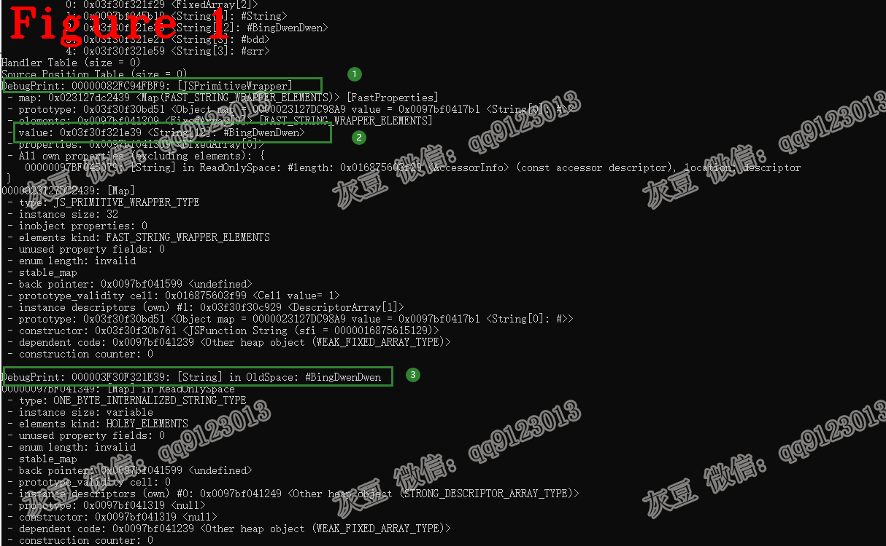

# 《Chrome V8 源码》49. new String 和 String 的本质区别  
# 1 介绍  
众所周知，二者的区别是：new String 为引用类型、String 为基本类型。本文讲解 new String 和 String 源码，带领大家从 V8 源码的角度看看二者之间的不同。  
# 2 测试用例  
```c++
1.var bdd = new String("BingDwenDwen");
2.var srr = String("BingDwenDwen");
3.%DebugPrint(bdd);
4.%DebugPrint(srr);
```
代码 1-2 行是测试用例，3-4 行用于辅助查看数据类型。**注意** %DebugPrint 指令需要 --allow-natives-syntax 选项。  
我们先来看看二者的不同，如图 1。  
  
图中的标记 1 bdd 的类型为 JSPrimitiveWrapper，"Wrapper" 表示对原始类型的包装，也就是引用类型。标记 3 说明了 srr 是字符串，字符串是 JS 的基本类型。  
我特意将 bdd 和 srr 的值设置为相同值，标记 2 可以看出 bdd 内部引用了一个字符串，这个字符串的地址（0x03f30f321e39）与标记 3 的地址一样，这说明 bdd 和 srr 使用了同一内存地址的数据。  
以上结果符合 JS 规范要求，下面看看 V8 如何设计出符合 JS 规范的功能代码。  
我们都知道 JavaScript 源码的执行是从字节码开始的，故我们也需要从测试用例的字节码开始分析，字节码如下：
```c++
1.  3F30F321FB6 @    0 : 13 00             LdaConstant [0]
2.  3F30F321FB8 @    2 : c3                Star1
3.  3F30F321FB9 @    3 : 19 fe f8          Mov <closure>, r2
4.  3F30F321FBC @    6 : 65 54 01 f9 02    CallRuntime [DeclareGlobals], r1-r2
5.  3F30F321FC1 @   11 : 21 01 00          LdaGlobal [1], [0]
6.  3F30F321FC4 @   14 : c3                Star1
7.  3F30F321FC5 @   15 : 13 02             LdaConstant [2]
8.  3F30F321FC7 @   17 : c2                Star2
9.  3F30F321FC8 @   18 : 0b f9             Ldar r1
10.  3F30F321FCA @   20 : 69 f9 f8 01 02    Construct r1, r2-r2, [2]
11.  3F30F321FCF @   25 : 23 03 04          StaGlobal [3], [4]
12.  3F30F321FD2 @   28 : 21 01 00          LdaGlobal [1], [0]
13.  3F30F321FD5 @   31 : c3                Star1
14.  3F30F321FD6 @   32 : 13 02             LdaConstant [2]
15.  3F30F321FD8 @   34 : c2                Star2
16.  3F30F321FD9 @   35 : 62 f9 f8 06       CallUndefinedReceiver1 r1, r2, [6]
17.  3F30F321FDD @   39 : 23 04 08          StaGlobal [4], [8]
18.  .............省略..........................
19.  Constant pool (size = 5)
20.  000003F30F321F49: [FixedArray] in OldSpace
21.   - map: 0x0097bf0412c1 <Map>
22.   - length: 5
23.  0: 0x03f30f321f29 <FixedArray[2]>
24.  1: 0x0097bf045b19 <String[6]: #String>
25.  2: 0x03f30f321e39 <String[12]: #BingDwenDwen>
26.  3: 0x03f30f321e21 <String[3]: #bdd>
27.  4: 0x03f30f321e59 <String[3]: #srr>
```   
上述代码中，第 5 行以常量（字符串 String）查找字符串构造方法，该方法是 JSFunction BUILTIN::StringConstructor ；  
第 6-9 行分别把常量池中的字符串：BingDwenDwen 和 JSFunction BUILTIN::StringConstructor 加载到寄存器。  
**记住** 第 9 行代码把 BUILTIN::StringConstructor 加载进累加器。  
第 10-11 行代码 Construct 指令生成 new String 并保存为引用类型变量 bdd；  
第 16-17行代码 CallUndefinedReceiver1 指令生成基本类型字符串 srr。  
# 3 Construct 源码分析 -- new String(XXX)     
Construct 是字节码功能，所以它的源码就是相应的字符节码处理程序，源码如下：  
```c++
1.  IGNITION_HANDLER(Construct, InterpreterAssembler) {
2.    TNode<Object> new_target = GetAccumulator();
3.    TNode<Object> constructor = LoadRegisterAtOperandIndex(0);
4.    RegListNodePair args = GetRegisterListAtOperandIndex(1);
5.    TNode<UintPtrT> slot_id = BytecodeOperandIdx(3);
6.    TNode<HeapObject> maybe_feedback_vector = LoadFeedbackVector();
7.    TNode<Context> context = GetContext();
8.    TNode<Object> result = Construct(constructor, context, new_target, args,
9.                                     slot_id, maybe_feedback_vector);
10.    SetAccumulator(result);
11.    Dispatch();
12.  }
```    
上述代码中，第 1 行 new_target 获取累加器的值，也就是 BUILTIN::StringConstructor；  
第 3 行 constructor 是参数寄存器 r1，也是 BUILTIN::StringConstructor；  
第 4 行 args 是参数寄存器 r2，内容是 "BingDwenDwen"；  
第 8 行代码是构造方法的入口函数，该函数内部调用 BUILTIN::StringConstructor 以完成 bdd 的构造，其源码如下：  
```c++
1.  // ES #sec-string-constructor
2.  // https://tc39.github.io/ecma262/#sec-string-constructor
3.  transitioning javascript builtin StringConstructor(
4.      js-implicit context: NativeContext, receiver: JSAny, newTarget: JSAny,
5.      target: JSFunction)(...arguments): JSAny {
6.    const length: intptr = Convert<intptr>(arguments.length);
7.    let s: String;
8.    // 1. If no arguments were passed to this function invocation, let s be "".
9.    if (length == 0) {
10.      s = EmptyStringConstant();
11.    } else {
12.      // 2. Else,
13.      // 2. a. If NewTarget is undefined and Type(value) is Symbol, return
14.      // SymbolDescriptiveString(value).
15.      if (newTarget == Undefined) {
16.        typeswitch (arguments[0]) {
17.          case (value: Symbol): {
18.            return SymbolDescriptiveString(value);
19.          }
20.          case (JSAny): {
21.          }
22.        }
23.      }
24.      // 2. b. Let s be ? ToString(value).
25.      s = ToString_Inline(arguments[0]);
26.    }
27.    // 3. If NewTarget is undefined, return s.
28.    if (newTarget == Undefined) {
29.      return s;
30.    }
31.    // 4. Return ! StringCreate(s, ? GetPrototypeFromConstructor(NewTarget,
32.    // "%String.prototype%")).
33.    const map = GetDerivedMap(target, UnsafeCast<JSReceiver>(newTarget));
34.    const obj =
35.        UnsafeCast<JSPrimitiveWrapper>(AllocateFastOrSlowJSObjectFromMap(map));
36.    obj.value = s;
37.    return obj;
38.  }
```   
上述代码是 TQ 语言源码，这是 V8 官方自创的、面向 Builtin 开发人员的语言。  
第 2 行注释代码说明了这个方法的功能是实现 ecma262-string-constructor；  
第 4 行代码说明该方法有三个隐含参数，分别是 context，receiver 和 newTarget；JSAny是数据类型，参见 TQ 文档；  
第 5 行代码说明该方法有一个显示参数argumens，类型是数组；  
结合本文测试用例，arguments[0] = "BingDwenDwen"，newTarget 是 JSFunction BUILTIN::StringConstructor。（前面的"记住"）      
本文用例执行第 25 行代码，把 arguments[0] 转为字符串 s；ToString_Inline(XX) 的功能为把参数 XX 转为字符串；  
第 33-34 行创建 JSReceiver 对象 obj；prototype 以后再讲。   
第 35 行使 obj.value 指向 s；**我的理解** 这就是"引用"的含义，你觉得呢？  
至此，引用类型分析完毕。  
# 4 CallUndefinedReceiver1 源码分析 -- String(XXX)
字节码处理程序的源码如下：  
```c++
IGNITION_HANDLER(CallUndefinedReceiver1, InterpreterJSCallAssembler) {
  JSCallN(1, ConvertReceiverMode::kNullOrUndefined);
}
```  
JSCallN 源码如下：  
```c++
1.  void JSCallN(int arg_count, ConvertReceiverMode receiver_mode) {
2.  //.......省略.................
3.      TNode<Object> function = LoadRegisterAtOperandIndex(0);
4.  //.......省略.................
5.      switch (kReceiverAndArgOperandCount) {
6.        case 0:
7.          CallJSAndDispatch(function, context, Int32Constant(arg_count),
8.                            receiver_mode);
9.          break;
10.        case 1:
11.          CallJSAndDispatch(
12.              function, context, Int32Constant(arg_count), receiver_mode,
13.              LoadRegisterAtOperandIndex(kFirstArgumentOperandIndex));
14.          break;
15.          ..........余下部分省略..........
```  
结合本文测试用例，第 3 行代码 function 是 JSFunction（BUILTIN::StringConstructor）；  
执行第 11 行代码，最终还是进入 BUILTIN::StringConstructor 的源码。  
**注意**参数发生了变化，执行行为也所有不同。源码如下：  
```c++
1.   transitioning javascript builtin StringConstructor(
2.       js-implicit context: NativeContext, receiver: JSAny, newTarget: JSAny,
3.       target: JSFunction)(...arguments): JSAny {
4.  		..........省略..........
5.     if (length == 0) {
6.        s = EmptyStringConstant();
7.      } else {
8.        if (newTarget == Undefined) {
9.  		..........省略..........
10.        }
11.        // 2. b. Let s be ? ToString(value).
12.        s = ToString_Inline(arguments[0]);
13.      }
14.      // 3. If NewTarget is undefined, return s.
15.      if (newTarget == Undefined) {
16.        return s;
17.      }
18.            ..........余下部分省略..........
19.  }
```   
第 2 行代码 newTarget 的值为空；第 3 行代码 arguments[0] 是字符串，arguments 的长度是 1  
执行第 7-12 行代码，创建了字符串 s；   
第 16 行返回 s，因为 newTarget 为空。**我的理解** 这就是“基本”类型的含义，你觉得呢？  
至此，基本类型分析完毕。  
**技术总结**   
**（1）** TQ 是面向 Builtin 开发者的编程语言，它实现了 CSA 的高级抽象，隐藏了很多 V8 的内部逻辑；  
**（2）** 如果两个 V8 内部字符串的内容相同，那么他们在 V8 内部就是一个字符串，用同一段内存表示。    
好了，今天到这里，下次见。    
**个人能力有限，有不足与纰漏，欢迎批评指正**  
**微信：qq9123013  备注：v8交流    知乎：https://www.zhihu.com/people/v8blink**  


