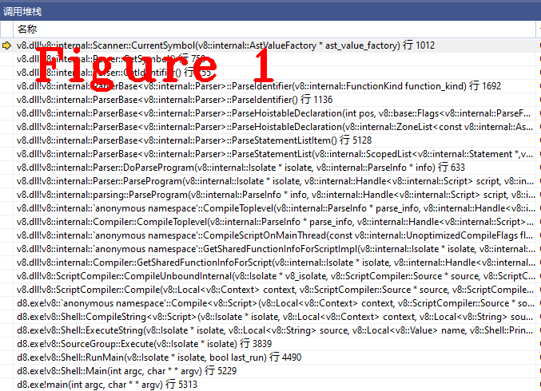
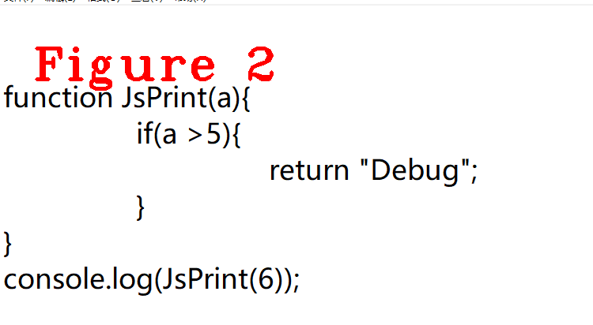
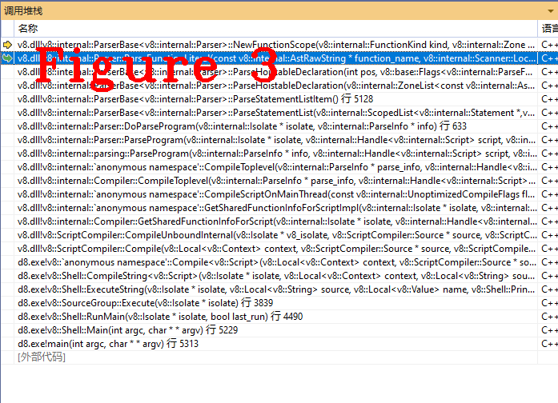
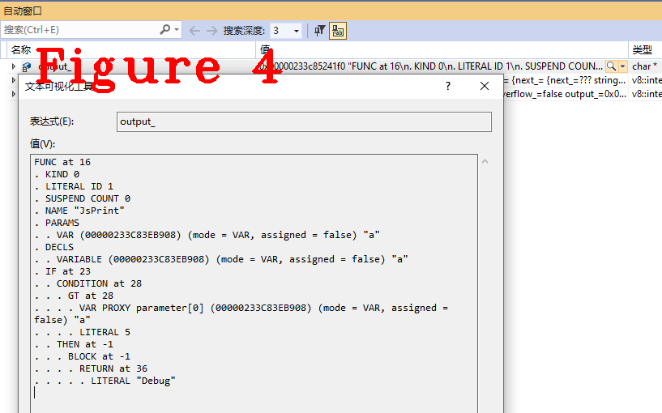

# 连载《Chrome V8 原理讲解》第五篇 V8语法分析源码讲解


# 1.摘要
本次是第五篇，剖析V8语法分析(parser)的源码和工作流程，讲解V8语法分析的核心源码、主要工作流程以及重要数据结构。本文将沿用第四篇文章的“测试样例代码”。
# 2.语法分析概述  
语法分析是词法分析（scanner）的下一阶段，词法分析输出（out）的token字是语法分析的输入(in)，语法分析在工作时会频繁使用词法分析器生成token。本文把词法分析器当作黑盒功能使用，直接给出词法分析的token字结果，词法分析器原理参见第四篇文章。
# 3.源码分析 
以`function`和`JsPrint`为例详细剖析V8语法分析器的实现原理，从语法分析器的入口函数`DoParseProgram()`入手做起，讲解用户自义函数JsPrint的语法分析过程，之后对延迟分析技术(parse lazily)进行说明。
## 3.1 语法分析
下面这段代码是语法分析的入口函数。
```c++
FunctionLiteral* Parser::DoParseProgram(Isolate* isolate, ParseInfo* info) {
  DCHECK_EQ(parsing_on_main_thread_, isolate != nullptr);
  DCHECK_NULL(scope_);
  ParsingModeScope mode(this, allow_lazy_ ? PARSE_LAZILY : PARSE_EAGERLY);
  ResetFunctionLiteralId();
  FunctionLiteral* result = nullptr;
  {
    Scope* outer = original_scope_;
    DCHECK_NOT_NULL(outer);
    if (flags().is_eval()) {
      outer = NewEvalScope(outer);
    } else if (flags().is_module()) {
      DCHECK_EQ(outer, info->script_scope());
      outer = NewModuleScope(info->script_scope());
    }
    DeclarationScope* scope = outer->AsDeclarationScope();
    scope->set_start_position(0);

    FunctionState function_state(&function_state_, &scope_, scope);
    ScopedPtrList<Statement> body(pointer_buffer());
    int beg_pos = scanner()->location().beg_pos;
    if (flags().is_module()) {
      DCHECK(flags().is_module());

      PrepareGeneratorVariables();
      Expression* initial_yield =
          BuildInitialYield(kNoSourcePosition, kGeneratorFunction);
      body.Add(
          factory()->NewExpressionStatement(initial_yield, kNoSourcePosition));
      if (flags().allow_harmony_top_level_await()) {
        BlockT block = impl()->NullBlock();
        {
          StatementListT statements(pointer_buffer());
          ParseModuleItemList(&statements);
          if (function_state.suspend_count() > 1) {
            scope->set_is_async_module();
            block = factory()->NewBlock(true, statements);
          } else {
            statements.MergeInto(&body);
          }
        }
        if (IsAsyncModule(scope->function_kind())) {
          impl()->RewriteAsyncFunctionBody(
              &body, block, factory()->NewUndefinedLiteral(kNoSourcePosition));
        }
      } else {
        ParseModuleItemList(&body);
      }
      if (!has_error() &&
          !module()->Validate(this->scope()->AsModuleScope(),
                              pending_error_handler(), zone())) {
        scanner()->set_parser_error();
      }
    } else if (info->is_wrapped_as_function()) {
      DCHECK(parsing_on_main_thread_);
      ParseWrapped(isolate, info, &body, scope, zone());
    } else if (flags().is_repl_mode()) {
      ParseREPLProgram(info, &body, scope);
    } else {
      this->scope()->SetLanguageMode(info->language_mode());
      ParseStatementList(&body, Token::EOS);
    }
    scope->set_end_position(peek_position());
    if (is_strict(language_mode())) {
      CheckStrictOctalLiteral(beg_pos, end_position());
    }
    if (is_sloppy(language_mode())) {
      InsertSloppyBlockFunctionVarBindings(scope);
    }
    if (flags().is_eval()) {
      DCHECK(parsing_on_main_thread_);
      info->ast_value_factory()->Internalize(isolate);
    }
    CheckConflictingVarDeclarations(scope);

    if (flags().parse_restriction() == ONLY_SINGLE_FUNCTION_LITERAL) {
      if (body.length() != 1 || !body.at(0)->IsExpressionStatement() ||
          !body.at(0)
               ->AsExpressionStatement()
               ->expression()
               ->IsFunctionLiteral()) {
        ReportMessage(MessageTemplate::kSingleFunctionLiteral);
      }
    }
    int parameter_count = 0;
    result = factory()->NewScriptOrEvalFunctionLiteral(
        scope, body, function_state.expected_property_count(), parameter_count);
    result->set_suspend_count(function_state.suspend_count());
  }
  info->set_max_function_literal_id(GetLastFunctionLiteralId());
  if (has_error()) return nullptr;
  RecordFunctionLiteralSourceRange(result);
  return result;
}
```
`DoParseProgram()`是语法分析的开始，` FunctionLiteral* result = nullptr;`这条语句定义了一个`result`,它是语法分析结束时生成的抽象语法树(AST)，`result`目前为空值，`DoParseProgram()`执行完，AST也就生成了。调试样例代码，进入下面这个方法。
```c++
void ParserBase<Impl>::ParseStatementList(StatementListT* body,
                                          Token::Value end_token) {
  DCHECK_NOT_NULL(body);

  while (peek() == Token::STRING) {
    bool use_strict = false;
#if V8_ENABLE_WEBASSEMBLY
    bool use_asm = false;
#endif  // V8_ENABLE_WEBASSEMBLY
    Scanner::Location token_loc = scanner()->peek_location();
    if (scanner()->NextLiteralExactlyEquals("use strict")) {
      use_strict = true;
#if V8_ENABLE_WEBASSEMBLY
    } else if (scanner()->NextLiteralExactlyEquals("use asm")) {
      use_asm = true;
#endif  // V8_ENABLE_WEBASSEMBLY
    }
    StatementT stat = ParseStatementListItem();
    if (impl()->IsNull(stat)) return;
    body->Add(stat);
    if (!impl()->IsStringLiteral(stat)) break;
    if (use_strict) {
      RaiseLanguageMode(LanguageMode::kStrict);
      if (!scope()->HasSimpleParameters()) {

        impl()->ReportMessageAt(token_loc,
                                MessageTemplate::kIllegalLanguageModeDirective,
                                "use strict");
        return;
      }
#if V8_ENABLE_WEBASSEMBLY
    } else if (use_asm) {
      impl()->SetAsmModule();
#endif  // V8_ENABLE_WEBASSEMBLY
    } else {
      RaiseLanguageMode(LanguageMode::kSloppy);
    }
  }
  while (peek() != end_token) {
    StatementT stat = ParseStatementListItem();
    if (impl()->IsNull(stat)) return;
    if (stat->IsEmptyStatement()) continue;
    body->Add(stat);
  }
}
```
上一个方法是语法分析的入口，而`ParseStatementList()`是开始分析程序语句。`while (peek() == Token::STRING)`这条语句，peek是取得token字的类型，这里取来的token是Token::FUNCTION，所以值为假，进入`while (peek() != end_token)`循环，执行`ParseStatementListItem()`方法，在这个方法中进入`Token::FUNCTION`对应的分析功能，代码如下：
```c++
ParserBase<Impl>::ParseHoistableDeclaration(
    ZonePtrList<const AstRawString>* names, bool default_export) {
  Consume(Token::FUNCTION);//cache机制

  int pos = position();
  ParseFunctionFlags flags = ParseFunctionFlag::kIsNormal;
  if (Check(Token::MUL)) {
    flags |= ParseFunctionFlag::kIsGenerator;
  }
  return ParseHoistableDeclaration(pos, flags, names, default_export);
}
```
`Consume()`是第三篇文章中提到的“token字缓存”机制的具体实现，从缓存中取出一个token开始分析，如果缓存缺失(cache miss)，则驱动词法分析器(Scanner)开始工作。从`Consume`取token的方法原理是使Scanner类中的current_成员指向next_成员，再利用next_next判断是否扫描下一个token字，请读者自行查阅代码。  

取出token字`function`、类型函数（Token::FUNCTION），接下来判断该函数属于哪种类型（FunctionKind），FunctionKind的具体代码如下：  
```c++
enum FunctionKind : uint8_t {
  // BEGIN constructable functions
  kNormalFunction,
  kModule,
  kAsyncModule,
//.................................
//省略了很多代码
//.................................
  // END concise methods 1
  kAsyncGeneratorFunction,
  // END async functions
  kGeneratorFunction,
  // BEGIN concise methods 2
  kConciseGeneratorMethod,
  kStaticConciseGeneratorMethod,
  // END generators
  kConciseMethod,
  kStaticConciseMethod,
  kClassMembersInitializerFunction,
  kClassStaticInitializerFunction,
  // END concise methods 2
  kInvalid,

  kLastFunctionKind = kClassStaticInitializerFunction,
};
```
不要混淆FunctionKind和Token::FUNCTION的概念，它们属于不同技术领域，Token属于编译技术，FunctionKind属于ECMA规范。在样例代码中，Token字`function`的FunctionKind是`KnormalFunction`,所以下一步是分析这个函数的名字（Token::IDENTIFIER），代码如下：
```c++
const AstRawString* Scanner::CurrentSymbol(
    AstValueFactory* ast_value_factory) const {
  if (is_literal_one_byte()) {
    return ast_value_factory->GetOneByteString(literal_one_byte_string());
  }
  return ast_value_factory->GetTwoByteString(literal_two_byte_string());
}
```
在`CurrentSymbol()`方法中，进行`one_byte`判断，JsPrint是one_byte类型，`if`语句为真，返回标识符。图1给出了`CurrentSymbol()`方法的函数调用堆栈，方便读者复现代码执行过程。  
  
至此，两个Token字`function`和`JsPrint`语法分析完成，通俗概述以上代码的工作流程如下：  
**（1）：** 在Javascript源码中，当看到'function'这个字符时，后面应该是一个函数；  

**（2）：** 判断这个函数类型(FunctionKind)，是异步或其它等等，样例代码是kNormalFunction；  

**（3）：** 是kNormalFunction，去获取函数的名字。  
## 3.2 延迟分析
什么是延迟分析，延迟分析是V8中一种性能优化技术，即非立即执行的代码先不分析，执行时再做分析。众所周知，一个程序中，代码执行是有先后顺序的，也并不是所有代码都会执行，基于这一点，V8内部实现了延迟分析、延迟编译技术，达到提高效率的目的。下面讲解样例代码为什么会触发延迟分析。
JsPrint是一个常规(kNormalFunction)方法，取得函数名之后，开始分析函数内容，代码如下：  
```c++
FunctionLiteral* Parser::ParseFunctionLiteral(
    const AstRawString* function_name, Scanner::Location function_name_location,
    FunctionNameValidity function_name_validity, FunctionKind kind,
    int function_token_pos, FunctionSyntaxKind function_syntax_kind,
    LanguageMode language_mode,
    ZonePtrList<const AstRawString>* arguments_for_wrapped_function) {
  bool is_wrapped = function_syntax_kind == FunctionSyntaxKind::kWrapped;
  DCHECK_EQ(is_wrapped, arguments_for_wrapped_function != nullptr);
  int pos = function_token_pos == kNoSourcePosition ? peek_position()
                                                    : function_token_pos;
  DCHECK_NE(kNoSourcePosition, pos);
  bool should_infer_name = function_name == nullptr;

  if (should_infer_name) {
    function_name = ast_value_factory()->empty_string();
  }
  FunctionLiteral::EagerCompileHint eager_compile_hint =
      function_state_->next_function_is_likely_called() || is_wrapped
          ? FunctionLiteral::kShouldEagerCompile
          : default_eager_compile_hint();
  DCHECK_IMPLIES(parse_lazily(), info()->flags().allow_lazy_compile());
  DCHECK_IMPLIES(parse_lazily(), has_error() || allow_lazy_);
  DCHECK_IMPLIES(parse_lazily(), extension() == nullptr);

  const bool is_lazy =
      eager_compile_hint == FunctionLiteral::kShouldLazyCompile;
  const bool is_top_level = AllowsLazyParsingWithoutUnresolvedVariables();
  const bool is_eager_top_level_function = !is_lazy && is_top_level;
  const bool is_lazy_top_level_function = is_lazy && is_top_level;
  const bool is_lazy_inner_function = is_lazy && !is_top_level;

  RCS_SCOPE(runtime_call_stats_, RuntimeCallCounterId::kParseFunctionLiteral,
            RuntimeCallStats::kThreadSpecific);
  base::ElapsedTimer timer;
  if (V8_UNLIKELY(FLAG_log_function_events)) timer.Start();
  const bool should_preparse_inner = parse_lazily() && is_lazy_inner_function;
  bool should_post_parallel_task =
      parse_lazily() && is_eager_top_level_function &&
      FLAG_parallel_compile_tasks && info()->parallel_tasks() &&
      scanner()->stream()->can_be_cloned_for_parallel_access();

  // This may be modified later to reflect preparsing decision taken
  bool should_preparse = (parse_lazily() && is_lazy_top_level_function) ||
                         should_preparse_inner || should_post_parallel_task;
  ScopedPtrList<Statement> body(pointer_buffer());
  int expected_property_count = 0;
  int suspend_count = -1;
  int num_parameters = -1;
  int function_length = -1;
  bool has_duplicate_parameters = false;
  int function_literal_id = GetNextFunctionLiteralId();
  ProducedPreparseData* produced_preparse_data = nullptr;
  Zone* parse_zone = should_preparse ? &preparser_zone_ : zone();
  DeclarationScope* scope = NewFunctionScope(kind, parse_zone);
  SetLanguageMode(scope, language_mode);
#ifdef DEBUG
  scope->SetScopeName(function_name);
#endif
  if (!is_wrapped && V8_UNLIKELY(!Check(Token::LPAREN))) {
    ReportUnexpectedToken(Next());
    return nullptr;
  }
  scope->set_start_position(position());

  bool did_preparse_successfully =
      should_preparse &&
      SkipFunction(function_name, kind, function_syntax_kind, scope,
                   &num_parameters, &function_length, &produced_preparse_data);
  if (!did_preparse_successfully) {
    if (should_preparse) Consume(Token::LPAREN);
    should_post_parallel_task = false;
    ParseFunction(&body, function_name, pos, kind, function_syntax_kind, scope,
                  &num_parameters, &function_length, &has_duplicate_parameters,
                  &expected_property_count, &suspend_count,
                  arguments_for_wrapped_function);
  }
  if (V8_UNLIKELY(FLAG_log_function_events)) {
    double ms = timer.Elapsed().InMillisecondsF();
    const char* event_name =
        should_preparse
            ? (is_top_level ? "preparse-no-resolution" : "preparse-resolution")
            : "full-parse";
    logger_->FunctionEvent(
        event_name, flags().script_id(), ms, scope->start_position(),
        scope->end_position(),
        reinterpret_cast<const char*>(function_name->raw_data()),
        function_name->byte_length(), function_name->is_one_byte());
  }
#ifdef V8_RUNTIME_CALL_STATS
  if (did_preparse_successfully && runtime_call_stats_ &&
      V8_UNLIKELY(TracingFlags::is_runtime_stats_enabled())) {
    runtime_call_stats_->CorrectCurrentCounterId(
        RuntimeCallCounterId::kPreParseWithVariableResolution,
        RuntimeCallStats::kThreadSpecific);
  }
#endif  // V8_RUNTIME_CALL_STATS

  language_mode = scope->language_mode();
  CheckFunctionName(language_mode, function_name, function_name_validity,
                    function_name_location);

  if (is_strict(language_mode)) {
    CheckStrictOctalLiteral(scope->start_position(), scope->end_position());
  }

  FunctionLiteral::ParameterFlag duplicate_parameters =
      has_duplicate_parameters ? FunctionLiteral::kHasDuplicateParameters
                               : FunctionLiteral::kNoDuplicateParameters;
  FunctionLiteral* function_literal = factory()->NewFunctionLiteral(
      function_name, scope, body, expected_property_count, num_parameters,
      function_length, duplicate_parameters, function_syntax_kind,
      eager_compile_hint, pos, true, function_literal_id,
      produced_preparse_data);
  function_literal->set_function_token_position(function_token_pos);
  function_literal->set_suspend_count(suspend_count);

  RecordFunctionLiteralSourceRange(function_literal);

  if (should_post_parallel_task) {
    // Start a parallel parse / compile task on the compiler dispatcher.
    info()->parallel_tasks()->Enqueue(info(), function_name, function_literal);
  }

  if (should_infer_name) {
    fni_.AddFunction(function_literal);
  }
  return function_literal;
}

```
`ParseFunctionLiteral()`，这个方法名字表明了它的主要功能是对函数内容进行语议分析。名字JsPrint分析完成后，进入这个方法分析JsPrint函数的内容，先判断这个方法是否符合延迟分析条件。  

图2是样例代码，可以看出`JsPrint`不会马上执行，并且它是最外部的顶层方法，满足延迟分析条件。从Javascript的执行顺序也可以得到同样的结论：定义JsPrint函数，但代码执行时最先执行的是`console.log()`，`console.log()`执行时需要先计算参数并压栈，所以说JsPrint不是立即执行的，而`console.log()`执行时调用了JsPrint,所以它满足延迟分析条件。
    
调试程序是最有效的验证手段，从代码的角度验证上述结论是否正确， 请读者跟踪`ParseFunctionLiteral()`方法，并查看`is_lazy`和`is_top_level`成员的值，看到这两个成员的值为真，上述结论正确无误，图3给出`ParseFunctionLiteral()`的调用堆栈，便于读者复现代码执行过程。  
  
下面给出`JsPrint()`的抽象语法图，供读者分析学习，如图4。  
  
总结，语法分析器代码逻辑十分复杂，分析代码时做好堆栈记录，有助于在跟踪代码中发生“跟错、跟丢”问题时快速帮你找到最近的正确位置，提高学习效率。  

好了，今天到这里，下次见。   

**微信：qq9123013  备注：v8交流    邮箱：v8blink@outlook.com**
