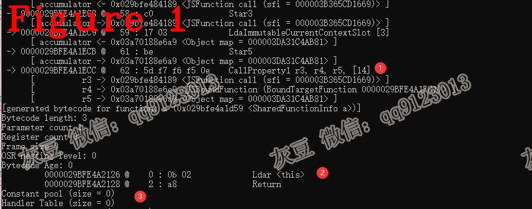
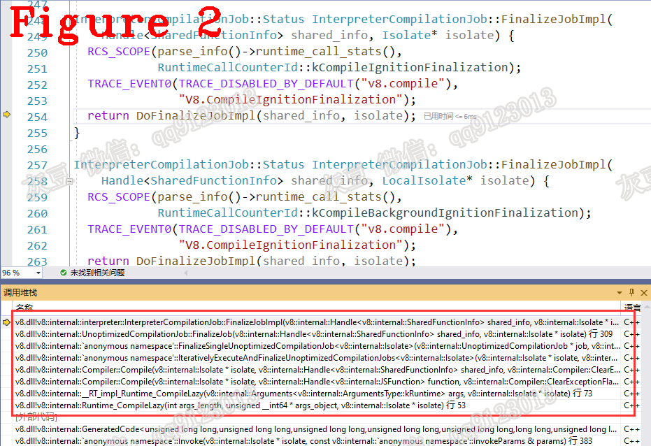

# 《Chrome V8 源码》51. 揭开 bind 和 call 的神秘面纱
# 1 背景   
本文内容来自网友的提问，如下代码：  
```c++
1.function a(){
2. return this;
3.}
4.const oldThis ={name:"old-this"};
5.const newThis ={name:"new-this"};
6.const b =a.bind(oldThis); 
7.console.log(b.call(newThis).name); //输出old-this
```   
上述代码最后一行的输出结果是 old-this，V8 内部是如何实现的？    
**致谢**：@brambles的细心讲解，还给我举例说明，使我充分理解了 bind 和 call 的应用场景，在此特别感谢。  
结合本文的测试用例，我讲讲 bind 和 call 的源码。  
# 2 bind 源码分析  
上述代码第 6 行，绑定 this 指针的值为 oldThis，bind 的用法和原理请参见 JS 规范，本文讲解 V8 如何实现 this 指针的绑定功能，源码如下：  
```c++
1.  transitioning javascript builtin FastFunctionPrototypeBind(
2.    js-implicit context: NativeContext, receiver: JSAny, newTarget: JSAny,
3.    target: JSFunction)(...arguments): JSAny {
4.  const argc: intptr = arguments.actual_count;
5.  try {
6.    typeswitch (receiver) {
7.      case (fn: JSFunction|JSBoundFunction): {
8.  //...省略.....
9.          const argumentsArray = arguments.length <= 1 ?
10.              kEmptyFixedArray :
11.              NewFixedArray(arguments.length - 1, ArgumentsIterator{arguments, current: 1});
12.          const boundReceiver: JSAny = arguments[0];
13.          const result = new JSBoundFunction{
14.            map: boundFunctionMap,
15.            properties_or_hash: kEmptyFixedArray,
16.            elements: kEmptyFixedArray,
17.            bound_target_function: fn,
18.            bound_this: boundReceiver,
19.            bound_arguments: argumentsArray
20.          };
21.          return result;}
22.        case (JSAny): {
23.          goto Slow;
24.        }  } } label Slow {
25.      tail FunctionPrototypeBind(
26.          LoadTargetFromFrame(), newTarget, Convert<int32>(argc));
27.    } }
```    
上述代码采用 TQ 编写，TQ 语法参见 V8 官方文档。  
当执行测试用例代码 `a.bind(oldThis);` 时，上述第 2 行代码 receiver 的值是函数 a；  
第 3 行 arguments 是参数列表，argsuments[0] 的值是对象 oldThis；  
第 4 行计算 arguments 列表长度 argc，本例中 argc 的值为 1；  
第 9-12 行把 arguments 列表中除第 0 个元素之外的其它元素重新组织为新的数组，本例中没有其它元素；  
第 13 行创新的函数 result，该函数即绑定了 oldThis 对象的 b 函数。   
**bind 总结：** 从 V8 角度看，result 是一个 HeapOjbect 对象，它的类型是 boundFunctionMap，称之为 JSBoundFunction。在我看来，它就是用花括号 {函数、this指针、其它可选参数} 包装的一个数据集合。      
# 3 JSBoundFunction 调用  
从 JavaScript 角度看，JSBoundFunction 与其它 JS 函数的调用过程没有不同，我们来看看 V8 中如何处理，图1 给出了字节码片段。  
    
图中标记 1 是调用 JSBoundFunction 的过程，字节码 CallUndefinedReceiver0 会进入汇编方法 Generate_InterpreterEntryTrampoline，该方法中再调用 JSBoundFunction 处理方法执行 b 方法。  
JSBoundFunction 处理方法从 b 方法中取出 bound_target_function 的值（也就是方法 a）并编译（参见前面的 TQ 代码中的 result）。
图中标记 2 和 3 是 bound_target_function 值的编译结果--字节码和常量池。    
**注意** 本节只是大概叙述了 JSBoundFunction 的调用过程，详细过程参见我之前的 Generate_InterpreterEntryTrampoline 相关的文章，本文不再赘述。    
# 4 call 源码分析  
测试用例第 7 行给方法 b 传递了 newThis，返回值仍然是 oldThis，我们来看看 call 方法到是怎么做的，源码如下： 
```c++
1.  void Builtins::Generate_FunctionPrototypeCall(MacroAssembler* masm) {
2.    // Stack Layout:
3.    // rsp[0]           : Return address
4.    // rsp[8]           : Argument 0 (receiver: callable to call)
5.    // rsp[16]          : Argument 1
6.    //  ...
7.    // rsp[8 * n]       : Argument n-1
8.    // rsp[8 * (n + 1)] : Argument n
9.    // rax contains the number of arguments, n.
10.    // 1. Get the callable to call (passed as receiver) from the stack.
11.    {
12.      StackArgumentsAccessor args(rax);
13.      __ movq(rdi, args.GetReceiverOperand());
14.    }
15.    // 2. Save the return address and drop the callable.
16.    __ PopReturnAddressTo(rbx);
17.    __ Pop(kScratchRegister);
18.    // 3. Make sure we have at least one argument.
19.    {
20.      Label done;
21.      if (kJSArgcIncludesReceiver) {
22.        __ cmpq(rax, Immediate(JSParameterCount(0)));
23.        __ j(greater, &done, Label::kNear);
24.      } else {
25.        __ testq(rax, rax);
26.        __ j(not_zero, &done, Label::kNear);
27.      }
28.      __ PushRoot(RootIndex::kUndefinedValue);
29.      __ incq(rax);
30.      __ bind(&done);
31.    }
32.    // 4. Push back the return address one slot down on the stack (overwriting the
33.    // original callable), making the original first argument the new receiver.
34.    __ PushReturnAddressFrom(rbx);
35.    __ decq(rax);  // One fewer argument (first argument is new receiver).
36.    // 5. Call the callable.
37.    // Since we did not create a frame for Function.prototype.call() yet,
38.    // we use a normal Call builtin here.
39.    __ Jump(masm->isolate()->builtins()->Call(), RelocInfo::CODE_TARGET);
40.  }
```   
上述代码是 V8 自定义的汇编码（其实质是用宏定义和 x86 汇编混合定义的一些自定义函数，其目的方便 Builint 开发），源码位置在 http://builtins-x64.cc 中，V8 汇编码的详细说明参见我之前的文章，本文不多讲，有问题随时交流。    
上述代码做了两件：一是参数压栈；二是使用 Builtin::kCall_ReceiverIsAny 执行 call 方法。测试用例中，call 方法有两个参数，分别是 b 和 newThis。参数 b 即 receiver: callable to call（见代码 4 行的注释）。  
在 Builtin::kCall_ReceiverIsAny 方法中经过一些操作后，最终使用 Runtime_ComipleLazy 编译并执行 b 方法。  
  
图 2 给出了编译时 b 方法的 V8 调用堆栈，供读者复现。图 1 中标记 2 和标记 3 可以证明参数 newThis 根本没有传给 b 方法，也可通过 --trace-ignition 查证。   
**技术总结**  
**（1）** bind 生成一个新的函数，它是用花括号 {函数、this指针、其它可选参数} 包装的一个数据集合，V8 使用 HeapObject 对象表示该集合，其类型是 JSBoundFunction；   
**（2）** V8 执行 JSBoundFunction 方法时，不会再传入新的 this。    

好了，今天到这里，下次见。    
**个人能力有限，有不足与纰漏，欢迎批评指正**  
**微信：qq9123013  备注：v8交流    知乎：https://www.zhihu.com/people/v8blink**  


  
  


