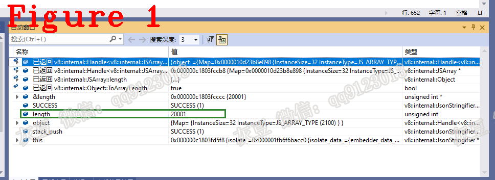

# 《Chrome V8 源码》52. 解密JSON序列化、stringify源码分析  
# 1 背景  
本文分析 Chrome V8 中 JSON.stringify() 源码，测试用例如下：  
```c++
function trigger() {
let a = [], b = [];
let s = '"'.repeat(0x800000);
a[20000] = s;
for (let i = 0; i < 10; i++) a[i] = s;
for (let i = 0; i < 10; i++) b[i] = a;

try {
    JSON.stringify(b);
} catch (hole) {
    return hole;
}
throw new Error('could not trigger');
}
let hole = trigger();
```    
为什么用这样的例子？这个例子选自 V8 漏洞 CVE-2021-38003。CVE-2021-38003 的讲解请参见即将发表的《Chrome V8 Bug》第 1 篇。    
# 2 源码分析
我以往的文章讲解过如何从字节码入手分析 V8 源码，本文不再赘言，直接给出 stringify 的源码。  
```c++
BUILTIN(JsonStringify) {
  HandleScope scope(isolate);
  Handle<Object> object = args.atOrUndefined(isolate, 1);
  Handle<Object> replacer = args.atOrUndefined(isolate, 2);
  Handle<Object> indent = args.atOrUndefined(isolate, 3);
 RETURN_RESULT_OR_FAILURE(isolate,
                          JsonStringify(isolate, object, replacer, indent));
}
```   
JavaScript 要求 stringify 的第一参数必需有，其它参数可选。结合本文测试用例，上述代码中 Object 是测试用例中的数组 b，replacer、indent 是空。 上述代码中最后一行的 JsonStringify 函数内部调用 JsonStringifier 类的成员方法 Stringify，其源码如下：  
```c++
1.  MaybeHandle<Object> JsonStringifier::Stringify(Handle<Object> object,
2.                                                 Handle<Object> replacer,
3.                                                 Handle<Object> gap) {
4.    if (!InitializeReplacer(replacer)) return MaybeHandle<Object>();
5.    if (!gap->IsUndefined(isolate_) && !InitializeGap(gap)) {
6.      return MaybeHandle<Object>();
7.    }
8.    Result result = SerializeObject(object);
9.    if (result == UNCHANGED) return factory()->undefined_value();
10.    if (result == SUCCESS) return builder_.Finish();
11.    DCHECK(result == EXCEPTION);
12.    return MaybeHandle<Object>();
13.  }
```   
上述代码第 4-7 行初始化 replacer 和 gap，其作用参见 JavaScript 规范，本文中二者为空。第 8 行代码 SerializeObject 是本文的主要内容，源码如下：  
```c++
1.    V8_INLINE Result SerializeObject(Handle<Object> obj) {
2.      return Serialize_<false>(obj, false, factory()->empty_string());
3.    }
4.  //...............分隔线........................................
5.  JsonStringifier::Result JsonStringifier::Serialize_(Handle<Object> object,
6.                                                      bool comma,
7.                                                      Handle<Object> key) {
8.  //............省略............
9.    if (object->IsJSReceiver() || object->IsBigInt()) {
10.      ASSIGN_RETURN_ON_EXCEPTION_VALUE(
11.          isolate_, object, ApplyToJsonFunction(object, key), EXCEPTION);
12.    }
13.  //............省略............
14.  //省略..............
15.    switch (HeapObject::cast(*object).map().instance_type()) {
16.  //省略.................
17.      case JS_ARRAY_TYPE:
18.        if (deferred_string_key) SerializeDeferredKey(comma, key);
19.        return SerializeJSArray(Handle<JSArray>::cast(object), key);
20.  //省略.................
21.    }
22.    UNREACHABLE();
23.  }
```   
上述代码第 2 行调用第5行的函数 Serialize_；  
第 5 行 object 是测试用例的数组 b，key 是空字符串；  
第 9 行 object 是 JSReceiver，执行 ApplyToJsonFunction，源码如下：  
```c++
1.  MaybeHandle<Object> JsonStringifier::ApplyToJsonFunction(Handle<Object> object,
2.                                                           Handle<Object> key) {
3.    Handle<Object> fun;
4.    LookupIterator it(isolate_, object, tojson_string_,
5.                      LookupIterator::PROTOTYPE_CHAIN_SKIP_INTERCEPTOR);
6.    ASSIGN_RETURN_ON_EXCEPTION(isolate_, fun, Object::GetProperty(&it), Object);
7.    if (!fun->IsCallable()) return object;
8.  //...............省略..........
9.  }
```  
上述第 4 行代码创建迭代器 it，它的作用是在原型链查找可以用做 JSON 的方法；  
第 6 行把找到的 JSON 方法赋给 fun，结合本文用例的结果是未找到；  
执行第 7 行的 return object，返回到 Serialize_ 方法。   
Serialize_ 方法第 15 行根据 object 的类型选择相应的 case，数组 b 的类型为 JS_ARRAY_TYPE，所以进入第 19 行代码，源码如下：  
```c++
1.  JsonStringifier::Result JsonStringifier::SerializeJSArray(
2.     Handle<JSArray> object, Handle<Object> key) {
3.   uint32_t length = 0;
4.   CHECK(object->length().ToArrayLength(&length));
5.   builder_.AppendCharacter('[');
6.   uint32_t i = 0;
7.   if (replacer_function_.is_null()) {
8.     switch (object->GetElementsKind()) {
9.  //省略很多.........
10.        case PACKED_ELEMENTS: {
11.          Handle<Object> old_length(object->length(), isolate_);
12.          while (i < length) {
13.            if (object->length() != *old_length ||
14.                object->GetElementsKind() != PACKED_ELEMENTS) {
15.              // Fall back to slow path.
16.              break;
17.            }
18.            Separator(i == 0);
19.            Result result = SerializeElement(
20.                isolate_,
21.                Handle<Object>(FixedArray::cast(object->elements()).get(i),
22.                               isolate_),
23.                i);
24.            if (result == UNCHANGED) {
25.              builder_.AppendCString("null");
26.            } else if (result != SUCCESS) {
27.              return result;
28.            }
29.            i++;
30.          }
31.          break;
32.        }
33.        default:
34.          break;
35.      }
36.    }
37.    if (i < length) {
38.      // Slow path for non-fast elements and fall-back in edge case.
39.      Result result = SerializeArrayLikeSlow(object, i, length);
40.      if (result != SUCCESS) return result;
41.    }
42.    return SUCCESS;
43.  }
```  
上述第 4 行代码取出数组 b 的长度值（10）；  
第 8 行代码读取数组的元素类型，并选择相应的处理程序，数组 b 的每个元素均是数组 a，其类型是 PACKED_ELEMENTS；  
第 10-32 行循环处理数组 b 中的每个元素；  
第 19 行代码 SerializeElement 方法用于处理每个元素；  
第 24-27 行代码接收 SerializeElement 的处理结果 result，result 只会是 UNCHANGED、SUCCESS 和 EXCEPTION 当中的某个值。  
SerializeElement 的源码如下：   
```c++
  V8_INLINE Result SerializeElement(Isolate* isolate, Handle<Object> object,
                                    int i) {
    return Serialize_<false>(object, false,
                             Handle<Object>(Smi::FromInt(i), isolate));
  }
```  
为什么又遇见了 Serialize_ 方法？答：**JSON 序列化的原理描述：** 结合本文用例，采用递归的方式依次序列化数组 b 的每个成员，数组 b 的成员是数组 a，数组 a 的成员是字符串。递归的结束条件是被处理对象为 JavaScript 的基本类型，也就是本文用例的字符串。  
既然又遇见了 Serialize_，那同样再次调用 SerializeJSArray 方法，前面讲 SerializeJSArray 时说过数组 b 的长度 length 的值是 10。这次调用 SerializeJSArray 时的 length 值是 20001，因为这次是数组 a，如图 1 所示。    
  
数组 a 的成元是基本类型字符串，所以在 SerializeJSArray 方法不会再进入递归，而是调用 SerializeArrayLikeSlow 进行下一步操作，源码如下：  
```c++
1.  JsonStringifier::Result JsonStringifier::SerializeArrayLikeSlow(
2.      Handle<JSReceiver> object, uint32_t start, uint32_t length) {
3.    for (uint32_t i = start; i < length; i++) {
4.      Separator(i == 0);
5.      Handle<Object> element;
6.      ASSIGN_RETURN_ON_EXCEPTION_VALUE(
7.          isolate_, element, JSReceiver::GetElement(isolate_, object, i),
8.          EXCEPTION);
9.      Result result = SerializeElement(isolate_, element, i);
10.  //省略.......................
11.    return SUCCESS;
12.  }
```
上述代码第 3 行 for 循环 20001 次，每次处理数组 a 中的一个元素；   
第 6 行取出数组 a 的第 i 个元素，使用 SerializeElement 方法序列化该元素。    
为什么又遇见了 SerializeElement？答案同上。 SerializeElement 方法中调用 Serialize_ 方法。  
数组 a 的元素是字符串，所以在 Serialize_ 方法中调用 SerializeString 方法，SerializeString方法内部又调用 SerializeString_ 方法，该方法便是序列化字符串的处理函数，源码如下：    
```c++
1.  void JsonStringifier::SerializeString_(Handle<String> string) {
2.    int length = string->length();//省略了很多代码.....................
3.      FlatStringReader reader(isolate_, string);
4.      for (int i = 0; i < reader.length(); i++) {
5.        SrcChar c = reader.Get<SrcChar>(i);
6.        if (DoNotEscape(c)) {
7.          builder_.Append<SrcChar, DestChar>(c);
8.        } else if (c >= 0xD800 && c <= 0xDFFF) {
9.          if (c <= 0xDBFF) {
10.            if (i + 1 < reader.length()) {
11.              SrcChar next = reader.Get<SrcChar>(i + 1);
12.              if (next >= 0xDC00 && next <= 0xDFFF) {
13.                builder_.Append<SrcChar, DestChar>(c);
14.                builder_.Append<SrcChar, DestChar>(next);
15.                i++;
16.              } else {
17.                builder_.AppendCString("\\u");
18.                char* const hex = DoubleToRadixCString(c, 16);
19.                builder_.AppendCString(hex);
20.                DeleteArray(hex);
21.              }  } else {
22.              builder_.AppendCString("\\u");
23.              char* const hex = DoubleToRadixCString(c, 16);
24.              builder_.AppendCString(hex);
25.              DeleteArray(hex);
26.            }
27.          } else {
28.            builder_.AppendCString("\\u");
29.            char* const hex = DoubleToRadixCString(c, 16);
30.            builder_.AppendCString(hex);
31.            DeleteArray(hex);
32.          }
33.        } else {
34.          builder_.AppendCString(&JsonEscapeTable[c * kJsonEscapeTableEntrySize]);
35.        }  }}
``` 
上代述代码第 4-35 行通过循环的方式处理每个字节；  
第 5 行 SrcChar 是 C++ 的 char 类型，每次循环取出一个字符进行转码，然后存入 builder_。至此，分析完毕。  
**技术总结**  
**（1）** 结合本文用例，采用递归的方式依次序列化数组 b 的每个成员，数组 b 的成员是数组 a，数组 a 的成员是字符串，就这样递归下去；  
**（2）** 递归的结束条件是被处理对象为 JavaScript 的基本类型，也就是本文用例的字符串。

好了，今天到这里，下次见。    
**个人能力有限，有不足与纰漏，欢迎批评指正**  
**微信：qq9123013  备注：v8交流    知乎：https://www.zhihu.com/people/v8blink**  


