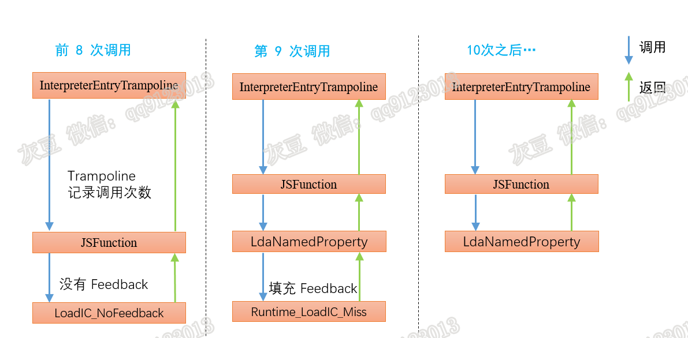

# 《Chrome V8 源码》53. Inline Cache 源码（一）   
# 1 背景  
最近正在分析 CVE-2021-30517 等几个与 Inline Cache（IC）相关的漏洞。IC 功能的代码比较多，分散在编译、JSFunction、Turbofan 等好几个地方，接下来的几篇文章将做专题讲解。本篇是第一篇，介绍 IC 的工作流程和关键节点，旨在帮助读者了解 IC 的全貌和运行原理。  
**致谢** @zh1x1an1221[twitter]、@king-hcj-16、@wang-bin-1-53、@zzzzz-41-3 （排名不分先后），我有问题时，各位总是及时回应并给予详细的解答，以后还要继续向各位多多学习，灰豆再次感谢！  
# 2 Inline Cache 介绍  
测试用例如下： 
```c++
function getfoo(obj){
 return obj.foo;
}
const o1 = {"foo":42};
const o2 = {"foo":33};
for(let i=0;i<10;i++){
 getfoo(o1);
 %DebugPrint(i);
}
getfoo(o2);
```  
本文仅围绕上述代码对 IC 进行讲解，内存肯定有局限性，但不影响我们入门学习。  
IC 是什么？  
getfoo函数执行时，V8 记录并保存调用点 (obj 的 foo 如何获得) 上的寻址方法，下次执行该函数时，直接使用寻址方法（V8 中的术语是 Handler），节省了计算寻址方法的时间，这就是 IC。IC 背后的原理是程序局部性原则，它是指程序在执行时呈现出局部性规律，即在一段时间内，整个程序的执行仅限于程序中的某一部分。  
IC 与 FeedBack 是什么关系呢？  
我的理解：IC 是一种方法，FeedBack 是这种方法的实现手段。V8 中规定了哪种 Bytecode 需要 IC 功能，在生成 SharedFunctionInfo 时就知道了有多少种 Bytecode，同时也就知道有多少个 IC 功能。例如：LdaNamedProperty 指令有 IC 功能，这个指令会把结果反馈并保存，下次再用时可以直接使用保存的结果，这个“反馈”就是 FeedBack，也就是具体实现手段。      

==========================

**注意：本文对 InterpreterEntryTrampoline的描述不准确。** 本文发表之后@Zzzzz提示 InterpreterEntryTrampoline 不负责开启 Feedback，而是由字节码 Return 开启 Feedbak，但这部分内容我还没学完，待学完再来修改本文，感谢提示。  

==========================

生成 SharedFunction 时**预定义**了 Feedback metadata 信息，使用 SharedFuncion 生成 JSFunction 也携带了该信息。V8 规定 JSFunction 执行 8 次之后才会启动 Feedback，图 1 给出了 IC 的启动过程。  
  
**InterpreterEntryTrampoline 前 8 次调用**  
代码如下：  
```c++
void Builtins::Generate_InterpreterEntryTrampoline(MacroAssembler* masm) {
 //省略   ...
   // Increment invocation count for the function.
  __ incl(
      FieldOperand(feedback_vector, FeedbackVector::kInvocationCountOffset));
//省略 ....      
}
```  
上述代码，InterpreterEntryTrampoline 负责统计 JSFunction 的调用次数，当调用次数小于 8 时执行代码的流程是：getfoo() 调用 LdaNamedProperty，LdaNamedProperty 中调用 LoadIC_BytecodeHandler。   
LoadIC_BytecodeHandler 源码如下：  
```c++
1.  void AccessorAssembler::LoadIC_BytecodeHandler(const LazyLoadICParameters* p,
2.                                                 ExitPoint* exit_point) {
3.    Label stub_call(this, Label::kDeferred), miss(this, Label::kDeferred),
4.        no_feedback(this, Label::kDeferred);
5.    GotoIf(IsUndefined(p->vector()), &no_feedback);
6.    //省略...........
7.      BIND(&no_feedback);
8.    {
9.      Comment("LoadIC_BytecodeHandler_nofeedback");
10.      // Call into the stub that implements the non-inlined parts of LoadIC.
11.      exit_point->ReturnCallStub(
12.          Builtins::CallableFor(isolate(), Builtin::kLoadIC_NoFeedback),
13.          p->context(), p->receiver(), p->name(),
14.          SmiConstant(FeedbackSlotKind::kLoadProperty));
15.    }
16.  }
```  
调用次数小于 8 时，执行 no_feedback（第 7-15 行）。  
**第 9 次调用，填充 Feedback**   
当调用第 9 次时，InterpreterEntryTrampoline 给 JSFunction 安装 Feedback（使它有效）。再次进入 LoadIC_BytecodeHandler 时调用 Runtime::kLoadIC_Miss 方法，该方法负填充 Feedback，源码如下：  
```c++
1.  RUNTIME_FUNCTION(Runtime_LoadIC_Miss) {
2.  //省略........
3.    FeedbackSlotKind kind = vector->GetKind(vector_slot);
4.    if (IsLoadICKind(kind)) {
5.      LoadIC ic(isolate, vector, vector_slot, kind);
6.      ic.UpdateState(receiver, key);
7.      RETURN_RESULT_OR_FAILURE(isolate, ic.Load(receiver, key));
8.  }
9.  }
```  
上述代码中看到了 ic.UpdateState 和 ic.Load，它们负责更新 Feedback。Load 负责两件事，第一件是正常寻址 obj.foo，第二件是把寻址方法存在 Feedback 中，源码如下：  
```c++
void IC::SetCache(Handle<Name> name, const MaybeObjectHandle& handler) {
  DCHECK(IsHandler(*handler));
  // Currently only load and store ICs support non-code handlers.
  DCHECK(IsAnyLoad() || IsAnyStore() || IsAnyHas());
  switch (state()) {
    case NO_FEEDBACK:
      UNREACHABLE();
    case UNINITIALIZED:
      UpdateMonomorphicIC(handler, name);
      break;
    case RECOMPUTE_HANDLER:
    case MONOMORPHIC:
      if (IsGlobalIC()) {
        UpdateMonomorphicIC(handler, name);
        break;
      }
      V8_FALLTHROUGH;
    case POLYMORPHIC:
      if (UpdatePolymorphicIC(name, handler)) break;
      if (UpdateMegaDOMIC(handler, name)) break;
      if (!is_keyed() || state() == RECOMPUTE_HANDLER) {
        CopyICToMegamorphicCache(name);
      }
      V8_FALLTHROUGH;
    case MEGADOM:
      ConfigureVectorState(MEGAMORPHIC, name);
      V8_FALLTHROUGH;
    case MEGAMORPHIC:
      UpdateMegamorphicCache(lookup_start_object_map(), name, handler);
      // Indicate that we've handled this case.
      vector_set_ = true;
      break;
    case GENERIC:
      UNREACHABLE();
  }
}
```  
上述代码，每个 case 代表一种 Feedback 状态，单态、多态等。单态存储一个寻址方式；多态存储 2-4 个寻址方式。SetCache 的主要功能是把 map 和寻址方式（Handler）写到 Feedback 给定的偏移位置，细节不多讲，下面看 Handler 的计算方法。    
**计算 Handler**    
寻址方法（Handler）的计算代码如下：  
```c++
1.  Handle<Object> LoadIC::ComputeHandler(LookupIterator* lookup) {
2.    switch (lookup->state()) {//省略............
3.      case LookupIterator::DATA: {
4.        if (lookup->is_dictionary_holder()) {
5.        } else if (lookup->IsElement(*holder)) {
6.        } else {
7.          DCHECK_EQ(PropertyLocation::kField,
8.                    lookup->property_details().location());
9.          {
10.            DCHECK(holder->IsJSObject(isolate()));
11.            FieldIndex field = lookup->GetFieldIndex();
12.            smi_handler = LoadHandler::LoadField(isolate(), field);
13.          }
14.        }
15.        return LoadHandler::LoadFromPrototype(isolate(), map, holder,
16.                                              smi_handler);
17.      }
18.       case LookupIterator::TRANSITION:
19.        UNREACHABLE();
20.    }
21.    return Handle<Code>::null();
22.  }
```  
上述第 12 行代码计算 Handler，本文用例的 Handler 是 SMI 类型数据，该数据的内容包括：is_inobject, offset, encoding, inobject_properties,first_inobject_offset，这内容说明了 foo 是 obj 的 inobject 属性、foo 在 obj 中的偏移等信息。计算 Handler 的源码参见 `FieldIndex FieldIndex::ForPropertyIndex(Map map, int property_index,Representation representation)`方法。  
Runtime_LoadIC_Miss 填充完 Feedback 之后返回 JSFunction，之后再执行 JSFunction 时直接从 Feedback 中获取 Handler 并取值。  
**技术总结**  
**（1）** 前 8 次调用时，使用 Builtin::kLoadIC_NoFeedback 方法读取 obj.foo，该方法每次执行都需要计算 Handler，此时 IC 无效；  
**（2）** 第 9 次 InterpreterEntryTrampoline 使 Feedback 有效（就是分配存储空间），Runtime_LoadIC_Miss 负责填充；   
**（3）** Handler 记录的内容是寻址方式，不是寻址结果，所以 getfoo(o1) 和 getfoo(o2) 的结果不会出错，因为 o1.foo 和 o2.foo 的寻址方式相同。  

好了，今天到这里，本专题未完，待续。    
**恳请批评指正，你的建议是我进步的动力！**  
**微信：qq9123013  备注：v8交流    知乎：https://www.zhihu.com/people/v8blink**  


