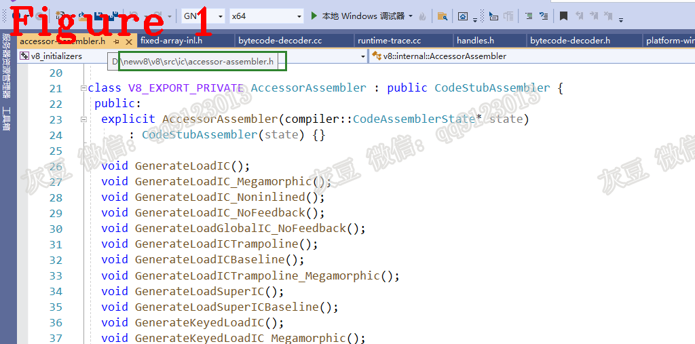
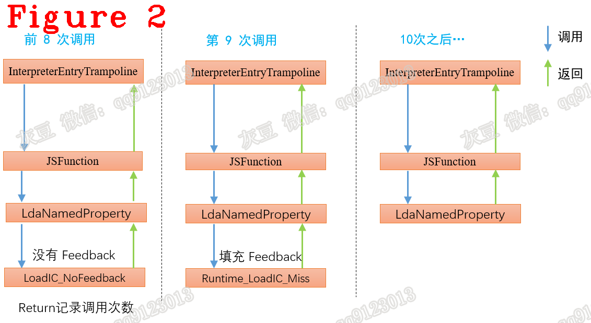
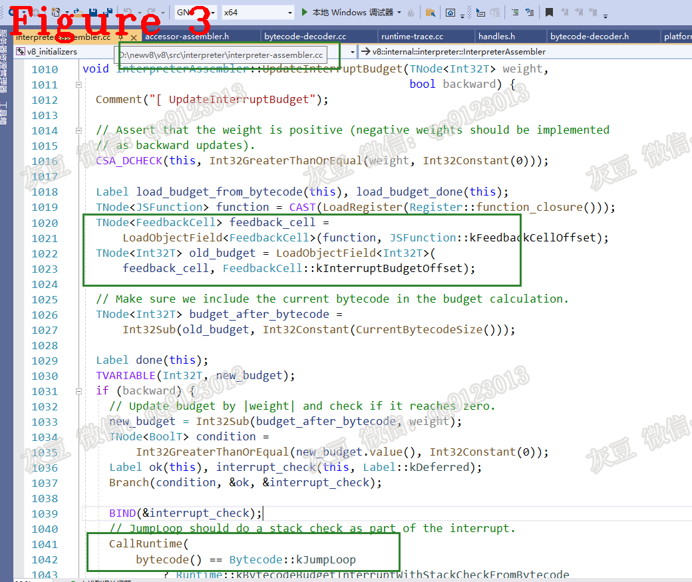

# 《Chrome V8 源码》54. Inline Cache 源码（二）   
# 1 内容介绍  
上篇文章对 IC 的工作流程做了宏观介绍，本文将详细解释它的工作流程，同时纠正上一篇文章的错误。  
# 2 IC 类型  
IC 类型，是指为数据 Load 和 Store 两种行为设计不同的 IC 存储，其目的是为了提高 cache 的工作效率（命中率）。  
图 1 给出了 V8 中的部分 IC 类型，完整的类型定义在 accessor-assembler.h 文件中，请自行查阅。  
   
图 1 可以看到，IC 类型分为 LoadIC 和 StoreIC 两大类，这两大类再细分为不同的子类型，子类型在后续文章中讲解。  
IC 工作的工作流程如图 2 所示。  
  
图 2 中纠正了第一篇文章的错误，函数的调用次数由 Return 指令统计，而不是上一篇文中说的：“InterpreterEntryTrampoline 统计”。 本文余下内容根据图 2 的工作流程序讲解关键点。   
# 3 安装 Feedbck  
在 V8 中，函数执行结束时会调用 Return 字节码，源码如下：  
```c++
IGNITION_HANDLER(Return, InterpreterAssembler) {
  UpdateInterruptBudgetOnReturn();
  TNode<Object> accumulator = GetAccumulator();
  Return(accumulator);
}
```  
其中 UpdateInterruptBudgetOnReturn 其负责统计函数调用次数，源码如下：  
```c++
void InterpreterAssembler::UpdateInterruptBudgetOnReturn() {
  const int kFirstBytecodeOffset = BytecodeArray::kHeaderSize - kHeapObjectTag;
  TNode<Int32T> profiling_weight =
      Int32Sub(TruncateIntPtrToInt32(BytecodeOffset()),
               Int32Constant(kFirstBytecodeOffset));
  UpdateInterruptBudget(profiling_weight, true);
}
```  
被调函数的字节码数量是已知的，称之为权重。在 UpdateInterruptBudget 函数中记录着 Budget 数据。Return 每执行一次，UpdateInterruptBudget 更新 Budget = Budget - 权重。当 Budget 为 0 时，为该函数安装 Feedback，详细内容参见 UpdateInterruptBudget 函数，图 3 给出了源码位置。  
  
图 3 标记的 Runtime 函数包括了 Feedback 的安装过程，请读者自行分析。
# 4 使用 Feedback 前后的区别  
执行 obj.foo 操作时，通常会使用字节码 LdaNamedProperty，该字节码会在 Feedback 中查找 foo 属性，下面说明查找过程中会发生的三种情况：  
**（1）** Feedback 未安装。   
未安装则正常在 obj 上查找 foo 属性并返回，该过程由 Builtin 方法 LoadIC_NoFeedback 实现，它的源码如下：  
```c++
1.  void AccessorAssembler::LoadIC_NoFeedback(const LoadICParameters* p,
2.                                            TNode<Smi> ic_kind) {
3.    Label miss(this, Label::kDeferred);
4.    TNode<Object> lookup_start_object = p->receiver_and_lookup_start_object();
5.    GotoIf(TaggedIsSmi(lookup_start_object), &miss);
6.    TNode<Map> lookup_start_object_map = LoadMap(CAST(lookup_start_object));
7.    GotoIf(IsDeprecatedMap(lookup_start_object_map), &miss);
8.    TNode<Uint16T> instance_type = LoadMapInstanceType(lookup_start_object_map);
9.    {
10.      Label not_function_prototype(this, Label::kDeferred);
11.      GotoIfNot(IsJSFunctionInstanceType(instance_type), &not_function_prototype);
12.      GotoIfNot(IsPrototypeString(p->name()), &not_function_prototype);
13.      GotoIfPrototypeRequiresRuntimeLookup(CAST(lookup_start_object),
14.                                           lookup_start_object_map,
15.                                           &not_function_prototype);
16.      Return(LoadJSFunctionPrototype(CAST(lookup_start_object), &miss));
17.      BIND(&not_function_prototype);
18.    }
19.    GenericPropertyLoad(CAST(lookup_start_object), lookup_start_object_map,
20.                        instance_type, p, &miss, kDontUseStubCache);
21.    BIND(&miss);
22.    {
23.      TailCallRuntime(Runtime::kLoadNoFeedbackIC_Miss, p->context(),
24.                      p->receiver(), p->name(), ic_kind);
25.    }
26.  }
```  
该函数先尝试查找 foo 属性，如果查找失败则进入第 23 行代码，使用效率最差的 Runtime 方式查找。  
**（2）** Feedback 安装了，但发生了 miss  
这次使用 Runtime 方法 Runtime_LoadIC_Miss 获取 foo 属性并更新 IC 函数，参见上一篇文章。更新后，IC 中存储的数据是 <map,handler> 的键值对，如下表所示。
|数组下标|IC对应的源码|缓存的Map和对应的IC-Hit Handler|
|:--|:--|:--|
|0|obj.foo|<map0, ic-hit handler>|
|1|this.y=y|<map1, ic-hit handler>|     

**（3）** cache 命中，在 IC 中找到了期望的数据  
判断 obj 的 map 地址 与 表中的 map0 地址是否相等，相等说明了 cache hit，handler 就是 foo 的寻址方式，计算 cache 命中的源码如下：  
```c++
1.  TNode<MaybeObject> AccessorAssembler::TryMonomorphicCase(
2.      TNode<TaggedIndex> slot, TNode<FeedbackVector> vector,
3.      TNode<Map> lookup_start_object_map, Label* if_handler,
4.      TVariable<MaybeObject>* var_handler, Label* if_miss) {
5.    Comment("TryMonomorphicCase");
6.    DCHECK_EQ(MachineRepresentation::kTagged, var_handler->rep());
7.    int32_t header_size =
8.        FeedbackVector::kRawFeedbackSlotsOffset - kHeapObjectTag;
9.    TNode<IntPtrT> offset = ElementOffsetFromIndex(slot, HOLEY_ELEMENTS);
10.    TNode<MaybeObject> feedback = ReinterpretCast<MaybeObject>(
11.        Load(MachineType::AnyTagged(), vector,
12.             IntPtrAdd(offset, IntPtrConstant(header_size))));
13.    GotoIfNot(IsWeakReferenceTo(feedback, lookup_start_object_map), if_miss);
14.    TNode<MaybeObject> handler = UncheckedCast<MaybeObject>(
15.        Load(MachineType::AnyTagged(), vector,
16.             IntPtrAdd(offset, IntPtrConstant(header_size + kTaggedSize))));
17.    *var_handler = handler;
18.    Goto(if_handler);
19.    return feedback;
20.  }
```  
上述代码得到命中结果后返回到标签 if_hanadler，它的定义在AccessorAssembler::LoadIC 方法中（**注意：** LoadIC 是 TryMonomorphicCase 的主调函数），该标签最终进入 HandleLoadICHandlerCase()，该方法将进一步分析 handler，分析过程后续讲解。  
除以上三种情况之外，还会发生 cache 未命中，cache的状态转换等等，这些会在后续文章中讲解。   
**技术总结**  
**（1）** 存储操作是 Loda 和 Store，所以 IC 也分为 Loda、Store 两大类。每一类的细分子类是为了提高 IC 的命中率；  
**（2）** 判断IC 命中的方法是比较 map 地址是否相等，相等说明 obj 的“形状”没变，还是老样子，那么从“老地方”取值也是对的；形状变了 map 一定会变，“老地方”也就不存在了。  

好了，今天到这里，本专题未完，待续。    
**恳请批评指正，你的建议是我进步的动力！**  
