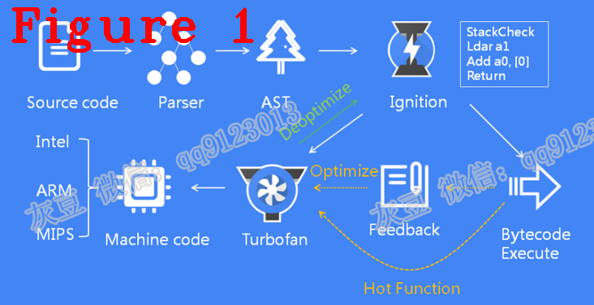
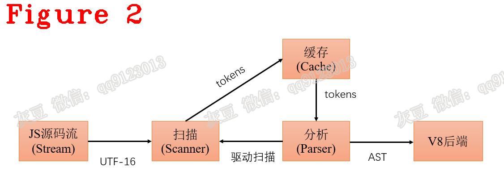
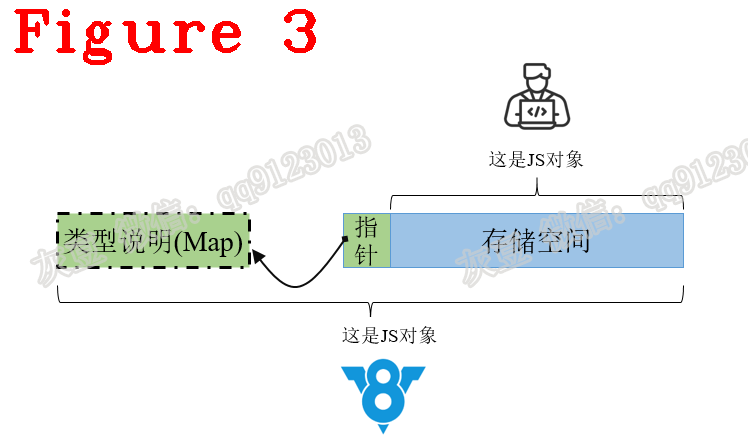
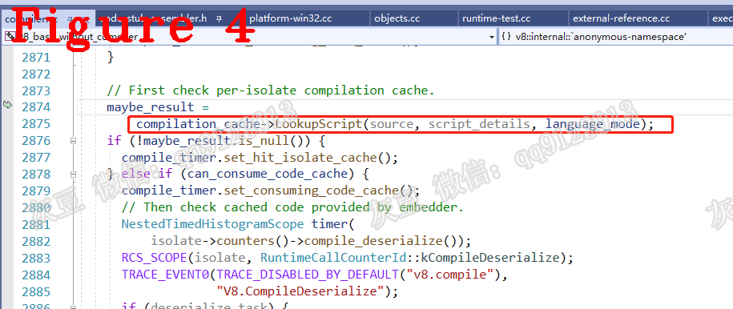
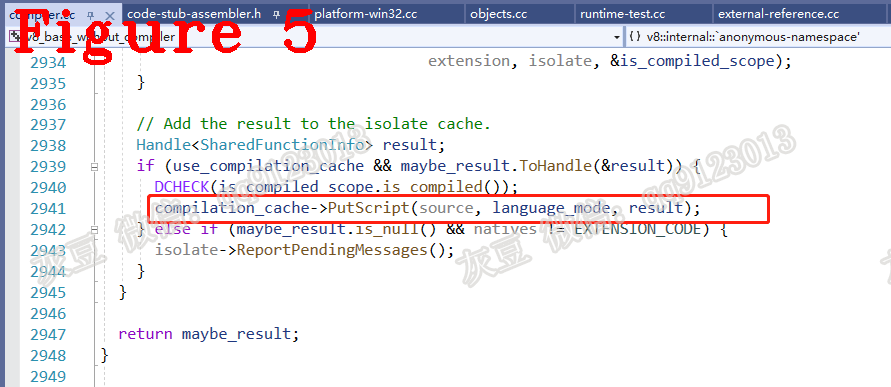
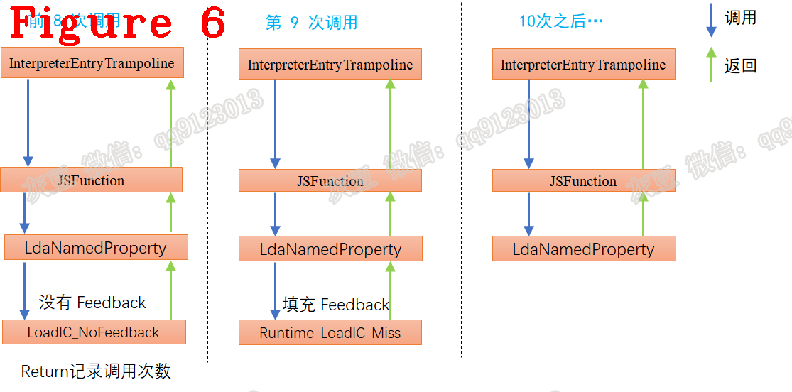

# 《Chrome V8 源码》55. 优化技术综述，如何提升 JS 运行速度  
# 1.背景  
本篇文章将为大家介绍 V8 的优化技术。同时，五月末我将在早早聊做视频直播，分享 V8 中使用的性能优化技术，本文是为了此次视频做准备，借此向各位读者征求意见，此次视频主要面向前端听众，但我不了解前端工作，更不知道听众的需求和兴趣点，请各位多多提意见、评论。  
# 2.V8 主要工作流程  
    
## 2.1 分析器（Parser）
它负责把 JavaScript 源码转换为 AST，它有两个核心功能，词法分析器（lexical analysis）负责把源码转为 token 字；语法分析器（Syntax analysis）使用 token 字生成 AST，最后再通过指令单元生成字节码。下图给出了分析器的内部工作流程：  
  
编译字节码时，词法分析器先生成一个 token 字，并放入缓存（cache），然后开始分析（parser），从缓存中取一个 token 做分析，然后生成抽象语法树的一个节点，再取下一个 token 进行分析，如此循环。如果缓存未命中(cache miss)，便启动扫描去生成新的 token。  
## 2.2 解释器（Ignition）  
Ignition 是 V8 的解释器，负责执行字节码。字节码与平台无关，也就是说无论 X86 架构或 ARM 架构，同一份 JavaScript 源码生成的字节码序列是相同的，解释器逐条读取字节码并执行。
## 2.3 优化编译（Turbofan）  
Turbofan 是 V8 的优化编译器，它使 JavaScript 执行的更快，但比Ignition需要更多的编译时间，所以 V8 只对热点函数使用 Turbofan。JavaScript 函数先由 Ignition 执行，当该函数执行次数达到设定值时变为执点函数，由 Turbofan 直接编译为本地汇编。  
图中其它模块稍后介绍。
# 3. JavaScript 动态类型  
为了更好地理解 V8 的优化技术，我们先来看看 V8 如何表达 “JavaScript 的动态类型” 。  
我们知道，JavaScript是动态类型语言，运行时数据类型会发生变化。V8 采用 C++ 编写，C++ 是强类型语言，要求类型确定。类型确定的 C++ 是如何表达类型不确定的 JavaScript 呢？答案是：C++ 申请一块内存，这块是 JavaScript 的一个对象，并约定这块内存的开始位置保存内存的解读方式，操作这块内存之前先查解读方法，通过改变解读方式来模拟 JavaScript 对象的动态变化。  
具体来说：操作 JS 数据前先查询类型，再操作。为此，V8采用了隐藏类（Hidden Class），因为 JavaScript 程序员看不到这个 class，所以称为隐藏类。**注意：** 隐藏类的术语是 Map，它的含义是地图，说明如何解读内存，不是 JavaScript Map 机制。  
   
（1） 开发者角度，仅能看到存储空间，这段存储空间保存了开发者定义的 JavaScript 对象；  
（2） 指针，它是存储空间的第一个位置，类型是指针，大小8byte（64位系统中），由V8维护，开发者看不到，它的作用是指向 Map；   
（3） V8角度，查询存储空间的第一个位置，就可以找到Map。这个Map大小是80byte，存储信息的格式与位置也是固定的，存储信息包括：JavaScript 对象的存储空间有哪些成员，成员类型，成员偏移地址等。所以说，Map 就是地图。    
V8 通过查询 Map，可以知道存储空间内存放了什么，怎么存放的，进而正确操作该对象。    

总结：V8 利用类型确定的 Map（c++实现的class对象）管理 JavaScript 的动态对象。
# 4. 缓存技术与开发建议  
V8 以 JavaScript 函数为粒度进行优化，V8 的编译缓存、inline 缓存等优化技术的操作对象是函数。下面说说给开发者的建议，以及建议背后的原理。 
## 4.1 不要改变代码的行为
开发者最好“什么也不做”， JavaScript 程序设计好之后就不要再随意变动，这里强调的是：程序在运行期间的行为不要变动，包括它的执行路径、对象内部结构等等不要总发生变化。缓存技术依赖程序局部性原则，因此“什么都不做”是保证缓存高效工作的最佳方式。  
**（1）** 编译缓存  
编译缓存用于保存编译后的结果，当下次再执行该方法可以省去编译过程。
```c++
if (Math.random() > 0.5) {
  A();
} else {
  B();
}
```  
V8 使用了lazy 编译技术，不执行的函数不编译。所以，仅 A() 或 B() 被编译并执行，并填充到代码缓存中，另一个函数被执行时才会被编译。如果这个程序不发生变化，代码缓存就会命中，免去编译过程。我们来简单看一下 V8 中的相关源码。  
  
上图中的标记是在查询 cache，命中则直接返回结果，无需再编译。  

上图中的标记将编译结果填充进 cache，以备后续使用。cache 的数据结构是 hash table   
**（2）** 内联缓存（inline cache）  
```c++
function getfoo(obj){
 return obj.foo;
}
const o1 = {"x":42,"y":43,"foo","41"};
for(let i=0;i<10;i++){
 getfoo(o1);
}
getfoo(o2); 
```
inline cache的作用：getfoo函数执行时，V8 先读取 obj 的 Map，找到 foo 的偏移量，然后才能获取 foo。我们把获取 foo 偏移量的过程称为寻址方法，inline cache 负责缓存寻址方法，下次执行该函数时，直接使用寻址方法（V8 中的术语是 Handler），节省了计算寻址方法的时间，这就是 inline cache，它依赖的也是是程序局部性原则，它是指程序在执行时呈现出局部性规律，即在一段时间内，整个程序的执行仅限于程序中的某一部分。
inline cache 希望开发者不要变动 o1 结构，更希望开发者对 o1 的读写操作是固定。具体在本例中，希望你只对 foo 操作，inline cache 只需保存属性 foo 的寻址方式即可，如果经常增加或删除 o1 的内部成员，inline cache 保存的东西越来多越，就会增加很多不必要的判断过程，影响性能。
inline cache 提升了 JavaScript 的运行性能，但对于使用次数较少的 JavaScript 函数使用 inline cache 不会带来太多的性能，反而影响 V8 的性能。所以 V8 规定函数调用次数超过 8 次时才开启 inline cache，如下图：   

和编译缓存一样，inlinecache 也有查找（lookup）和填充（put）操作。  
**（3）** Turbofan 优化编译  
Turbofan 是 V8 的优化编译机制，Turbofan 使 JavaScript 执行的更快，但也需要更多的编译时间，所以 V8 只对热点函数使用 Turbofan。Turbofan 采用了“投机”方式来达到提升效率的目的，以下面的代码为例解释“投机”，并说明这种方式为什么不希望程序行为变化。  
```
function add(x,y){
    return x+y;
}
console.log(add(1,2));
console.log(add("hello ","world"));
```  
我们知道 add() 是多态的，对于数值是数学加法运算，对于字符串是拼接操作，字符串和数值的加法则是先把数值转换为字符串，再做拼接操作。“灵活”也意味着效率不高，因为要事先判断数据类型、越界检测等等...
“投机”的本质还是程序局部性原则，Turbofan 针对 add(1,2) 优化时，它笃定你的 add() 只用于整数加法运行，把其编译为本地机器码的加法运算，去掉了各种不必要的判断。针对 add("hello ","world") 优化时，把其编译为字符串的拼接操作。
add() 的多态方便了开发者，减少了代码量，但如果 add() 毫无规律地在不同操作数之间使用，会导致优化效果很差，所以 Turbofan 不希望程序行为变化。
## 4.2 如何组织代码，才能更高效  
**（1）** 动、静代码分离  
JavaScript 脚本的任何变动都会导致整个脚本的缓存失效，所以需要经常变动的脚本最好放到单独的脚本文件中，例如：库和业务逻辑，业务逻辑代码的改变会使库代码的缓存也无效。  
**（2）** 根据重要性、使频次、多态等因素区分
影响代码缓存效果的因素有很多，以下两点是最常见的因素：   
1.A 和 B 是两个方法， A 调用 B 且它两不在同一脚本文件中，代码缓存可能只存了 A 所在的脚本。  
2.lazy 编译，暂不执行的函数不被缓存，如果脚本中存在大量暂不执行的函数，那缓存的效果也不好。
提升工作效率的简单方法是把所有 JavaScript 写成一个脚本文件，这样可以保证缓存的命中率，这与第一条建议相反。不建议这样做，因为除了代码缓存，还要考虑网络请求、流式编译、页面交互等多方面因素。      

好了，今天到这里。    
**恳请批评指正，你的建议是我进步的动力！**    
**微信：qq9123013  备注：v8交流    知乎：https://www.zhihu.com/people/v8blink**
