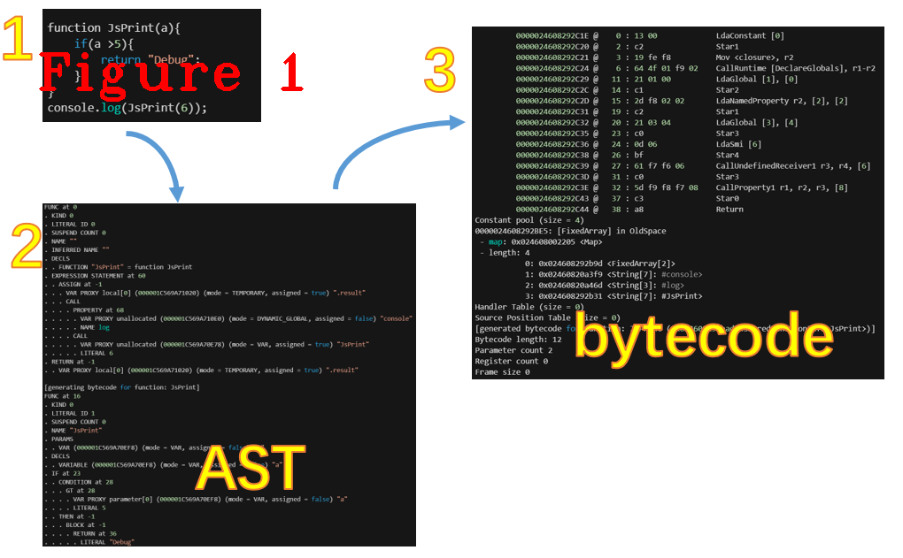
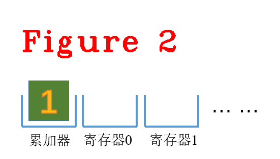
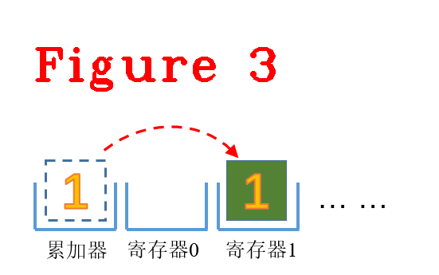
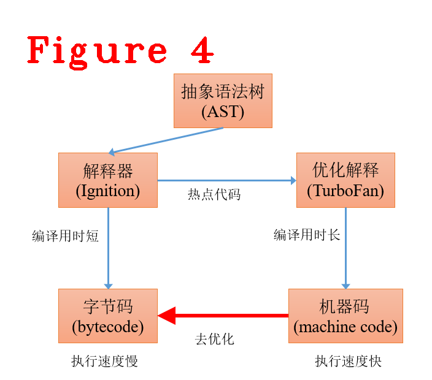
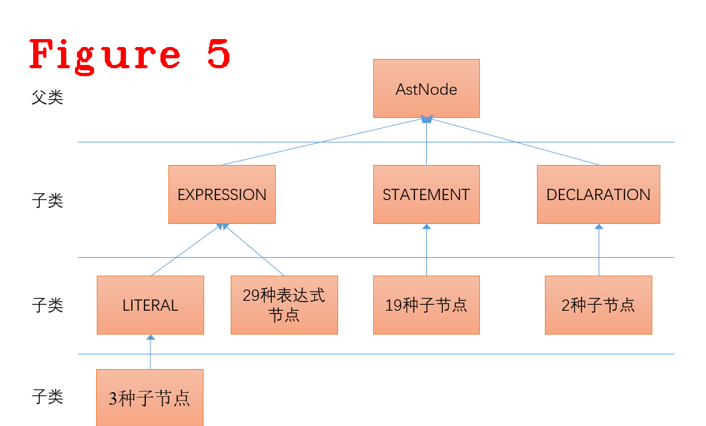
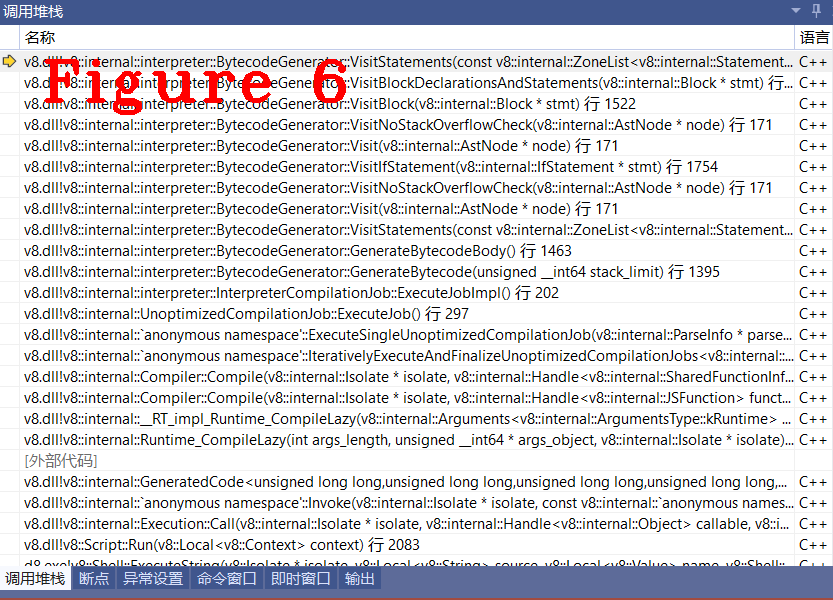

# 连载《Chrome V8 原理讲解》第六篇 bytecode字节码生成


# 1.摘要  
本次是第六篇，讲解V8中抽象语法树(abstract syntax code,AST)到字节码(bytecode)的翻译过程。AST是源代码的抽象语法结构的树状表示，是语法分析的输出结果，bytecode是一种体系结构无关的、在V8中可以运行的抽象机器码，不依赖指令集。本文中，我们以AST作为V8输入，从AST生成后开始调试(Debug)，讲解bytecode生成过程，分析核心源码和重要数据结构，如图1所示。本文内容的组织方式：介绍字节码，讲解字节码原理，如何看懂字节码(章节2)；AST到bytecode的翻译过程、源码分析(章节3)。  

# 2.字节码介绍
字节码是机器码的抽象表示，采用和物理CPU相同的计算模型进行设计。字节码是最小功能完备集，JavaScript源码的任何功能都可以等价转换成字节码的组合。V8有数以百计的字节码，例如`Add`和`Sub`等简单操作，还有`LdaNamedProperty`等属性加载操作。每个字节码都可以指定寄存器作为其操作数，生成字节码的过程中使用寄存器 r0，r1，r2，... 和累加寄存器（accumulator register）。累加器是和其它寄存器一样的常规寄存器，但不同的是累加器的操作没有显式给出指令，具体来说，`Add r1`将寄存器`r1`中的值和累加器中的值进行加法运算，在这个过程不需要显示指出累加器。字节码的定义在v8/src/interpreter/bytecodes.h中，下面展示一部分相关源码。  
```c++
#define BYTECODE_LIST_WITH_UNIQUE_HANDLERS(V)                                  \
  /* Extended width operands */                                                \
  V(Wide, ImplicitRegisterUse::kNone)                                          \
  V(ExtraWide, ImplicitRegisterUse::kNone)                                     \
                                                                               \
  /* Debug Breakpoints - one for each possible size of unscaled bytecodes */   \
  /* and one for each operand widening prefix bytecode                    */   \
  V(DebugBreakWide, ImplicitRegisterUse::kReadWriteAccumulator)                \
  V(DebugBreakExtraWide, ImplicitRegisterUse::kReadWriteAccumulator)           \
  V(DebugBreak0, ImplicitRegisterUse::kReadWriteAccumulator)                   \
  V(DebugBreak1, ImplicitRegisterUse::kReadWriteAccumulator,                   \
    OperandType::kReg)                                                         \
  V(DebugBreak2, ImplicitRegisterUse::kReadWriteAccumulator,                   \
    OperandType::kReg, OperandType::kReg)                                      \
  V(DebugBreak3, ImplicitRegisterUse::kReadWriteAccumulator,                   \
    OperandType::kReg, OperandType::kReg, OperandType::kReg)                   \
  V(DebugBreak4, ImplicitRegisterUse::kReadWriteAccumulator,                   \
    OperandType::kReg, OperandType::kReg, OperandType::kReg,                   \
    OperandType::kReg)                                                         \
  V(DebugBreak5, ImplicitRegisterUse::kReadWriteAccumulator,                   \
    OperandType::kRuntimeId, OperandType::kReg, OperandType::kReg)             \
  V(DebugBreak6, ImplicitRegisterUse::kReadWriteAccumulator,                   \
    OperandType::kRuntimeId, OperandType::kReg, OperandType::kReg,             \
    OperandType::kReg)                                                         \
                                                                               \
  /* Side-effect-free bytecodes -- carefully ordered for efficient checks */   \
  /* - [Loading the accumulator] */                                            \
  V(Ldar, ImplicitRegisterUse::kWriteAccumulator, OperandType::kReg)           \
  V(LdaZero, ImplicitRegisterUse::kWriteAccumulator)                           \
  V(LdaSmi, ImplicitRegisterUse::kWriteAccumulator, OperandType::kImm)         \
  V(LdaUndefined, ImplicitRegisterUse::kWriteAccumulator)                      \
  V(LdaNull, ImplicitRegisterUse::kWriteAccumulator)                           \
  V(LdaTheHole, ImplicitRegisterUse::kWriteAccumulator)                        \
  V(LdaTrue, ImplicitRegisterUse::kWriteAccumulator)                           \
  V(LdaFalse, ImplicitRegisterUse::kWriteAccumulator)                          \
  V(LdaConstant, ImplicitRegisterUse::kWriteAccumulator, OperandType::kIdx)    \
  V(LdaContextSlot, ImplicitRegisterUse::kWriteAccumulator, OperandType::kReg, \
    OperandType::kIdx, OperandType::kUImm)                                     \
  V(LdaImmutableContextSlot, ImplicitRegisterUse::kWriteAccumulator,           \
    OperandType::kReg, OperandType::kIdx, OperandType::kUImm)                  \
  V(LdaCurrentContextSlot, ImplicitRegisterUse::kWriteAccumulator,             \
    OperandType::kIdx)                                                         \
  V(LdaImmutableCurrentContextSlot, ImplicitRegisterUse::kWriteAccumulator,    \
    OperandType::kIdx)                                                         \
  /* - [Register Loads ] */                                                    \
  V(Star, ImplicitRegisterUse::kReadAccumulator, OperandType::kRegOut)         \
  V(Mov, ImplicitRegisterUse::kNone, OperandType::kReg, OperandType::kRegOut)  \
  V(PushContext, ImplicitRegisterUse::kReadAccumulator, OperandType::kRegOut)  \
  V(PopContext, ImplicitRegisterUse::kNone, OperandType::kReg)                 \
  /* - [Test Operations ] */                                                   \
  V(TestReferenceEqual, ImplicitRegisterUse::kReadWriteAccumulator,            \
    OperandType::kReg)                                                         \
  V(TestUndetectable, ImplicitRegisterUse::kReadWriteAccumulator)              \
  V(TestNull, ImplicitRegisterUse::kReadWriteAccumulator)                      \
  V(TestUndefined, ImplicitRegisterUse::kReadWriteAccumulator)                 \
  V(TestTypeOf, ImplicitRegisterUse::kReadWriteAccumulator,                    \
    OperandType::kFlag8)                                                       \
//.........省略很多.....
```
上面这段代码是字节码的宏定义，用语句`V(Ldar, ImplicitRegisterUse::kWriteAccumulator, OperandType::kReg)`举例说明，`Ldar`是加载数据到累加器，`ImplicitRegisterUse::kWriteAccumulator, OperandType::kReg`说明了`Ldar`指令的源操作数和目的操作数，具体讲两条字节码的含义，如下：  
**（1）** LdaSmi [1]，这里的[1]是Smi小整型(small int)常量，加载到累加器中，如图2所示。  
  
**（2）** Star r1，这里的r1是r1寄存器，把累加器中的值写入到r1寄存器，目前累加器的值为1，执行完后r1的值为1，如图3所示。  
  
其它字节码指令参见V8的指令定义文件，这里不再赘述。V8为了提升性能，会把多次执行的字节码标记为热点代码，使用优化编译器(TurboFan)把热点代码翻译成机器相关的本地指令，达到提高运行效率的目的，如图4所示。  
  
解释器将AST翻译成字节码比TurboFan用时更短，对于运行次数较少的代码非常合适，即不在运行次数较少的代码上付出更高的编译代价。TurboFan则是对常用代码（热点代码）进行本地化编译，生成体系结构相关的机器码，这需要更长的编译时间，换来的是更快的执行速度。  
去优化，是将机器码转成字节码，为什么要这样做？原因有很多，详细原因参见TurboFan的定义文件。这里说一个与技术开发人员相关的原因：调试javascript源码，对源码进行调试时，需要转回字节码。  
# 3.字节码生成
聊字节码生成之前，先要看明白AST树的结构，明白了AST树结构，也就知道了字节码生成其实是遍历树的过程，落地到程序上就是一个有限状态自动机，具体实现就是`switch case`配合一些预设的宏定义模板，图5给出了AST的数据结构。  
  
AST树的每个节点都继承自`AstNode`这个类，可以说一切皆“AstNode”。`AstNode`的成员方法是最多的，在众多方法中，AstNode的`NodeType`方法无疑是最重要的，因为把一个AstNode节点翻译成字节码时，首先，根据`NodeType`把父类AstNode转成具体的子类，比如，转成表达式(ExPRESSION)或语句(STATEMENT)；其次，才能读取相应的数据、生成字节码，下面的代码是AstNode转成Assignment的具体实现。
```C++
void BytecodeGenerator::VisitAssignment(Assignment* expr) {
  AssignmentLhsData lhs_data = PrepareAssignmentLhs(expr->target());

  VisitForAccumulatorValue(expr->value());

  builder()->SetExpressionPosition(expr);
  BuildAssignment(lhs_data, expr->op(), expr->lookup_hoisting_mode());
}
```  
在这段代码中，计算`expr->target(),expr->value(),expr->op()`时可能会发生递归调用，因为表达式内可以包含多个子表达式。
```c++
void BytecodeGenerator::GenerateBytecodeBody() {
  // Build the arguments object if it is used.
  VisitArgumentsObject(closure_scope()->arguments());
  // Build rest arguments array if it is used.
  Variable* rest_parameter = closure_scope()->rest_parameter();
  VisitRestArgumentsArray(rest_parameter);
  // Build assignment to the function name or {.this_function}
  // variables if used.
  VisitThisFunctionVariable(closure_scope()->function_var());
  VisitThisFunctionVariable(closure_scope()->this_function_var());
  // Build assignment to {new.target} variable if it is used.
  VisitNewTargetVariable(closure_scope()->new_target_var());
  // Create a generator object if necessary and initialize the
  // {.generator_object} variable.
  FunctionLiteral* literal = info()->literal();
  if (IsResumableFunction(literal->kind())) {
    BuildGeneratorObjectVariableInitialization();
  }
  // Emit tracing call if requested to do so.
  if (FLAG_trace) builder()->CallRuntime(Runtime::kTraceEnter);
  // Emit type profile call.
  if (info()->flags().collect_type_profile()) {
    feedback_spec()->AddTypeProfileSlot();
    int num_parameters = closure_scope()->num_parameters();
    for (int i = 0; i < num_parameters; i++) {
      Register parameter(builder()->Parameter(i));
      builder()->LoadAccumulatorWithRegister(parameter).CollectTypeProfile(
          closure_scope()->parameter(i)->initializer_position());
    }
  }
  // Increment the function-scope block coverage counter.
  BuildIncrementBlockCoverageCounterIfEnabled(literal, SourceRangeKind::kBody);
  // Visit declarations within the function scope.
  if (closure_scope()->is_script_scope()) {
    VisitGlobalDeclarations(closure_scope()->declarations());
  } else if (closure_scope()->is_module_scope()) {
    VisitModuleDeclarations(closure_scope()->declarations());
  } else {
    VisitDeclarations(closure_scope()->declarations());
  }
  // Emit initializing assignments for module namespace imports (if any).
  VisitModuleNamespaceImports();
  // The derived constructor case is handled in VisitCallSuper.
  if (IsBaseConstructor(function_kind())) {
    if (literal->class_scope_has_private_brand()) {
      BuildPrivateBrandInitialization(builder()->Receiver());
    }

    if (literal->requires_instance_members_initializer()) {
      BuildInstanceMemberInitialization(Register::function_closure(),
                                        builder()->Receiver());
    }
  }
  // Visit statements in the function body.
  VisitStatements(literal->body());
  // Emit an implicit return instruction in case control flow can fall off the
  // end of the function without an explicit return being present on all paths.
  if (!builder()->RemainderOfBlockIsDead()) {
    builder()->LoadUndefined();
    BuildReturn(literal->return_position());
  }
}
```  
上面的函数是生成bytecode的入口，最终进入`VisitStatements(literal->body());`，从这里开始生成bytecode，在生成byteocde之前要先使用`AstNode->XXXtype()`获取子类的具体类型，下面给出`XXXtype`的具体实现。
```C++
#define DECLARATION_NODE_LIST(V) \
  V(VariableDeclaration)         \
  V(FunctionDeclaration)

#define ITERATION_NODE_LIST(V) \
  V(DoWhileStatement)          \
  V(WhileStatement)            \
  V(ForStatement)              \
  V(ForInStatement)            \
  V(ForOfStatement)

#define BREAKABLE_NODE_LIST(V) \
  V(Block)                     \
  V(SwitchStatement)

#define STATEMENT_NODE_LIST(V)       \
  ITERATION_NODE_LIST(V)             \
  BREAKABLE_NODE_LIST(V)             \
  V(ExpressionStatement)             \
  V(EmptyStatement)                  \
  V(SloppyBlockFunctionStatement)    \
  V(IfStatement)                     \
  V(ContinueStatement)               \
  V(BreakStatement)                  \
  V(ReturnStatement)                 \
  V(WithStatement)                   \
  V(TryCatchStatement)               \
  V(TryFinallyStatement)             \
  V(DebuggerStatement)               \
  V(InitializeClassMembersStatement) \
  V(InitializeClassStaticElementsStatement)

#define LITERAL_NODE_LIST(V) \
  V(RegExpLiteral)           \
  V(ObjectLiteral)           \
  V(ArrayLiteral)

#define EXPRESSION_NODE_LIST(V) \
  LITERAL_NODE_LIST(V)          \
  V(Assignment)                 \
  V(Await)                      \
  V(BinaryOperation)            \
//............代码太长，省略很多
  V(YieldStar)

#define FAILURE_NODE_LIST(V) V(FailureExpression)

#define AST_NODE_LIST(V)                        \
  DECLARATION_NODE_LIST(V)                      \
  STATEMENT_NODE_LIST(V)                        \
  EXPRESSION_NODE_LIST(V)
//=========分隔线===============================
#define GENERATE_VISIT_CASE(NodeType)                                   \
  case AstNode::k##NodeType:                                            \
    return this->impl()->Visit##NodeType(static_cast<NodeType*>(node));

#define GENERATE_FAILURE_CASE(NodeType) \
  case AstNode::k##NodeType:            \
    UNREACHABLE();
//=========分隔线===============================
#define GENERATE_AST_VISITOR_SWITCH()        \
  switch (node->node_type()) {               \
    AST_NODE_LIST(GENERATE_VISIT_CASE)       \
    FAILURE_NODE_LIST(GENERATE_FAILURE_CASE) \
  }

#define DEFINE_AST_VISITOR_SUBCLASS_MEMBERS()               \
 public:                                                    \
  void VisitNoStackOverflowCheck(AstNode* node) {           \
    GENERATE_AST_VISITOR_SWITCH()                           \
  }                                                         \
                                                            \
  void Visit(AstNode* node) {                               \
    if (CheckStackOverflow()) return;                       \
    VisitNoStackOverflowCheck(node);                        \
  }                                                         \
```
上述代码中，隔开的三部分代码，组成了AstNode中所有类型(NodeType)的switch语句，第一部分代码和图5的节点类型一一对应。
```c++
void BytecodeGenerator::VisitStatements(
    const ZonePtrList<Statement>* statements) {
  for (int i = 0; i < statements->length(); i++) {
    // Allocate an outer register allocations scope for the statement.
    RegisterAllocationScope allocation_scope(this);
    Statement* stmt = statements->at(i);
    Visit(stmt);
    if (builder()->RemainderOfBlockIsDead()) break;
  }
}
```
上述代码是bytecode生成的入口，请读者使用图1的样例代码自行跟踪，图6给出`VisitStatements`的函数调用堆栈。  
  
V8中AST到字节码的翻译过程，与编译LLVM中AST到三地址码的翻译相似，读者可自行查阅编译技术相关资料。
好了，今天到这里，下次见。   
**恳请读者批评指正、提出宝贵意见**  
**微信：qq9123013  备注：v8交流    邮箱：v8blink@outlook.com**


