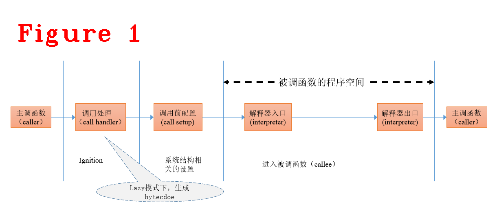
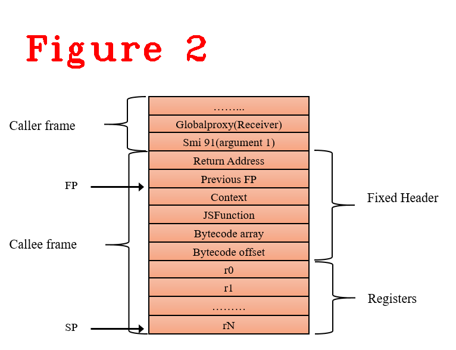
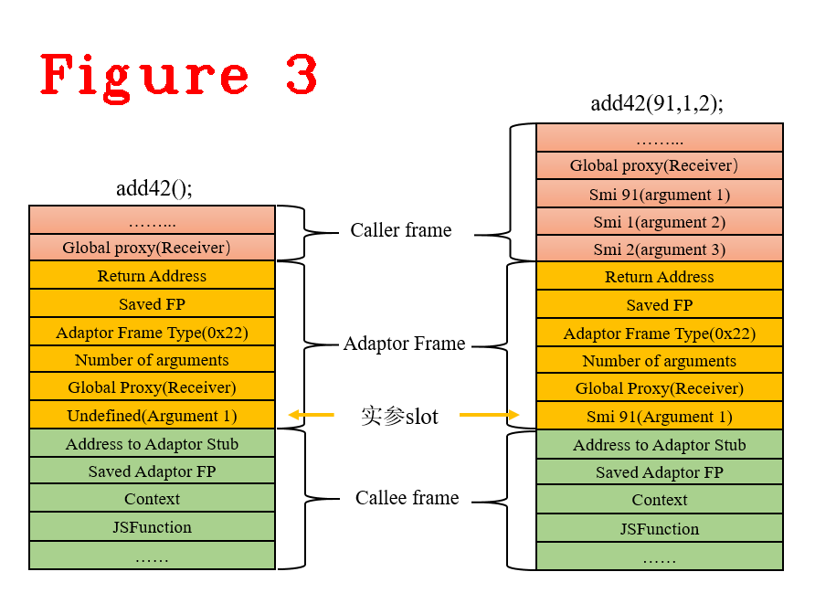
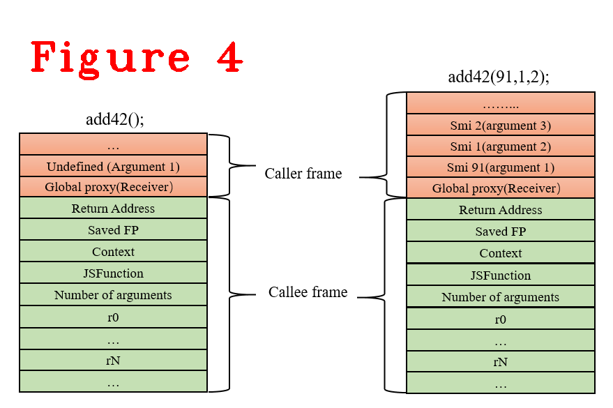

# 连载《Chrome V8 原理讲解》第七篇 V8堆栈框架 Stack Frame 


# 1 摘要   
本文是第七篇。讲解v8处理函数调用时的底层架构。通过分析运行时函数堆栈，重点对“实际参数少于声明参数”和“实际参数多于声明参数”两种函数调用的stack frame进行详细分析，解释这两种调用方式为什么没有发生堆栈泄露，还能稳定运行、生成正确结果的原因，借此阐述v8堆栈的设计细节。  
本文中把“实际参数少于声明参数”和“实际参数多于声明参数”称为**实参不匹配**，“实参与函数声明的形参数量相同”称为**正常调用**。本文的组织方式：v8 stack frame介绍（章节2）；stack frame的先导知识--寄存器与参数编码（章节3）；v8刚淘汰的adaptor frame机制（章节4）；v8最新的stack frame机制（章节5）。   
**关键词：stack frame，caller，callee，bytecode，adaptor frame**  

# 2 stack frame介绍  
v8在调用函数（callee）之前都会把实际参数压栈，callee会把局部变量压栈。stack frame是一块保留区域，用于存放实参、callee的返回值、局部变量和寄存器。stack frame的创建步骤如下：  
**（1）** callee的实际参数。如果有，压栈。  

**（2）** callee的返回地址压栈。  

**（3）** callee开始执行，EBP压栈。  

**（4）** 设置EBP等于ESP。*注：EBP现在代表callee的栈基址。*   

**（5）** 如果有局部变量，修改ESP预留栈空间。  

**（6）** 如果需要保存寄存器，压栈。  
以上六步是常规的函数调用堆栈构建过程，看下面的样例代码，是正常的函数调用。
```javascript
function add42(x) {
  return x + 42;
}
add42(91);
```
`add42(x)`在V8中的执行过程如图1所示。*注:不考虑优化技术*  
  
图1中，在lazy mode（相关概念参见第五篇文章）情况下，当callee初次执行时，Ignition才生成它的bytecode，安装与体系结构相关的配置，进入callee空间执行，最后再返回到caller。bytecode生成后，开始执行`add42(x)`，stack frame如图2。  
  
图2是callee执行时的stack frame，构建过程由V8中的`InterpreterPushArgsThenCall`负责，`add42(x)`定义时声明了一个参数，调用时也是传入了一个实参91，这是一个正常的函数调用，调用结束后正常退出，正常清理堆栈。看下面两种非常普遍的情况：  

**（1）** 调用函数不传实参，`add42()`  

**（2）** 调用函数传入多个实参，`add42(91,1,2)`  

这两种情况属于“实参不匹配”，在sloppy mode下不会报错，正常执行，`add42(91,1,2)`还会返回正确的结果133。众所周知，“实参不匹配”时，calee退出时可能发生堆栈泄露。本文剩余篇幅讲解V8如何做到“实参不匹配”的正确运行，既能有正确的返回结果(133)，又不发生堆栈泄露。  
# 3 寄存器与参数编码  
了解bytecode中寄存器和函数参数的编码方式，有助于理解stack frame的原理。调用`add42(91)`生成的bytecode如下：  
```c++
0d              LdaUndefined              //加载undefined到累加器
26 f9           Star r2                   //累加器的值存入r2寄存器
13 01 00        LdaGlobal [1]             //加载全局指针(add42)到累加器
26 fa           Star r1                   //累加器的值存入r1
0c 03           LdaSmi [91]               //加载小整型数91到累加器
26 f8           Star r3                   //累加器的值存入r3
5f fa f9 02     CallNoFeedback r1, r2-r3  //调用add42(x)
```   
寄存器用非负单字节整数编码，r1的编码是fa，r2是f9，以此类推。`5f fa f9 02     CallNoFeedback r1, r2-r3`中，`fa`代表r1寄存器，`f9`代表r2寄存器，`02`表示长度为2，`f9 02`联合表示：以r2开始，长度为2的寄存器列表。  

```c++
25 02             Ldar a0          //加载第一个参数到累加器
40 2a 00          AddSmi [42]      //累加器 +=42
ab                Return           //返回累加器
```  
上面是执行`add42(x)`函数的bytecode，第一个参数（a0）的数字编码是02。  
这种编码其实是stack frame的偏移量，见图2，fa补码（two's complement）是6，FP减6正好是r1寄存器，a0补码是2，FP加2正好是第一个实参91。这种编码方式的优点：通过简单的FP加减操作，实现了对参数和寄存器的快速访问，简化了字节码的设计。**注意：** 由于v8版本更新迭代快，不同版v8的编码实现存在细微差别，但编码思路是相同的，并且v8中规定了寄器存访问公式：r[i]=FP-2-kFixedFrameHeaderSize-i，参数访问公式：a[i]=FP+2+parameter_count-i-1，parameter_count表示参数的数量。
# 4 adaptor frame机制  
沿用多年的adaptor frame机制已经被淘汰，但了解adaptor frame机制，有助理解v8中新stack frame机制的原理和设计初衷。下面是“实参不匹配”的调用:  
```c++
add42()
add42(91,1,2,)
```  
众所周知，`add42()`的结果是undefined+42=NaN；`add42(91,1,2)`的结果是91+42=133；这两个函数都正常执行，没发生堆栈泄露，并且返回结果133，图3给出了stack frame的镜像。  
  
与图2对比，可知stack frame中新增了adaptor frame结构(黄色标记)。adaptor frame中有两个重要数据：  
**（1）**Number of arguments，它记录了`add42(x)`调用时的参数数量。这个数值在编译期，通过查询对应的JSFunction获得，对于`add42(x)`，它的值为1。  
**（2）**实参slot，存储了`add42(x)`调用时传入的实参，数量由Number of arguments决定。  
在执行`add42()`时，缺少一个实参，用一个Undefined填充实参slot，见图3中左侧的stack frame。  
另一个`add42(91,1,2)`中，虽然入栈三个实数，但根据Number of arguments得知，只需要一个实参，取第一个参数91填充实参slot。  
之后，进入`add42(x)`开始执行，它所需要的实数从Adaptor Frame中读取的，和Caller Frame没有关系。`add42(x)`执行时可以准确地读取实数，Undefinded或91，这变成了正常调用。  
总结，Adaptor Frame的作用是改变“实参不匹配”为“正常调用”，其本质是caller和callee之间的纽带，负责计算存callee所需要的实参，并从caller中取来，缺失时用undefined补上，多余的忽略。入压时已经保存了Saved FP和Saved Adaptor FP，callee退栈到Adaptor Frame，Adaptor Frame退栈到caller，所以不会发生堆栈泄露。  
为什么v8淘汰Adaptor Frame？因为性能损耗，调用一次callee，要发生两次stack Frame构建，一次是构建Adaptor Frame，另一次是构建callee Frame，这是很耗时的，所以要淘汰。  
# 5 最新的stack frame机制  
出于性能优化的考虑，2021年初，服役多年的adaptor frame退出了历史舞台，新版stack frame机制如图4所示。  
  
它的创新点是省去adaptor frame，将函数调用时的堆栈构建减少一次，但保留Number of Arguments。   
新版stack frame机制必须满足以下四点要求，这更是v8团队设计这种新stack frame机制的初衷：  
**（1）** 满足章节2中介绍的用偏移量访问参数和寄存器的方式。  

**（2）** 必须能处理“实参不匹配”的函数调用，`add42()`和`add42(91,1,2)`都可以正常执行。 

**（3）** callee退出，实现堆栈正常清理，这是必须的！ 

**（4）** 抛弃adaptor frame，因为它太消耗性能。 

下面详细说明图4的新stack frame机制如何满足以上四点要求：  
针对第(1)点要求，入压方式不变，编码方式不变，一定满足，读者可以计算验证，不再赘述。  

针对第(2)点要求，Number of arguments的作用与上面的一样，记录callee需要的实参数量，`add42(x)`的Number of arguments是1。v8约定：callee的实参由右向左压入caller Frame，压入数量取实际数量和Number of arguments的最大值。`add42(91,1,2)`调用时，实际数量是3(91,1,2)个，入栈3个实参，依次为2,1,91。`add42()`调用时，实际数量是0个，Number of arguments是1，要入栈1个实参，用Undefined填充。进入`add42(x)`执行，它可以得到期望的参数(91或Undefined)，此需求满足。  

针对第(3)点要求，图4中入栈方式是常规的入栈，所以退出时不存在任何问题。  

针对第(4)点要求，已经满足了，adaptor frame suddenly disappeared!!!   
下面给出上述功能的关键入口函数，供读者复现学习。  
```c++
void Builtins::Generate_InterpreterPushArgsThenCallImpl(
    MacroAssembler* masm, ConvertReceiverMode receiver_mode,
    InterpreterPushArgsMode mode) {
  DCHECK(mode != InterpreterPushArgsMode::kArrayFunction);
  // ----------- S t a t e -------------
  //  -- rax : the number of arguments (not including the receiver)
  //  -- rbx : the address of the first argument to be pushed. Subsequent
  //           arguments should be consecutive above this, in the same order as
  //           they are to be pushed onto the stack.
  //  -- rdi : the target to call (can be any Object).
  // -----------------------------------
  Label stack_overflow;

  if (mode == InterpreterPushArgsMode::kWithFinalSpread) {
    // The spread argument should not be pushed.
    __ decl(rax);
  }

  __ leal(rcx, Operand(rax, 1));  // Add one for receiver.

  // Add a stack check before pushing arguments.
  __ StackOverflowCheck(rcx, &stack_overflow);

  // Pop return address to allow tail-call after pushing arguments.
  __ PopReturnAddressTo(kScratchRegister);

  if (receiver_mode == ConvertReceiverMode::kNullOrUndefined) {
    // Don't copy receiver.
    __ decq(rcx);
  }

  // rbx and rdx will be modified.
  GenerateInterpreterPushArgs(masm, rcx, rbx, rdx);

  // Push "undefined" as the receiver arg if we need to.
  if (receiver_mode == ConvertReceiverMode::kNullOrUndefined) {
    __ PushRoot(RootIndex::kUndefinedValue);
  }

  if (mode == InterpreterPushArgsMode::kWithFinalSpread) {
    // Pass the spread in the register rbx.
    // rbx already points to the penultime argument, the spread
    // is below that.
    __ movq(rbx, Operand(rbx, -kSystemPointerSize));
  }

  // Call the target.
  __ PushReturnAddressFrom(kScratchRegister);  // Re-push return address.

  if (mode == InterpreterPushArgsMode::kWithFinalSpread) {
    __ Jump(BUILTIN_CODE(masm->isolate(), CallWithSpread),
            RelocInfo::CODE_TARGET);
  } else {
    __ Jump(masm->isolate()->builtins()->Call(receiver_mode),
            RelocInfo::CODE_TARGET);
  }

  // Throw stack overflow exception.
  __ bind(&stack_overflow);
  {
    __ TailCallRuntime(Runtime::kThrowStackOverflow);
    // This should be unreachable.
    __ int3();
  }
}
//=======================================
//======分割线==========================
//=======================================
void Builtins::Generate_InterpreterPushArgsThenConstructImpl(
    MacroAssembler* masm, InterpreterPushArgsMode mode) {
  // ----------- S t a t e -------------
  //  -- rax : the number of arguments (not including the receiver)
  //  -- rdx : the new target (either the same as the constructor or
  //           the JSFunction on which new was invoked initially)
  //  -- rdi : the constructor to call (can be any Object)
  //  -- rbx : the allocation site feedback if available, undefined otherwise
  //  -- rcx : the address of the first argument to be pushed. Subsequent
  //           arguments should be consecutive above this, in the same order as
  //           they are to be pushed onto the stack.
  // -----------------------------------
  Label stack_overflow;

  // Add a stack check before pushing arguments.
  __ StackOverflowCheck(rax, &stack_overflow);

  // Pop return address to allow tail-call after pushing arguments.
  __ PopReturnAddressTo(kScratchRegister);

  if (mode == InterpreterPushArgsMode::kWithFinalSpread) {
    // The spread argument should not be pushed.
    __ decl(rax);
  }

  // rcx and r8 will be modified.
  GenerateInterpreterPushArgs(masm, rax, rcx, r8);

  // Push slot for the receiver to be constructed.
  __ Push(Immediate(0));

  if (mode == InterpreterPushArgsMode::kWithFinalSpread) {
    // Pass the spread in the register rbx.
    __ movq(rbx, Operand(rcx, -kSystemPointerSize));
    // Push return address in preparation for the tail-call.
    __ PushReturnAddressFrom(kScratchRegister);
  } else {
    __ PushReturnAddressFrom(kScratchRegister);
    __ AssertUndefinedOrAllocationSite(rbx);
  }

  if (mode == InterpreterPushArgsMode::kArrayFunction) {
    // Tail call to the array construct stub (still in the caller
    // context at this point).
    __ AssertFunction(rdi);
    // Jump to the constructor function (rax, rbx, rdx passed on).
    Handle<Code> code = BUILTIN_CODE(masm->isolate(), ArrayConstructorImpl);
    __ Jump(code, RelocInfo::CODE_TARGET);
  } else if (mode == InterpreterPushArgsMode::kWithFinalSpread) {
    // Call the constructor (rax, rdx, rdi passed on).
    __ Jump(BUILTIN_CODE(masm->isolate(), ConstructWithSpread),
            RelocInfo::CODE_TARGET);
  } else {
    DCHECK_EQ(InterpreterPushArgsMode::kOther, mode);
    // Call the constructor (rax, rdx, rdi passed on).
    __ Jump(BUILTIN_CODE(masm->isolate(), Construct), RelocInfo::CODE_TARGET);
  }

  // Throw stack overflow exception.
  __ bind(&stack_overflow);
  {
    __ TailCallRuntime(Runtime::kThrowStackOverflow);
    // This should be unreachable.
    __ int3();
  }
}
```  
以上代码是两功能函数，给出了即将执行callee之前，做的一些与体系结构相关的准备工作，我的平台是x64架构，所以上述代码取自builtins-x64.cc，读者可以debug调式学习。
```c++
void Builtins::Generate_Call(MacroAssembler* masm, ConvertReceiverMode mode) {
  // ----------- S t a t e -------------
  //  -- rax : the number of arguments (not including the receiver)
  //  -- rdi : the target to call (can be any Object)
  // -----------------------------------
  StackArgumentsAccessor args(rax);

  Label non_callable;
  __ JumpIfSmi(rdi, &non_callable);
  __ LoadMap(rcx, rdi);
  __ CmpInstanceTypeRange(rcx, FIRST_JS_FUNCTION_TYPE, LAST_JS_FUNCTION_TYPE);
  __ Jump(masm->isolate()->builtins()->CallFunction(mode),
          RelocInfo::CODE_TARGET, below_equal);

  __ CmpInstanceType(rcx, JS_BOUND_FUNCTION_TYPE);
  __ Jump(BUILTIN_CODE(masm->isolate(), CallBoundFunction),
          RelocInfo::CODE_TARGET, equal);

  // Check if target has a [[Call]] internal method.
  __ testb(FieldOperand(rcx, Map::kBitFieldOffset),
           Immediate(Map::Bits1::IsCallableBit::kMask));
  __ j(zero, &non_callable, Label::kNear);

  // Check if target is a proxy and call CallProxy external builtin
  __ CmpInstanceType(rcx, JS_PROXY_TYPE);
  __ Jump(BUILTIN_CODE(masm->isolate(), CallProxy), RelocInfo::CODE_TARGET,
          equal);

  // 2. Call to something else, which might have a [[Call]] internal method (if
  // not we raise an exception).

  // Overwrite the original receiver with the (original) target.
  __ movq(args.GetReceiverOperand(), rdi);
  // Let the "call_as_function_delegate" take care of the rest.
  __ LoadNativeContextSlot(rdi, Context::CALL_AS_FUNCTION_DELEGATE_INDEX);
  __ Jump(masm->isolate()->builtins()->CallFunction(
              ConvertReceiverMode::kNotNullOrUndefined),
          RelocInfo::CODE_TARGET);

  // 3. Call to something that is not callable.
  __ bind(&non_callable);
  {
    FrameScope scope(masm, StackFrame::INTERNAL);
    __ Push(rdi);
    __ CallRuntime(Runtime::kThrowCalledNonCallable);
  }
}
```  
本文只讲解callee为函数的情况(根据ECMA规范，callee还可以是构造体，等等。)，此时上述代码是执行callee的入口函数，`Generate_Call`的第一个参数`MacroAssembler* masm`以及它内部的指令，如` __ JumpIfSmi(rdi, &non_callable);`都说明了这里执行bytecode，读者可以自行debug调试。  
从这里开始，后续会用到汇编知识，经常在没有源码的情况下进行汇编调试。    
好了，今天到这里，下次见。  
**恳请读者批评指正、提出宝贵意见**  
**微信：qq9123013  备注：v8交流    邮箱：v8blink@outlook.com**