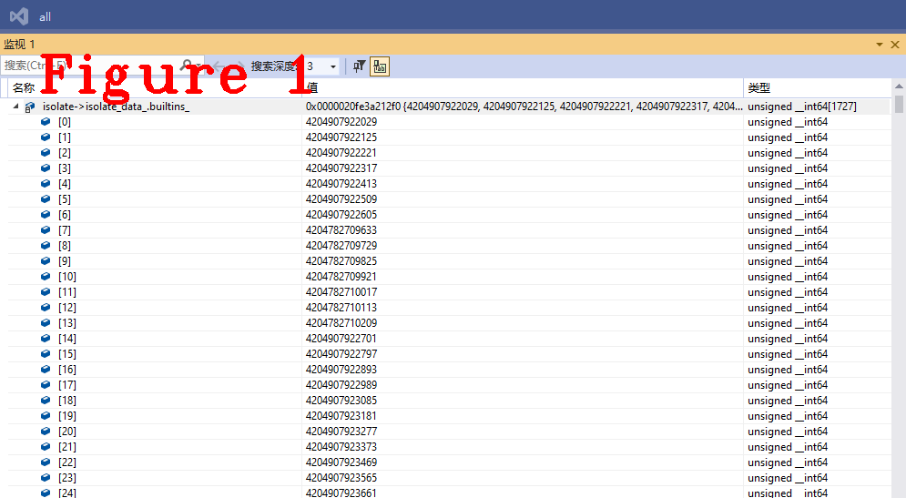
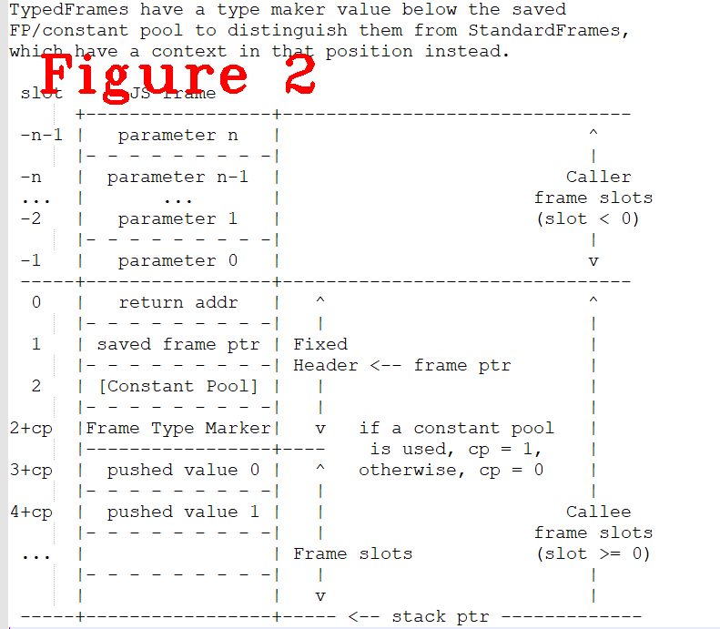

# 连载《Chrome V8 原理讲解》第八篇 解释器Ignition

# 1 摘要 
本次是第八篇，讲解v8解释器Ignition的工作流程。Ignition是基于寄存器的解释器，本过通过分析Ignition重要源码和核心数据结构、讲解bytecode的加载和执行过程，详细阐述Ignition的工作流程。  
本文内容的组织方式：讲解Ignition的先导知识--Builtin是什么、具体实现以及调试方法（章节2）;Ignition工作流程、原理讲解、源码分析（章节3）。    
**关键字** bytecode handler（字节码处理程序），dispatch，Builtin,Ignition  

# 2 Builtin
学习Ignition，绕不开Builtin，因为Ignition的大部分功能由Builtin实现。Builtin（built in function）是V8的内建功能，它是V8运行时可执行的代码块，实现Builtin功能的方式主要有：Javascript、C++、汇编、CodeStubAssembler四种方式。其中，CodeStubAssembler是一种平台无关（platform-independent）的抽象语言，由TurbFan编译生成。Builtin有很多种，以TF_BUILTIN举例说明，下面是它的宏定义模板:
```C++
#define TF_BUILTIN(Name, AssemblerBase)                                     \
  class Name##Assembler : public AssemblerBase {                            \
   public:                                                                  \
    using Descriptor = Builtin_##Name##_InterfaceDescriptor;                \
                                                                            \
    explicit Name##Assembler(compiler::CodeAssemblerState* state)           \
        : AssemblerBase(state) {}                                           \
    void Generate##Name##Impl();                                            \
                                                                            \
    template <class T>                                                      \
    TNode<T> Parameter(                                                     \
        Descriptor::ParameterIndices index,                                 \
        cppgc::SourceLocation loc = cppgc::SourceLocation::Current()) {     \
      return CodeAssembler::Parameter<T>(static_cast<int>(index), loc);     \
    }                                                                       \
                                                                            \
    template <class T>                                                      \
    TNode<T> UncheckedParameter(Descriptor::ParameterIndices index) {       \
      return CodeAssembler::UncheckedParameter<T>(static_cast<int>(index)); \
    }                                                                       \
  };                                                                        \
  void Builtins::Generate_##Name(compiler::CodeAssemblerState* state) {     \
    Name##Assembler assembler(state);                                       \
    state->SetInitialDebugInformation(#Name, __FILE__, __LINE__);           \
    if (Builtins::KindOf(Builtin::k##Name) == Builtins::TFJ) {              \
      assembler.PerformStackCheck(assembler.GetJSContextParameter());       \
    }                                                                       \
    assembler.Generate##Name##Impl();                                       \
  }                                                                         \
  void Name##Assembler::Generate##Name##Impl()
```  
上述代码中，`AssemblerBase`是Builtin功能父类，功能不同，其父类也不同，通过下面的代码举例说明：
```c++
TF_BUILTIN(CloneFastJSArrayFillingHoles, ArrayBuiltinsAssembler) {
  auto context = Parameter<Context>(Descriptor::kContext);
  auto array = Parameter<JSArray>(Descriptor::kSource);

  CSA_ASSERT(this,
             Word32Or(Word32BinaryNot(IsHoleyFastElementsKindForRead(
                          LoadElementsKind(array))),
                      Word32BinaryNot(IsNoElementsProtectorCellInvalid())));

  Return(CloneFastJSArray(context, array, base::nullopt,
                          HoleConversionMode::kConvertToUndefined));
}
```
上述代码是一个具体的Builtin功能实现，`CloneFastJSArrayFillingHoles`是Builtin功能的名字，`ArrayBuiltinsAssembler`是它的父类。名字不同，功能不同，其父类自然也不同。但是，所有Builtin均继承自同一个顶层的父类`CodeStubAssembler`，代码如下：
```c++
class V8_EXPORT_PRIVATE CodeStubAssembler
    : public compiler::CodeAssembler,
      public TorqueGeneratedExportedMacrosAssembler {
 public:
  using ScopedExceptionHandler = compiler::ScopedExceptionHandler;

  template <typename T>
  using LazyNode = std::function<TNode<T>()>;

  explicit CodeStubAssembler(compiler::CodeAssemblerState* state);

  enum AllocationFlag : uint8_t {
    kNone = 0,
    kDoubleAlignment = 1,
    kPretenured = 1 << 1,
    kAllowLargeObjectAllocation = 1 << 2,
  };

  enum SlackTrackingMode { kWithSlackTracking, kNoSlackTracking };

  using AllocationFlags = base::Flags<AllocationFlag>;

  TNode<IntPtrT> ParameterToIntPtr(TNode<Smi> value) { return SmiUntag(value); }
  TNode<IntPtrT> ParameterToIntPtr(TNode<IntPtrT> value) { return value; }
  TNode<IntPtrT> ParameterToIntPtr(TNode<UintPtrT> value) {
    return Signed(value);
  }

  enum InitializationMode {
    kUninitialized,
    kInitializeToZero,
    kInitializeToNull
  };
//........................
//代码近4000行，以下部分省略......................
//........................
```
代码太多，请自行查阅。下面给出Builtin列表，它包含了所有的Builtin，是一个宏模板，里面又嵌套了不同子类型的Builtin宏模板。
```c++
#define BUILTIN_LIST(CPP, TFJ, TFC, TFS, TFH, BCH, ASM)  \
  BUILTIN_LIST_BASE(CPP, TFJ, TFC, TFS, TFH, ASM)        \
  BUILTIN_LIST_FROM_TORQUE(CPP, TFJ, TFC, TFS, TFH, ASM) \
  BUILTIN_LIST_INTL(CPP, TFJ, TFS)                       \
  BUILTIN_LIST_BYTECODE_HANDLERS(BCH)
```
Builtin的编写规则，本文不做介绍，想学习的读者可以留言联系我，也可查阅官方文档。  
下面讲debug跟踪Builtin功能的方法，分析Ignition工作流程时离不开debug调试。无论Builtin的实现方式是js亦或C++，都只能做汇编调试，因为Builtin的实现与V8分离，单独生成个`snapshot_blob.bin`文件，保存在磁盘上，V8启动时将其进行反序列化，读取到内存中，这样做为了提升V8的启动速度。7.9版之前的V8，支持Builtin的C++调试，请读者自行分析，有问题可以联系我。  
Ignition执行字节码的入口是`InterpreterEntryTrampoline`，它是一个Builtin，它的功能和具体实现稍后讲解，下面看如何debug跟踪它。
```C++
enum class Builtin : int32_t {
  kNoBuiltinId = -1,
#define DEF_ENUM(Name, ...) k##Name,
  BUILTIN_LIST(DEF_ENUM, DEF_ENUM, DEF_ENUM, DEF_ENUM, DEF_ENUM, DEF_ENUM,
               DEF_ENUM)
#undef DEF_ENUM
#define EXTRACT_NAME(Name, ...) k##Name,
  // Define kFirstBytecodeHandler,
  kFirstBytecodeHandler =
      FirstFromVarArgs(BUILTIN_LIST_BYTECODE_HANDLERS(EXTRACT_NAME) 0)
#undef EXTRACT_NAME
};
```  
首先，看上面的`Builtin`类结构,每一个Builtin功能都有一个枚举编号，根据`BUILTIN_LIST`宏模板的定义顺序，可以计算出`InterpreterEntryTrampoline`的枚举编号，用这个编码做数组下标在图1中找到对应的数组成员，这个`isolate->isolate_data_.builtins_`成员是`BUILTIN`数组。  

  
根据数组成员中存储的内存地址，进行汇编级调试。此外，另一个跟踪方法是从`i::Excetuion::Call()`方法进行跟踪，最终也是进入汇编代码，不再赘述。开始跟踪之前，一定要先分析重要的数据结构，学习相关原理，例如V8的堆栈布局(stack layout)等，这会使调试Builtin事半功倍。V8是一个庞大的系统，涉及了编译技术、体系结构、操作系统等众多知识领域，有相应的知识储备可以使学习V8的过程更容易一些。
# 3 Ignition解释器
前面介绍了Ignition的调试方法，本节详细讲解Ignition源码的具体实现和工作流程，Ignition是V8解释器，负责执行字节码，它的输入一个字节码列表（bytecode array），输出是程序的执行结果。先给出几个重要约定：  

**（1）** bytecode handler，字节码处理程序，每个字节码对应一个处理程序，Ignition解释执行字节码的本质就是执行对应的处理程序。 

**（2）** bytecode array，字节码列表，一个Javascript功能编译完后生字节码列表。执行字节码之前，需要做预先的准备，包括构建堆栈，参数入压等等，具体工作由`InterpreterEntryTrampoline`负责。  

**（3）** 每一条字节码执行完后，都要调用`Dispatch()`，这个函数负责跳转到下一条字节码开始执行。  

**（4）** Ignition是一个基于寄存器的解释器，这些寄存器是V8维护的虚拟寄存器，用栈实现，不是物理寄存器。但有一个例外，Ignition有一个累加器寄存器，它被很多字节码作为隐式的输入输出寄存器，它是物理寄存器。  

**（5）** dispatch table,字节码分发表，每个isolate都包含一个全局的字节码分发表，分发表以字节码的枚举值作为索引，表项是字节码处理程序的对象指针。  
以上五点约定的功能均写入了`snapshot_blob.bin`文件，在V8启动时通过反序列化方式加载。  
`InterpreterEntryTrampoline`的源码实现如下：  
```c++
void Builtins::Generate_InterpreterEntryTrampoline(MacroAssembler* masm) {
  Register closure = rdi;
  Register feedback_vector = rbx;

  // Get the bytecode array from the function object and load it into
  // kInterpreterBytecodeArrayRegister.
  __ LoadTaggedPointerField(
      kScratchRegister,
      FieldOperand(closure, JSFunction::kSharedFunctionInfoOffset));
  __ LoadTaggedPointerField(
      kInterpreterBytecodeArrayRegister,
      FieldOperand(kScratchRegister, SharedFunctionInfo::kFunctionDataOffset));

  Label is_baseline;
  GetSharedFunctionInfoBytecodeOrBaseline(
      masm, kInterpreterBytecodeArrayRegister, kScratchRegister, &is_baseline);

  // The bytecode array could have been flushed from the shared function info,
  // if so, call into CompileLazy.
  Label compile_lazy;
  __ CmpObjectType(kInterpreterBytecodeArrayRegister, BYTECODE_ARRAY_TYPE,
                   kScratchRegister);
  __ j(not_equal, &compile_lazy);

  // Load the feedback vector from the closure.
  __ LoadTaggedPointerField(
      feedback_vector, FieldOperand(closure, JSFunction::kFeedbackCellOffset));
  __ LoadTaggedPointerField(feedback_vector,
                            FieldOperand(feedback_vector, Cell::kValueOffset));

  Label push_stack_frame;
  // Check if feedback vector is valid. If valid, check for optimized code
  // and update invocation count. Otherwise, setup the stack frame.
  __ LoadMap(rcx, feedback_vector);
  __ CmpInstanceType(rcx, FEEDBACK_VECTOR_TYPE);
  __ j(not_equal, &push_stack_frame);

  // Check for an optimization marker.
  Label has_optimized_code_or_marker;
  Register optimization_state = rcx;
  LoadOptimizationStateAndJumpIfNeedsProcessing(
      masm, optimization_state, feedback_vector, &has_optimized_code_or_marker);
//........................
//代码太长，以下部分省略......................
//........................

}
```
`InterpreterEntryTrampoline`的作用是构建调用堆栈，分配部局变量等，图2给出了一种`InterpreterEntryTrampoline`构建的栈布局，不同类型函数有不同的堆栈，第七篇文章中讲的堆栈也是由这个函数构建的。上述代码中`GetSharedFunctionInfoBytecodeOrBaseline`是取得bytecode array，通过每一个`Label`可以看出要执行的功能，`__`的具体实现是`#define __ ACCESS_MASM(masm)`，之后会调用bytecode array的第一条bytecode，开始执行。  
  

`Builtins`类中还定义了其它一些重要的函数，见下面源码：
```C++
class Builtins {
//........................
//代码太长，省略很多.......
//........................
  static void Generate_CallFunction(MacroAssembler* masm,
                                    ConvertReceiverMode mode);

  static void Generate_CallBoundFunctionImpl(MacroAssembler* masm);

  static void Generate_Call(MacroAssembler* masm, ConvertReceiverMode mode);

  enum class CallOrConstructMode { kCall, kConstruct };
  static void Generate_CallOrConstructVarargs(MacroAssembler* masm,
                                              Handle<Code> code);
  static void Generate_CallOrConstructForwardVarargs(MacroAssembler* masm,
                                                     CallOrConstructMode mode,
                                                     Handle<Code> code);

  static void Generate_InterpreterPushArgsThenCallImpl(
      MacroAssembler* masm, ConvertReceiverMode receiver_mode,
      InterpreterPushArgsMode mode);

  static void Generate_InterpreterPushArgsThenConstructImpl(
      MacroAssembler* masm, InterpreterPushArgsMode mode);

  template <class Descriptor>
  static void Generate_DynamicCheckMapsTrampoline(MacroAssembler* masm,
                                                  Handle<Code> builtin_target);

#define DECLARE_ASM(Name, ...) \
  static void Generate_##Name(MacroAssembler* masm);
#define DECLARE_TF(Name, ...) \
  static void Generate_##Name(compiler::CodeAssemblerState* state);

  BUILTIN_LIST(IGNORE_BUILTIN, DECLARE_TF, DECLARE_TF, DECLARE_TF, DECLARE_TF,
               IGNORE_BUILTIN, DECLARE_ASM)
//........................
//代码太长，以下部分省略......................
//........................
```
`Builtins`类中的`#define DECLARE_TF(Name, ...)`和`#define DECLARE_ASM(Name, ...)`是所有Builtin的生成函数，它们是由Turbofan生成，每一条bytecode的执行，由一个具体的bytecode handler负责。**注意：bytecode handler只是一种Builtin，还有其它的Builtin功能，byteocde是Builtin，Builtin并不都是bytecode！**  

下面是生成bytecode handler的功能代码：
```c++
#define IGNITION_HANDLER(Name, BaseAssembler)                         \
  class Name##Assembler : public BaseAssembler {                      \
   public:                                                            \
    explicit Name##Assembler(compiler::CodeAssemblerState* state,     \
                             Bytecode bytecode, OperandScale scale)   \
        : BaseAssembler(state, bytecode, scale) {}                    \
    Name##Assembler(const Name##Assembler&) = delete;                 \
    Name##Assembler& operator=(const Name##Assembler&) = delete;      \
    static void Generate(compiler::CodeAssemblerState* state,         \
                         OperandScale scale);                         \
                                                                      \
   private:                                                           \
    void GenerateImpl();                                              \
  };                                                                  \
  void Name##Assembler::Generate(compiler::CodeAssemblerState* state, \
                                 OperandScale scale) {                \
    Name##Assembler assembler(state, Bytecode::k##Name, scale);       \
    state->SetInitialDebugInformation(#Name, __FILE__, __LINE__);     \
    assembler.GenerateImpl();                                         \
  }                                                                   \
  void Name##Assembler::GenerateImpl()
//=======================================================
//=====================分隔线==================================
//=======================================================
// LdaZero
//
// Load literal '0' into the accumulator.
IGNITION_HANDLER(LdaZero, InterpreterAssembler) {
  TNode<Number> zero_value = NumberConstant(0.0);
  SetAccumulator(zero_value);
  Dispatch();
}
```
`IGNITION_HANDLER`是宏模板，`Name`是字节码名字，`BaseAssembler`是字节码的父类，`IGNITION_HANDLER(LdaZero, InterpreterAssembler)`这条语句是成生`LdaZero`的handler。`Dispatch()`是前面说的“dispatch table”，它的作用是执行下一条字节码，可以理解为寄存`eip++`，下面是`Dispatch()`的具体实现：
```C++
void InterpreterAssembler::Dispatch() {
  Comment("========= Dispatch");
  DCHECK_IMPLIES(Bytecodes::MakesCallAlongCriticalPath(bytecode_), made_call_);
  TNode<IntPtrT> target_offset = Advance();
  TNode<WordT> target_bytecode = LoadBytecode(target_offset);
  DispatchToBytecodeWithOptionalStarLookahead(target_bytecode);
}

void InterpreterAssembler::DispatchToBytecodeWithOptionalStarLookahead(
    TNode<WordT> target_bytecode) {
  if (Bytecodes::IsStarLookahead(bytecode_, operand_scale_)) {
    StarDispatchLookahead(target_bytecode);
  }
  DispatchToBytecode(target_bytecode, BytecodeOffset());
}
```
`LoadBytecode(target_offset)`获取下一条字节码，`DispatchToBytecodeWithOptionalStarLookahead(target_bytecode)`负责跳转到下一条字节码并执行。  
上面讲了字节码的生成方式，以及程序运行期进入下一条字节码的方式(dispatch)，下面的代码是生成所有的字节码处理程序。  
```C++
Handle<Code> GenerateBytecodeHandler(Isolate* isolate, const char* debug_name,
                                     Bytecode bytecode,
                                     OperandScale operand_scale,
                                     Builtin builtin,
                                     const AssemblerOptions& options) {
  Zone zone(isolate->allocator(), ZONE_NAME, kCompressGraphZone);
  compiler::CodeAssemblerState state(
      isolate, &zone, InterpreterDispatchDescriptor{},
      CodeKind::BYTECODE_HANDLER, debug_name,
      builtin);

  switch (bytecode) {
#define CALL_GENERATOR(Name, ...)                     \
  case Bytecode::k##Name:                             \
    Name##Assembler::Generate(&state, operand_scale); \
    break;
    BYTECODE_LIST_WITH_UNIQUE_HANDLERS(CALL_GENERATOR);
#undef CALL_GENERATOR
    case Bytecode::kIllegal:
      IllegalAssembler::Generate(&state, operand_scale);
      break;
    case Bytecode::kStar0:
      Star0Assembler::Generate(&state, operand_scale);
      break;
    default:
      UNREACHABLE();
  }
//............省略代码...................
}
```
`GenerateBytecodeHandler()`函数是生成字节码处理程序的入口，由它负责调用上面的`IGNITION_HANDLER(XXX,YYY)`宏模板，完成所有字节码处理程序的生成，`GenerateBytecodeHandler()`由TurbFan启动，一句话总结：每一个字节码处理程序由Turbofan独立生成且作为`Handle<Code>`存在，最终会写进`snapshot_blob.bin`文件中。  
好了，今天到这里，下次见。   
**恳请读者批评指正、提出宝贵意见**  
**微信：qq9123013  备注：v8交流    邮箱：v8blink@outlook.com**