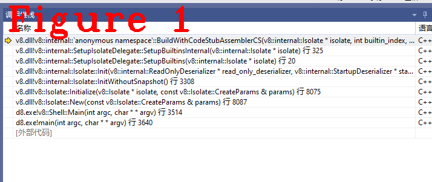
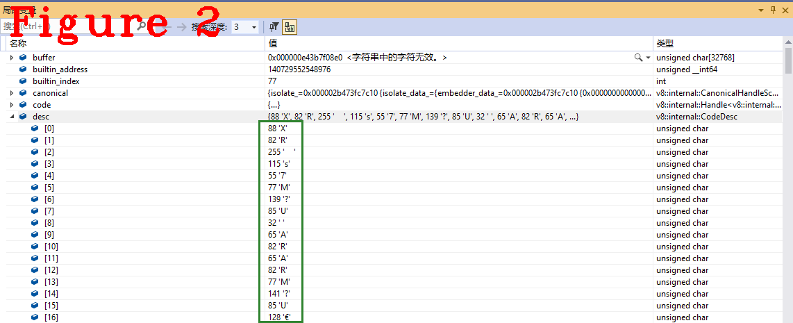

# 连载《Chrome V8 原理讲解》第九篇 Builtin源码分析


# 1 摘要 
上一篇文章中，Builtin作为先导知识，我们做了宏观概括和介绍。Builtin（Built-in function）是编译好的内置代码块（chunk），存储在`snapshot_blob.bin`文件中，V8启动时以反序列化方式加载，运行时可以直接调用。Builtins功能共计600多个，细分为多个子类型，涵盖了解释器、字节码、执行单元等多个V8核心功能，本文从微观角度剖析Builtins功能的源码，在不使用`snapshot_blob.bin`文件的情况下，详细说明Builtin创建和运行过程。
本文内容组织结构：Bultin初始化过程（章节2），Builtin子类型讲解(章节3)。  
# 2 Builtin初始化  
下面是`code`类，它负责管理所有`Builtin`功能，是`builtin table`的数据类型。
```c++
1.  class Code : public HeapObject {
2.   public:
3.    NEVER_READ_ONLY_SPACE
4.    // Opaque data type for encapsulating code flags like kind, inline
5.    // cache state, and arguments count.
6.    using Flags = uint32_t;
7.  #define CODE_KIND_LIST(V)   \
8.    V(OPTIMIZED_FUNCTION)     \
9.    V(BYTECODE_HANDLER)       \
10.   V(STUB)                   \
11.    V(BUILTIN)                \
12.    V(REGEXP)                 \
13.    V(WASM_FUNCTION)          \
14.    V(WASM_TO_CAPI_FUNCTION)  \
15.    V(WASM_TO_JS_FUNCTION)    \
16.    V(JS_TO_WASM_FUNCTION)    \
17.    V(JS_TO_JS_FUNCTION)      \
18.    V(WASM_INTERPRETER_ENTRY) \
19.    V(C_WASM_ENTRY)
20.    enum Kind {
21.  #define DEFINE_CODE_KIND_ENUM(name) name,
22.      CODE_KIND_LIST(DEFINE_CODE_KIND_ENUM)
23.  #undef DEFINE_CODE_KIND_ENUM
24.          NUMBER_OF_KINDS
25.    };
26.    static const char* Kind2String(Kind kind);
27.    // Layout description.
28.  #define CODE_FIELDS(V)                                                    \
29.    V(kRelocationInfoOffset, kTaggedSize)                                   \
30.    V(kDeoptimizationDataOffset, kTaggedSize)                               \
31.    V(kSourcePositionTableOffset, kTaggedSize)                              \
32.    V(kCodeDataContainerOffset, kTaggedSize)                                \
33.    /* Data or code not directly visited by GC directly starts here. */     \
34.    /* The serializer needs to copy bytes starting from here verbatim. */   \
35.    /* Objects embedded into code is visited via reloc info. */             \
36.    V(kDataStart, 0)                                                        \
37.    V(kInstructionSizeOffset, kIntSize)                                     \
38.    V(kFlagsOffset, kIntSize)                                               \
39.    V(kSafepointTableOffsetOffset, kIntSize)                                \
40.    V(kHandlerTableOffsetOffset, kIntSize)                                  \
41.    V(kConstantPoolOffsetOffset,                                            \
42.      FLAG_enable_embedded_constant_pool ? kIntSize : 0)                    \
43.    V(kCodeCommentsOffsetOffset, kIntSize)                                  \
44.    V(kBuiltinIndexOffset, kIntSize)                                        \
45.    V(kUnalignedHeaderSize, 0)                                              \
46.    /* Add padding to align the instruction start following right after */  \
47.    /* the Code object header. */                                           \
48.    V(kOptionalPaddingOffset, CODE_POINTER_PADDING(kOptionalPaddingOffset)) \
49.    V(kHeaderSize, 0)
50.    DEFINE_FIELD_OFFSET_CONSTANTS(HeapObject::kHeaderSize, CODE_FIELDS)
51.  #undef CODE_FIELDS
52.    STATIC_ASSERT(FIELD_SIZE(kOptionalPaddingOffset) == kHeaderPaddingSize);
53.    inline int GetUnwindingInfoSizeOffset() const;
54.    class BodyDescriptor;
55.    // Flags layout.  BitField<type, shift, size>.
56.  #define CODE_FLAGS_BIT_FIELDS(V, _)    \
57.    V(HasUnwindingInfoField, bool, 1, _) \
58.    V(KindField, Kind, 5, _)             \
59.    V(IsTurbofannedField, bool, 1, _)    \
60.    V(StackSlotsField, int, 24, _)       \
61.    V(IsOffHeapTrampoline, bool, 1, _)
62.    DEFINE_BIT_FIELDS(CODE_FLAGS_BIT_FIELDS)
63.  #undef CODE_FLAGS_BIT_FIELDS
64.    static_assert(NUMBER_OF_KINDS <= KindField::kMax, "Code::KindField size");
65.    static_assert(IsOffHeapTrampoline::kLastUsedBit < 32,
66.                  "Code::flags field exhausted");
67.    // KindSpecificFlags layout (STUB, BUILTIN and OPTIMIZED_FUNCTION)
68.  #define CODE_KIND_SPECIFIC_FLAGS_BIT_FIELDS(V, _) \
69.    V(MarkedForDeoptimizationField, bool, 1, _)     \
70.    V(EmbeddedObjectsClearedField, bool, 1, _)      \
71.    V(DeoptAlreadyCountedField, bool, 1, _)         \
72.    V(CanHaveWeakObjectsField, bool, 1, _)          \
73.    V(IsPromiseRejectionField, bool, 1, _)          \
74.    V(IsExceptionCaughtField, bool, 1, _)
75.    DEFINE_BIT_FIELDS(CODE_KIND_SPECIFIC_FLAGS_BIT_FIELDS)
76.  #undef CODE_KIND_SPECIFIC_FLAGS_BIT_FIELDS
77.   private:
78.    friend class RelocIterator;
79.    bool is_promise_rejection() const;
80.    bool is_exception_caught() const;
81.    OBJECT_CONSTRUCTORS(Code, HeapObject);  
82.  };
//........................代码太长，省略很多.....................
//.............................................................
```  
上述代码中，`CODE_KIND_LIST`从code角度定义了类型，在`Builtin`类中也定义了`Builtin`一共有七种子类型，这是两种不同的定义方式，但说的都是Builtin。`Builtin`的初始化工作由方法`void Isolate::Initialize(Isolate* isolate,const v8::Isolate::CreateParams& params)`统一完成，下面给出这个方法的部分代码。
```c++
1.  void Isolate::Initialize(Isolate* isolate,
2.                           const v8::Isolate::CreateParams& params) {
3.    i::Isolate* i_isolate = reinterpret_cast<i::Isolate*>(isolate);
4.    CHECK_NOT_NULL(params.array_buffer_allocator);
5.    i_isolate->set_array_buffer_allocator(params.array_buffer_allocator);
6.    if (params.snapshot_blob != nullptr) {
7.      i_isolate->set_snapshot_blob(params.snapshot_blob);
8.    } else {
9.      i_isolate->set_snapshot_blob(i::Snapshot::DefaultSnapshotBlob());
10.   }
11.    auto code_event_handler = params.code_event_handler;
12.  //........................代码太长，省略很多.....................
13.    if (!i::Snapshot::Initialize(i_isolate)) {
14.      // If snapshot data was provided and we failed to deserialize it must
15.      // have been corrupted.
16.      if (i_isolate->snapshot_blob() != nullptr) {
17.        FATAL(
18.            "Failed to deserialize the V8 snapshot blob. This can mean that the "
19.            "snapshot blob file is corrupted or missing.");
20.      }
21.      base::ElapsedTimer timer;
22.      if (i::FLAG_profile_deserialization) timer.Start();
23.      i_isolate->InitWithoutSnapshot();
24.      if (i::FLAG_profile_deserialization) {
25.        double ms = timer.Elapsed().InMillisecondsF();
26.        i::PrintF("[Initializing isolate from scratch took %0.3f ms]\n", ms);
27.      }
28.    }
29.    i_isolate->set_only_terminate_in_safe_scope(
30.        params.only_terminate_in_safe_scope);
31.  }
```
上述方面中进入第22行，最终进入下面的Builtin初始化方法。
```c++
1.  void SetupIsolateDelegate::SetupBuiltinsInternal(Isolate* isolate) {
2.  //...................删除部分代码，留下最核心功能
3.  //...................删除部分代码，留下最核心功能
4.    int index = 0;
5.    Code code;
6.  #define BUILD_CPP(Name)                                                      \
7.    code = BuildAdaptor(isolate, index, FUNCTION_ADDR(Builtin_##Name), #Name); \
8.    AddBuiltin(builtins, index++, code);
9.  #define BUILD_TFJ(Name, Argc, ...)                              \
10.   code = BuildWithCodeStubAssemblerJS(                          \
11.        isolate, index, &Builtins::Generate_##Name, Argc, #Name); \
12.    AddBuiltin(builtins, index++, code);
13.  #define BUILD_TFC(Name, InterfaceDescriptor)                      \
14.    /* Return size is from the provided CallInterfaceDescriptor. */ \
15.    code = BuildWithCodeStubAssemblerCS(                            \
16.        isolate, index, &Builtins::Generate_##Name,                 \
17.        CallDescriptors::InterfaceDescriptor, #Name);               \
18.    AddBuiltin(builtins, index++, code);
19.  #define BUILD_TFS(Name, ...)                                                   \
20.    /* Return size for generic TF builtins (stub linkage) is always 1. */        \
21.    code =                                                                       \
22.        BuildWithCodeStubAssemblerCS(isolate, index, &Builtins::Generate_##Name, \
23.                                     CallDescriptors::Name, #Name);              \
24.    AddBuiltin(builtins, index++, code);
25.  #define BUILD_TFH(Name, InterfaceDescriptor)              \
26.    /* Return size for IC builtins/handlers is always 1. */ \
27.    code = BuildWithCodeStubAssemblerCS(                    \
28.        isolate, index, &Builtins::Generate_##Name,         \
29.        CallDescriptors::InterfaceDescriptor, #Name);       \
30.    AddBuiltin(builtins, index++, code);
31.  #define BUILD_BCH(Name, OperandScale, Bytecode)                           \
32.    code = GenerateBytecodeHandler(isolate, index, OperandScale, Bytecode); \
33.    AddBuiltin(builtins, index++, code);
34.  #define BUILD_ASM(Name, InterfaceDescriptor)                                \
35.    code = BuildWithMacroAssembler(isolate, index, Builtins::Generate_##Name, \
36.                                   #Name);                                    \
37.    AddBuiltin(builtins, index++, code);
38.    BUILTIN_LIST(BUILD_CPP, BUILD_TFJ, BUILD_TFC, BUILD_TFS, BUILD_TFH, BUILD_BCH,
39.                 BUILD_ASM);
40.  //...................删除部分代码，留下最核心功能
41.  //...................删除部分代码，留下最核心功能
42.  }
```
上述代码只保留了最核心的Builtin初始化功能，初始化工作的主要是生成并编译Builtin代码，并以独立功能的形式挂载到`isolate`上，以`BuildWithCodeStubAssemblerCS()`详细描述该过程。  
见下面代码，第一个参数是`isolate`，用于保存初化完成的`Builtin`；第二个参数全局变量`index`，`Builtin`存储在`isolate`的数组成员中，`index`是数组下标；第三个参数`generator`是函数指针，该函数用于生成`Builtin`；第四个参数是call描述符；最后一个是函数名字。  
```c++
1.  // Builder for builtins implemented in TurboFan with CallStub linkage.
2.  Code BuildWithCodeStubAssemblerCS(Isolate* isolate, int32_t builtin_index,
3.                                    CodeAssemblerGenerator generator,
4.                                    CallDescriptors::Key interface_descriptor,
5.                                    const char* name) {
6.    HandleScope scope(isolate);
7.    // Canonicalize handles, so that we can share constant pool entries pointing
8.    // to code targets without dereferencing their handles.
9.    CanonicalHandleScope canonical(isolate);
10.   Zone zone(isolate->allocator(), ZONE_NAME);
11.    // The interface descriptor with given key must be initialized at this point
12.    // and this construction just queries the details from the descriptors table.
13.    CallInterfaceDescriptor descriptor(interface_descriptor);
14.    // Ensure descriptor is already initialized.
15.    DCHECK_LE(0, descriptor.GetRegisterParameterCount());
16.    compiler::CodeAssemblerState state(
17.        isolate, &zone, descriptor, Code::BUILTIN, name,
18.        PoisoningMitigationLevel::kDontPoison, builtin_index);
19.    generator(&state);
20.    Handle<Code> code = compiler::CodeAssembler::GenerateCode(
21.        &state, BuiltinAssemblerOptions(isolate, builtin_index));
22.    return *code;
23.  }
```
在代码中，第19行代码生成Builtin源码，以第一个Builtin为例说明`generator(&state)`的功能，此时`generator`指针代表的函数是`TF_BUILTIN(RecordWrite, RecordWriteCodeStubAssembler) `，下面是代码：
```c++
1.  TF_BUILTIN(RecordWrite, RecordWriteCodeStubAssembler) {
2.    Label generational_wb(this);
3.    Label incremental_wb(this);
4.    Label exit(this);
5.    Node* remembered_set = Parameter(Descriptor::kRememberedSet);
6.    Branch(ShouldEmitRememberSet(remembered_set), &generational_wb,
7.           &incremental_wb);
8.    BIND(&generational_wb);
9.    {
10.     Label test_old_to_young_flags(this);
11.      Label store_buffer_exit(this), store_buffer_incremental_wb(this);
12.      TNode<IntPtrT> slot = UncheckedCast<IntPtrT>(Parameter(Descriptor::kSlot));
13.      Branch(IsMarking(), &test_old_to_young_flags, &store_buffer_exit);
14.      BIND(&test_old_to_young_flags);
15.      {
16.        TNode<IntPtrT> value =
17.            BitcastTaggedToWord(Load(MachineType::TaggedPointer(), slot));
18.        TNode<BoolT> value_is_young =
19.            IsPageFlagSet(value, MemoryChunk::kIsInYoungGenerationMask);
20.        GotoIfNot(value_is_young, &incremental_wb);
21.        TNode<IntPtrT> object =
22.            BitcastTaggedToWord(Parameter(Descriptor::kObject));
23.        TNode<BoolT> object_is_young =
24.            IsPageFlagSet(object, MemoryChunk::kIsInYoungGenerationMask);
25.        Branch(object_is_young, &incremental_wb, &store_buffer_incremental_wb);
26.      }
27.      BIND(&store_buffer_exit);
28.      {
29.        TNode<ExternalReference> isolate_constant =
30.            ExternalConstant(ExternalReference::isolate_address(isolate()));
31.        Node* fp_mode = Parameter(Descriptor::kFPMode);
32.        InsertToStoreBufferAndGoto(isolate_constant, slot, fp_mode, &exit);
33.      }
34.      BIND(&store_buffer_incremental_wb);
35.      {
36.        TNode<ExternalReference> isolate_constant =
37.            ExternalConstant(ExternalReference::isolate_address(isolate()));
38.        Node* fp_mode = Parameter(Descriptor::kFPMode);
39.        InsertToStoreBufferAndGoto(isolate_constant, slot, fp_mode,
40.                                   &incremental_wb);
41.      }
42.    } //........................省略代码......................................
43.    BIND(&exit);
44.    IncrementCounter(isolate()->counters()->write_barriers(), 1);
45.    Return(TrueConstant());
46.  }
```
这个函数`TF_BUILTIN(RecordWrite, RecordWriteCodeStubAssembler)`是生成器，它的作用是生成写记录功能的源代码，`TF_BUILTIN`是宏模板，展开后可以看到它的类成员`CodeAssemblerState* state`保存了生成之后的源码。“用平台无关的生成器为特定平台生成源代码”是`Builtin`的常用做法，这样减少了工作量。函数执行完成后返回到`BuildWithCodeStubAssemblerCS`，生成的源代码经过处理后，最终由`code`表示，下面是`code`的数据类型。  

```c++
class Code : public HeapObject {
 public:
  NEVER_READ_ONLY_SPACE
  // Opaque data type for encapsulating code flags like kind, inline
  // cache state, and arguments count.
  using Flags = uint32_t;

#define CODE_KIND_LIST(V)   \
  V(OPTIMIZED_FUNCTION)     \
  V(BYTECODE_HANDLER)       \
  V(STUB)                   \
  V(BUILTIN)                \
  V(REGEXP)                 \
  V(WASM_FUNCTION)          \
  V(WASM_TO_CAPI_FUNCTION)  \
  V(WASM_TO_JS_FUNCTION)    \
  V(JS_TO_WASM_FUNCTION)    \
  V(JS_TO_JS_FUNCTION)      \
  V(WASM_INTERPRETER_ENTRY) \
  V(C_WASM_ENTRY)

  enum Kind {
#define DEFINE_CODE_KIND_ENUM(name) name,
    CODE_KIND_LIST(DEFINE_CODE_KIND_ENUM)
#undef DEFINE_CODE_KIND_ENUM
        NUMBER_OF_KINDS
  };
//..................省略........................
//.............................................
```  
上述代码中，可以看到从`code`的角度对`Builtin`进行了更详细的分类。另外`code`是堆对象，也就是说`Builtin`是由V8的堆栈进行管理，后续讲到堆栈时再详细说明这部分知识。图2给出函数调用堆栈，供读者自行复现。  

  
在`SetupBuiltinsInternal()`中可以看到`AddBuiltin()`将生成的`code`代码添加到`isolate`中，代码如下。  

```c++
void SetupIsolateDelegate::AddBuiltin(Builtins* builtins, int index,
                                      Code code) {
  DCHECK_EQ(index, code.builtin_index());
  builtins->set_builtin(index, code);
}
//..............分隔线......................
void Builtins::set_builtin(int index, Code builtin) {
  isolate_->heap()->set_builtin(index, builtin);
}
```
所有`Builtin`功能生成后保存在`Address builtins_[Builtins::builtin_count]`中，初始化方法`SetupBuiltinsInternal`按照`BUILTIN_LIST`的定义顺序依次完成所有Builtin的源码生成、编译和挂载到isolate。  
# 2 Builtin子类型
从`Builtins`的功能看，它包括了：Ignition实现、字节码实现、以及ECMA规范实现等众多V8的核心功能，在`BUILTIN_LIST`定义中有详细注释，请读者自行查阅。前面讲过，从`BUILTIN`的实现角度分为七种类型，见下面代码：  
```c++
#define BUILD_CPP(Name)
#define BUILD_TFJ(Name, Argc, ...) 
#define BUILD_TFC(Name, InterfaceDescriptor)  
#define BUILD_TFS(Name, ...) 
#define BUILD_TFH(Name, InterfaceDescriptor) 
#define BUILD_BCH(Name, OperandScale, Bytecode)  
#define BUILD_ASM(Name, InterfaceDescriptor)
```

以子类型`BUILD_CPP`举例说明，下面是完整源代码。  

```c++
1.  Code BuildAdaptor(Isolate* isolate, int32_t builtin_index,
2.                    Address builtin_address, const char* name) {
3.    HandleScope scope(isolate);
4.    // Canonicalize handles, so that we can share constant pool entries pointing
5.    // to code targets without dereferencing their handles.
6.    CanonicalHandleScope canonical(isolate);
7.    constexpr int kBufferSize = 32 * KB;
8.    byte buffer[kBufferSize];
9.    MacroAssembler masm(isolate, BuiltinAssemblerOptions(isolate, builtin_index),
10.                       CodeObjectRequired::kYes,
11.                        ExternalAssemblerBuffer(buffer, kBufferSize));
12.    masm.set_builtin_index(builtin_index);
13.    DCHECK(!masm.has_frame());
14.    Builtins::Generate_Adaptor(&masm, builtin_address);
15.    CodeDesc desc;
16.    masm.GetCode(isolate, &desc);
17.    Handle<Code> code = Factory::CodeBuilder(isolate, desc, Code::BUILTIN)
18.                            .set_self_reference(masm.CodeObject())
19.                            .set_builtin_index(builtin_index)
20.                            .Build();
21.    return *code;
22.  }
```
`BuildAdaptor`的生成功能由第13行代码实现，最终该代码的实现如下：  
```c++
void Builtins::Generate_Adaptor(MacroAssembler* masm, Address address) {
  __ LoadAddress(kJavaScriptCallExtraArg1Register,
                 ExternalReference::Create(address));
  __ Jump(BUILTIN_CODE(masm->isolate(), AdaptorWithBuiltinExitFrame),
          RelocInfo::CODE_TARGET);
}
}
```  
上面两部分代码实现了第77号`Builtin`功能，名字是`HandleApiCall`，图2以`char`类型展示了生成的源代码。  

  

总结：学习Builtin时，涉及很多系统结构相关的知识，本文讲解采用的是x64架构。每种`Builtin`的生成方式虽不相同，但分析源码的思路相同，有问题可以联系我。  
好了，今天到这里，下次见。   
**恳请读者批评指正、提出宝贵意见**  
**微信：qq9123013  备注：v8交流    邮箱：v8blink@outlook.com**